# Vue2 核心

>[尚硅谷 Vue2.0+Vue3.0 全套教程丨 vuejs 从入门到精通](https://www.bilibili.com/video/BV1Zy4y1K7SH?p=1&vd_source=65e8ed62ff65aeec2427f9b6c8523b9b)
>
>[英文官网：https://vuejs.org/](英文官网: https://vuejs.org/)
>
>[中文官网：https://cn.vuejs.org/](https://cn.vuejs.org/)

## Vue 简介

### Vue 介绍

1. 动态 **构建用户界面 **的 **渐进式** JavaScript 框架
   - 构建用户界面：把数据通过某种办法变成用户界面
   - 渐进式：Vue 可以自底向上逐层的应用，简单应用只需要一个轻量小巧的核心库，复杂应用可以引入各式各样的 Vue 插件

2. 作者：尤雨溪

   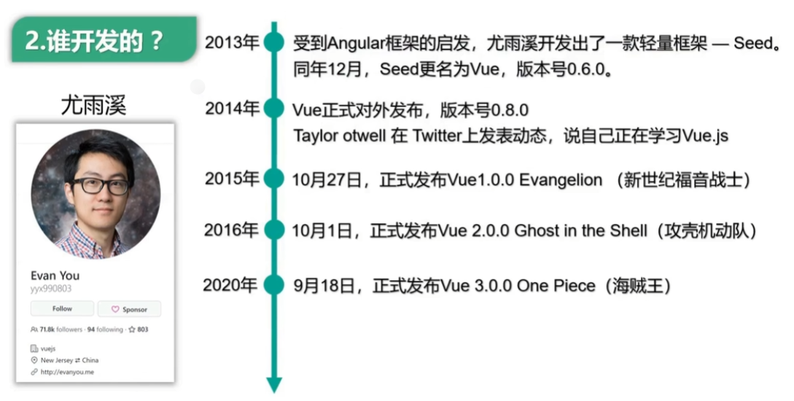

### Vue 特点

1. 遵循 **MVWM** 模式
2. 编码简洁，体积小，运行效率高，适合移动/PC 端开发
3. 它本身只关注 UI，可以引入其它第三方库开发项目
4. 采用 **组件化** 模式，提高代码复用率、且让代码更好维护。
5. **声明式** 编码，让编码人员无需直接操作 DOM，提高开发效率。

### 与其它 JS 框架的关联

- 借鉴 Angular 的 **模板** 和 **数据绑定** 技术
- 借鉴 React 的 **组件化** 和 **虚拟 DOM** 技术

### Vue 周边库

- vue-cli：vue 脚手架
- vue-resource(axios)：ajax 请求
- vue-router：路由
- vuex：状态管理
- vue-lazyload：图片獭加载
- vue-scroller：页面滑动相关
- mint-ui：基于 vue 的 UI 组件库（移动端）
- element-ui：基于 vue 的 UI 组件库 (PC 端)

## 初识 Vue

### 安装环境

#### ①安装 Vue 插件

下载 `Vue.js.devtools` 开发者工具插件 **去除 F12 之后的提示信息**

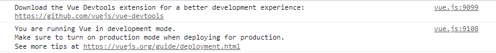

#### ②引入 Vue

```vue
<script type="text/javascript" src="../js/vue.js"></script>
```

#### ③去掉开发环境提示

开发环境下代码注释掉开发环境提示信息，开发环境下用的是开发版有提示，实际环境下用的是 min 压缩版，没有提示

```vue
<script type="text/javascript">
    // 取消开发者提示信息
    Vue.config.productionTip = false;
</script>
```

#### ④引入 favicon.ico

### Vue 入门

```vue
<!DOCTYPE html>
<html lang="en">
  <head>
    <meta charset="UTF-8" />
    <title>Title</title>
    <script type="text/javascript" src="../js/vue.js"></script>
  </head>
  <body>
    <!--容器-->
    <div id="root">
      <!--插值法-->
      hello,{{name}}!{{new Date()}}
    </div>

    <script type="text/javascript">
      //取消开发者提示信息
      Vue.config.productionTip = false;
      //创建 vue 实例
      const vm = new Vue({
        el: "#root", // el 用于指定当前 Vue 实例为哪个容器服务，值通常为 css 选择器字符串
        // data 中用于存储数据，数据供 e1 所指定的容器去使用，值暂时先写成一个对象
        data: {
          name: "张三",
        },
      });
    </script>
  </body>
</html>
```

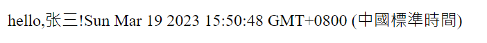

## 模板语法

Vue 模板语法包括两大类

### 插值语法

1. 用于解析标签体内容

1. 写法：`{{xxx}}`，xxx 是 js 表达式，可以直接读取到 data 中的所有区域


### 指令语法

1. 用于解析标签（包括：标签属性、标签体内容、绑定事件…）
2. 写法：`<a v-bind:href="xxx">` 或简写为 `<a :href="xxx">`，xxx 同样要写 js 表达式，可以直接读取到 data 中的所有属性
3. 备注：Vue 中有很多的指令，且形式都是 v-xxx，此处只是拿 v-bind 举例

```vue
<!DOCTYPE html>
<html lang="en">
  <head>
    <meta charset="UTF-8" />
    <title>Title</title>
    <script type="text/javascript" src="../js/vue.js"></script>
  </head>
  <body>
    <!--容器-->
    <div id="root">
      <!--插值法-->
      hello,{{name}}<br />
      <!--指令语法-->
      <a v-bind:href="url">百度链接</a><br />
      <a :href="url.toUpperCase()">百度链接</a><br />
    </div>
    <script type="text/javascript">
      //取消开发者提示信息
      Vue.config.productionTip = false;
      //创建 vue 实例
      const vm = new Vue({
        el: "#root",
        data: {
          name: "张三",
          url: "http://www.baidu.com",
        },
      });
    </script>
  </body>
</html>
```

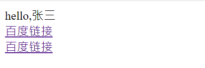

## 数据绑定

Vue 中有 2 种数据绑定的方式

### 单向数据绑定

1. 语法：`v-bind:href ="xxx"` 或简写为 `:href`
2. 特点：数据只能从 data 流向页面

### 双向数据绑定

1. 语法：`v-mode:value="xxx"` 或简写为 `v-model="xxx" `
2. 特点：数据不仅能从 data 流向页面，还能从页面流向 data
3. 备注：
   1. 双向绑定一般都应用在表单类元素上，如 \<input>\<select>\<textarea>等 
   2. v-model:value 可以简写为 v-model，因为 v-model 默认收集的就是 value 值


```vue
<!DOCTYPE html>
<html lang="en">
  <head>
    <meta charset="UTF-8" />
    <title>Title</title>
    <script type="text/javascript" src="../js/vue.js"></script>
  </head>
  <body>
    <!--容器-->
    <div id="root">
      <!--数据绑定-->
      单向数据绑定：<input type="text" v-bind:value="name" /><br />
      双向数据绑定：<input type="text" v-model:value="name" /><br />
    </div>
    <script type="text/javascript">
      //取消开发者提示信息
      Vue.config.productionTip = false;
      //创建 vue 实例
      const vm = new Vue({
        el: "#root",
        data: {
          name: "张三",
        },
      });
    </script>
  </body>
</html>
```

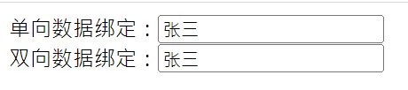

## el 与 data 的两种写法

### el 2 种写法

- a 创建 Vue 实例对象的时候配置 `el` 属性
- b 先创建 Vue 实例，随后再通过`vm.$mount('#root')`指定 `el` 的值

### data 2 种写法

- a 对象式：`data： { }`
- b 函数式：`data() { return { } }`

如何选择：目前哪种写法都可以，以后到组件时，data 必须使用函数，否则会报错

一个重要的原则：由 Vue 管理的函数，**一定不要写箭头函数**，否则 this 就不再是 Vue 实例了

```vue
<!DOCTYPE html>
<html>
	<head>
		<meta charset="UTF-8" />
		<title>el与data的两种写法</title>
		<!-- 引入 Vue -->
		<script type="text/javascript" src="../js/vue.js"></script>
	</head>
	<body>
		<!-- 准备好一个容器-->
		<div id="root">
			<h1>你好，{{name}}</h1>
		</div>
	</body>

	<script type="text/javascript">
		Vue.config.productionTip = false //阻止 vue 在启动时生成生产提示。

		//el 的两种写法
		/* const v = new Vue({
			//el:'#root', //第一种写法
			data:{
				name:'尚硅谷'
			}
		})
		console.log(v)
		v.$mount('#root') //第二种写法 */

		//data 的两种写法
		new Vue({
			el:'#root',
			//data 的第一种写法：对象式
			/* data:{
				name:'尚硅谷'
			} */

			//data 的第二种写法：函数式
			data(){
				console.log('@@@',this) //此处的 this 是 Vue 实例对象
				return{
					name:'尚硅谷'
				}
			}
		})
	</script>
</html>
```

## MVVM 模型

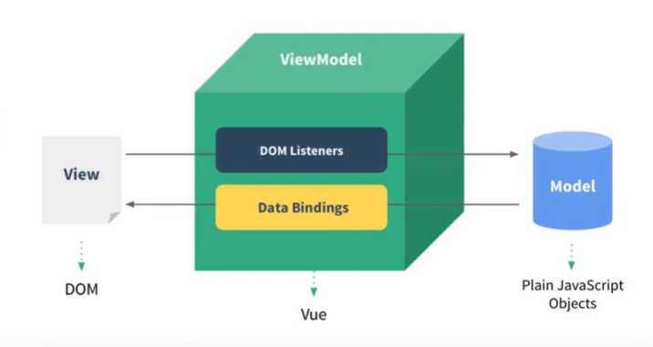

Vue 特性：**数据驱动视图** 和 **双向数据绑定**

|     |                    |               |
| --- | ------------------ | ------------- |
| M   | 模型 Model         | data 中的数据 |
| V   | 视图 View          | 模板代码      |
| VM  | 视图模型 ViewModel | Vue 实例      |

- `data` 中所有的属性，最后都出现在了 `vm` 身上
- `vm` 身上所有的属性 及 `Vue` 原型身上所有的属性，在 `Vue` 模板中都可以直接使用

```vue
<!DOCTYPE html>
<html>
	<head>
		<meta charset="UTF-8" />
		<title>理解MVVM</title>
		<!-- 引入 Vue -->
		<script type="text/javascript" src="../js/vue.js"></script>
	</head>
	<body>
		<!-- 准备好一个容器-->
		<div id="root">
			<h1>学校名称：{{name}}</h1>
			<h1>学校地址：{{address}}</h1>
			<!-- <h1>测试一下 1：{{1+1}}</h1>
			<h1>测试一下 2：{{$options}}</h1>
			<h1>测试一下 3：{{$emit}}</h1>
			<h1>测试一下 4：{{_c}}</h1> -->
		</div>
	</body>

	<script type="text/javascript">
		Vue.config.productionTip = false //阻止 vue 在启动时生成生产提示。

		const vm = new Vue({
			el:'#root',
			data:{
				name:'尚硅谷',
				address:'北京',
			}
		})
		console.log(vm)
	</script>
</html>
```

## MVVM 工作原理

> - ViewModel 是 MVVM 的核心，将当前页面数据源和页面结构连接在一起
> - 当数据源发生变化时，会被 ViewModel 监听到，ViewModel 会将最新的数据自动更新到页面中
> - 当表单元素的值发生变化时，也会被 VM 监听到，ViewModel 会把变化的值自动同步到 Model 数据源

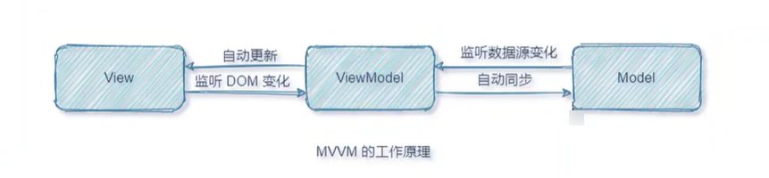

## 数据代理

### Object.defineproperty 方法

```cue
let number = 18
let person = {
    name:'张三',
    sex:'男',
}

Object.defineProperty(person,'age',{
    // value:18,
    // enumerable:true, //控制属性是否可以枚举，默认值是 false
    // writable:true, //控制属性是否可以被修改，默认值是 false
    // configurable:true //控制属性是否可以被删除，默认值是 false

    //当有人读取 person 的 age 属性时，get 函数 (getter) 就会被调用，且返回值就是 age 的值
    get(){
        console.log('有人读取 age 属性了')
        return number
    },

    //当有人修改 person 的 age 属性时，set 函数 (setter) 就会被调用，且会收到修改的具体值
    set(value){
        console.log('有人修改了 age 属性，且值是',value)
        number = value
    }

})

// console.log(Object.keys(person))

console.log(person)
```

**数据代理**：通过一个对象代理对另一个对象中属性的操作（读/写）

```vue
<!-- 数据代理：通过一个对象代理对另一个对象中属性的操作（读/写）-->

let obj = {x:100}
let obj2 = {y:200}

Object.defineProperty(obj2,'x',{
    get(){
        return obj.x
    },
    set(value){
        obj.x = value
    }
})
```

- `Vue`中的数据代理通过`vm`对象来代理`data`对象中属性的操作（读/写）
- `Vue`中数据代理的好处：更加方便的操作`data`中的数据
- 基本原理
  - 通过`object.defineProperty()`把`data`对象中所有属性添加到`vm`上
  - 为每一个添加到`vm`上的属性，都指定一个`getter` `setter` 
  - 在`getter` `setter` 内部去操作（读/写）`data`中对应的属性

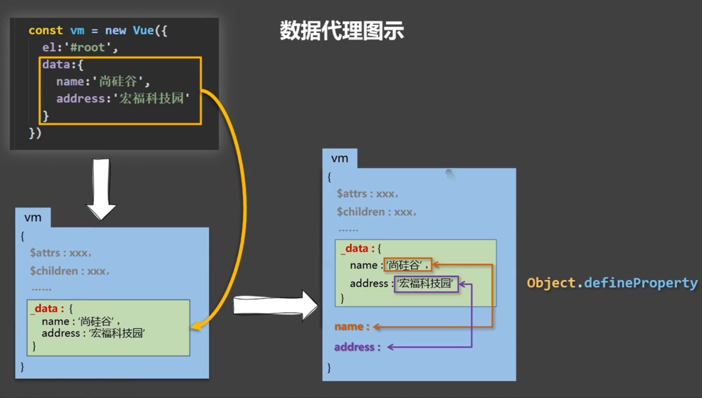

`Vue`将`data`中的数据拷贝了一份到`_data`属性中，又将`_data`里面的属性提到`Vue`实例中（如`name`），通过`defineProperty`实现数据代理，这样通过`geter/setter`操作 `name`，进而操作`_data`中的 `name`。而`_data`又对`data`进行数据劫持，实现响应式

```vue
<!DOCTYPE html>
<html>
	<head>
		<meta charset="UTF-8" />
		<title>Vue中的数据代理</title>
		<!-- 引入 Vue -->
		<script type="text/javascript" src="../js/vue.js"></script>
	</head>
	<body>
		<!-- 准备好一个容器-->
		<div id="root">
			<h2>学校名称：{{name}}</h2>
			<h2>学校地址：{{address}}</h2>
		</div>
	</body>

	<script type="text/javascript">
		Vue.config.productionTip = false //阻止 vue 在启动时生成生产提示。
		
		const vm = new Vue({
			el:'#root',
			data:{
				name:'尚硅谷',
				address:'宏福科技园'
			}
		})
	</script>
</html>
```

## 事件处理

### 事件的基本用法

- 使用`v-on:xxx`或`@xxx`绑定事件，其中 `xxx` 是事件名
- 事件的回调需要配置在`methods`对象中，最终会在`vm`上
- `methods`中配置的函数，**不要用箭头函数**，否则 `this` 就不是`vm`了
- `methods`中配置的函数，都是被 `Vue`所管理的函数，`this` 的指向是`vm`或**组件实例对象** 
- `@click="demo"`和`@click="demo($event)"`效果一致，但后者可以传参

```vue
<!DOCTYPE html>
<html>
	<head>
		<meta charset="UTF-8" />
		<title>事件的基本使用</title>
		<!-- 引入 Vue -->
		<script type="text/javascript" src="../js/vue.js"></script>
	</head>
	<body>
		<!-- 准备好一个容器-->
		<div id="root">
			<h2>欢迎来到{{name}}学习</h2>
			<!-- <button v-on:click="showInfo">点我提示信息</button> -->
			<button @click="showInfo1">点我提示信息 1（不传参）</button>
			<button @click="showInfo2($event,66)">点我提示信息 2（传参）</button>
		</div>
	</body>

	<script type="text/javascript">
		Vue.config.productionTip = false //阻止 vue 在启动时生成生产提示。

		const vm = new Vue({
			el:'#root',
			data:{
				name:'尚硅谷',
			},
			methods:{
				showInfo1(event){
					// console.log(event.target.innerText)
					// console.log(this) //此处的 this 是 vm
					alert('同学你好！')
				},
				showInfo2(event,number){
					console.log(event,number)
					// console.log(event.target.innerText)
					// console.log(this) //此处的 this 是 vm
					alert('同学你好！！')
				}
			}
		})
	</script>
</html>
```

### 事件修饰符

Vue 中的事件修饰符

1. `prevent` 阻止默认事件（常用）
2. `stop` 阻止事件冒泡（常用）
3. `once` 事件只触发一次（常用）
4. `capture` 使用事件的捕获模式
5. `self` 只有`event.target`是当前操作的元素时才触发事件
6. `passive` 事件的默认行为立即执行，无需等待事件回调执行完毕

修饰符可以连续写，比如可以这么用：`@click.prevent.stop="showInfo"`

```vue
<!DOCTYPE html>
<html>
	<head>
		<meta charset="UTF-8" />
		<title>事件修饰符</title>
		<!-- 引入 Vue -->
		<script type="text/javascript" src="../js/vue.js"></script>
		<style>
			*{
				margin-top: 20px;
			}
			.demo1{
				height: 50px;
				background-color: skyblue;
			}
			.box1{
				padding: 5px;
				background-color: skyblue;
			}
			.box2{
				padding: 5px;
				background-color: orange;
			}
			.list{
				width: 200px;
				height: 200px;
				background-color: peru;
				overflow: auto;
			}
			li{
				height: 100px;
			}
		</style>
	</head>
	<body>
		<!-- 准备好一个容器-->
		<div id="root">
			<h2>欢迎来到{{name}}学习</h2>
			<!-- 阻止默认事件（常用） -->
			<a href="http://www.atguigu.com" @click.prevent="showInfo">点我提示信息</a>

			<!-- 阻止事件冒泡（常用） -->
			<div class="demo1" @click="showInfo">
				<button @click.stop="showInfo">点我提示信息</button>
				<!-- 修饰符可以连续写 -->
				<!-- <a href="http://www.atguigu.com" @click.prevent.stop="showInfo">点我提示信息</a> -->
			</div>

			<!-- 事件只触发一次（常用） -->
			<button @click.once="showInfo">点我提示信息</button>

			<!-- 使用事件的捕获模式 -->
			<div class="box1" @click.capture="showMsg(1)">
				div1
				<div class="box2" @click="showMsg(2)">
					div2
				</div>
			</div>

			<!-- 只有 event.target 是当前操作的元素时才触发事件； -->
			<div class="demo1" @click.self="showInfo">
				<button @click="showInfo">点我提示信息</button>
			</div>

			<!-- 事件的默认行为立即执行，无需等待事件回调执行完毕； -->
			<ul @wheel.passive="demo" class="list">
				<li>1</li>
				<li>2</li>
				<li>3</li>
				<li>4</li>
			</ul>

		</div>
	</body>

	<script type="text/javascript">
		Vue.config.productionTip = false //阻止 vue 在启动时生成生产提示。

		new Vue({
			el:'#root',
			data:{
				name:'尚硅谷'
			},
			methods:{
				showInfo(e){
					alert('同学你好！')
					// console.log(e.target)
				},
				showMsg(msg){
					console.log(msg)
				},
				demo(){
					for (let i = 0; i < 100000; i++) {
						console.log('#')
					}
					console.log('累坏了')
				}
			}
		})
	</script>
</html>
```

### 键盘事件

> 键盘上的每个按键都有自己的名称和编码，例如：Enter（13）。而`Vue`还对一些常用按键起了别名方便使用

1. **Vue 中常用的按键别名**

   1. 回车 `enter`

   1. 删除`delete`捕获“删除”和“退格”键

   1. 退出`esc`

   1. 空格`space`

   1. 换行`tab`特殊，必须配合`keydown`去使用

   1. 上`up`

   1. 下`down`

   1. 左`left`

   1. 右`right`

2. `Vue`未提供别名的按键，可以使用按键原始的`key`值去绑定，但注意要转为`kebab-case`(多单词小写
   短横线写法)

3. 系统修饰键（用法特殊）`ctrl` `alt` `shift` `meta`(`meta`就是`win`键)

   - 配合`keyup`使用：按下修饰键的同时，再按下其他键，随后释放其他键，事件才被触发指定`ctr+y`使用`@keyup.ctr.y`
   - 配合`keydown`使用：正常触发事件

4. 也可以使用`keyCode`去指定具体的按键（不推荐）

5. `Vue.config.keyCodes.自定义键名=键码`，可以去定制按键别名

```vue
<!DOCTYPE html>
<html>
	<head>
		<meta charset="UTF-8" />
		<title>键盘事件</title>
		<!-- 引入 Vue -->
		<script type="text/javascript" src="../js/vue.js"></script>
	</head>
	<body>
		<!-- 准备好一个容器-->
		<div id="root">
			<h2>欢迎来到{{name}}学习</h2>
			<input type="text" placeholder="按下回车提示输入" @keyup.enter="showInfo"><br/> 
			<input type="text" placeholder="按下tab提示输入" @keydown.tab="showInfo"><br/>
			<input type="text" placeholder="按下回车提示输入" @keydown.huiche="showInfo">
		</div>
	</body>

	<script type="text/javascript">
		Vue.config.productionTip = false //阻止 vue 在启动时生成生产提示。
		Vue.config.keyCodes.huiche = 13 //定义了一个别名按键

		new Vue({
			el:'#root',
			data:{
				name:'尚硅谷'
			},
			methods: {
				showInfo(e){
					// console.log(e.key,e.keyCode)
					console.log(e.target.value)
				}
			},
		})
	</script>
</html>
```

## 计算属性

### 插值语法实现

```vue
<!DOCTYPE html>
<html>
	<head>
		<meta charset="UTF-8" />
		<title>姓名案例_插值语法实现</title>
		<!-- 引入 Vue -->
		<script type="text/javascript" src="../js/vue.js"></script>
	</head>
	<body>
		<!-- 准备好一个容器-->
		<div id="root">
			姓：<input type="text" v-model="firstName"> <br/><br/>
			名：<input type="text" v-model="lastName"> <br/><br/>
			全名：<span>{{firstName}}-{{lastName}}</span>
		</div>
	</body>

	<script type="text/javascript">
		Vue.config.productionTip = false //阻止 vue 在启动时生成生产提示。

		new Vue({
			el:'#root',
			data:{
				firstName:'张',
				lastName:'三'
			}
		})
	</script>
</html>
```

### method 实现

数据发生变化，模板就会被重新解析

```vue
<!DOCTYPE html>
<html>
	<head>
		<meta charset="UTF-8" />
		<title>姓名案例_methods实现</title>
		<!-- 引入 Vue -->
		<script type="text/javascript" src="../js/vue.js"></script>
	</head>
	<body>
		<!-- 准备好一个容器-->
		<div id="root">
			姓：<input type="text" v-model="firstName"> <br/><br/>
			名：<input type="text" v-model="lastName"> <br/><br/>
			全名：<span>{{fullName()}}</span>
		</div>
	</body>

	<script type="text/javascript">
		Vue.config.productionTip = false //阻止 vue 在启动时生成生产提示。

		new Vue({
			el:'#root',
			data:{
				firstName:'张',
				lastName:'三'
			},
			methods: {
				fullName(){
					console.log('@---fullName')
					return this.firstName + '-' + this.lastName
				}
			},
		})
	</script>
</html>
```

### computed 计算属性

1. 定义：要用的属性不存在，需要通过已有属性计算得来
2. 原理：底层借助了 `Objcet.defineproperty()` 方法提供的 `getter` 和 `setter`
3. `get` 函数什么时候执行？
   1. 初次读取时会执行一次
   2. 当依赖的数据发生改变时会被再次调用
4. 优势：与 `methods` 实现相比，内部有缓存机制（复用），效率更高，调试方便
5. 备注
   1. 计算属性最终会出现在 `vm` 上，直接读取使用即可
   2. 如果计算属性要被修改，那必须写 `set` 函数去响应修改，且 `set` 中要引起计算时依赖的数据发生改变
   3. 如果计算属性确定不考虑修改，可以使用计算属性的简写形式

```vue
<!DOCTYPE html>
<html>
	<head>
		<meta charset="UTF-8" />
		<title>姓名案例_计算属性实现</title>
		<!-- 引入 Vue -->
		<script type="text/javascript" src="../js/vue.js"></script>
	</head>
	<body>
		<!-- 准备好一个容器-->
		<div id="root">
			姓：<input type="text" v-model="firstName"> <br/><br/>
			名：<input type="text" v-model="lastName"> <br/><br/>
			全名：<span>{{fullName}}</span> <br/><br/>
		</div>
	</body>

	<script type="text/javascript">
		Vue.config.productionTip = false //阻止 vue 在启动时生成生产提示。

		const vm = new Vue({
			el:'#root',
			data:{
				firstName:'张',
				lastName:'三',
			},
			computed:{
				//完整写法
				/* fullName:{
					get(){
						console.log('get 被调用了')
						return this.firstName + '-' + this.lastName
					},
					set(value){
						console.log('set',value)
						const arr = value.split('-')
						this.firstName = arr[0]
						this.lastName = arr[1]
					}
				} */
				//简写
				fullName(){
					console.log('get 被调用了')
					return this.firstName + '-' + this.lastName
				}
			}
		})
	</script>
</html>
```

## 侦听属性

```vue
<!DOCTYPE html>
<html>
	<head>
		<meta charset="UTF-8" />
		<title>天气案例</title>
		<!-- 引入 Vue -->
		<script type="text/javascript" src="../js/vue.js"></script>
	</head>
	<body>
		<!-- 准备好一个容器-->
		<div id="root">
			<h2>今天天气很{{info}}</h2>
			<!-- 绑定事件的时候：@xxx="yyy" yyy 可以写一些简单的语句 -->
			<!-- <button @click="isHot = !isHot">切换天气</button> -->
			<button @click="changeWeather">切换天气</button>
		</div>
	</body>

	<script type="text/javascript">
		Vue.config.productionTip = false //阻止 vue 在启动时生成生产提示。
		
		const vm = new Vue({
			el:'#root',
			data:{
				isHot:true,
			},
			computed:{
				info(){
					return this.isHot ? '炎热' : '凉爽'
				}
			},
			methods: {
				changeWeather(){
					this.isHot = !this.isHot
				}
			},
		})
	</script>
</html>
```

###  watch 监视属性

1. 当被监视的属性变化时，回调函数自动调用，进行相关操作
2. 监视的属性必须存在，才能进行监视，既可以监视 `data`，也可以监视计算属性
3. 配置项属性 `immediate:false`，改为 `true`，则初始化时调用一次 `handler(newValue,oldValue)`
4. 监视有两种写法
   1. 创建 `Vue` 时传入 `watch: {}`配置
   2. 通过 `vm.$watch()` 监视

```vue
<!DOCTYPE html>
<html>
	<head>
		<meta charset="UTF-8" />
		<title>天气案例_监视属性</title>
		<!-- 引入 Vue -->
		<script type="text/javascript" src="../js/vue.js"></script>
	</head>
	<body>
		<!-- 准备好一个容器-->
		<div id="root">
			<h2>今天天气很{{info}}</h2>
			<button @click="changeWeather">切换天气</button>
		</div>
	</body>

	<script type="text/javascript">
		Vue.config.productionTip = false //阻止 vue 在启动时生成生产提示。
		
		const vm = new Vue({
			el:'#root',
			data:{
				isHot:true,
			},
			computed:{
				info(){
					return this.isHot ? '炎热' : '凉爽'
				}
			},
			methods: {
				changeWeather(){
					this.isHot = !this.isHot
				}
			},
			/* watch:{
				isHot:{
					immediate:true, //初始化时让 handler 调用一下
					//handler 什么时候调用？当 isHot 发生改变时。
					handler(newValue,oldValue){
						console.log('isHot 被修改了',newValue,oldValue)
					}
				}
			} */
		})

		vm.$watch('isHot',{
			immediate:true, //初始化时让 handler 调用一下
			//handler 什么时候调用？当 isHot 发生改变时。
			handler(newValue,oldValue){
				console.log('isHot 被修改了',newValue,oldValue)
			}
		})
	</script>
</html>
```

### 深度侦听

1. `Vue` 中的 `watch` 默认不监测对象内部值的改变（一层）
2. 在 `watch` 中配置 `deep:true` 可以监测对象内部值的改变（多层）

**注意**

1. `Vue` 自身可以监测对象内部值的改变，但 `Vue` 提供的 `watch` 默认不可以
2. 使用 `watch` 时根据监视数据的具体结构，决定是否采用深度监视

```vue
<!DOCTYPE html>
<html>
	<head>
		<meta charset="UTF-8" />
		<title>天气案例_深度监视</title>
		<!-- 引入 Vue -->
		<script type="text/javascript" src="../js/vue.js"></script>
	</head>
	<body>
		<!-- 准备好一个容器-->
		<div id="root">
			<h2>今天天气很{{info}}</h2>
			<button @click="changeWeather">切换天气</button>
			<hr/>
			<h3>a 的值是:{{numbers.a}}</h3>
			<button @click="numbers.a++">点我让 a+1</button>
			<h3>b 的值是:{{numbers.b}}</h3>
			<button @click="numbers.b++">点我让 b+1</button>
			<button @click="numbers = {a:666,b:888}">彻底替换掉 numbers</button>
			{{numbers.c.d.e}}
		</div>
	</body>

	<script type="text/javascript">
		Vue.config.productionTip = false //阻止 vue 在启动时生成生产提示。
		
		const vm = new Vue({
			el:'#root',
			data:{
				isHot:true,
				numbers:{
					a:1,
					b:1,
					c:{
						d:{
							e:100
						}
					}
				}
			},
			computed:{
				info(){
					return this.isHot ? '炎热' : '凉爽'
				}
			},
			methods: {
				changeWeather(){
					this.isHot = !this.isHot
				}
			},
			watch:{
				isHot:{
					// immediate:true, //初始化时让 handler 调用一下
					//handler 什么时候调用？当 isHot 发生改变时。
					handler(newValue,oldValue){
						console.log('isHot 被修改了',newValue,oldValue)
					}
				},
				//监视多级结构中某个属性的变化
				/* 'numbers.a':{
					handler(){
						console.log('a 被改变了')
					}
				} */
				//监视多级结构中所有属性的变化
				numbers:{
					deep:true,
					handler(){
						console.log('numbers 改变了')
					}
				}
			}
		})

	</script>
</html>
```

### 侦听属性简写

如果监视属性除了 `handler` 没有其他配置项的话，可以进行简写

```vue
<!DOCTYPE html>
<html>
	<head>
		<meta charset="UTF-8" />
		<title>天气案例_监视属性_简写</title>
		<!-- 引入 Vue -->
		<script type="text/javascript" src="../js/vue.js"></script>
	</head>
	<body>
		<!-- 准备好一个容器-->
		<div id="root">
			<h2>今天天气很{{info}}</h2>
			<button @click="changeWeather">切换天气</button>
		</div>
	</body>

	<script type="text/javascript">
		Vue.config.productionTip = false //阻止 vue 在启动时生成生产提示。
		
		const vm = new Vue({
			el:'#root',
			data:{
				isHot:true,
			},
			computed:{
				info(){
					return this.isHot ? '炎热' : '凉爽'
				}
			},
			methods: {
				changeWeather(){
					this.isHot = !this.isHot
				}
			},
			watch:{
				//正常写法
				/* isHot:{
					// immediate:true, //初始化时让 handler 调用一下
					// deep:true,//深度监视
					handler(newValue,oldValue){
						console.log('isHot 被修改了',newValue,oldValue)
					}
				}, */
				//简写
				isHot(newValue,oldValue){
					console.log('isHot 被修改了',newValue,oldValue,this)
				}
			}
		})

		//正常写法
		/* vm.$watch('isHot',{
			immediate:true, //初始化时让 handler 调用一下
			deep:true,//深度监视
			handler(newValue,oldValue){
				console.log('isHot 被修改了',newValue,oldValue)
			}
		}) */

		//简写
		/* vm.$watch('isHot',(newValue,oldValue)=>{
			console.log('isHot 被修改了',newValue,oldValue,this)
		}) */

	</script>
</html>
```

### 计算属性 VS 侦听属性

`computed` 和 `watch` 之间的区别

- `computed` 能完成的功能，`watch` 都可以完成
- `watch` 能完成的功能，`computed` 不一定能完成，例如 `watch` 可以进行异步操作

两个重要的小原则

- 所有被 `Vue` 管理的函数，最好写成普通函数，这样 `this` 的指向才是 `vm` 或组件实例对象
- 所有不被 `Vue` 所管理的函数（定时器的回调函数、`ajax` 的回调函数等、`Promise` 的回调函数），最好写成箭头函数，这样 `this` 的指向才是 `vm` 或组件实例对象

## class 与 style 绑定

### 绑定样式

class 样式

- 写法：`:c1ass="xxx"`,`xxx` 可以是字符串、数组、对象
- `:style="[a,b]"`其中 a、b 是样式对象
- `:style:="{fontSize:xxx}"`其中`xxx`是动态值
  - 字符串写法适用于：类名不确定，要动态获取
  - 数组写法适用于：要绑定多个样式，个数不确定，名字也不确定
  - 对象写法适用于：要绑定多个样式，个数确定，名字也确定，但不确定用不用

```vue
<!DOCTYPE html>
<html>
	<head>
		<meta charset="UTF-8" />
		<title>绑定样式</title>
		<style>
			.basic{
				width: 400px;
				height: 100px;
				border: 1px solid black;
			}
			
			.happy{
				border: 4px solid red;;
				background-color: rgba(255, 255, 0, 0.644);
				background: linear-gradient(30deg,yellow,pink,orange,yellow);
			}
			.sad{
				border: 4px dashed rgb(2, 197, 2);
				background-color: gray;
			}
			.normal{
				background-color: skyblue;
			}

			.atguigu1{
				background-color: yellowgreen;
			}
			.atguigu2{
				font-size: 30px;
				text-shadow:2px 2px 10px red;
			}
			.atguigu3{
				border-radius: 20px;
			}
		</style>
		<script type="text/javascript" src="../js/vue.js"></script>
	</head>
	<body>
		<!-- 准备好一个容器-->
		<div id="root">
			<!-- 绑定 class 样式--字符串写法，适用于：样式的类名不确定，需要动态指定 -->
			<div class="basic" :class="mood" @click="changeMood">{{name}}</div> <br/><br/>

			<!-- 绑定 class 样式--数组写法，适用于：要绑定的样式个数不确定、名字也不确定 -->
			<div class="basic" :class="classArr">{{name}}</div> <br/><br/>

			<!-- 绑定 class 样式--对象写法，适用于：要绑定的样式个数确定、名字也确定，但要动态决定用不用 -->
			<div class="basic" :class="classObj">{{name}}</div> <br/><br/>

			<!-- 绑定 style 样式--对象写法 -->
			<div class="basic" :style="styleObj">{{name}}</div> <br/><br/>
			<!-- 绑定 style 样式--数组写法 -->
			<div class="basic" :style="styleArr">{{name}}</div>
		</div>
	</body>

	<script type="text/javascript">
		Vue.config.productionTip = false
		
		const vm = new Vue({
			el:'#root',
			data:{
				name:'尚硅谷',
				mood:'normal',
				classArr:['atguigu1','atguigu2','atguigu3'],
				classObj:{
					atguigu1:false,
					atguigu2:false,
				},
				styleObj:{
					fontSize: '40px',
					color:'red',
				},
				styleObj2:{
					backgroundColor:'orange'
				},
				styleArr:[
					{
						fontSize: '40px',
						color:'blue',
					},
					{
						backgroundColor:'gray'
					}
				]
			},
			methods: {
				changeMood(){
					const arr = ['happy','sad','normal']
					const index = Math.floor(Math.random()*3)
					this.mood = arr[index]
				}
			},
		})
	</script>
	
</html>
```

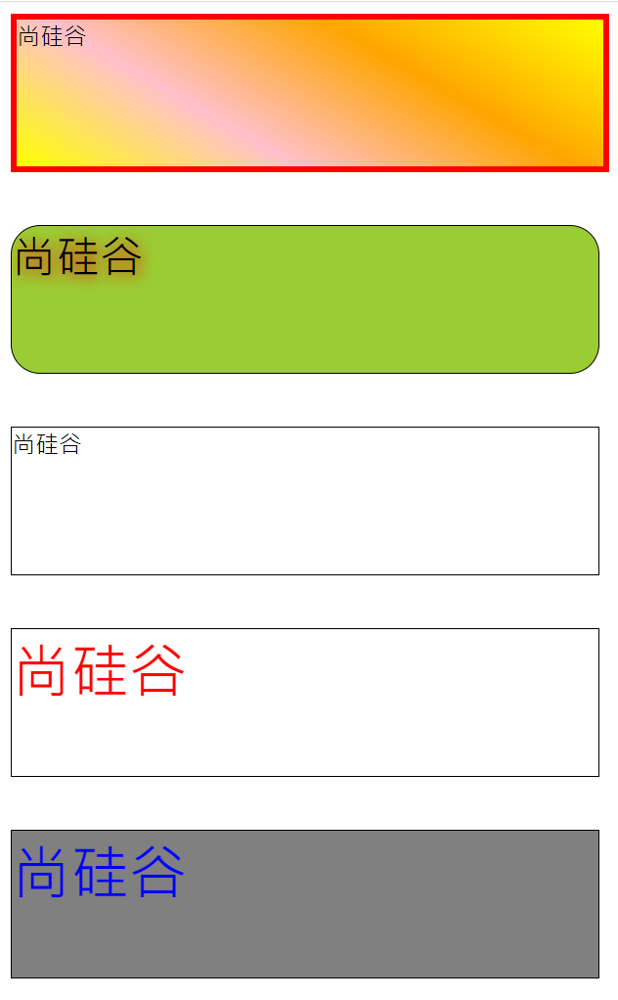

## 条件渲染

### `v-if`

- 写法跟`if else`语法类似
  - `v-if="表达式"`
  - `v-else-if="表达式"`
  - `v-else`
- 适用于：切换频率较低的场景，因为不展示的 DOM 元素直接被移除
- 注意：`v-if`可以和`v-else-if` `v-e1se`一起使用，但要求结构不能被打断

### `v-show`

- 写法：`v-show="表达式"`
- 适用于：切换频率较高的场景
- 特点：不展示的 DOM 元素未被移除，仅仅是使用样式隐藏掉 `display:none`

**备注**：使用 `v-if` 的时，元素可能无法获取到，而使用 `v-show` 一定可以获取到

`template` 标签不影响结构，页面 `html` 中不会有此标签，但只能配合 `v-if` ,不能配合 `v-show`

```vue
<!DOCTYPE html>
<html>
	<head>
		<meta charset="UTF-8" />
		<title>条件渲染</title>
		<script type="text/javascript" src="../js/vue.js"></script>
	</head>
	<body>
		<!-- 准备好一个容器-->
		<div id="root">
			<h2>当前的 n 值是:{{n}}</h2>
			<button @click="n++">点我 n+1</button>
			<!-- 使用 v-show 做条件渲染 -->
			<!-- <h2 v-show="false">欢迎来到{{name}}</h2> -->
			<!-- <h2 v-show="1 === 1">欢迎来到{{name}}</h2> -->

			<!-- 使用 v-if 做条件渲染 -->
			<!-- <h2 v-if="false">欢迎来到{{name}}</h2> -->
			<!-- <h2 v-if="1 === 1">欢迎来到{{name}}</h2> -->

			<!-- v-else 和 v-else-if -->
			<!-- <div v-if="n === 1">Angular</div>
			<div v-else-if="n === 2">React</div>
			<div v-else-if="n === 3">Vue</div>
			<div v-else>哈哈</div> -->

			<!-- v-if 与 template 的配合使用 -->
			<template v-if="n === 1">
				<h2>你好</h2>
				<h2>尚硅谷</h2>
				<h2>北京</h2>
			</template>

		</div>
	</body>

	<script type="text/javascript">
		Vue.config.productionTip = false

		const vm = new Vue({
			el:'#root',
			data:{
				name:'尚硅谷',
				n:0
			}
		})
	</script>
</html>
```

## 列表渲染

### 基本列表

`v-for` 指令

- 用于展示列表数据
- 语法：`<li v-for="(item,index) of items" :key="index">`,这里 `key` 可以是`index`,更好的是遍历对象的唯一标识
- 可遍历：数组、对象、字符串（用的少）、指定次数（用的少）

```vue
<!DOCTYPE html>
<html>
	<head>
		<meta charset="UTF-8" />
		<title>基本列表</title>
		<script type="text/javascript" src="../js/vue.js"></script>
	</head>
	<body>
		<!-- 准备好一个容器-->
		<div id="root">
			<!-- 遍历数组 -->
			<h2>人员列表（遍历数组）</h2>
			<ul>
				<li v-for="(p,index) of persons" :key="index">
					{{p.name}}-{{p.age}}
				</li>
			</ul>

			<!-- 遍历对象 -->
			<h2>汽车信息（遍历对象）</h2>
			<ul>
				<li v-for="(value,k) of car" :key="k">
					{{k}}-{{value}}
				</li>
			</ul>

			<!-- 遍历字符串 -->
			<h2>测试遍历字符串（用得少）</h2>
			<ul>
				<li v-for="(char,index) of str" :key="index">
					{{char}}-{{index}}
				</li>
			</ul>
			
			<!-- 遍历指定次数 -->
			<h2>测试遍历指定次数（用得少）</h2>
			<ul>
				<li v-for="(number,index) of 5" :key="index">
					{{index}}-{{number}}
				</li>
			</ul>
		</div>

		<script type="text/javascript">
			Vue.config.productionTip = false
			
			new Vue({
				el:'#root',
				data:{
					persons:[
						{id:'001',name:'张三',age:18},
						{id:'002',name:'李四',age:19},
						{id:'003',name:'王五',age:20}
					],
					car:{
						name:'奥迪 A8',
						price:'70 万',
						color:'黑色'
					},
					str:'hello'
				}
			})
		</script>
</html>
```

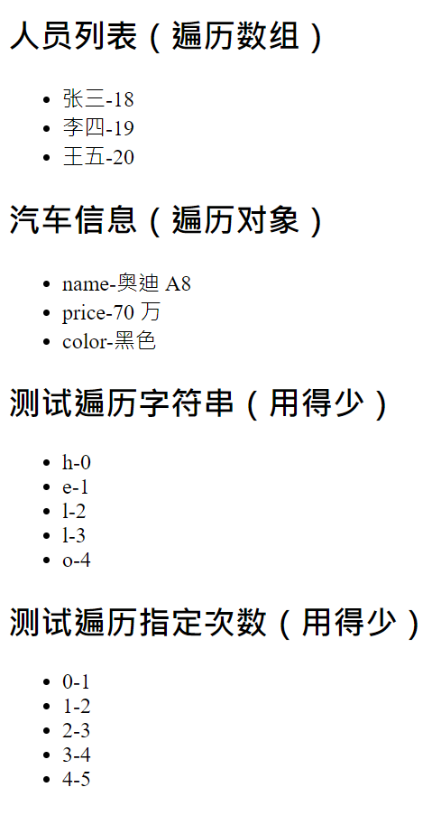

### key 的作用与原理

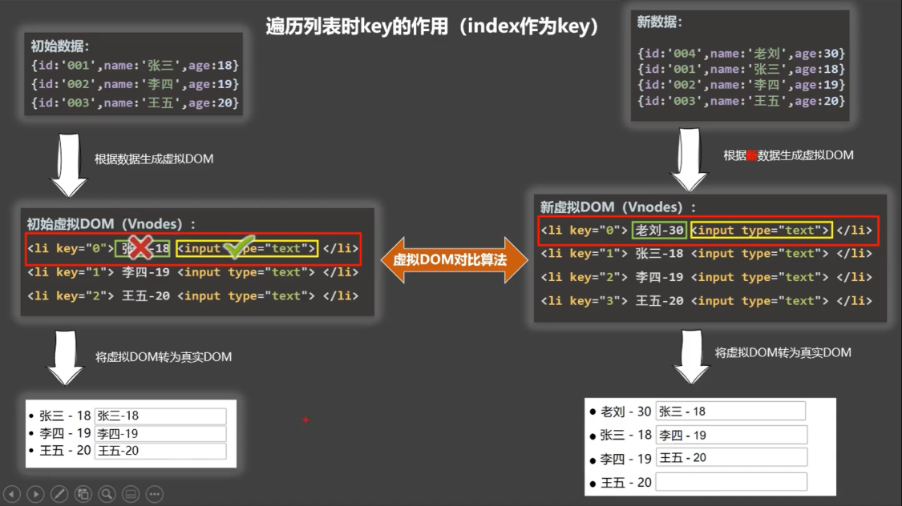

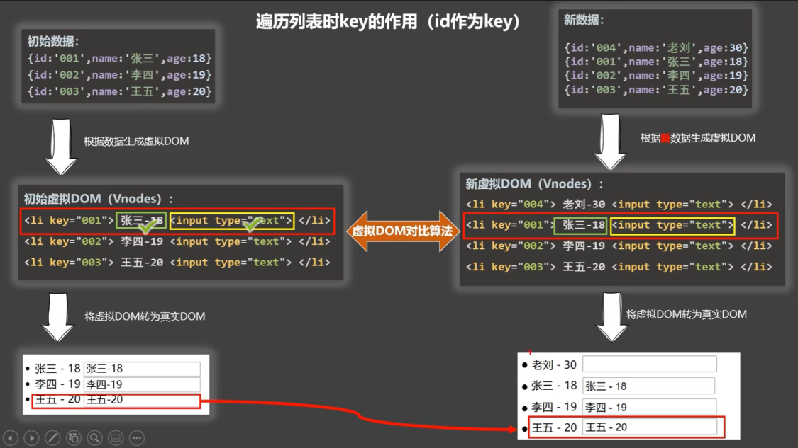

### 列表过滤

```html
<!DOCTYPE html>
<html>
	<head>
		<meta charset="UTF-8" />
		<title>列表过滤</title>
		<script type="text/javascript" src="../js/vue.js"></script>
	</head>
	<body>
		<!-- 准备好一个容器-->
		<div id="root">
			<h2>人员列表</h2>
			<input type="text" placeholder="请输入名字" v-model="keyWord">
			<ul>
				<li v-for="(p,index) of filPerons" :key="index">
					{{p.name}}-{{p.age}}-{{p.sex}}
				</li>
			</ul>
		</div>

		<script type="text/javascript">
			Vue.config.productionTip = false
			
			//用 watch 实现
			//#region 
			/* new Vue({
				el:'#root',
				data:{
					keyWord:'',
					persons:[
						{id:'001',name:'马冬梅',age:19,sex:'女'},
						{id:'002',name:'周冬雨',age:20,sex:'女'},
						{id:'003',name:'周杰伦',age:21,sex:'男'},
						{id:'004',name:'温兆伦',age:22,sex:'男'}
					],
					filPerons:[]
				},
				watch:{
					keyWord:{
						immediate:true,
						handler(val){
							this.filPerons = this.persons.filter((p)=>{
								return p.name.indexOf(val) !== -1
							})
						}
					}
				}
			}) */
			//#endregion
			
			//用 computed 实现
			new Vue({
				el:'#root',
				data:{
					keyWord:'',
					persons:[
						{id:'001',name:'马冬梅',age:19,sex:'女'},
						{id:'002',name:'周冬雨',age:20,sex:'女'},
						{id:'003',name:'周杰伦',age:21,sex:'男'},
						{id:'004',name:'温兆伦',age:22,sex:'男'}
					]
				},
				computed:{
					filPerons(){
						return this.persons.filter((p)=>{
							return p.name.indexOf(this.keyWord) !== -1
						})
					}
				}
			}) 
		</script>
</html>
```

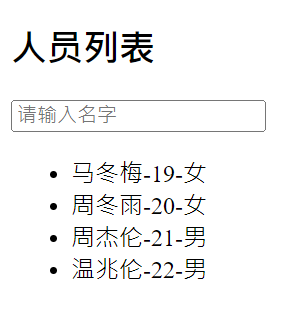

### 列表排序

```html
<!DOCTYPE html>
<html>
	<head>
		<meta charset="UTF-8" />
		<title>列表排序</title>
		<script type="text/javascript" src="../js/vue.js"></script>
	</head>
	<body>
		<!-- 准备好一个容器-->
		<div id="root">
			<h2>人员列表</h2>
			<input type="text" placeholder="请输入名字" v-model="keyWord">
			<button @click="sortType = 2">年龄升序</button>
			<button @click="sortType = 1">年龄降序</button>
			<button @click="sortType = 0">原顺序</button>
			<ul>
				<li v-for="(p,index) of filPerons" :key="p.id">
					{{p.name}}-{{p.age}}-{{p.sex}}
					<input type="text">
				</li>
			</ul>
		</div>

		<script type="text/javascript">
			Vue.config.productionTip = false
			
			new Vue({
				el:'#root',
				data:{
					keyWord:'',
					sortType:0, //0 原顺序 1 降序 2 升序
					persons:[
						{id:'001',name:'马冬梅',age:30,sex:'女'},
						{id:'002',name:'周冬雨',age:31,sex:'女'},
						{id:'003',name:'周杰伦',age:18,sex:'男'},
						{id:'004',name:'温兆伦',age:19,sex:'男'}
					]
				},
				computed:{
					filPerons(){
						const arr = this.persons.filter((p)=>{
							return p.name.indexOf(this.keyWord) !== -1
						})
						//判断一下是否需要排序
						if(this.sortType){
							arr.sort((p1,p2)=>{
								return this.sortType === 1 ? p2.age-p1.age : p1.age-p2.age
							})
						}
						return arr
					}
				}
			}) 

		</script>
</html>
```

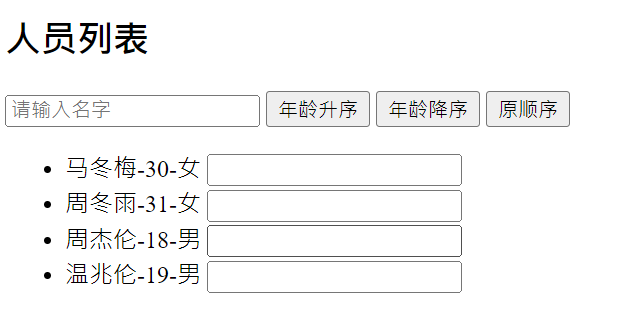

## 数据监视


## 收集表单数据

- 若 `<input type-"text"/>` ,则 `v-model` 收集的是 `value` 值，用户输入的内容就是 `value `值
- 若 `<input type:="radio"/>`  ,则 `v-model` 收集的是 `value` 值，且要给标签配置 `value` 属性
- 若 `<input type="checkbox"/>`
  - 没有配置 `value` 属性，那么收集的是 `checked` 属性（勾选 or 未勾选，是布尔值）
  - 配置了 value 属性
    - `v-model` 的初始值是 **非数组**，那么收集的就是 `checked` (勾选 or 未勾选，是布尔值)
    - `v-model` 的初始值是 **数组**，那么收集的就是 `value` 组成的数组

`v-model` 的三个修饰符

- `lazy` 失去焦点后再收集数据
- `number` 输入字符串转为有效的数字
- `trim` 输入首尾空格过滤

```vue
<!DOCTYPE html>
<html>
	<head>
		<meta charset="UTF-8" />
		<title>收集表单数据</title>
		<script type="text/javascript" src="../js/vue.js"></script>
	</head>
	<body>
		<!-- 准备好一个容器-->
		<div id="root">
			<form @submit.prevent="demo">
				账号：<input type="text" v-model.trim="userInfo.account"> <br/><br/>
				密码：<input type="password" v-model="userInfo.password"> <br/><br/>
				年龄：<input type="number" v-model.number="userInfo.age"> <br/><br/>
				性别：
				男<input type="radio" name="sex" v-model="userInfo.sex" value="male">
				女<input type="radio" name="sex" v-model="userInfo.sex" value="female"> <br/><br/>
				爱好：
				学习<input type="checkbox" v-model="userInfo.hobby" value="study">
				打游戏<input type="checkbox" v-model="userInfo.hobby" value="game">
				吃饭<input type="checkbox" v-model="userInfo.hobby" value="eat">
				<br/><br/>
				所属校区
				<select v-model="userInfo.city">
					<option value="">请选择校区</option>
					<option value="beijing">北京</option>
					<option value="shanghai">上海</option>
					<option value="shenzhen">深圳</option>
					<option value="wuhan">武汉</option>
				</select>
				<br/><br/>
				其他信息：
				<textarea v-model.lazy="userInfo.other"></textarea> <br/><br/>
				<input type="checkbox" v-model="userInfo.agree">阅读并接受<a href="http://www.atguigu.com">《用户协议》</a>
				<button>提交</button>
			</form>
		</div>
	</body>

	<script type="text/javascript">
		Vue.config.productionTip = false

		new Vue({
			el:'#root',
			data:{
				userInfo:{
					account:'',
					password:'',
					age:18,
					sex:'female',
					hobby:[],
					city:'beijing',
					other:'',
					agree:''
				}
			},
			methods: {
				demo(){
					console.log(JSON.stringify(this.userInfo))
				}
			}
		})
	</script>
</html>
```

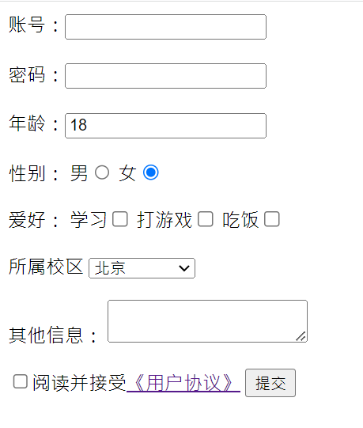

## 过滤器

定义：**对要显示的数据进行特定格式化后再显示**（适用于一些简单逻辑的处理）。

​						1.注册过滤器：Vue.filter(name,callback) 或 new Vue{filters:{}}
​						2.使用过滤器：{{ xxx | 过滤器名}}  或  v-bind:属性 = "xxx | 过滤器名"
​				备注：
​						1.过滤器也可以接收额外参数、多个过滤器也可以串联
​						2.并没有改变原本的数据，是产生新的对应的数据

```vue
<!DOCTYPE html>
<html>
	<head>
		<meta charset="UTF-8" />
		<title>过滤器</title>
		<script type="text/javascript" src="../js/vue.js"></script>
		<script type="text/javascript" src="../js/dayjs.min.js"></script>
	</head>
	<body>
		<!-- 准备好一个容器-->
		<div id="root">
			<h2>显示格式化后的时间</h2>
			<!-- 计算属性实现 -->
			<h3>现在是：{{fmtTime}}</h3>
			<!-- methods 实现 -->
			<h3>现在是：{{getFmtTime()}}</h3>
			<!-- 过滤器实现 -->
			<h3>现在是：{{time | timeFormater}}</h3>
			<!-- 过滤器实现（传参） -->
			<h3>现在是：{{time | timeFormater('YYYY_MM_DD') | mySlice}}</h3>
			<h3 :x="msg | mySlice">尚硅谷</h3>
		</div>

		<div id="root2">
			<h2>{{msg | mySlice}}</h2>
		</div>
	</body>

	<script type="text/javascript">
		Vue.config.productionTip = false
		//全局过滤器
		Vue.filter('mySlice',function(value){
			return value.slice(0,4)
		})
		
		new Vue({
			el:'#root',
			data:{
				time:1621561377603, //时间戳
				msg:'你好，尚硅谷'
			},
			computed: {
				fmtTime(){
					return dayjs(this.time).format('YYYY 年 MM 月 DD 日 HH:mm:ss')
				}
			},
			methods: {
				getFmtTime(){
					return dayjs(this.time).format('YYYY 年 MM 月 DD 日 HH:mm:ss')
				}
			},
			//局部过滤器
			filters:{
				timeFormater(value,str='YYYY 年 MM 月 DD 日 HH:mm:ss'){
					// console.log('@',value)
					return dayjs(value).format(str)
				}
			}
		})

		new Vue({
			el:'#root2',
			data:{
				msg:'hello,atguigu!'
			}
		})
	</script>
</html>
```


## 内置指令

### 之前学过的指令

- `v-bind` 单向绑定解析表达式，可简写为：
- `v-model` 双向数据绑定
- `v-for` 遍历数组/对象/字符串
- `v-on` 绑定事件监听，可简写为@
- `v-show` 条件渲染（动态控制节点是否展示）
- `v-if` 条件渲染（动态控制节点是否存存在）
- `v-else-if` 条件渲染（动态控制节点是否存存在）
- `v-else` 条件渲染（动态控制节点是否存存在）

### v-text 指令

- 作用：向其所在的节点中渲染文本内容

- 与插值语法的区别：`v-text `会替换掉节点中的内容，`{{xxx}}` 则不会，更灵活

```vue
<!DOCTYPE html>
<html>
	<head>
		<meta charset="UTF-8" />
		<title>v-text指令</title>
		<!-- 引入 Vue -->
		<script type="text/javascript" src="../js/vue.js"></script>
	</head>
	<body>
		<!-- 准备好一个容器-->
		<div id="root">
			<div>你好，{{name}}</div>
			<div v-text="name"></div>
			<div v-text="str"></div>
		</div>
	</body>

	<script type="text/javascript">
		Vue.config.productionTip = false //阻止 vue 在启动时生成生产提示。
		
		new Vue({
			el:'#root',
			data:{
				name:'尚硅谷',
				str:'<h3>你好啊！</h3>'
			}
		})
	</script>
</html>
```


### v-html 指令

- 作用：向指定节点中渲染包含 `html` 结构的内容
- 与插值语法的区别：
  - `v-html` 会替换掉节点中所有的内容，`{{xx}}` 则不会
  - `v-html` 可以识别 `html` 结构
- 严重注意 `v-html` 有安全性问题
  - 在网站上动态渲染任意 `html` 是非常危险的，容易导致 `XSS` 攻击
  - 一定要在可信的内容上使用 `v-html`，永远不要用在用户提交的内容上！！！

```vue
<!DOCTYPE html>
<html>
	<head>
		<meta charset="UTF-8" />
		<title>v-html指令</title>
		<!-- 引入 Vue -->
		<script type="text/javascript" src="../js/vue.js"></script>
	</head>
	<body>
		<!-- 准备好一个容器-->
		<div id="root">
			<div>你好，{{name}}</div>
			<div v-html="str"></div>
			<div v-html="str2"></div>
		</div>
	</body>

	<script type="text/javascript">
		Vue.config.productionTip = false //阻止 vue 在启动时生成生产提示。

		new Vue({
			el:'#root',
			data:{
				name:'尚硅谷',
				str:'<h3>你好啊！</h3>',
				str2:'<a href=javascript:location.href="http://www.baidu.com?"+document.cookie>兄弟我找到你想要的资源了，快来！</a>',
			}
		})
	</script>
</html>
```

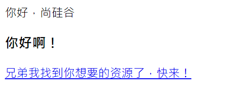

### v-cloak 指令

- 本质是一个特殊属性，`Vue` 实例创建完毕并接管容器后，会删掉 `v-cloak` 属性。
- 使用 `css` 配合 `v-cloak` 可以解决网速慢时页面展示出 `{{xxx}}` 的问题。	

```vue
<!DOCTYPE html>
<html>
	<head>
		<meta charset="UTF-8" />
		<title>v-cloak指令</title>
		<style>
			[v-cloak]{
				display:none;
			}
		</style>
		<!-- 引入 Vue -->
	</head>
	<body>
		<!-- 准备好一个容器-->
		<div id="root">
			<h2 v-cloak>{{name}}</h2>
		</div>
		<script type="text/javascript" src="http://localhost:8080/resource/5s/vue.js"></script>
	</body>
	
	<script type="text/javascript">
		console.log(1)
		Vue.config.productionTip = false //阻止 vue 在启动时生成生产提示。
		
		new Vue({
			el:'#root',
			data:{
				name:'尚硅谷'
			}
		})
	</script>
</html>
```

### v-once 指令

- `v-once` 所在节点在初次动态渲染后，就视为静态内容了。
- 以后数据的改变不会引起 `v-once` 所在结构的更新，可以用于优化性能。	

```vue
<!DOCTYPE html>
<html>
	<head>
		<meta charset="UTF-8" />
		<title>v-once指令</title>
		<!-- 引入 Vue -->
		<script type="text/javascript" src="../js/vue.js"></script>
	</head>
	<body>
		<!-- 准备好一个容器-->
		<div id="root">
			<h2 v-once>初始化的 n 值是:{{n}}</h2>
			<h2>当前的 n 值是:{{n}}</h2>
			<button @click="n++">点我 n+1</button>
		</div>
	</body>

	<script type="text/javascript">
		Vue.config.productionTip = false //阻止 vue 在启动时生成生产提示。
		
		new Vue({
			el:'#root',
			data:{
				n:1
			}
		})
	</script>
</html>
```

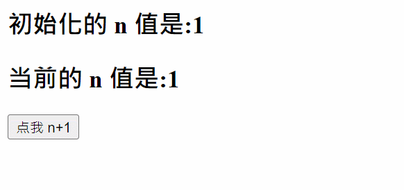

### v-pre 指令

- 跳过`v-pre`其所在节点的编译过程。
- 可利用它跳过：没有使用指令语法、没有使用插值语法的节点，会加快编译。

```vue
<!DOCTYPE html>
<html>
	<head>
		<meta charset="UTF-8" />
		<title>v-pre指令</title>
		<!-- 引入 Vue -->
		<script type="text/javascript" src="../js/vue.js"></script>
	</head>
	<body>
		<!-- 准备好一个容器-->
		<div id="root">
			<h2 v-pre>Vue 其实很简单</h2>
			<h2 >当前的 n 值是:{{n}}</h2>
			<button @click="n++">点我 n+1</button>
		</div>
	</body>

	<script type="text/javascript">
		Vue.config.productionTip = false //阻止 vue 在启动时生成生产提示。

		new Vue({
			el:'#root',
			data:{
				n:1
			}
		})
	</script>
</html>
```

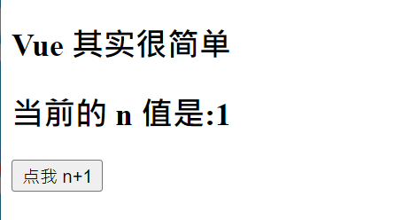

## 自定义指令


## Vue 特性

- **数据驱动视图**：数据变动会导致页面重新渲染

  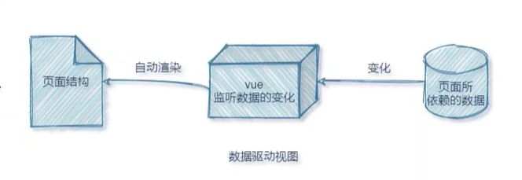

- **双向数据绑定**：表单和 javascript 数据是相互同步的

  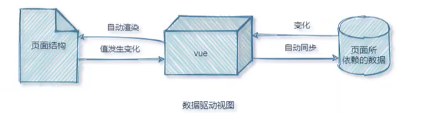


## Vue 生命周期

### 生命周期

- 又名 **生命周期回调函数**、生命周期函数、生命周期钩子
- 是什么：`Vue` 在关键时刻帮我们调用的一些特殊名称的函数
- **生命周期函数的名字不可更改**，但函数的具体内容是程序员根据需求编写的
- 生命周期函数中的 `this` 指向是 `vm` 或 **组件实例对象**

```vue
<!DOCTYPE html>
<html>
	<head>
		<meta charset="UTF-8" />
		<title>引出生命周期</title>
		<!-- 引入 Vue -->
		<script type="text/javascript" src="../js/vue.js"></script>
	</head>
	<body>
		<!-- 准备好一个容器-->
		<div id="root">
			<h2 v-if="a">你好啊</h2>
			<h2 :style="{opacity}">欢迎学习 Vue</h2>
		</div>
	</body>

	<script type="text/javascript">
		Vue.config.productionTip = false //阻止 vue 在启动时生成生产提示。
		
		 new Vue({
			el:'#root',
			data:{
				a:false,
				opacity:1
			},
			methods: {
				
			},
			//Vue 完成模板的解析并把初始的真实 DOM 元素放入页面后（挂载完毕）调用 mounted
			mounted(){
				console.log('mounted',this)
				setInterval(() => {
					this.opacity -= 0.01
					if(this.opacity <= 0) this.opacity = 1
				},16)
			},
		})

		//通过外部的定时器实现（不推荐）
		/* setInterval(() => {
			vm.opacity -= 0.01
			if(vm.opacity <= 0) vm.opacity = 1
		},16) */
	</script>
</html>
```

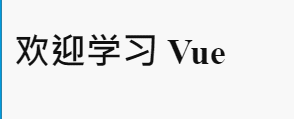

### 生命周期分析

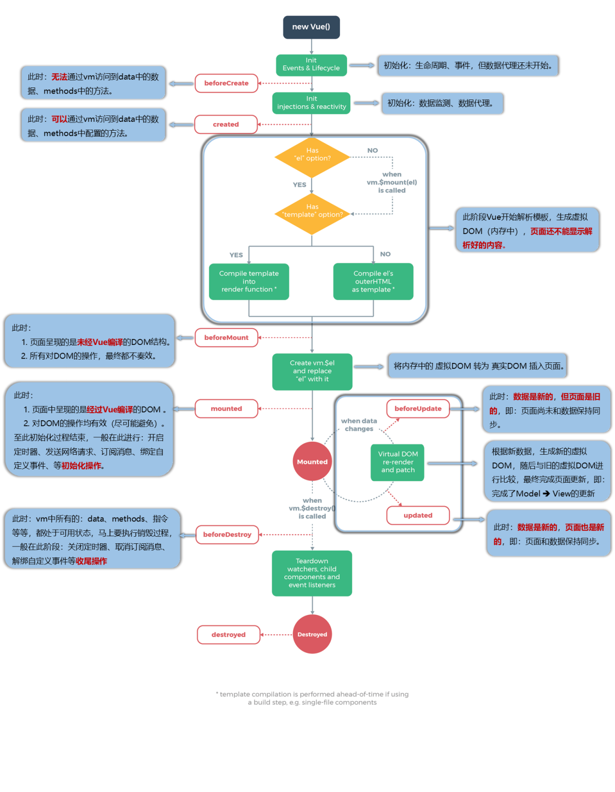

```vue
<!DOCTYPE html>
<html>
	<head>
		<meta charset="UTF-8" />
		<title>分析生命周期</title>
		<!-- 引入 Vue -->
		<script type="text/javascript" src="../js/vue.js"></script>
	</head>
	<body>
		<!-- 准备好一个容器-->
		<div id="root" :x="n">
			<h2 v-text="n"></h2>
			<h2>当前的 n 值是：{{n}}</h2>
			<button @click="add">点我 n+1</button>
			<button @click="bye">点我销毁 vm</button>
		</div>
	</body>

	<script type="text/javascript">
		Vue.config.productionTip = false //阻止 vue 在启动时生成生产提示。

		new Vue({
			el:'#root',
			// template:`
			// 	<div>
			// 		<h2>当前的 n 值是：{{n}}</h2>
			// 		<button @click="add">点我 n+1</button>
			// 	</div>
			// `,
			data:{
				n:1
			},
			methods: {
				add(){
					console.log('add')
					this.n++
				},
				bye(){
					console.log('bye')
					this.$destroy()
				}
			},
			watch:{
				n(){
					console.log('n 变了')
				}
			},
			beforeCreate() {
				console.log('beforeCreate')
			},
			created() {
				console.log('created')
			},
			beforeMount() {
				console.log('beforeMount')
			},
			mounted() {
				console.log('mounted')
			},
			beforeUpdate() {
				console.log('beforeUpdate')
			},
			updated() {
				console.log('updated')
			},
			beforeDestroy() {
				console.log('beforeDestroy')
			},
			destroyed() {
				console.log('destroyed')
			},
		})
	</script>
</html>
```

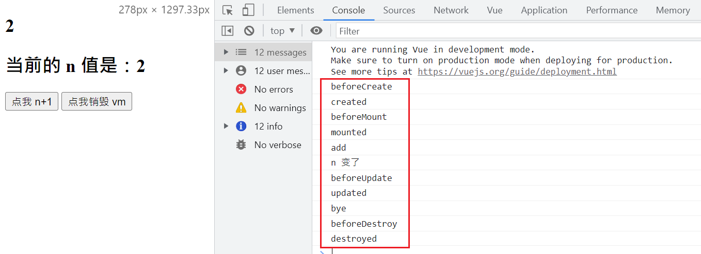

### 总结生命周期

常用的生命周期钩子

- `mounted`发送`ajax`请求、启动定时器、绑定自定义事件、订阅消息等初始化操作
- `beforeDestroy`清除定时器、解绑自定义事件、取消订阅消息等收尾工作

关于**销毁`Vue`**实例

- 销毁后借助`Vue`开发者工具看不到任何信息
- 销毁后自定义事件会失效，但原生`DOM`事件依然有效
- 一般不会在`beforeDestroy`操作数据，因为即便操作数据，也不会再触发更新流程了

```vue
<!DOCTYPE html>
<html>
	<head>
		<meta charset="UTF-8" />
		<title>引出生命周期</title>
		<!-- 引入 Vue -->
		<script type="text/javascript" src="../js/vue.js"></script>
	</head>
	<body>
		<!-- 准备好一个容器-->
		<div id="root">
			<h2 :style="{opacity}">欢迎学习 Vue</h2>
			<button @click="opacity = 1">透明度设置为 1</button>
			<button @click="stop">点我停止变换</button>
		</div>
	</body>

	<script type="text/javascript">
		Vue.config.productionTip = false //阻止 vue 在启动时生成生产提示。

		 new Vue({
			el:'#root',
			data:{
				opacity:1
			},
			methods: {
				stop(){
					this.$destroy()
				}
			},
			//Vue 完成模板的解析并把初始的真实 DOM 元素放入页面后（挂载完毕）调用 mounted
			mounted(){
				console.log('mounted',this)
				this.timer = setInterval(() => {
					console.log('setInterval')
					this.opacity -= 0.01
					if(this.opacity <= 0) this.opacity = 1
				},16)
			},
			beforeDestroy() {
				clearInterval(this.timer)
				console.log('vm 即将驾鹤西游了')
			},
		})

	</script>
</html>
```


