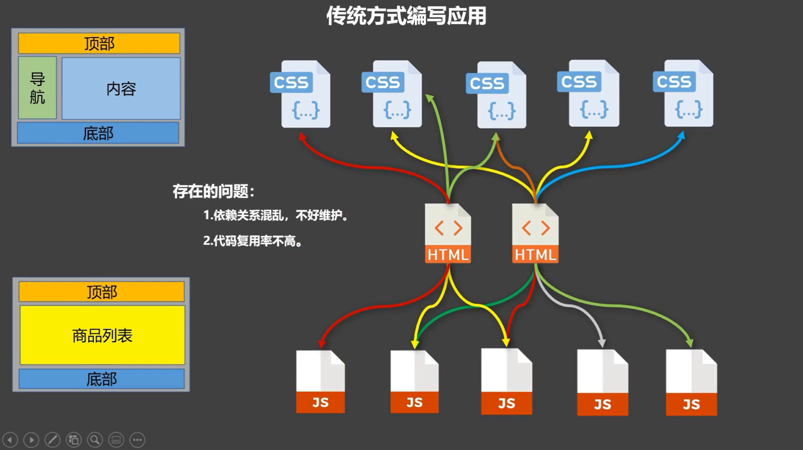
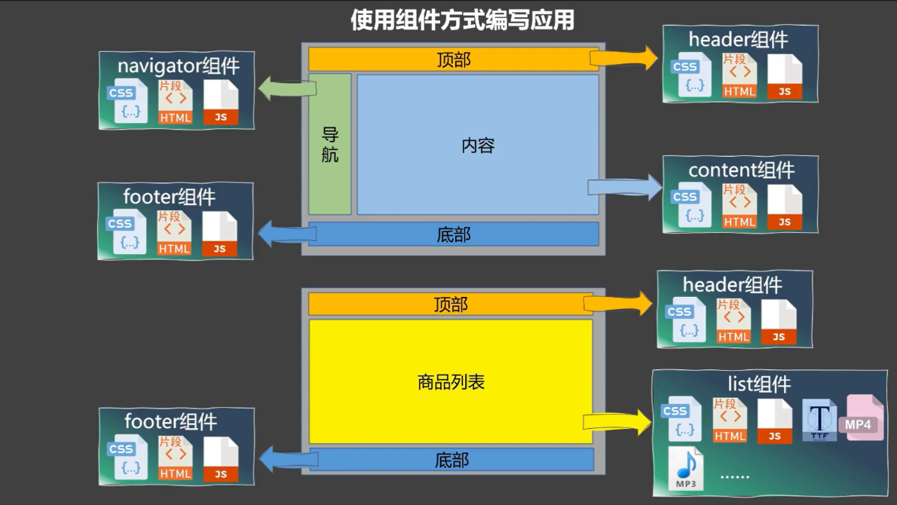

# 模块与组件、模块化与组件化

模块
a.理解：向外提供特定功能的 js 程序，一般就是一个 js 文件
b.为什么：js 文件很多很复杂
c.作用：复用、简化 js 的编写，提高 js 运行效率
组件
a.定义：用来实现局部功能的代码和资源的集合
(html/css/js/image...)
b.为什么：一个界面的功能很复杂
c.作用：复用编码，简化项目编码，提高运行效率
模块化
当应用中的 js 都以模块来编写的，那这个应用就是一个模块化的应
用
组件化
当应用中的功能都是多组件的方式来编写的，那这个应用就是一个组
件化的应用

### 非单文件组件

- **非单文件组件**：一个文件中包含有个组件
- **单文件组件**：一个文件中只包含有 1 个组件
  2.2.1.基本使用
  Vue 中使用组件的三大步骤
  1.定义组件
  使用 Vue.extend(options) 创建，其中 options 和 new Vue(o
  ptions) 时传入的 options 几乎一样，但也有点区别
  a。
  e1 不要写，因为最终所有的组件都要经过一个 vm 的管理，
  由 vm 中的 e1 才决定服务哪个容器
  b.
  data 必须写成函数，辟免组件被复用时，数据存在引用关系
  2.注册组件
  a.局部注册：new Vue() 的时候 options 传入 component
  s 选项
  b.全局注册：Vue.component('组件名'，组件)
  3。使用组件
  编写组件标签如<school></school>

### 单文件组件
