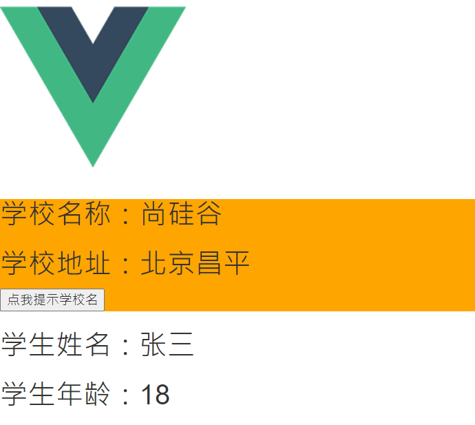
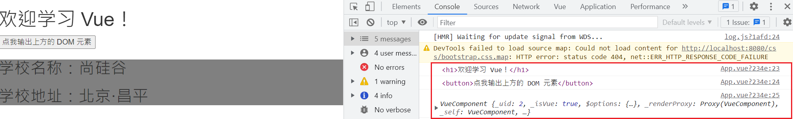
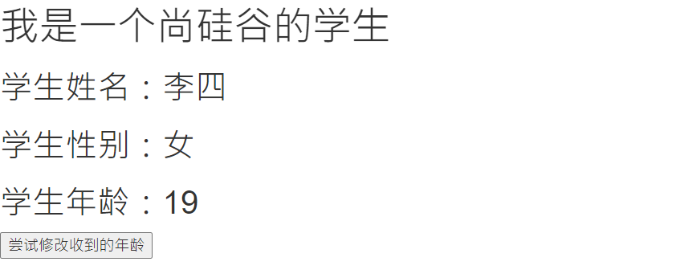
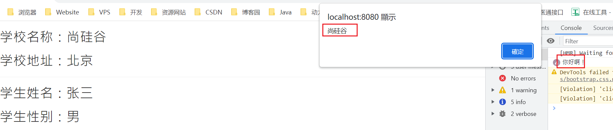
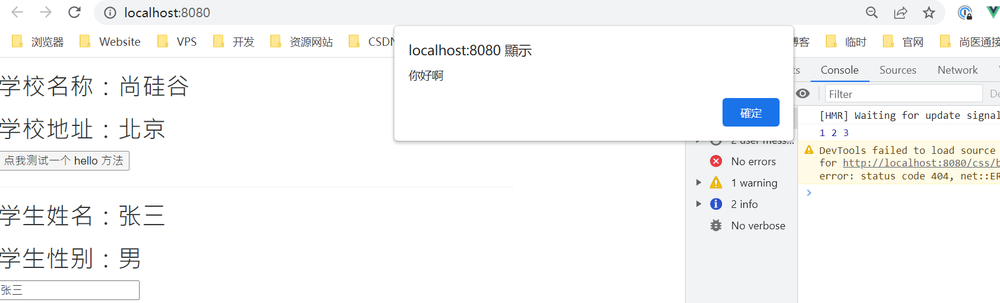
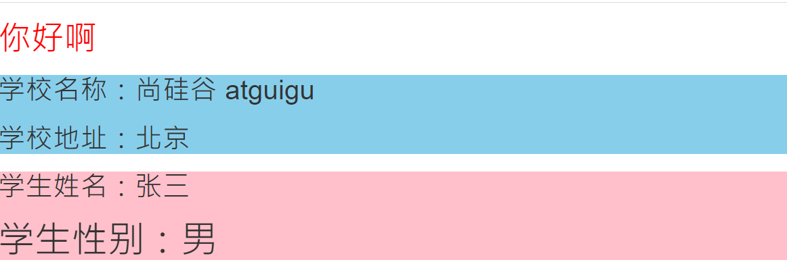
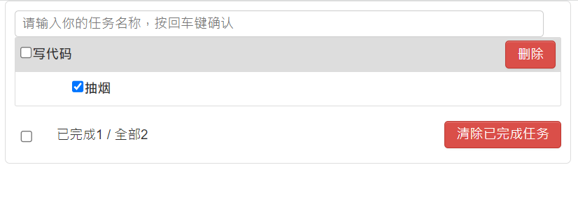

# 使用 Vue 脚手架 

## 初始化脚手架

### 说明

1. Vue 脚手架是 Vue 官方提供的标准化开发工具（开发平台）。
2. 文档：[https://cli.vuejs.org/zh/](https://cli.vuejs.org/zh/)。
3. **Vue CLI 现已处于维护模式！现在官方推荐使用 [create-vue](https://github.com/vuejs/create-vue) 来创建基于 [Vite](https://vitejs.dev/) 的新项目。**

### 具体步骤

#### ①安装 vue-cli

```javascript
# 第一步（仅第一次执行）：全局安装@vue/cli
npm install -g @vue/cli
```

#### ②创建 Vue 项目

```javascript
# 第二步：切换到你要创建项目的目录，然后使用命令创建项目
vue create vueproject
```

#### ③运行 Vue 项目

```javascript
# 第三步：启动项目
npm run serve

# 备注：如出现下载缓慢请配置npm淘宝镜像：
npm config set registry https://registry.npm.taobao.org

# Vue脚手架隐藏了所有webpack相关的配置，若想查看具体的webpack配置，
vue inspect outputjs
```

### 模板项目的结构

```
├── node_modules
├── public
│ ├── favicon.ico: 页签图标
│ └── index.html: 主页面
├── src
│ ├── assets: 存放静态资源
│ │ └── logo.png
│ │── component: 存放组件
│ │ └── HelloWorld.vue
│ │── App.vue: 汇总所有组件
│ │── main.js: 入口文件
├── .gitignore: git 版本管制忽略的配置
├── babel.config.js: babel 的配置文件
├── package.json: 应用包配置文件
├── README.md: 应用描述文件
├── package-lock.json：包版本控制文件
```

#### `src/components/School.vue`

```vue
<template>
	<div class="demo">
		<h2>学校名称：{{name}}</h2>
		<h2>学校地址：{{address}}</h2>
		<button @click="showName">点我提示学校名</button>	
	</div>
</template>

<script>
	 export default {
		name:'School',
		data(){
			return {
				name:'尚硅谷',
				address:'北京昌平'
			}
		},
		methods: {
			showName(){
				alert(this.name)
			}
		},
	}
</script>

<style>
	.demo{
		background-color: orange;
	}
</style>
```

#### `src/components/Student.vue`

```vue
<template>
	<div>
		<h2>学生姓名：{{name}}</h2>
		<h2>学生年龄：{{age}}</h2>
	</div>
</template>

<script>
	 export default {
		name:'Student',
		data(){
			return {
				name:'张三',
				age:18
			}
		}
	}
</script>
```

#### `src/App.vue`

```vue
<template>
	<div>
		
		<School></School>
		<Student></Student>
	</div>
</template>

<script>
	//引入组件
	import School from './components/School'
	import Student from './components/Student'

	export default {
		name:'App',
		components:{
			School,
			Student
		}
	}
</script>
```

#### `src/main.js`

```js
/* 
	该文件是整个项目的入口文件
*/
//引入 Vue
import Vue from 'vue'
//引入 App 组件，它是所有组件的父组件
import App from './App.vue'
//关闭 vue 的生产提示
Vue.config.productionTip = false

//创建 Vue 实例对象---vm
new Vue({
	el:'#app',
	//render 函数完成了这个功能：将 App 组件放入容器中
  render: h => h(App),
	// render:q=> q('h1','你好啊')

	// template:`<h1>你好啊</h1>`,
	// components:{App},
})
```

#### `public/index.html`

```html
<!DOCTYPE html>
<html lang="">
  <head>
    <meta charset="utf-8">
		<!-- 针对 IE 浏览器的一个特殊配置，含义是让 IE 浏览器以最高的渲染级别渲染页面 -->
    <meta http-equiv="X-UA-Compatible" content="IE=edge">
		<!-- 开启移动端的理想视口 -->
    <meta name="viewport" content="width=device-width,initial-scale=1.0">
		<!-- 配置页签图标 -->
    <link rel="icon" href="<%= BASE_URL %>favicon.ico">
		<!-- 引入第三方样式 -->
		<link rel="stylesheet" href="<%= BASE_URL %>css/bootstrap.css">
		<!-- 配置网页标题 -->
    <title>硅谷系统</title>
  </head>
  <body>
		<!-- 当浏览器不支持 js 时 noscript 中的元素就会被渲染 -->
    <noscript>
      <strong>We're sorry but <%= htmlWebpackPlugin.options.title %> doesn't work properly without JavaScript enabled. Please enable it to continue.</strong>
    </noscript>
		<!-- 容器 -->
    <div id="app"></div>
    <!-- built files will be auto injected -->
  </body>
</html>
```



### render 函数

```vue
new Vue({
	el:'#app',
	//render 函数完成了这个功能：将 App 组件放入容器中
  	render: h => h(App),

    //完整形式
    //render(createElement){
    //    return createElement(App)
    //}
})
```

### 关于不同版本的 Vue

1. `vue.js` 与 `vue.runtime.xxx.js` 的区别：
   1. `vue.js` 是完整版的 `Vue`，包含：核心功能 + 模板解析器。
   2. `vue.runtime.xxx.js` 是运行版的 `Vue`，只包含：核心功能；没有模板解析器。
2. 因为 `vue.runtime.xxx.js` 没有模板解析器，所以不能使用 `template` 配置项，需要使用 `render` 函数接收到的 `createElement` 函数去指定具体内容。	

### vue.config.js 配置文件

1. 使用 `vue inspect > output.js` 可以查看到 Vue 脚手架的默认配置。
2. 使用 `vue.config.js` 可以对脚手架进行个性化定制，详情见：https://cli.vuejs.org/zh

## ref 属性

1. 被用来给元素或子组件注册引用信息（id 的替代者）
2. 应用在 html 标签上获取的是真实 DOM 元素，应用在组件标签上是组件实例对象（VueComponent）
3. 使用方式：
   1. 打标识：```<h1 ref="xxx">.....</h1>``` 或 ```<School ref="xxx"></School>```
   2. 获取：```this.$refs.xxx```

```vue
<template>
	<div>
		<h1 v-text="msg" ref="title"></h1>
		<button ref="btn" @click="showDOM">点我输出上方的 DOM 元素</button>
		<School ref="sch"/>
	</div>
</template>

<script>
	//引入 School 组件
	import School from './components/School'

	export default {
		name:'App',
		components:{School},
		data() {
			return {
				msg:'欢迎学习 Vue！'
			}
		},
		methods: {
			showDOM(){
				console.log(this.$refs.title) //真实 DOM 元素
				console.log(this.$refs.btn) //真实 DOM 元素
				console.log(this.$refs.sch) //School 组件的实例对象（vc）
			}
		},
	}
</script>
```



## props 配置项

1. 功能：让组件接收外部传过来的数据

2. 传递数据：```<Demo name="xxx"/>```

3. 接收数据：

   1. 第一种方式（只接收）：```props:['name'] ```

   2. 第二种方式（限制类型）：```props:{name:String}```

   3. 第三种方式（限制类型、限制必要性、指定默认值）：

      ```js
      props:{
      	name:{
      	type:String, //类型
      	required:true, //必要性
      	default:'老王' //默认值
      	}
      }
      ```

   > 备注：props 是只读的，Vue 底层会监测你对 props 的修改，如果进行了修改，就会发出警告，若业务需求确实需要修改，那么请复制 props 的内容到 data 中一份，然后去修改 data 中的数据。

### `src/App.vue`

```vue
<template>
	<div>
		<Student name="李四" sex="女" :age="18"/>
	</div>
</template>

<script>
	import Student from './components/Student'

	export default {
		name:'App',
		components:{Student}
	}
</script>
```

### `src/components/School.vue`

```vue
<template>
	<div>
		<h1>{{msg}}</h1>
		<h2>学生姓名：{{name}}</h2>
		<h2>学生性别：{{sex}}</h2>
		<h2>学生年龄：{{myAge+1}}</h2>
		<button @click="updateAge">尝试修改收到的年龄</button>
	</div>
</template>

<script>
	export default {
		name:'Student',
		data() {
			console.log(this)
			return {
				msg:'我是一个尚硅谷的学生',
				myAge:this.age
			}
		},
		methods: {
			updateAge(){
				this.myAge++
			}
		},
		//简单声明接收
		// props:['name','age','sex'] 

		//接收的同时对数据进行类型限制
		/* props:{
			name:String,
			age:Number,
			sex:String
		} */

		//接收的同时对数据：进行类型限制 + 默认值的指定 + 必要性的限制
		props:{
			name:{
				type:String, //name 的类型是字符串
				required:true, //name 是必要的
			},
			age:{
				type:Number,
				default:99 //默认值
			},
			sex:{
				type:String,
				required:true
			}
		}
	}
</script>
```



## mixin(混入)

1. 功能：可以把多个组件共用的配置提取成一个混入对象

2. 使用方式：

   第一步定义混合：

   ```
   {
       data(){....},
       methods:{....}
       ....
   }
   ```

   第二步使用混入：

   ​	全局混入：```Vue.mixin(xxx)```
   ​	局部混入：```mixins:['xxx']	```

备注：

1. 组件和混入对象含有同名选项时，这些选项将以恰当的方式进行“合并”，在发生冲突时以组件优先

   ```js
   var mixin = {
       data: function () {
           return {
               message: 'hello',
               foo: abc'
           }
       }
   }
   
   new Vue({
       mixins: [mixin],
       data() {
           return {
               message: goodbye',
           	  bar: 'def'
           }
       },
       created() {
           console.log(this.$data)
           // => { message: "goodbye", foo: "abc", bar: "def" }
       }
   })
   ```

2. 同名生命周期钩子将合并为一个数组，**因此都将被调用**。另外，混入对象的钩子将在组件自身钩子之前调用

   ```js
   var mixin = { 
       created () { 
           console.log('混入对象的钩子被调用') 
       } 
   } 
   
   new Vue({ 
       mixins: [mixin], 
       created () { 
           console.log('组件钩子被调用') 
       } 
   }) 
   
   // => "混入对象的钩子被调用" 
   // => "组件钩子被调用"
   ```

### `src/mixin.js`

```js
export const hunhe = {
	methods: {
		showName(){
			alert(this.name)
		}
	},
	mounted() {
		console.log('你好啊！')
	},
}
export const hunhe2 = {
	data() {
		return {
			x:100,
			y:200
		}
	},
}
```

### `src/components/School.vue`

```vue
<template>
	<div>
		<h2 @click="showName">学校名称：{{name}}</h2>
		<h2>学校地址：{{address}}</h2>
	</div>
</template>

<script>
	//引入一个 hunhe
	// import {hunhe,hunhe2} from '../mixin'

	export default {
		name:'School',
		data() {
			return {
				name:'尚硅谷',
				address:'北京',
				x:666
			}
		},
		// mixins:[hunhe,hunhe2],
	}
</script>
```

### `src/components/Student.vue`

```vue
<template>
	<div>
		<h2 @click="showName">学生姓名：{{name}}</h2>
		<h2>学生性别：{{sex}}</h2>
	</div>
</template>

<script>
	// import {hunhe,hunhe2} from '../mixin'

	export default {
		name:'Student',
		data() {
			return {
				name:'张三',
				sex:'男'
			}
		},
		// mixins:[hunhe,hunhe2]
	}
</script>
```

### `src/App.vue`

```vue
<template>
	<div>
		<School/>
		<hr>
		<Student/>
	</div>
</template>

<script>
	import School from './components/School'
	import Student from './components/Student'

	export default {
		name:'App',
		components:{School,Student}
	}
</script>
```

### `src/main.js`

```js
//引入 Vue
import Vue from 'vue'
//引入 App
import App from './App.vue'
import {hunhe,hunhe2} from './mixin'
//关闭 Vue 的生产提示
Vue.config.productionTip = false

Vue.mixin(hunhe)
Vue.mixin(hunhe2)


//创建 vm
new Vue({
	el:'#app',
	render: h => h(App)
})
```



## 插件

1. 功能：用于增强 Vue

2. 本质：包含 install 方法的一个对象，install 的第一个参数是 Vue，第二个以后的参数是插件使用者传递的数据。

3. 定义插件：

   ```js
   对象.install = function (Vue, options) {
       // 1. 添加全局过滤器
       Vue.filter(....)
   
       // 2. 添加全局指令
       Vue.directive(....)
   
       // 3. 配置全局混入 (合)
       Vue.mixin(....)
   
       // 4. 添加实例方法
       Vue.prototype.$myMethod = function () {...}
       Vue.prototype.$myProperty = xxxx
   }
   ```

4. 使用插件：```Vue.use()```

### `src/plugins.js`

```js
export default {
	install(Vue,x,y,z){
		console.log(x,y,z)
		//全局过滤器
		Vue.filter('mySlice',function(value){
			return value.slice(0,4)
		})

		//定义全局指令
		Vue.directive('fbind',{
			//指令与元素成功绑定时（一上来）
			bind(element,binding){
				element.value = binding.value
			},
			//指令所在元素被插入页面时
			inserted(element,binding){
				element.focus()
			},
			//指令所在的模板被重新解析时
			update(element,binding){
				element.value = binding.value
			}
		})

		//定义混入
		Vue.mixin({
			data() {
				return {
					x:100,
					y:200
				}
			},
		})

		//给 Vue 原型上添加一个方法（vm 和 vc 就都能用了）
		Vue.prototype.hello = ()=>{alert('你好啊')}
	}
}
```

### `src/components/School.vue`

```vue
<template>
	<div>
		<h2>学校名称：{{name | mySlice}}</h2>
		<h2>学校地址：{{address}}</h2>
		<button @click="test">点我测试一个 hello 方法</button>
	</div>
</template>

<script>
	export default {
		name:'School',
		data() {
			return {
				name:'尚硅谷 atguigu',
				address:'北京',
			}
		},
		methods: {
			test(){
				this.hello()
			}
		},
	}
</script>
```

### `src/components/Student.vue`

```vue
<template>
	<div>
		<h2>学生姓名：{{name}}</h2>
		<h2>学生性别：{{sex}}</h2>
		<input type="text" v-fbind:value="name">
	</div>
</template>

<script>
	export default {
		name:'Student',
		data() {
			return {
				name:'张三',
				sex:'男'
			}
		},
	}
</script>
```

### `src/main.js`

```js
//引入 Vue
import Vue from 'vue'
//引入 App
import App from './App.vue'
//引入插件
import plugins from './plugins'
//关闭 Vue 的生产提示
Vue.config.productionTip = false

//应用（使用）插件
Vue.use(plugins,1,2,3)
//创建 vm
new Vue({
	el:'#app',
	render: h => h(App)
})
```



## scoped 样式

1. 作用：让样式在局部生效，防止冲突。
2. 写法：```<style scoped>```

> Vue 中的 webpack 并没有安装最新版，导致有些插件也不能默认安装最新版，如 `npm i less-loader@7`，而不是最新版

### `src/components/School.vue`

```vue
<template>
	<div class="demo">
		<h2 class="title">学校名称：{{name}}</h2>
		<h2>学校地址：{{address}}</h2>
	</div>
</template>

<script>
	export default {
		name:'School',
		data() {
			return {
				name:'尚硅谷 atguigu',
				address:'北京',
			}
		}
	}
</script>

<style scoped>
	.demo{
		background-color: skyblue;
	}
</style>
```

### `src/components/Student.vue`

```vue
<template>
	<div class="demo">
		<h2 class="title">学生姓名：{{name}}</h2>
		<h2 class="atguigu">学生性别：{{sex}}</h2>
	</div>
</template>

<script>
	export default {
		name:'Student',
		data() {
			return {
				name:'张三',
				sex:'男'
			}
		}
	}
</script>

<style lang="less" scoped>
	.demo{
		background-color: pink;
		.atguigu{
			font-size: 40px;
		}
	}
</style>
```

### `src/App.vue`

```vue
<template>
	<div>
		<h1 class="title">你好啊</h1>
		<School/>
		<Student/>
	</div>
</template>

<script>
	import Student from './components/Student'
	import School from './components/School'

	export default {
		name:'App',
		components:{School,Student}
	}
</script>

<style scoped>
	.title{
		color: red;
	}
</style>
```



## Todo-List 案例

1. 组件化编码流程：
   1. 拆分静态组件：组件要按照功能点拆分，命名不要与 html 元素冲突。

   2. 实现动态组件：考虑好数据的存放位置，数据是一个组件在用，还是一些组件在用：
      1. 一个组件在用：放在组件自身即可。

      2. 一些组件在用：放在他们共同的父组件上（<span style="color:red">状态提升</span>）。

   3. 实现交互：从绑定事件开始。

2. props 适用于：
   1. 父组件 ==> 子组件 通信

   2. 子组件 ==> 父组件 通信（要求父先给子一个函数）

3. 使用 v-model 时要切记：v-model 绑定的值不能是 props 传过来的值，因为 props 是不可以修改的！

4. props 传过来的若是对象类型的值，修改对象中的属性时 Vue 不会报错，但不推荐这样做。



## webStorage 本地存储

1. 存储内容大小一般支持 5MB 左右（不同浏览器可能还不一样）

2. 浏览器端通过 Window.sessionStorage 和 Window.localStorage 属性来实现本地存储机制。

3. 相关 API：

   1. ```xxxxxStorage.setItem('key', 'value');```
      该方法接受一个键和值作为参数，会把键值对添加到存储中，如果键名存在，则更新其对应的值。

   2. ```xxxxxStorage.getItem('person');```

      该方法接受一个键名作为参数，返回键名对应的值。

   3. ```xxxxxStorage.removeItem('key');```

      该方法接受一个键名作为参数，并把该键名从存储中删除。

   4. ``` xxxxxStorage.clear()```

      该方法会清空存储中的所有数据。

4. 备注：

   1. SessionStorage 存储的内容会随着浏览器窗口关闭而消失。
   2. LocalStorage 存储的内容，需要手动清除才会消失。
   3. ```xxxxxStorage.getItem(xxx)```如果 xxx 对应的 value 获取不到，那么 getItem 的返回值是 null。
   4. ```JSON.parse(null)```的结果依然是 null。

### `localStorage.html`

```html
<!DOCTYPE html>
<html>
	<head>
		<meta charset="UTF-8" />
		<title>localStorage</title>
	</head>
	<body>
		<h2>localStorage</h2>
		<button onclick="saveData()">点我保存一个数据</button>
		<button onclick="readData()">点我读取一个数据</button>
		<button onclick="deleteData()">点我删除一个数据</button>
		<button onclick="deleteAllData()">点我清空一个数据</button>

		<script type="text/javascript" >
			let p = {name:'张三',age:18}

			function saveData(){
				localStorage.setItem('msg','hello!!!')
				localStorage.setItem('msg2',666)
				localStorage.setItem('person',JSON.stringify(p))
			}
			function readData(){
				console.log(localStorage.getItem('msg'))
				console.log(localStorage.getItem('msg2'))

				const result = localStorage.getItem('person')
				console.log(JSON.parse(result))

				// console.log(localStorage.getItem('msg3'))
			}
			function deleteData(){
				localStorage.removeItem('msg2')
			}
			function deleteAllData(){
				localStorage.clear()
			}
		</script>
	</body>
</html>
```

### `sessionStorage.html`

```html
<!DOCTYPE html>
<html>
	<head>
		<meta charset="UTF-8" />
		<title>sessionStorage</title>
	</head>
	<body>
		<h2>sessionStorage</h2>
		<button onclick="saveData()">点我保存一个数据</button>
		<button onclick="readData()">点我读取一个数据</button>
		<button onclick="deleteData()">点我删除一个数据</button>
		<button onclick="deleteAllData()">点我清空一个数据</button>

		<script type="text/javascript" >
			let p = {name:'张三',age:18}

			function saveData(){
				sessionStorage.setItem('msg','hello!!!')
				sessionStorage.setItem('msg2',666)
				sessionStorage.setItem('person',JSON.stringify(p))
			}
			function readData(){
				console.log(sessionStorage.getItem('msg'))
				console.log(sessionStorage.getItem('msg2'))

				const result = sessionStorage.getItem('person')
				console.log(JSON.parse(result))

				// console.log(sessionStorage.getItem('msg3'))
			}
			function deleteData(){
				sessionStorage.removeItem('msg2')
			}
			function deleteAllData(){
				sessionStorage.clear()
			}
		</script>
	</body>
</html>
```

## 组件的自定义事件

1. 一种组件间通信的方式，适用于：<strong style="color:red">子组件 ===> 父组件</strong>

2. 使用场景：A 是父组件，B 是子组件，B 想给 A 传数据，那么就要在 A 中给 B 绑定自定义事件（<span style="color:red">事件的回调在 A 中</span>）。

3. 绑定自定义事件：

   1. 第一种方式，在父组件中：```<Demo @atguigu="test"/>```  或 ```<Demo v-on:atguigu="test"/>```

   2. 第二种方式，在父组件中：

      ```js
      <Demo ref="demo"/>
      ......
      mounted(){
         this.$refs.xxx.$on('atguigu',this.test)
      }
      ```

   3. 若想让自定义事件只能触发一次，可以使用```once```修饰符，或```$once```方法。

4. 触发自定义事件：```this.$emit('atguigu',数据)```		

5. 解绑自定义事件```this.$off('atguigu')```

6. 组件上也可以绑定原生 DOM 事件，需要使用```native```修饰符。

7. 注意：通过```this.$refs.xxx.$on('atguigu',回调)```绑定自定义事件时，回调<span style="color:red">要么配置在 methods 中</span>，<span style="color:red">要么用箭头函数</span>，否则 this 指向会出问题！

### `src/App.vue`

```vue
<template>
	<div class="app">
		<h1>{{msg}}，学生姓名是:{{studentName}}</h1>

		<!-- 通过父组件给子组件传递函数类型的 props 实现：子给父传递数据 -->
		<School :getSchoolName="getSchoolName"/>

		<!-- 通过父组件给子组件绑定一个自定义事件实现：子给父传递数据（第一种写法，使用@或 v-on） -->
		<!-- <Student @atguigu="getStudentName" @demo="m1"/> -->

		<!-- 通过父组件给子组件绑定一个自定义事件实现：子给父传递数据（第二种写法，使用 ref） -->
		<Student ref="student" @click.native="show"/>
	</div>
</template>

<script>
	import Student from './components/Student'
	import School from './components/School'

	export default {
		name:'App',
		components:{School,Student},
		data() {
			return {
				msg:'你好啊！',
				studentName:''
			}
		},
		methods: {
			getSchoolName(name){
				console.log('App 收到了学校名：',name)
			},
			getStudentName(name,...params){
				console.log('App 收到了学生名：',name,params)
				this.studentName = name
			},
			m1(){
				console.log('demo 事件被触发了！')
			},
			show(){
				alert(123)
			}
		},
		mounted() {
			this.$refs.student.$on('atguigu',this.getStudentName) //绑定自定义事件
			// this.$refs.student.$once('atguigu',this.getStudentName) //绑定自定义事件（一次性）
		},
	}
</script>

<style scoped>
	.app{
		background-color: gray;
		padding: 5px;
	}
</style>
```

### `src/components/School.vue`

```vue
<template>
	<div class="school">
		<h2>学校名称：{{name}}</h2>
		<h2>学校地址：{{address}}</h2>
		<button @click="sendSchoolName">把学校名给 App</button>
	</div>
</template>

<script>
	export default {
		name:'School',
		props:['getSchoolName'],
		data() {
			return {
				name:'尚硅谷',
				address:'北京',
			}
		},
		methods: {
			sendSchoolName(){
				this.getSchoolName(this.name)
			}
		},
	}
</script>

<style scoped>
	.school{
		background-color: skyblue;
		padding: 5px;
	}
</style>
```

### `src/components/Student.vue`

```vue
<template>
	<div class="student">
		<h2>学生姓名：{{name}}</h2>
		<h2>学生性别：{{sex}}</h2>
		<h2>当前求和为：{{number}}</h2>
		<button @click="add">点我 number++</button>
		<button @click="sendStudentlName">把学生名给 App</button>
		<button @click="unbind">解绑 atguigu 事件</button>
		<button @click="death">销毁当前 Student 组件的实例 (vc)</button>
	</div>
</template>

<script>
	export default {
		name:'Student',
		data() {
			return {
				name:'张三',
				sex:'男',
				number:0
			}
		},
		methods: {
			add(){
				console.log('add 回调被调用了')
				this.number++
			},
			sendStudentlName(){
				//触发 Student 组件实例身上的 atguigu 事件
				this.$emit('atguigu',this.name,666,888,900)
				// this.$emit('demo')
				// this.$emit('click')
			},
			unbind(){
				this.$off('atguigu') //解绑一个自定义事件
				// this.$off(['atguigu','demo']) //解绑多个自定义事件
				// this.$off() //解绑所有的自定义事件
			},
			death(){
				this.$destroy() //销毁了当前 Student 组件的实例，销毁后所有 Student 实例的自定义事件全都不奏效。
			}
		},
	}
</script>

<style lang="less" scoped>
	.student{
		background-color: pink;
		padding: 5px;
		margin-top: 30px;
	}
</style>
```

## 全局事件总线（GlobalEventBus）

1. 一种组件间通信的方式，适用于<span style="color:red">任意组件间通信</span>。

2. 安装全局事件总线：

   ```js
   new Vue({
   	......
   	beforeCreate() {
   		Vue.prototype.$bus = this //安装全局事件总线，$bus 就是当前应用的 vm
   	},
       ......
   }) 
   ```

3. 使用事件总线：

   1. 接收数据：A 组件想接收数据，则在 A 组件中给$bus 绑定自定义事件，事件的<span style="color:red">回调留在 A 组件自身。</span>

      ```js
      methods(){
        demo(data){......}
      }
      ......
      mounted() {
        this.$bus.$on('xxxx',this.demo)
      }
      ```

   2. 提供数据：```this.$bus.$emit('xxxx',数据)```

4. 最好在 beforeDestroy 钩子中，用$off 去解绑<span style="color:red">当前组件所用到的</span>事件。

## 消息订阅与发布（pubsub）

1. 一种组件间通信的方式，适用于<span style="color:red">任意组件间通信</span>。

2. 使用步骤：

   1. 安装 pubsub：```npm i pubsub-js```

   2. 引入：```import pubsub from 'pubsub-js'```

   3. 接收数据：A 组件想接收数据，则在 A 组件中订阅消息，订阅的<span style="color:red">回调留在 A 组件自身。</span>

      ```js
      methods(){
        demo(data){......}
      }
      ......
      mounted() {
        this.pid = pubsub.subscribe('xxx',this.demo) //订阅消息
      }
      ```

   4. 提供数据：```pubsub.publish('xxx',数据)```

   5. 最好在 beforeDestroy 钩子中，用```PubSub.unsubscribe(pid)```去<span style="color:red">取消订阅。</span>

## nextTick

1. 语法：```this.$nextTick(回调函数)```
2. 作用：在下一次 DOM 更新结束后执行其指定的回调。
3. 什么时候用：当改变数据后，要基于更新后的新 DOM 进行某些操作时，要在 nextTick 所指定的回调函数中执行。

## Vue 封装的过度与动画

1. 作用：在插入、更新或移除 DOM 元素时，在合适的时候给元素添加样式类名。

2. 图示：

3. 写法：

   1. 准备好样式：

      - 元素进入的样式：
        1. v-enter：进入的起点
        2. v-enter-active：进入过程中
        3. v-enter-to：进入的终点
      - 元素离开的样式：
        1. v-leave：离开的起点
        2. v-leave-active：离开过程中
        3. v-leave-to：离开的终点

   2. 使用```<transition>```包裹要过度的元素，并配置 name 属性：

      ```vue
      <transition name="hello">
      	<h1 v-show="isShow">你好啊！</h1>
      </transition>
      ```

   3. 备注：若有多个元素需要过度，则需要使用：```<transition-group>```，且每个元素都要指定```key```值。

## vue 脚手架配置代理

### 方法一

​	在 vue.config.js 中添加如下配置：

```js
devServer:{
  proxy:"http://localhost:5000"
}
```

说明：

1. 优点：配置简单，请求资源时直接发给前端（8080）即可。
2. 缺点：不能配置多个代理，不能灵活的控制请求是否走代理。
3. 工作方式：若按照上述配置代理，当请求了前端不存在的资源时，那么该请求会转发给服务器（优先匹配前端资源）

### 方法二

​	编写 vue.config.js 配置具体代理规则：

```js
module.exports = {
	devServer: {
      proxy: {
      '/api1': {// 匹配所有以 '/api1'开头的请求路径
        target: 'http://localhost:5000',// 代理目标的基础路径
        changeOrigin: true,
        pathRewrite: {'^/api1': ''}
      },
      '/api2': {// 匹配所有以 '/api2'开头的请求路径
        target: 'http://localhost:5001',// 代理目标的基础路径
        changeOrigin: true,
        pathRewrite: {'^/api2': ''}
      }
    }
  }
}
/*
   changeOrigin 设置为 true 时，服务器收到的请求头中的 host 为：localhost:5000
   changeOrigin 设置为 false 时，服务器收到的请求头中的 host 为：localhost:8080
   changeOrigin 默认值为 true
*/
```

说明：

1. 优点：可以配置多个代理，且可以灵活的控制请求是否走代理。
2. 缺点：配置略微繁琐，请求资源时必须加前缀。

## 插槽

1. 作用：让父组件可以向子组件指定位置插入 html 结构，也是一种组件间通信的方式，适用于 <strong style="color:red">父组件 ===> 子组件</strong> 。

2. 分类：默认插槽、具名插槽、作用域插槽

3. 使用方式：

   1. 默认插槽：

      ```vue
      父组件中：
              <Category>
                 <div>html 结构 1</div>
              </Category>
      子组件中：
              <template>
                  <div>
                     <!-- 定义插槽 -->
                     <slot>插槽默认内容...</slot>
                  </div>
              </template>
      ```

   2. 具名插槽：

      ```vue
      父组件中：
              <Category>
                  <template slot="center">
                    <div>html 结构 1</div>
                  </template>
      
                  <template v-slot:footer>
                     <div>html 结构 2</div>
                  </template>
              </Category>
      子组件中：
              <template>
                  <div>
                     <!-- 定义插槽 -->
                     <slot name="center">插槽默认内容...</slot>
                     <slot name="footer">插槽默认内容...</slot>
                  </div>
              </template>
      ```

   3. 作用域插槽：

      1. 理解：<span style="color:red">数据在组件的自身，但根据数据生成的结构需要组件的使用者来决定。</span>（games 数据在 Category 组件中，但使用数据所遍历出来的结构由 App 组件决定）

      2. 具体编码：

         ```vue
         父组件中：
         		<Category>
         			<template scope="scopeData">
         				<!-- 生成的是 ul 列表 -->
         				<ul>
         					<li v-for="g in scopeData.games" :key="g">{{g}}</li>
         				</ul>
         			</template>
         		</Category>
         
         		<Category>
         			<template slot-scope="scopeData">
         				<!-- 生成的是 h4 标题 -->
         				<h4 v-for="g in scopeData.games" :key="g">{{g}}</h4>
         			</template>
         		</Category>
         子组件中：
                 <template>
                     <div>
                         <slot :games="games"></slot>
                     </div>
                 </template>
         		
                 <script>
                     export default {
                         name:'Category',
                         props:['title'],
                         //数据在子组件自身
                         data() {
                             return {
                                 games:['红色警戒','穿越火线','劲舞团','超级玛丽']
                             }
                         },
                     }
                 </script>
         ```

   ```
   
   ```

## Vuex

### 1.概念

在 Vue 中实现集中式状态（数据）管理的一个 Vue 插件，对 vue 应用中多个组件的共享状态进行集中式的管理（读/写），也是一种组件间通信的方式，且适用于任意组件间通信。

### 2.何时使用？

多个组件需要共享数据时

### 3.搭建 vuex 环境

1. 创建文件：```src/store/index.js```

   ```js
   //引入 Vue 核心库
   import Vue from 'vue'
   //引入 Vuex
   import Vuex from 'vuex'
   //应用 Vuex 插件
   Vue.use(Vuex)
   
   //准备 actions 对象——响应组件中用户的动作
   const actions = {}
   //准备 mutations 对象——修改 state 中的数据
   const mutations = {}
   //准备 state 对象——保存具体的数据
   const state = {}
   
   //创建并暴露 store
   export default new Vuex.Store({
   	actions,
   	mutations,
   	state
   })
   ```

2. 在```main.js```中创建 vm 时传入```store```配置项

   ```js
   ......
   //引入 store
   import store from './store'
   ......
   
   //创建 vm
   new Vue({
   	el:'#app',
   	render: h => h(App),
   	store
   })
   ```

###    4.基本使用

1. 初始化数据、配置```actions```、配置```mutations```，操作文件```store.js```

   ```js
   //引入 Vue 核心库
   import Vue from 'vue'
   //引入 Vuex
   import Vuex from 'vuex'
   //引用 Vuex
   Vue.use(Vuex)
   
   const actions = {
       //响应组件中加的动作
   	jia(context,value){
   		// console.log('actions 中的 jia 被调用了',miniStore,value)
   		context.commit('JIA',value)
   	},
   }
   
   const mutations = {
       //执行加
   	JIA(state,value){
   		// console.log('mutations 中的 JIA 被调用了',state,value)
   		state.sum += value
   	}
   }
   
   //初始化数据
   const state = {
      sum:0
   }
   
   //创建并暴露 store
   export default new Vuex.Store({
   	actions,
   	mutations,
   	state,
   })
   ```

2. 组件中读取 vuex 中的数据：```$store.state.sum```

3. 组件中修改 vuex 中的数据：```$store.dispatch('action中的方法名',数据)``` 或 ```$store.commit('mutations中的方法名',数据)```

   >  备注：若没有网络请求或其他业务逻辑，组件中也可以越过 actions，即不写```dispatch```，直接编写```commit```

### 5.getters 的使用

1. 概念：当 state 中的数据需要经过加工后再使用时，可以使用 getters 加工。

2. 在```store.js```中追加```getters```配置

   ```js
   ......
   
   const getters = {
   	bigSum(state){
   		return state.sum * 10
   	}
   }
   
   //创建并暴露 store
   export default new Vuex.Store({
   	......
   	getters
   })
   ```

3. 组件中读取数据：```$store.getters.bigSum```

### 6.四个 map 方法的使用

1. <strong>mapState 方法：</strong>用于帮助我们映射```state```中的数据为计算属性

   ```js
   computed: {
       //借助 mapState 生成计算属性：sum、school、subject（对象写法）
        ...mapState({sum:'sum',school:'school',subject:'subject'}),
            
       //借助 mapState 生成计算属性：sum、school、subject（数组写法）
       ...mapState(['sum','school','subject']),
   },
   ```

2. <strong>mapGetters 方法：</strong>用于帮助我们映射```getters```中的数据为计算属性

   ```js
   computed: {
       //借助 mapGetters 生成计算属性：bigSum（对象写法）
       ...mapGetters({bigSum:'bigSum'}),
   
       //借助 mapGetters 生成计算属性：bigSum（数组写法）
       ...mapGetters(['bigSum'])
   },
   ```

3. <strong>mapActions 方法：</strong>用于帮助我们生成与```actions```对话的方法，即：包含```$store.dispatch(xxx)```的函数

   ```js
   methods:{
       //靠 mapActions 生成：incrementOdd、incrementWait（对象形式）
       ...mapActions({incrementOdd:'jiaOdd',incrementWait:'jiaWait'})
   
       //靠 mapActions 生成：incrementOdd、incrementWait（数组形式）
       ...mapActions(['jiaOdd','jiaWait'])
   }
   ```

4. <strong>mapMutations 方法：</strong>用于帮助我们生成与```mutations```对话的方法，即：包含```$store.commit(xxx)```的函数

   ```js
   methods:{
       //靠 mapActions 生成：increment、decrement（对象形式）
       ...mapMutations({increment:'JIA',decrement:'JIAN'}),
       
       //靠 mapMutations 生成：JIA、JIAN（对象形式）
       ...mapMutations(['JIA','JIAN']),
   }
   ```

> 备注：mapActions 与 mapMutations 使用时，若需要传递参数需要：在模板中绑定事件时传递好参数，否则参数是事件对象。

### 7.模块化 + 命名空间

1. 目的：让代码更好维护，让多种数据分类更加明确。

2. 修改```store.js```

   ```javascript
   const countAbout = {
     namespaced:true,//开启命名空间
     state:{x:1},
     mutations: { ... },
     actions: { ... },
     getters: {
       bigSum(state){
          return state.sum * 10
       }
     }
   }
   
   const personAbout = {
     namespaced:true,//开启命名空间
     state:{ ... },
     mutations: { ... },
     actions: { ... }
   }
   
   const store = new Vuex.Store({
     modules: {
       countAbout,
       personAbout
     }
   })
   ```

3. 开启命名空间后，组件中读取 state 数据：

   ```js
   //方式一：自己直接读取
   this.$store.state.personAbout.list
   //方式二：借助 mapState 读取：
   ...mapState('countAbout',['sum','school','subject']),
   ```

4. 开启命名空间后，组件中读取 getters 数据：

   ```js
   //方式一：自己直接读取
   this.$store.getters['personAbout/firstPersonName']
   //方式二：借助 mapGetters 读取：
   ...mapGetters('countAbout',['bigSum'])
   ```

5. 开启命名空间后，组件中调用 dispatch

   ```js
   //方式一：自己直接 dispatch
   this.$store.dispatch('personAbout/addPersonWang',person)
   //方式二：借助 mapActions：
   ...mapActions('countAbout',{incrementOdd:'jiaOdd',incrementWait:'jiaWait'})
   ```

6. 开启命名空间后，组件中调用 commit

   ```js
   //方式一：自己直接 commit
   this.$store.commit('personAbout/ADD_PERSON',person)
   //方式二：借助 mapMutations：
   ...mapMutations('countAbout',{increment:'JIA',decrement:'JIAN'}),
   ```

 ## 路由

1. 理解：一个路由（route）就是一组映射关系（key - value），多个路由需要路由器（router）进行管理。
2. 前端路由：key 是路径，value 是组件。

### 1.基本使用

1. 安装 vue-router，命令：```npm i vue-router```

2. 应用插件：```Vue.use(VueRouter)```

3. 编写 router 配置项：

   ```js
   //引入 VueRouter
   import VueRouter from 'vue-router'
   //引入 Luyou 组件
   import About from '../components/About'
   import Home from '../components/Home'
   
   //创建 router 实例对象，去管理一组一组的路由规则
   const router = new VueRouter({
   	routes:[
   		{
   			path:'/about',
   			component:About
   		},
   		{
   			path:'/home',
   			component:Home
   		}
   	]
   })
   
   //暴露 router
   export default router
   ```

4. 实现切换（active-class 可配置高亮样式）

   ```vue
   <router-link active-class="active" to="/about">About</router-link>
   ```

5. 指定展示位置

   ```vue
   <router-view></router-view>
   ```

### 2.几个注意点

1. 路由组件通常存放在```pages```文件夹，一般组件通常存放在```components```文件夹。
2. 通过切换，“隐藏”了的路由组件，默认是被销毁掉的，需要的时候再去挂载。
3. 每个组件都有自己的```$route```属性，里面存储着自己的路由信息。
4. 整个应用只有一个 router，可以通过组件的```$router```属性获取到。

### 3.多级路由（多级路由）

1. 配置路由规则，使用 children 配置项：

   ```js
   routes:[
   	{
   		path:'/about',
   		component:About,
   	},
   	{
   		path:'/home',
   		component:Home,
   		children:[ //通过 children 配置子级路由
   			{
   				path:'news', //此处一定不要写：/news
   				component:News
   			},
   			{
   				path:'message',//此处一定不要写：/message
   				component:Message
   			}
   		]
   	}
   ]
   ```

2. 跳转（要写完整路径）：

   ```vue
   <router-link to="/home/news">News</router-link>
   ```

### 4.路由的 query 参数

1. 传递参数

   ```vue
   <!-- 跳转并携带 query 参数，to 的字符串写法 -->
   <router-link :to="/home/message/detail?id=666&title=你好">跳转</router-link>
   				
   <!-- 跳转并携带 query 参数，to 的对象写法 -->
   <router-link 
   	:to="{
   		path:'/home/message/detail',
   		query:{
   		   id:666,
               title:'你好'
   		}
   	}"
   >跳转</router-link>
   ```

2. 接收参数：

   ```js
   $route.query.id
   $route.query.title
   ```

### 5.命名路由

1. 作用：可以简化路由的跳转。

2. 如何使用

   1. 给路由命名：

      ```js
      {
      	path:'/demo',
      	component:Demo,
      	children:[
      		{
      			path:'test',
      			component:Test,
      			children:[
      				{
                            name:'hello' //给路由命名
      					path:'welcome',
      					component:Hello,
      				}
      			]
      		}
      	]
      }
      ```

   2. 简化跳转：

      ```vue
      <!--简化前，需要写完整的路径 -->
      <router-link to="/demo/test/welcome">跳转</router-link>
      
      <!--简化后，直接通过名字跳转 -->
      <router-link :to="{name:'hello'}">跳转</router-link>
      
      <!--简化写法配合传递参数 -->
      <router-link 
      	:to="{
      		name:'hello',
      		query:{
      		   id:666,
                  title:'你好'
      		}
      	}"
      >跳转</router-link>
      ```

### 6.路由的 params 参数

1. 配置路由，声明接收 params 参数

   ```js
   {
   	path:'/home',
   	component:Home,
   	children:[
   		{
   			path:'news',
   			component:News
   		},
   		{
   			component:Message,
   			children:[
   				{
   					name:'xiangqing',
   					path:'detail/:id/:title', //使用占位符声明接收 params 参数
   					component:Detail
   				}
   			]
   		}
   	]
   }
   ```

2. 传递参数

   ```vue
   <!-- 跳转并携带 params 参数，to 的字符串写法 -->
   <router-link :to="/home/message/detail/666/你好">跳转</router-link>
   				
   <!-- 跳转并携带 params 参数，to 的对象写法 -->
   <router-link 
   	:to="{
   		name:'xiangqing',
   		params:{
   		   id:666,
               title:'你好'
   		}
   	}"
   >跳转</router-link>
   ```

   > 特别注意：路由携带 params 参数时，若使用 to 的对象写法，则不能使用 path 配置项，必须使用 name 配置！

3. 接收参数：

   ```js
   $route.params.id
   $route.params.title
   ```

### 7.路由的 props 配置

​	作用：让路由组件更方便的收到参数

```js
{
	name:'xiangqing',
	path:'detail/:id',
	component:Detail,

	//第一种写法：props 值为对象，该对象中所有的 key-value 的组合最终都会通过 props 传给 Detail 组件
	// props:{a:900}

	//第二种写法：props 值为布尔值，布尔值为 true，则把路由收到的所有 params 参数通过 props 传给 Detail 组件
	// props:true
	
	//第三种写法：props 值为函数，该函数返回的对象中每一组 key-value 都会通过 props 传给 Detail 组件
	props(route){
		return {
			id:route.query.id,
			title:route.query.title
		}
	}
}
```

### 8.```<router-link>```的 replace 属性

1. 作用：控制路由跳转时操作浏览器历史记录的模式
2. 浏览器的历史记录有两种写入方式：分别为```push```和```replace```，```push```是追加历史记录，```replace```是替换当前记录。路由跳转时候默认为```push```
3. 如何开启```replace```模式：```<router-link replace .......>News</router-link>```

### 9.编程式路由导航

1. 作用：不借助```<router-link> ```实现路由跳转，让路由跳转更加灵活

2. 具体编码：

   ```js
   //$router 的两个 API
   this.$router.push({
   	name:'xiangqing',
   		params:{
   			id:xxx,
   			title:xxx
   		}
   })
   
   this.$router.replace({
   	name:'xiangqing',
   		params:{
   			id:xxx,
   			title:xxx
   		}
   })
   this.$router.forward() //前进
   this.$router.back() //后退
   this.$router.go() //可前进也可后退
   ```

### 10.缓存路由组件

1. 作用：让不展示的路由组件保持挂载，不被销毁。

2. 具体编码：

   ```vue
   <keep-alive include="News"> 
       <router-view></router-view>
   </keep-alive>
   ```

### 11.两个新的生命周期钩子

1. 作用：路由组件所独有的两个钩子，用于捕获路由组件的激活状态。
2. 具体名字：
   1. ```activated```路由组件被激活时触发。
   2. ```deactivated```路由组件失活时触发。

### 12.路由守卫

1. 作用：对路由进行权限控制

2. 分类：全局守卫、独享守卫、组件内守卫

3. 全局守卫：

   ```js
   //全局前置守卫：初始化时执行、每次路由切换前执行
   router.beforeEach((to,from,next)=>{
   	console.log('beforeEach',to,from)
   	if(to.meta.isAuth){ //判断当前路由是否需要进行权限控制
   		if(localStorage.getItem('school') === 'atguigu'){ //权限控制的具体规则
   			next() //放行
   		}else{
   			alert('暂无权限查看')
   			// next({name:'guanyu'})
   		}
   	}else{
   		next() //放行
   	}
   })
   
   //全局后置守卫：初始化时执行、每次路由切换后执行
   router.afterEach((to,from)=>{
   	console.log('afterEach',to,from)
   	if(to.meta.title){ 
   		document.title = to.meta.title //修改网页的 title
   	}else{
   		document.title = 'vue_test'
   	}
   })
   ```

4. 独享守卫：

   ```js
   beforeEnter(to,from,next){
   	console.log('beforeEnter',to,from)
   	if(to.meta.isAuth){ //判断当前路由是否需要进行权限控制
   		if(localStorage.getItem('school') === 'atguigu'){
   			next()
   		}else{
   			alert('暂无权限查看')
   			// next({name:'guanyu'})
   		}
   	}else{
   		next()
   	}
   }
   ```

5. 组件内守卫：

   ```js
   //进入守卫：通过路由规则，进入该组件时被调用
   beforeRouteEnter (to, from, next) {
   },
   //离开守卫：通过路由规则，离开该组件时被调用
   beforeRouteLeave (to, from, next) {
   }
   ```

### 13.路由器的两种工作模式


1. 对于一个 url 来说，什么是 hash 值？—— #及其后面的内容就是 hash 值。

2. hash 值不会包含在 HTTP 请求中，即：hash 值不会带给服务器。

3. hash 模式：

   1. 地址中永远带着#号，不美观。
   2. 若以后将地址通过第三方手机 app 分享，若 app 校验严格，则地址会被标记为不合法。
   3. 兼容性较好。

4. history 模式：

   1. 地址干净，美观。
   2. 兼容性和 hash 模式相比略差。
   3. 应用部署上线时需要后端人员支持，解决刷新页面服务端 404 的问题。

    
