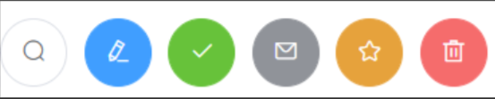

# Vue UI 组件库

## 移动端常用 UI 组件库

1. Vant ：[https://youzan.github.io/vant](https://youzan.github.io/vant)
2. Cube UI : [https://didi.github.io/cube-ui](https://didi.github.io/cube-ui)
3. Mint UI : [http://mint-ui.github.io](http://mint-ui.github.io)

## PC 端常用 UI 组件库

1. Element UI : [https://element.eleme.cn](https://element.eleme.cn)
2. IView UI :[https://www.iviewui.com](https://www.iviewui.com)

## element-ui 基本使用

1. 安装 element-ui: `npm i element-ui -S`

2. `src/main.js`

   ```js
   import Vue from 'vue'
   import App from './App.vue'
   import ElementUI from 'element-ui';
   import 'element-ui/lib/theme-chalk/index.css';
   
   Vue.config.productionTip = false
   
   Vue.use(ElementUI);
   
   new Vue({
   	el:'#app',
   	render: h => h(App),
   })
   ```

3. `src/App.vue`

   ```vue
   <template>
     <div>
       <atguigu-row>
           <el-button icon="el-icon-search" circle></el-button>
           <el-button type="primary" icon="el-icon-s-check" circle></el-button>
           <el-button type="success" icon="el-icon-check" circle></el-button>
           <el-button type="info" icon="el-icon-message" circle></el-button>
           <el-button type="warning" icon="el-icon-star-off" circle></el-button>
           <el-button type="danger" icon="el-icon-delete" circle></el-button>
       </atguigu-row>
     </div>
   </template>
   
   <script>
   	export default {
   		name:'App',
   	}
   </script>
   ```

   

## element-ui 按需引入

1. 安装 babel-plugin-component `npm i babel-plugin-component -D`

2. 修改 `babel-config-js`

   ```js
   module.exports = {
     presets: [
       '@vue/cli-plugin-babel/preset',
   		["@babel/preset-env", { "modules": false }],
     ],
   	plugins:[
       [
         "component",
         {
           "libraryName": "element-ui",
           "styleLibraryName": "theme-chalk"
         }
       ]
     ]
   }
   ```

3. `src/main.js`

   ```js
   import Vue from 'vue'
   import App from './App.vue'
   import { Button,Row,DatePicker } from 'element-ui';
   
   Vue.config.productionTip = false
   
   Vue.component('atguigu-button', Button);
   Vue.component('atguigu-row', Row);
   Vue.component('atguigu-date-picker', DatePicker);
   
   //创建 vm
   new Vue({
   	el:'#app',
   	render: h => h(App),
   })
   ```

   


