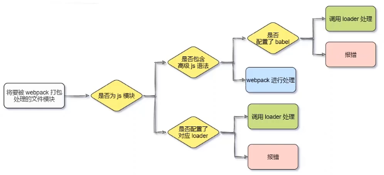

# Webpack

> 前端工程化解决方案

## 安装 webpack

> -S 表示开发环境和生产环境都要用到，-D 表示开发环境用到

```javascript
npm install webpack@5.42.1 -D
npm install webpack-cli@4.9.0 -D
```

## 配置文件

> webpack.config.js

```javascript
// 向外导出一个 webpack 配置对象
module.exports = {
    // 开发 development 上线 production
    mode: 'development' // mode 用来指定构建模式，有 development 和 production
}
```

> package.json

```json
"scripts": {
    "dev": "webpack"
},
```

> 运行脚本

```javascript
npm run dev
```

## 默认约定

- 默认的打包入口文件为`src->index.js`
- 默认的输出文件路径为`dist->main.js`

## 自定义打包规则

```javascript
const path = require('path');

// 向外导出一个 webpack 配置对象
module.exports = {
    // 输入
    entry: path.join(__dirname, './src/index1.js'),
    // 输出
    output: {
        path: path.join(__dirname, './dist'),
        filename: 'bundle.js'
    },
    mode: 'production' // mode 用来指定构建模式，有 development 和 production
}
```

## 自动打包插件

> 插件 webpak-dev-server，类似与 nodemon 自动打包

```javascript
npm install webpack-dev-server@3.11.2 -D
```

> 修改 package.json

```javascript
"scripts": {
    "dev": "webpack serve"
},
```

> 访问的是服务器的页面 http://localhost:8080/src/

注意：因为生成的 js 是保存在内存中的，所以页面引用的路径需要修改

```html
<!--加载内存中的 js-->
<script src="/bundle.js"></script>
```

## html-webpack-plugin 插件

> - 将 http://localhost:8080/src/资源复制 http://localhost:8080/目录的内存下
>
> - 将内存中的 bundle.js 自动绑定到 index.html 中

> 安装 html-webpack-plugin 插件

```javascript
npm install html-webpack-plugin@5.3.2 -D
```

> 配置 webpack.config.js

```javascript
// 导入 plugin 插件
const HtmlPlugin = require('html-webpack-plugin');
// 创建插件实例对象
const htmlPlugin = new HtmlPlugin({
    template: './src/index.html', // 指定源文件路径
    filename: './index.html', // 指定新生成文件路径
})
// 向外导出一个 webpack 配置对象
module.exports = {
    mode: 'production', // mode 用来指定构建模式，有 development 和 production
    plugins: [htmlPlugin],// 使插件生效
}
```

> 配置功能

```javascript
module.exports = {
    // 自动打开网页
    devServer: {
        open: true,
        host:'127.0.0.1',
        port:8080,
    }
}
```

## loader 加载器

> 帮助 webpack 处理 css、less、babel 等非 ES5JavaScript 的静态资源
>
> css 样式、图片等都会打包到内存中的 bundle.js 文件中




## css-loader

> 导入样式 index.js

```javascript
// 导入样式，webpack 中一切皆模块，通过 ES6 语法导入
import './css/index.css'
```

> 安装 loader

```javascript
npm install style-loader@3.0.0 css-loader@5.2.6 -D
```

> 配置文件

```javascript
// 向外导出一个 webpack 配置对象
module.exports = {
    module: {
        // loader 匹配规则
        rules: [{
            test: /\.css$/, use: ['style-loader', 'css-loader']
        }]
    }
}
```

## less-loader

> less 可以嵌套 css，写起来更加直观

```javascript
npm install less-loader@10.0.1 less@4.1.1 -D
```

> 配置文件

```javascript
// 向外导出一个 webpack 配置对象
module.exports = {
     module: {
        // loader 匹配规则
        rules: [
            {test: /\.css$/, use: ['style-loader', 'css-loader']},
            // less 匹配规则
            {test: /\.less$/, use: ['style-loader', 'css-loader', 'less-loader']},
        ]
    },
}
```

## url-loader

> 导入图片 index.js，会自动将图片转换成 Base64 格式

```javascript
// 导入图片
import logo from './images/img1.jpg'
$('.box').attr('src', logo)
```

> 下载 url-loader

```javascript
npm install url-loader@4.1.1 file-loader@6.2.0 -D
```

> 配置文件，limit 表示限制图片大小，小于等于 limit 值时图片转成 Base64

```javascript
// 向外导出一个 webpack 配置对象
module.exports = {
     module: {
        // loader 匹配规则
        rules: [
            {test: /\.css$/, use: ['style-loader', 'css-loader']},
            // less 匹配规则
            {test: /\.less$/, use: ['style-loader', 'css-loader', 'less-loader']},
            // 图片匹配
            {test: /\.jpg|png|gifs$/, use: ['url-loader?limit=22229']},
        ]
    },
}            
```

## babel-loader

> 装饰器语法

```javascript
// babel
function info(target){
    target.info = 'Person info'
}

@info
class Person{}
console.log(Person.info)
```

> 处理 javascript 高级

```javascript
npm i babel-loader@8.2.2 @babel/core@7.14.6 @babel/plugin-proposal-decorators@7.14.5 -D
```

> 排除 node_modules 的高级语言部分

```javascript
// 向外导出一个 webpack 配置对象
module.exports = {
     module: {
        // loader 匹配规则
        rules: [
            {test: /\.css$/, use: ['style-loader', 'css-loader']},
            // less 匹配规则
            {test: /\.less$/, use: ['style-loader', 'css-loader', 'less-loader']},
            // 图片匹配
            {test: /\.jpg|png|gifs$/, use: ['url-loader?limit=22229']},
            // babel 匹配
            {test: /\.js$/, use: ['babel-loader'], exclude: /node_modules/},
        ]
    },
}    
```

> 配置插件 babel.config.js

```javascript
module.exports = {
    plugins: [['@babel/plugin-proposal-decorators',{legacy:true}]]
}
```

## 打包发布

> 配置文件为打包，生成的文件在磁盘上

```javascript
"scripts": {
    "dev": "webpack serve",
    "build": "webpack --mode production" // 生产环境中，运行 build 命令
},
```

> 运行打包命令

```javascript
npm run build
```

> 安装打包清理工具

```javascript
npm install --save-dev clean-webpack-plugin
```

> 配置插件

```javascript
const { CleanWebpackPlugin } = require('clean-webpack-plugin');

const webpackConfig = {
    plugins: [
        new CleanWebpackPlugin(),
    ],
};

module.exports = webpackConfig;
```

> 最终版配置文件

```javascript
const path = require('path');
// 导入 plugin 插件
const HtmlPlugin = require('html-webpack-plugin');
// 创建插件实例对象
const htmlPlugin = new HtmlPlugin({
    template: './src/index.html', // 指定源文件路径
    filename: './index.html', // 指定新生成文件路径
})
//打包清理工具
const {CleanWebpackPlugin} = require('clean-webpack-plugin');


// 向外导出一个 webpack 配置对象
module.exports = {
    // 输入
    entry: path.join(__dirname, './src/index.js'),
    // 输出
    output: {
        path: path.resolve(__dirname, './dist'),
        filename: 'js/bundle.js'
    },
    mode: 'development', // mode 用来指定构建模式，有 development 和 production
    devtool: 'nosources-source-map',//源代码和生产代码调试问题
    plugins: [htmlPlugin, new CleanWebpackPlugin()],// 使插件生效
    // 自动打开网页
    devServer: {
        open: true,
        host: '127.0.0.1',
        port: 8080,
    },

    module: {
        //loader 匹配规则
        rules: [
            {test: /\.css$/, use: ['style-loader', 'css-loader']},
            {test: /\.less$/, use: ['style-loader', 'css-loader', 'less-loader']},
            {test: /\.jpg|png|gifs$/, use: ['url-loader?limit=470&outputPath=images']},
            {test: /\.js$/, use: ['babel-loader'], exclude: /node_modules/},
        ]
    },
    resolve:{
        alias:{
            // 告诉 webpack@代表 src 目录
            '@':path.join(__dirname,'./src/')
        }
    }
}
```

## SourceMap

> 解决 bundle.js 和源代码行号位置不一致问题

```javascript
devtool: 'eval-source-map',//源代码和生产代码调试问题
devtool: 'nosources-source-map',//只定位报错位置，不暴露源码
```

## @代表 src 路径

> 通过@可以表示路径从外往里找

