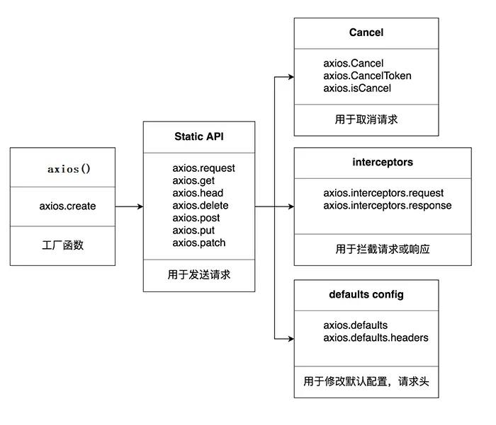
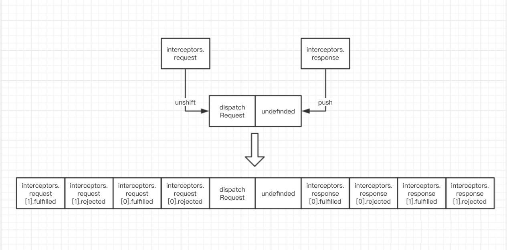

# axios

>[尚硅谷 Web 前端 axios 入门与源码解析](https://www.bilibili.com/video/BV1wr4y1K7tq/?spm_id_from=333.337.search-card.all.click)

## 环境安装

安装 json-server 作为服务端

```js
# 官网
https://www.npmjs.com/package/json-server

# 安装 json-server npm 包
npm install -g json-server

# 设置 db.json 文件

# 启动服务器
json-server --watch db.json
```

## axios 的理解和使用

### axios 是什么？

1. 前端最流行的 ajax 请求库
2. react/vue 官方都推荐使用 axios 发 ajax 请求
3. 文档：[https://github.com/axios/axios](https://github.com/axios/axios)

### axios 特点

1. 基于 xhr + promise 的异步 ajax 请求库
2. 浏览器端/node 端都可以使用
3. 支持请求／响应拦截器
4. 支持请求取消
5. 请求/响应数据转换
6. 批量发送多个请求

### axios 常用语法

```js
axios(config)  // 通用/最本质的发任意类型请求的方式

axios(url[, config])  // 可以只指定 url 发 get 请求

axios.request(config)  // 等同于 axios(config)

axios.get(url[, config])  // 发 get 请求

axios.delete(url[, config])   // delete 请求

axios.post(url[, data, config])  // 发 post 请求

axios.put(url[, data, config])  // 发 put 请求

axios.defaults.xxx  // 请求的默认全局配置

axios.interceptors.request.use()  // 添加请求拦截器

axios.interceptors.response.use()  // 添加响应拦截器

axios.create([config])  // 创建一个新的 axios(它没有下面的功能)

axios.Cancel()  // 用于创建取消请求的错误对象

axios.CancelToken()  // 用于创建取消请求的 token 对象

axios.isCancel()  // 是否是一个取消请求的错误

axios.all(promises)  // 用于批量执行多个异步请求

axios.spread()  // 用来指定接收所有成功数据的回调函数的方法
```



### 难点语法的理解和使用

#### axios.create(config)

1. 根据指定配置创建一个新的 axios, 也就就每个新 axios 都有自己的配置
2. 新 axios 只是没有取消请求和批量发请求的方法，其它所有语法都是一致的
3. 为什么要设计这个语法？
   1. 需求：项目中有部分接口需要的配置与另一部分接口需要的配置不太一样，如何处理
   2. 解决：创建 2 个新 axios, 每个都有自己特有的配置，分别应用到不同要求的接口请求中

#### 拦截器函数/ajax 请求/请求的回调函数的调用顺序

1. 说明：调用 axios() 并不是立即发送 ajax 请求，而是需要经历一个较长的流程
2. 流程：请求拦截器 2 => 请求拦截器 1 => 发 ajax 请求 => 响应拦截器 1 => 响应拦截器 2 => 请求的回调

3. 注意：此流程是通过 promise 串连起来的，请求拦截器传递的是 config, 响应拦截器传递的是 response

#### 取消请求

1. 基本流程

   配置 cancelToken 对象

   缓存用于取消请求的 cancel 函数

   在后面特定时机调用 cancel 函数取消请求

   在错误回调中判断如果 error 是 cancel, 做相应处理

2. 实现功能

   点击按钮，取消某个正在请求中的请求

   在请求一个接口前，取消前面一个未完成的请求

## axios 源码分析

### 源码目录结构

```js
├── /dist/ # 项目输出目录
├── /lib/ # 项目源码目录
│ ├── /adapters/ # 定义请求的适配器 xhr、http
│ │ ├── http.js # 实现 http 适配器(包装 http 包)
│ │ └── xhr.js # 实现 xhr 适配器(包装 xhr 对象)
│ ├── /cancel/ # 定义取消功能
│ ├── /core/ # 一些核心功能
│ │ ├── Axios.js # axios 的核心主类
│ │ ├── dispatchRequest.js # 用来调用 http 请求适配器方法发送请求的函数
│ │ ├── InterceptorManager.js # 拦截器的管理器
│ │ └── settle.js # 根据 http 响应状态，改变 Promise 的状态
│ ├── /helpers/ # 一些辅助方法
│ ├── axios.js # 对外暴露接口
│ ├── defaults.js # axios 的默认配置
│ └── utils.js # 公用工具
├── package.json # 项目信息
├── index.d.ts # 配置 TypeScript 的声明文件
└── index.js # 入口文件
```

### 源码分析

#### axios 与 Axios 的关系 ?

1. 从语法上来说：axios 不是 Axios 的实例
2. 从功能上来说：axios 是 Axios 的实例
3. axios 是 Axios.prototype.request 函数 bind() 返回的函数
4. axios 作为对象有 Axios 原型对象上的所有方法，有 Axios 对象上所有属性

#### instance 与 axios 的区别？

1. 相同：
   - 都是一个能发任意请求的函数：request(config)
   - 都有发特定请求的各种方法：get()/post()/put()/delete()
   - 都有默认配置和拦截器的属性：defaults/interceptors

2. 不同：
   - 默认配置很可能不一样
   - instance 没有 axios 后面添加的一些方法：create()/CancelToken()/all()

#### axios 运行的整体流程？


1. 整体流程：

   request(config) ==> dispatchRequest(config) ==> xhrAdapter(config)

2. request(config): 

   将请求拦截器 / dispatchRequest() / 响应拦截器 通过 promise 链串连起来，返回 promise

3. dispatchRequest(config): 

   转换请求数据 ===> 调用 xhrAdapter() 发请求 ===> 请求返回后转换响应数据。返回 promise

4. xhrAdapter(config): 

   创建 XHR 对象，根据 config 进行相应设置，发送特定请求，并接收响应数据，返回 promise 

#### axios 的请求/响应拦截器是什么?



1. 请求拦截器：

   在真正发送请求前执行的回调函数

   可以对请求进行检查或配置进行特定处理

   成功的回调函数，传递的默认是 config(也必须是)

   失败的回调函数，传递的默认是 error

2. 响应拦截器

   在请求得到响应后执行的回调函数

   可以对响应数据进行特定处理

   成功的回调函数，传递的默认是 response

   失败的回调函数，传递的默认是 error

#### axios 的请求/响应数据转换器是什么

1. 请求转换器：对请求头和请求体数据进行特定处理的函数

   ```js
   if (utils.isObject(data)) {
   
    setContentTypeIfUnset(headers, 'application/json;charset=utf-8');
   
    return JSON.stringify(data);
   
   }
   ```

2. 响应转换器：将响应体 json 字符串解析为 js 对象或数组的函数

   ```js
   response.data = JSON.parse(response.data)
   ```

#### response 的整体结构

```js
{
 data,
 status,
 statusText,
 headers,
 config,
 request
 }
```

#### error 的整体结构

```js
{
 message,DF
 response,
request,
}
```

#### 如何取消未完成的请求？

1. 当配置了 cancelToken 对象时，保存 cancel 函数

   创建一个用于将来中断请求的 cancelPromise

   并定义了一个用于取消请求的 cancel 函数

   将 cancel 函数传递出来

2. 调用 cancel() 取消请求

   执行 cacel 函数，传入错误信息 message

   内部会让 cancelPromise 变为成功，且成功的值为一个 Cancel 对象

   在 cancelPromise 的成功回调中中断请求，并让发请求的 proimse 失败，失败的 reason 为 Cancel 对象
