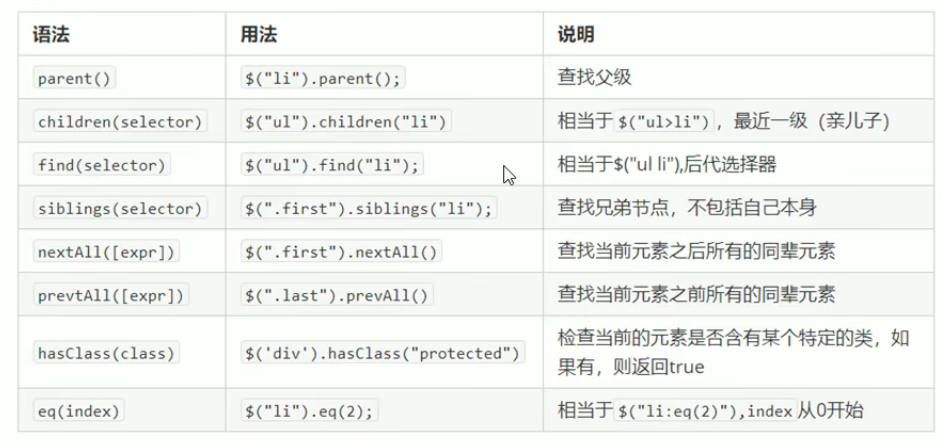
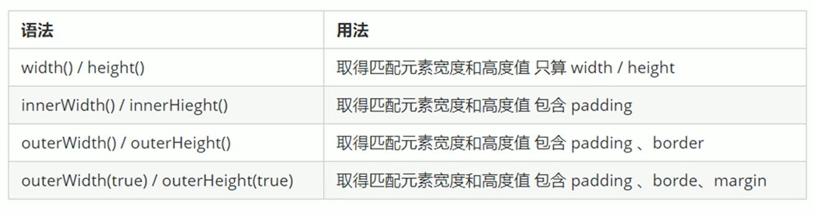

# jQuery

> [黑马前端 jQuery-pink 老师](https://www.bilibili.com/video/BV1wo4y1R7t6/?spm_id_from=333.337.search-card.all.click)

## jQuery 入门

### 下载

> [https://jQuery.com/](https://jQuery.com/)

### 初始化

```javascript
$(document).ready(function () {
    alert("页面初始化了");
});

$(function () {
    alert("页面初始化了");
});
```

## jQuery 选择器

### 基础选择器

> 其余选择器查看文档

```javascript
$("#id") == document.getElementById()
$(".类名") == document.getElementsByName()
$("标签名") == document.getElementsByTagname()
fn() {
    alert($("#id").val());
    alert($(".btn").text());
    alert($("div").html());
}
```

### 筛选方法



## jQuery 样式操作

### 设置样式

> 注意默认存在隐式迭代，即会遍历所有符合的元素并改变样式

```javascript
$("div").css('属性'，'值');

$("div").css({
    width: 400,
    height: 400,
    backgroundColor: "red"
})
```

### 排他思想

```javascript
//设置当前样式
$(this).css("background", "pink");
//取消其他样式
$(this).siblings("button").css("background", "");
```

### 链式编程

```javascript
$(this).siblings().parent().css('color', 'blue');
```

### 操作类样式

```javascript
//添加类样式
$(this).addClass("current");
//删除类样式
$(this).removeClass("current");
//切换类样式
$(this).toggleClass("current");
```

### tap 切换

```javascript
//通过 index() 方法获得 li 的下标
var index = $(this).index();
```

### className 和 addClass 区别

- className 是替换类样式
- addClass 是追加类样式

## jQuery 效果

### 显示和隐藏

```javascript
$(function () {
    $("button").eq(0).click(function () {
        $("div").show(1000, function () {
            alert(1);
        });
    })
    $("button").eq(1).click(function () {
        $("div").hide(1000, function () {
            alert(1);
        });
    })
    $("button").eq(2).click(function () {
        $("div").toggle(1000);
    })
});
```

### 滑动

```javascript
$(function () {
    $("button").eq(0).click(function () {
        // 下滑动 slideDown()
        $("div").slideDown();
    })
    $("button").eq(1).click(function () {
        // 上滑动 slideUp()
        $("div").slideUp(500);
    })
    $("button").eq(2).click(function () {
        // 滑动切换 slideToggle()
        $("div").slideToggle(500);
    });
});
```

### 事件切换 hover

>hover==mouseover+mouseout
>
>slideToggle==slideDown+slideUp

```javascript
$(function () {
    $(".nav>li").mouseover(function() {
        $(this).children("ul").slideDown(200);
    });
    $(".nav>li").mouseout(function() {
        $(this).children("ul").slideUp(200);
    });
})

$(function () {
    $(".nav>li").hover(function () {
        $(this).children("ul").slideToggle();
    });
})
```

### 停止动画排队效果

```javascript
$(".nav>li").hover(function () {
    // stop 方法必须写到动画的前面
    $(this).children("ul").stop().slideToggle();
});
```

### 淡入淡出效果

```javascript
$(function () {
    $("button").eq(0).click(function () {
        // 淡入 fadeIn()
        $("div").fadeIn(1000);
    })
    $("button").eq(1).click(function () {
        // 淡出 fadeOut()
        $("div").fadeOut(1000);
    })
    $("button").eq(2).click(function () {
        // 淡入淡出切换 fadeToggle()
        $("div").fadeToggle(1000);
    });
    $("button").eq(3).click(function () {
        //  修改透明度 fadeTo() 这个速度和透明度要必须写
        $("div").fadeTo(1000, 0.5);
    });
});
```

### 自定义动画

```javascript
$(function () {
    $("button").click(function () {
        $("div").animate({
            left: 500,
            top: 300,
            opacity: .4,
            width: 500
        }, 500);
    })
})
```

## jQuery 属性

### 获取设置元素固有属性值

```javascript
<a href="http://www.itcast.cn" title="都挺好">都挺好</a>
console.log($("a").prop("href"));
$("a").prop("title", "我们都挺好");
```

### 获取设置元素自定义属性值

```javascript
<div index="1" data-index="2">我是 div</div>
console.log($("div").attr("index"));
$("div").attr("index", 4);
```

### 数据缓存

```javascript
<span>123</span>
$("span").data("uname", "andy");
console.log($("span").data("uname"));
```

## jQuery 内容文本值

### 获取设置值

```javascript
//相当于 innerHtml
console.log($("div").html());
//相当于 innerText
console.log($("div").text());
//设置 div 值
$("div").text("123");
//获取表单 value 值
console.log($("input").val());
//设置表单值
$("input").val("123");
```

## jQuery 元素操作

### 遍历元素 each

```javascript
//获取商品数量总和
var sum = 0;
$("div").each(function (i, domEle) {
    sum += parseInt($(domEle).text());
})
console.log(sum);

$.each($("div"), function (index, element) {
    console.log(index);
    console.log(element);
});
```

### 创建元素

```javascript
//内部添加
var li = $("<li>li</li>");
$("ul").append(li);  //内部添加并且放到内容的最后面 
$("ul").prepend(li); //内部添加并且放到内容的最前面
//外部添加
var div = $("<div>div</div>");
$(".test").after(div); //外部添加后面
$(".test").before(div); //外部添加前面
```

### 删除元素

```javascript
$("ul").remove(); //可以删除匹配的元素
$("ul").empty(); //可以删除匹配的元素里面的子节点
$("ul").html(""); //可以删除匹配的元素里面的子节点
```

## jQuery 尺寸位置操作

### 尺寸



### 位置

```javascript
//获取距离文档的位置
console.log($(".son").offset());
console.log($(".son").offset().top);
//设置距离文档的位置
$(".son").offset({
    top: 200,
    left: 200
});

//获取距离带有定位父级位置
console.log($(".son").position());

//被卷去的头部 scrollTop()
$(document).scrollTop(100);
```

## jQuery 事件

### 事件注册

```javascript
$("div").click(function() {
    $(this).css("background", "purple");
});
$("div").mouseenter(function() {
    $(this).css("background", "skyblue");
});
```

### 事件处理

> on 事件处理程序

```javascript
$("div").on({
    mouseenter: function() {
        $(this).css("background", "skyblue");
    },
    click: function() {
        $(this).css("background", "purple");
    },
    mouseleave: function() {
        $(this).css("background", "blue");
    }
});
```

>事件解绑 off
>
>one() 一次触发事件

```javascript
$("div").off();  // 这个是解除了 div 身上的所有事件
$("div").off("click"); // 这个是解除了 div 身上的点击事件

// 
$("p").one("click", function () {
    alert(11);
})
```

> 自动触发事件

```java
// 1. 元素。事件 () 会触发元素的默认行为
$("div").click();
// 2. 元素.trigger("事件") 会触发元素的默认行为
$("div").trigger("click");
$("input").trigger("focus");
// 3. 元素.triggerHandler("事件") 就是不会触发元素的默认行为
$("div").triggerHandler("click");
$("input").on("focus", function () {
    $(this).val("你好吗");
});
```

### 事件对象

> event 表示事件对象

## jQuery 其他方法

### 拷贝对象

```javascript
var targetObj = {};
var obj = {
    id: 1,
    name: "andy"
};
$.extend(targetObj, obj);
console.log(targetObj);
```

### 多 JS 库冲突

```javascript
将$符号改成JQuery
```

### 使用插件

> 了解即可，需要使用的时候参照文档操作

#### 瀑布流插件

- pinterest_grid.js

- 展示图片的插件

#### 图片懒加载插件

- EasyLazyload.min.js

- 图片较多的时候延迟加载

#### 全屏滚动插件

- fullpage.min.js

- 无滚动条滚动

#### bootstrap 响应式布局插件

- bootstrap.js

## jQuery 整合 Ajax

### 发送不带参数的 GET 请求

```javascript
$(function () {
    $('#btnGET').on('click', function () {
        $.get('http://www.liulongbin.top:3006/api/getbooks', function (data) {
            console.log(data)
        });
    });
});
```

### 发送带参数的 GET 请求

```javascript
$(function () {
    $('#btnGET').on('click', function () {
        $.get('http://www.liulongbin.top:3006/api/getbooks', {id: 1}, function (data) {
            console.log(data)
        });
    });
});
```

### 发送 post 请求提交数据

```javascript
$(function () {
    $('#btnGET').on('click', function () {
        $.post(
            'http://www.liulongbin.top:3006/api/addbook',
            {bookname: 'shuihu', author: '施耐庵转世', publisher: '出版社'},
            /*回调函数*/
            function (data) {
                console.log(data)
            });
    });
});
```

### $.ajax 通用方式

```javascript
//get 请求不带参数
$(function () {
    $('#btnGET').on('click', function () {
        $.ajax({
            type: 'GET',
            url: 'http://www.liulongbin.top:3006/api/getbooks',
            data: {},
            success: function (data) {
                console.log(data);
            }
        });
    });
});

//get 请求带参数
$(function () {
    $('#btnGET').on('click', function () {
        $.ajax({
            type: 'GET',
            url: 'http://www.liulongbin.top:3006/api/getbooks',
            data: {
                id: 2
            },
            success: function (data) {
                console.log(data);
            }
        });
    });
});

//post 请求
$(function () {
    $('#btnGET').on('click', function () {
        $.ajax({
            type: 'POST',
            url: 'http://www.liulongbin.top:3006/api/addbook',
            data: {
                bookname: 'shuihu',
                author: '施耐庵转世',
                publisher: '出版社'
            },
            success: function (data) {
                console.log(data);
            }
        });
    });
});
```
