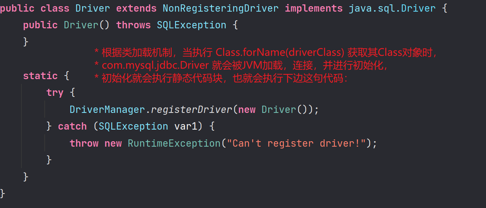
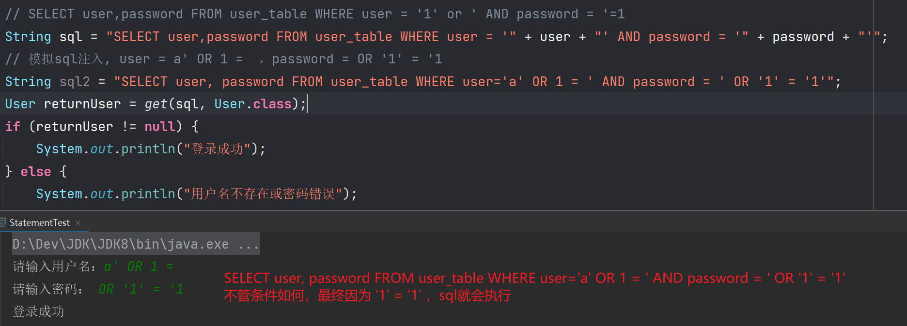
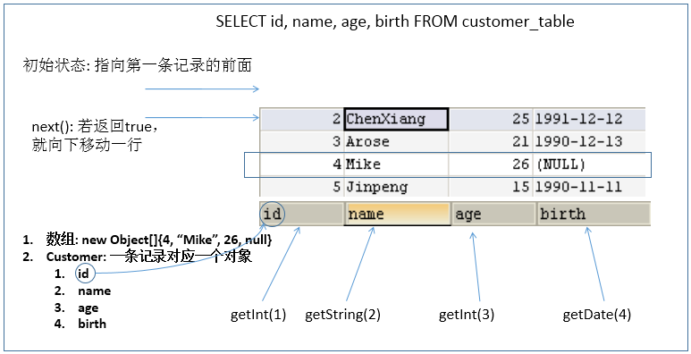
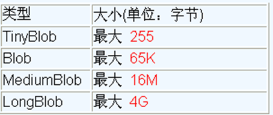
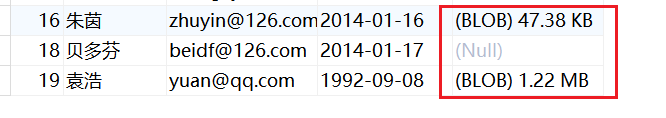

# JDBC 核心技术

## JDBC 概述

### 数据的持久化

- 持久化 (persistence)：**把数据保存到可掉电式存储设备中以供之后使用**。大多数情况下，特别是企业级应用，**数据持久化意味着将内存中的数据保存到硬盘**上加以“固化”**，而持久化的实现过程大多通过各种关系数据库来完成**。

- 持久化的主要应用是将内存中的数据存储在关系型数据库中，当然也可以存储在磁盘文件、XML 数据文件中。

   

### Java 中的数据存储技术

- 在 Java 中，数据库存取技术可分为如下几类：
  - **JDBC**直接访问数据库
  - JDO (Java Data Object ) 技术

  - **第三方O/R工具**，如 Hibernate, Mybatis 等

- JDBC 是 java 访问数据库的基石，JDO、Hibernate、MyBatis 等只是更好的封装了 JDBC。

### JDBC 介绍

- JDBC(Java Database Connectivity) 是一个**独立于特定数据库管理系统、通用的 SQL 数据库存取和操作的公共接口**（一组 API），定义了用来访问数据库的标准 Java 类库，（**java.sql,javax.sql**）使用这些类库可以以一种**标准**的方法、方便地访问数据库资源。
- JDBC 为访问不同的数据库提供了一种**统一的途径**，为开发者屏蔽了一些细节问题。
- JDBC 的目标是使 Java 程序员使用 JDBC 可以连接任何**提供了 JDBC 驱动程序**的数据库系统，这样就使得程序员无需对特定的数据库系统的特点有过多的了解，从而大大简化和加快了开发过程。
- 如果没有 JDBC，那么 Java 程序访问数据库时是这样的：


---

- 有了 JDBC，Java 程序访问数据库时是这样的：


***

- 总结如下：


### JDBC 体系结构

- JDBC 接口（API）包括两个层次：
  - **面向应用的 API**：Java API，抽象接口，供应用程序开发人员使用（连接数据库，执行 SQL 语句，获得结果）。
  -  **面向数据库的 API**：Java Driver API，供开发商开发数据库驱动程序用。

> **JDBC 是 sun 公司提供一套用于数据库操作的接口，java 程序员只需要面向这套接口编程即可。**
>
> **不同的数据库厂商，需要针对这套接口，提供不同实现。不同的实现的集合，即为不同数据库的驱动。**

### JDBC 程序编写步骤


> 补充：ODBC(**Open Database Connectivity**，开放式数据库连接)，是微软在 Windows 平台下推出的。使用者在程序中只需要调用 ODBC API，由 ODBC 驱动程序将调用转换成为对特定的数据库的调用请求。

## 使用 JDBC 连接数据库

### Driver 接口介绍

- java.sql.Driver 接口是所有 JDBC 驱动程序需要实现的接口。这个接口是提供给数据库厂商使用的，不同数据库厂商提供不同的实现。

- 在程序中不需要直接去访问实现了 Driver 接口的类，而是由驱动程序管理器类 (java.sql.DriverManager) 去调用这些 Driver 实现。
  - Oracle 的驱动：**oracle.jdbc.driver.OracleDriver**
  - mySql 的驱动： **com.mysql.jdbc.Driver**

### 这里使用 Maven 管理 jar 包

```xml
<!-- https://mvnrepository.com/artifact/mysql/mysql-connector-java -->
<dependency>
    <groupId>mysql</groupId>
    <artifactId>mysql-connector-java</artifactId>
    <version>5.1.47</version>
</dependency>
```

### 加载与注册 JDBC 驱动

- 加载驱动：加载 JDBC 驱动需调用 Class 类的静态方法 forName()，向其传递要加载的 JDBC 驱动的类名，`Class.forName(“com.mysql.jdbc.Driver”);`

- 注册驱动：DriverManager 类是驱动程序管理器类，负责管理驱动程序，使用 `DriverManager.registerDriver(com.mysql.jdbc.Driver)` 来注册驱动，通常不用显式调用 DriverManager 类的 registerDriver() 方法来注册驱动程序类的实例，因为 Driver 接口的驱动程序类都包含了静态代码块，在这个静态代码块中，会调用 DriverManager.registerDriver() 方法来注册自身的一个实例。下图是 MySQL 的 Driver 实现类的源码：

  

### URL

- JDBC URL 用于标识一个被注册的驱动程序，驱动程序管理器通过这个 URL 选择正确的驱动程序，从而建立到数据库的连接。

- JDBC URL 的标准由三部分组成，各部分间用冒号分隔。 
  - **jdbc:子协议：子名称**
  - **协议**：JDBC URL 中的协议总是 jdbc 
  - **子协议**：子协议用于标识一个数据库驱动程序
  - **子名称**：一种标识数据库的方法。子名称可以依不同的子协议而变化，用子名称的目的是为了**定位数据库**提供足够的信息。包含**主机名**(对应服务端的 ip 地址)**，端口号，数据库名**

- 举例：

  

- **几种常用数据库的 JDBC URL**

  - MySQL 的连接 URL 编写方式：

    - `jdbc:mysql://主机名称:mysql 服务端口号/数据库名称？参数=值&参数=值`
    - `jdbc:mysql://localhost:3306/jdbc`
    - `jdbc:mysql://localhost:3306/jdbc?useUnicode=true&characterEncoding=utf8`，    （如果 JDBC 程序与服务器端的字符集不一致，会导致乱码，那么可以通过参数指定服务器端的字符集）
    - `jdbc:mysql://localhost:3306/jdbc?user=root&password=123456`
  - Oracle 9i 的连接 URL 编写方式：
  
    - `jdbc:oracle:thin:@主机名称:oracle 服务端口号：数据库名称`
    - `jdbc:oracle:thin:@localhost:1521:jdbc`
  - SQLServer 的连接 URL 编写方式：

    - `jdbc:sqlserver://主机名称:sqlserver 服务端口号:DatabaseName=数据库名称`

    - `jdbc:sqlserver://localhost:1433:DatabaseName=jdbc`

### 用户名和密码

- user,password 可以用“属性名=属性值”方式告诉数据库
- 可以调用 DriverManager 类的 getConnection() 方法建立到数据库的连接

### 数据库连接方式举例

#### 连接方式一

```java
/**
 * 使用 Driver
 * @param
 * @return
 */
@Test
public void testConnection1() throws SQLException {
    // 获取 Driver 实现类对象
    Driver driver = new com.mysql.jdbc.Driver();

    // jdbc:mysql:协议
    // localhost:ip 地址
    // 3306：默认 mysql 的端口号
    // jdbc:jdbc 数据库
    String url = "jdbc:mysql://localhost:3306/jdbc?useSSL=false";
    // 将用户名和密码封装在 Properties 中
    Properties info = new Properties();
    info.setProperty("user", "root");
    info.setProperty("password", "123456");

    Connection conn = driver.connect(url, info);
    System.out.println(conn);
}
```

#### 连接方式二

```java
/**
 * 使用 Driver
 * @param
 * @return
 */
@Test
public void testConnection2() throws Exception {
    // 1.获取 Driver 实现类对象：使用反射
    Class clazz = Class.forName("com.mysql.jdbc.Driver");
    Driver driver = (Driver) clazz.newInstance();

    // 2.提供要连接的数据库
    String url = "jdbc:mysql://localhost:3306/jdbc?useSSL=false";
    // 3.提供连接需要的用户名和密码
    Properties info = new Properties();
    info.setProperty("user", "root");
    info.setProperty("password", "123456");

    // 4.获取连接
    Connection conn = driver.connect(url, info);
    System.out.println(conn);
}
```

#### 连接方式三

```java
/**
 * 使用 DriverManager 替换 Driver
 * @param
 * @return
 */
@Test
public void testConnection3() throws Exception {
    // 1.获取 Driver 实现类的对象
    Class clazz = Class.forName("com.mysql.jdbc.Driver");
    Driver driver = (Driver) clazz.newInstance();

    // 2.提供另外三个连接的基本信息：
    String url = "jdbc:mysql://localhost:3306/jdbc?useSSL=false";
    String user = "root";
    String password = "123456";

    // 注册驱动
    DriverManager.registerDriver(driver);

    // 获取连接
    Connection conn = DriverManager.getConnection(url, user, password);
    System.out.println(conn);
}
```

#### 连接方式四

```java
/**
 * 不用显示的注册驱动
 *
 * 根据类加载机制，当执行 Class.forName(driverClass) 获取其 Class 对象时，
 * com.mysql.jdbc.Driver 就会被 JVM 加载，连接，并进行初始化，
 * 初始化就会执行静态代码块，也就会执行下边这句代码：
 *  static {
 *      try {
 *          DriverManager.registerDriver(new Driver());
 *      } catch (SQLException var1) {
 *          throw new RuntimeException("Can't register driver!");
 *      }
 *  }
 */
@Test
public void testConnection4() throws Exception {
    // 1.提供三个连接的基本信息：
    String url = "jdbc:mysql://localhost:3306/jdbc?useSSL=false";
    String user = "root";
    String password = "123456";

    // 2.加载驱动
    // Class.forName(driverClass) 只能帮助我们得到 Driver 的 Class 对象啊，为什么会帮我们完成注册了呢？
    // 理由看上面解释
    Class.forName("com.mysql.jdbc.Driver");

    // 2.获取连接
    Connection conn = DriverManager.getConnection(url, user, password);
    System.out.println(conn);
}
```

#### 连接方式五 (最终版)

```java
/**
 * 将数据库连接需要的 4 个基本信息声明在配置文件中，通过读取配置文件的方式，获取连接
 * 此种方式的好处？
 * 1.实现了数据与代码的分离。实现了解耦
 * 2.如果需要修改配置文件信息，可以避免程序重新打包。
 * @param
 * @return
 */
@Test
public void getConnection5() throws Exception {

    //1.读取配置文件中的 4 个基本信息
    InputStream is = ConnectionTest.class.getClassLoader().getResourceAsStream("jdbc.properties");

    Properties pros = new Properties();
    pros.load(is);

    String user = pros.getProperty("user");
    String password = pros.getProperty("password");
    String url = pros.getProperty("url");
    String driverClass = pros.getProperty("driverClass");

    //2.加载驱动
    Class.forName(driverClass);

    //3.获取连接
    Connection conn = DriverManager.getConnection(url, user, password);
    System.out.println(conn);

}
```

其中，配置文件声明在工程的 resources 目录下：`jdbc.properties`

```properties
user=root
password=123456
url=jdbc:mysql://localhost:3306/jdbc?useSSL=false
driverClass=com.mysql.jdbc.Driver
```

> 说明：使用配置文件的方式保存配置信息，在代码中加载配置文件
>
> **使用配置文件的好处：**
>
> ①实现了代码和数据的分离，如果需要修改配置信息，直接在配置文件中修改，不需要深入代码
>
> ②如果修改了配置信息，省去重新编译的过程

## Java 与 SQL 对应数据类型转换表

| Java 类型          | SQL 类型                 |
| ------------------ | ------------------------ |
| boolean            | BIT                      |
| byte               | TINYINT                  |
| short              | SMALLINT                 |
| int                | INTEGER                  |
| long               | BIGINT                   |
| String             | CHAR,VARCHAR,LONGVARCHAR |
| byte    array      | BINARYVAR    BINARY      |
| java.sql.Date      | DATE                     |
| java.sql.Time      | TIME                     |
| java.sql.Timestamp | TIMESTAMP                |

## 使用 Statement 和 PreparedStatement

### 操作和访问数据库

- 数据库连接被用于向数据库服务器发送命令和 SQL 语句，并接受数据库服务器返回的结果。其实一个数据库连接就是一个 Socket 连接。

- 在 java.sql 包中有 3 个接口分别定义了对数据库的调用的不同方式：
  - Statement：用于执行静态 SQL 语句并返回它所生成结果的对象。 
  - PrepatedStatement：SQL 语句被预编译并存储在此对象中，可以使用此对象多次高效地执行该语句。
  - CallableStatement：用于执行 SQL 存储过程

  

### 使用 Statement 操作数据表

#### Statement 介绍

通过调用 Connection 对象的 createStatement() 方法创建该对象。该对象用于执行静态的 SQL 语句，并且返回执行结果。

Statement 接口中定义了下列方法用于执行 SQL 语句：

```sql
int excuteUpdate(String sql)：执行更新操作 INSERT、UPDATE、DELETE
ResultSet executeQuery(String sql)：执行查询操作 SELECT
```

#### 代码演示

```java
/**
 * @title: StatementTest
 * @date: 2023/4/28 19:51
 * @author: zhongnan
 * @description: Statement 测试
 */
public class StatementTest {

    // 使用 Statement 的弊端：需要拼写 sql 语句，并且存在 SQL 注入的问题
    // 如何避免出现 sql 注入：只要用 PreparedStatement(从 Statement 扩展而来) 取代 Statement
    public static void main(String[] args) {
        Scanner scanner = new Scanner(System.in);
        System.out.print("请输入用户名：");
        String user = scanner.nextLine();
        System.out.print("请输入密码：");
        String password = scanner.nextLine();

        // SELECT user,password FROM user_table WHERE user = '1' or ' AND password = '=1
        String sql = "SELECT user,password FROM user_table WHERE user = '" + user + "' AND password = '" + password + "'";
        // 模拟 sql 注入，user = a' OR 1 =  ，password = OR '1' = '1
        String sql2 = "SELECT user, password FROM user_table WHERE user='a' OR 1 = ' AND password = ' OR '1' = '1'";
        User returnUser = get(sql, User.class);
        if (returnUser != null) {
            System.out.println("登录成功");
        } else {
            System.out.println("用户名不存在或密码错误");
        }
    }

    // 使用 Statement 实现对数据表的查询操作
    public static <T> T get(String sql, Class<T> clazz) {
        T t = null;

        Connection conn = null;
        Statement st = null;
        ResultSet rs = null;
        try {
            // 1.加载配置文件
            InputStream is = StatementTest.class.getClassLoader().getResourceAsStream("jdbc.properties");
            Properties pros = new Properties();
            pros.load(is);

            // 2.读取配置信息
            String user = pros.getProperty("user");
            String password = pros.getProperty("password");
            String url = pros.getProperty("url");
            String driverClass = pros.getProperty("driverClass");

            // 3.加载驱动
            Class.forName(driverClass);

            // 4.获取连接
            conn = DriverManager.getConnection(url, user, password);

            st = conn.createStatement();

            rs = st.executeQuery(sql);

            // 获取结果集的元数据
            ResultSetMetaData rsmd = rs.getMetaData();

            // 获取结果集的列数
            int columnCount = rsmd.getColumnCount();

            if (rs.next()) {

                t = clazz.newInstance();

                for (int i = 0; i < columnCount; i++) {
                    //1. 获取列的名称
                    String columnName1 = rsmd.getColumnName(i + 1);

                    // 1. 获取列的别名，如果没有使用别名，则默认是列名，拓展更多
                    String columnName = rsmd.getColumnLabel(i + 1);

                    // 2. 根据列名获取对应数据表中的数据
                    Object columnVal = rs.getObject(columnName);

                    // 3. 将数据表中得到的数据，封装进对象
                    Field field = clazz.getDeclaredField(columnName);
                    field.setAccessible(true);
                    field.set(t, columnVal);
                }
                return t;
            }
        } catch (Exception e) {
            e.printStackTrace();
        } finally {
            // 关闭资源
            if (rs != null) {
                try {
                    rs.close();
                } catch (SQLException e) {
                    e.printStackTrace();
                }
            }
            if (st != null) {
                try {
                    st.close();
                } catch (SQLException e) {
                    e.printStackTrace();
                }
            }

            if (conn != null) {
                try {
                    conn.close();
                } catch (SQLException e) {
                    e.printStackTrace();
                }
            }
        }
        return null;
    }
}
```

#### 使用 Statement 操作数据表的弊端

- **问题一：存在拼串操作，繁琐**
- **问题二：存在 SQL 注入问题**

  - SQL 注入是利用某些系统没有对用户输入的数据进行充分的检查，而在用户输入数据中注入非法的 SQL 语句段或命令 (如：`SELECT user, password FROM user_table WHERE user='a' OR 1 = ' AND password = ' OR '1' = '1'`) ，从而利用系统的 SQL 引擎完成恶意行为的做法。

    


- 对于 Java 而言，要防范 SQL 注入，只要用 PreparedStatement(从 Statement 扩展而来) 取代 Statement 就可以了。
- 

### 使用 PreparedStatement 操作数据表

#### PreparedStatement 介绍

- 可以通过调用 Connection 对象的 **preparedStatement(String sql)** 方法获取 PreparedStatement 对象

- **PreparedStatement 接口是 Statement 的子接口，它表示一条预编译过的 SQL 语句**

- PreparedStatement 对象所代表的 SQL 语句中的参数用问号 (?) 来表示，调用 PreparedStatement 对象的 setXxx() 方法来设置这些参数。setXxx() 方法有两个参数，第一个参数是要设置的 SQL 语句中的参数的索引 (从 1 开始)，第二个是设置的 SQL 语句中的参数的值

#### 代码演示

```java
public class PreparedStatementTest {
    public static void main(String[] args) {
        Scanner scanner = new Scanner(System.in);

        System.out.print("请输入用户名：");
        String user = scanner.nextLine();
        System.out.print("请输入密码：");
        String password = scanner.nextLine();
        // SELECT user,password FROM user_table WHERE user = '1' or ' AND password = '=1
        String sql = "SELECT user,password FROM user_table WHERE user = ? and password = ?";
        User returnUser = getInstance(User.class, sql, user, password);
        if (returnUser != null) {
            System.out.println("登录成功");
        } else {
            System.out.println("用户名不存在或密码错误");
        }
    }

    /**
     * 针对于不同的表的通用的查询操作，返回表中的一条记录
     * @param clazz 实体类
     * @param sql sql
     * @param args 参数
     * @return {@link T}
     */
    public static <T> T getInstance(Class<T> clazz, String sql, Object... args) {
        Connection conn = null;
        PreparedStatement ps = null;
        ResultSet rs = null;
        try {
            conn = JDBCUtils.getConnection();

            ps = conn.prepareStatement(sql);
            for (int i = 0; i < args.length; i++) {
                ps.setObject(i + 1, args[i]);
            }

            rs = ps.executeQuery();
            // 获取结果集的元数据 :ResultSetMetaData
            ResultSetMetaData rsmd = rs.getMetaData();
            // 通过 ResultSetMetaData 获取结果集中的列数
            int columnCount = rsmd.getColumnCount();

            if (rs.next()) {
                T t = clazz.newInstance();
                // 处理结果集一行数据中的每一个列
                for (int i = 0; i < columnCount; i++) {
                    // 获取列值
                    Object columValue = rs.getObject(i + 1);

                    // 获取每个列的列名
                    // String columnName = rsmd.getColumnName(i + 1);
                    String columnLabel = rsmd.getColumnLabel(i + 1);

                    // 给 t 对象指定的 columnName 属性，赋值为 columValue：通过反射
                    Field field = clazz.getDeclaredField(columnLabel);
                    field.setAccessible(true);
                    field.set(t, columValue);
                }
                return t;
            }
        } catch (Exception e) {
            e.printStackTrace();
        } finally {
            JDBCUtils.closeResource(conn, ps, rs);
        }
        return null;
    }
}
```

#### 使用 PreparedStatement 的优势

- 代码的可读性和可维护性。

- **PreparedStatement 能最大可能提高性能：**
  - DBServer 会对**预编译**语句提供性能优化。因为预编译语句有可能被重复调用，所以**语句在被 DBServer 的编译器编译后的执行代码被缓存下来，那么下次调用时只要是相同的预编译语句就不需要编译，只要将参数直接传入编译过的语句执行代码中就会得到执行。**
  - 在 statement 语句中，即使是相同操作但因为数据内容不一样，所以整个语句本身不能匹配，没有缓存语句的意义。事实是没有数据库会对普通语句编译后的执行代码缓存。这样**每执行一次都要对传入的语句编译一次。**
  - (语法检查，语义检查，翻译成二进制命令，缓存)

- PreparedStatement 可以防止 SQL 注入 

### 使用 PreparedStatement 实现 CRUD

#### 通用的增删改操作

```java
/**
 * 通用的增删改操作
 * @param sql sql
 * @param args 参数
 * @return
 */
public void update(String sql, Object... args) {//sql 中占位符的个数与可变形参的长度相同！
    Connection conn = null;
    PreparedStatement ps = null;
    try {
        //1.获取数据库的连接
        conn = JDBCUtils.getConnection();
        //2.预编译 sql 语句，返回 PreparedStatement 的实例
        ps = conn.prepareStatement(sql);
        //3.填充占位符
        for (int i = 0; i < args.length; i++) {
            ps.setObject(i + 1, args[i]);//小心参数声明错误！！
        }
        //4.执行
        ps.execute();
    } catch (Exception e) {
        e.printStackTrace();
    } finally {
        //5.资源的关闭
        JDBCUtils.closeResource(conn, ps);
    }
}
```

#### 通用的查询操作

```java
/**
 * 查询列表通用方法
 * @param clazz 类
 * @param sql sql
 * @param args 参数
 * @return {@link List<T>}
 */
public <T> List<T> getForList(Class<T> clazz, String sql, Object... args) {
    Connection conn = null;
    PreparedStatement ps = null;
    ResultSet rs = null;
    try {
        conn = JDBCUtils.getConnection();

        ps = conn.prepareStatement(sql);
        for (int i = 0; i < args.length; i++) {
            ps.setObject(i + 1, args[i]);
        }

        rs = ps.executeQuery();
        // 获取结果集的元数据 :ResultSetMetaData
        ResultSetMetaData rsmd = rs.getMetaData();
        // 通过 ResultSetMetaData 获取结果集中的列数
        int columnCount = rsmd.getColumnCount();
        //创建集合对象
        ArrayList<T> list = new ArrayList<T>();
        while (rs.next()) {
            T t = clazz.newInstance();
            // 处理结果集一行数据中的每一个列：给 t 对象指定的属性赋值
            for (int i = 0; i < columnCount; i++) {
                // 获取列值
                Object columValue = rs.getObject(i + 1);

                // 获取每个列的列名
                // String columnName = rsmd.getColumnName(i + 1);
                String columnLabel = rsmd.getColumnLabel(i + 1);

                // 给 t 对象指定的 columnName 属性，赋值为 columValue：通过反射
                Field field = clazz.getDeclaredField(columnLabel);
                field.setAccessible(true);
                field.set(t, columValue);
            }
            list.add(t);
        }
        return list;
    } catch (Exception e) {
        e.printStackTrace();
    } finally {
        JDBCUtils.closeResource(conn, ps, rs);
    }
    return null;
}
```

### ResultSet 与 ResultSetMetaData

#### ResultSet

- 查询需要调用 `PreparedStatement` 的 `executeQuery()` 方法，查询结果是一个 `ResultSet` 对象

- `ResultSet` 对象以逻辑表格的形式封装了执行数据库操作的结果集，`ResultSet` 接口由数据库厂商提供实现
- `ResultSet` 返回的实际上就是一张数据表。有一个指针指向数据表的第一条记录的前面。

- `ResultSet` 对象维护了一个指向当前数据行的游标，初始的时候，游标在第一行之前，可以通过 `ResultSet` 对象的 `next()` 方法移动到下一行。调用 `next()` 方法检测下一行是否有效。若有效，该方法返回 `true`，且指针下移。相当于 `Iterator` 对象的 `hasNext()` 和 `next()` 方法的结合体。
- 当指针指向一行时，可以通过调用 `getXxx(int index)` 或 `getXxx(int columnName)` 获取每一列的值。

  - 例如：`getInt(1)`, `getString("name")`
  - 注意：Java 与数据库交互涉及到的相关 Java API 中的索引都从 1 开始。

- `ResultSet` 接口的常用方法：
  
  - `boolean next()`
  
  - `getString()`
  - ……
  
  

#### ResultSetMetaData

- 可用于**获取关于 ResultSet 对象中列的类型和属性信息**的对象

- `ResultSetMetaData meta = rs.getMetaData()`;
  - `getColumnName(int column)`：获取指定列的名称
  - `getColumnLabel(int column)`：获取指定列的别名
  - `getColumnCount()`：返回当前 `ResultSet` 对象中的列数。 

  - `getColumnTypeName(int column)`：检索指定列的数据库特定的类型名称。 
  - `getColumnDisplaySize(int column)`：指示指定列的最大标准宽度，以字符为单位。 
  - `isNullable(int column)`：指示指定列中的值是否可以为 null。 

  -  `isAutoIncrement(int column)`：指示是否自动为指定列进行编号，这样这些列仍然是只读的。 


### 资源的释放

- 释放 ResultSet, Statement,Connection。
- 数据库连接（Connection）是非常稀有的资源，用完后必须马上释放，如果 Connection 不能及时正确的关闭将导致系统宕机。Connection 的使用原则是**尽量晚创建，尽量早的释放。**
- 可以在 finally 中关闭，保证及时其他代码出现异常，资源也一定能被关闭。

### JDBC API 小结

- 两种思想
  - 面向接口编程的思想

  - ORM 思想 (object relational mapping)
    - 一个数据表对应一个 java 类
    - 表中的一条记录对应 java 类的一个对象
    - 表中的一个字段对应 java 类的一个属性

- 两种技术
  - JDBC 结果集的元数据：ResultSetMetaData
    - 获取列数：getColumnCount()
    - 获取列的别名：getColumnLabel()
  - 通过反射，创建指定类的对象，获取指定的属性并赋值

## 操作 BLOB 类型字段

### MySQL BLOB 类型

- MySQL 中，BLOB 是一个二进制大型对象，是一个可以存储大量数据的容器，它能容纳不同大小的数据。
- 插入 BLOB 类型的数据必须使用 PreparedStatement，因为 BLOB 类型的数据无法使用字符串拼接写的。

- MySQL 的四种 BLOB 类型 (除了在存储的最大信息量上不同外，他们是等同的)



- 实际使用中根据需要存入的数据大小定义不同的 BLOB 类型。
- 需要注意的是：如果存储的文件过大，数据库的性能会下降。
- 如果在指定了相关的 Blob 类型以后，还报错：`xxx too large`，那么在 mysql 的安装目录下，找 `my.ini` 文件加上如下的配置参数： `max_allowed_packet=16M`。同时注意：修改了 `my.ini` 文件之后，需要重新启动 mysql 服务。

### 向数据表中插入大数据类型

```java
//向数据表 customers 中插入 Blob 类型的字段
@Test
public void testInsert() throws Exception {
    Connection conn = JDBCUtils.getConnection();
    String sql = "insert into customers(name,email,birth,photo)values(?,?,?,?)";

    PreparedStatement ps = conn.prepareStatement(sql);

    ps.setObject(1, "袁浩");
    ps.setObject(2, "yuan@qq.com");
    ps.setObject(3, "1992-09-08");
    FileInputStream is = new FileInputStream(new File("girl.jpg"));
    ps.setBlob(4, is);

    ps.execute();

    JDBCUtils.closeResource(conn, ps);
}
```



### 从数据表中读取大数据类型

```java
//查询数据表 customers 中 Blob 类型的字段
@Test
public void testQuery() {
    Connection conn = null;
    PreparedStatement ps = null;
    InputStream is = null;
    FileOutputStream fos = null;
    ResultSet rs = null;
    try {
        conn = JDBCUtils.getConnection();
        String sql = "select id,name,email,birth,photo from customers where id = ?";
        ps = conn.prepareStatement(sql);
        ps.setInt(1, 19);
        rs = ps.executeQuery();
        if (rs.next()) {
            int id = rs.getInt("id");
            String name = rs.getString("name");
            String email = rs.getString("email");
            Date birth = rs.getDate("birth");

            Customer cust = new Customer(id, name, email, birth);
            System.out.println(cust);

            //将 Blob 类型的字段下载下来，以文件的方式保存在本地
            Blob photo = rs.getBlob("photo");
            is = photo.getBinaryStream();
            fos = new FileOutputStream("girl2.jpg");
            byte[] buffer = new byte[1024];
            int len;
            while ((len = is.read(buffer)) != -1) {
                fos.write(buffer, 0, len);
            }
        }
    } catch (Exception e) {
        e.printStackTrace();
    } finally {
        try {
            if (is != null)
                is.close();
        } catch (IOException e) {
            e.printStackTrace();
        }
        try {
            if (fos != null)
                fos.close();
        } catch (IOException e) {
            e.printStackTrace();
        }
        JDBCUtils.closeResource(conn, ps, rs);
    }
}
```

## 批量插入

### 批量执行 SQL 语句

当需要成批插入或者更新记录时，可以采用 Java 的**批量更新**机制，这一机制允许多条语句一次性提交给数据库批量处理。通常情况下比单独提交处理更有效率

JDBC 的批量处理语句包括下面三个方法：
- **addBatch(String)：添加需要批量处理的 SQL 语句或是参数；**
- **executeBatch()：执行批量处理语句；**
- **clearBatch():清空缓存的数据**

通常我们会遇到两种批量执行 SQL 语句的情况：
- 多条 SQL 语句的批量处理；
- 一个 SQL 语句的批量传参；

### 批量插入测试

举例：向数据表中插入 20000 条数据

#### 使用 Statement

```java
//使用 Statement
@Test
public void testInsert1() {
    Connection conn = null;
    Statement st = null;
    try {
        long start = System.currentTimeMillis();
        conn = JDBCUtils.getConnection();
        st = conn.createStatement();
        for (int i = 1; i <= 20000; i++) {
            String sql = "insert into goods(name)values('name_" + i + "')";
            st.execute(sql);
        }
        long end = System.currentTimeMillis();
        System.out.println("花费的时间为：" + (end - start)); // 花费的时间为：24143
    } catch (Exception e) {
        e.printStackTrace();
    }
}
```

#### 使用 PreparedStatement

```java
//使用 PreparedStatement
@Test
public void testInsert2() {
    Connection conn = null;
    PreparedStatement ps = null;
    try {
        long start = System.currentTimeMillis();
        conn = JDBCUtils.getConnection();
        String sql = "insert into goods(name)values(?)";
        ps = conn.prepareStatement(sql);
        for (int i = 1; i <= 20000; i++) {
            ps.setObject(1, "name_" + i);
            ps.execute();
        }
        long end = System.currentTimeMillis();
        System.out.println("花费的时间为：" + (end - start)); // 花费的时间为：20367
    } catch (Exception e) {
        e.printStackTrace();
    } finally {
        JDBCUtils.closeResource(conn, ps);
    }
}
```

#### 使用 executeBatch

```java
/*
 * 批量插入的方式三：
 * 1.addBatch()、executeBatch()、clearBatch()
 * 2.mysql 服务器默认是关闭批处理的，我们需要通过一个参数，让 mysql 开启批处理的支持。
 * 修改配置文件
 * url=jdbc:mysql://localhost:3306/jdbc?useSSL=false&rewriteBatchedStatements=true
 */
@Test
public void testInsert3() {
    Connection conn = null;
    PreparedStatement ps = null;
    try {
        long start = System.currentTimeMillis();
        conn = JDBCUtils.getConnection();
        String sql = "insert into goods(name)values(?)";
        ps = conn.prepareStatement(sql);
        for (int i = 1; i <= 20000; i++) {
            ps.setObject(1, "name_" + i);
            //1."攒"sql
            ps.addBatch();
            if (i % 500 == 0) {
                //2.执行 batch
                ps.executeBatch();
                //3.清空 batch
                ps.clearBatch();
            }
        }
        long end = System.currentTimeMillis();
        System.out.println("花费的时间为：" + (end - start)); // 花费的时间为：566
    } catch (Exception e) {
        e.printStackTrace();
    } finally {
        JDBCUtils.closeResource(conn, ps);
    }
}
```

#### 手动提交数据

```java
//批量插入的方式四：设置连接不允许自动提交数据
@Test
public void testInsert4() {
    Connection conn = null;
    PreparedStatement ps = null;
    try {
        long start = System.currentTimeMillis();
        conn = JDBCUtils.getConnection();
        //设置不允许自动提交数据
        conn.setAutoCommit(false);
        String sql = "insert into goods(name)values(?)";
        ps = conn.prepareStatement(sql);
        for (int i = 1; i <= 20000; i++) {
            ps.setObject(1, "name_" + i);
            //1."攒"sql
            ps.addBatch();
            if (i % 500 == 0) {
                //2.执行 batch
                ps.executeBatch();
                //3.清空 batch
                ps.clearBatch();
            }
        }
        //提交数据
        conn.commit();
        long end = System.currentTimeMillis();
        System.out.println("花费的时间为：" + (end - start)); // 花费的时间为：527
    } catch (Exception e) {
        e.printStackTrace();
    } finally {
        JDBCUtils.closeResource(conn, ps);
    }
}
```
