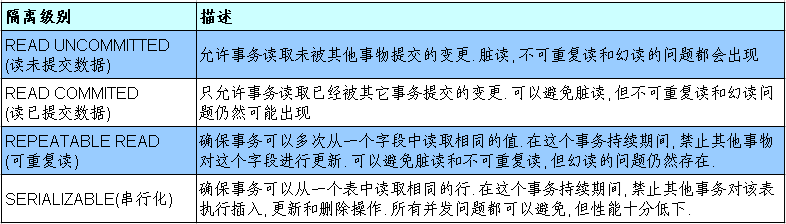
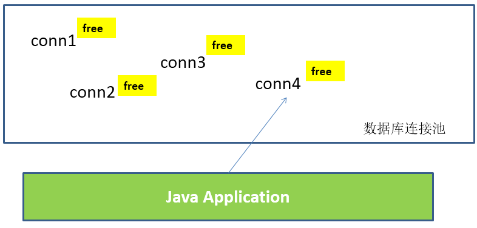
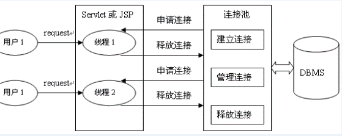

# JDBC 操作数据库

## 数据库事务

### 数据库事务介绍

- **事务：一组逻辑操作单元，使数据从一种状态变换到另一种状态。**

- **事务处理（事务操作）：**保证所有事务都作为一个工作单元来执行，即使出现了故障，都不能改变这种执行方式。当在一个事务中执行多个操作时，要么所有的事务都**被提交 (commit)**，那么这些修改就永久地保存下来；要么数据库管理系统将放弃所作的所有修改，整个事务**回滚 (rollback)**到最初状态。

- 为确保数据库中数据的**一致性**，数据的操纵应当是离散的成组的逻辑单元：当它全部完成时，数据的一致性可以保持，而当这个单元中的一部分操作失败，整个事务应全部视为错误，所有从起始点以后的操作应全部回退到开始状态。 

### JDBC 事务处理

- 数据一旦提交，就不可回滚。

- 数据什么时候意味着提交？

  - **当一个连接对象被创建时，默认情况下是自动提交事务**：每次执行一个 SQL 语句时，如果执行成功，就会向数据库自动提交，而不能回滚。
  - **关闭数据库连接，数据就会自动的提交。**如果多个操作，每个操作使用的是自己单独的连接，则无法保证事务。即同一个事务的多个操作必须在同一个连接下。

- **JDBC 程序中为了让多个 SQL 语句作为一个事务执行：**

  - 调用 Connection 对象的 **setAutoCommit(false);** 以取消自动提交事务
  - 在所有的 SQL 语句都成功执行后，调用 **commit();** 方法提交事务
  - 在出现异常时，调用 **rollback();** 方法回滚事务

  > 若此时 Connection 没有被关闭，还可能被重复使用，则需要恢复其自动提交状态 setAutoCommit(true)。尤其是在使用数据库连接池技术时，执行 close() 方法前，建议恢复自动提交状态。

【案例：用户 AA 向用户 BB 转账 100】

```java
public void testJDBCTransaction() {
	Connection conn = null;
	try {
		// 1.获取数据库连接
		conn = JDBCUtils.getConnection();
		// 2.开启事务
		conn.setAutoCommit(false);
		// 3.进行数据库操作
		String sql1 = "update user_table set balance = balance - 100 where user = ?";
		update(conn, sql1, "AA");

		// 模拟网络异常
		//System.out.println(10 / 0);

		String sql2 = "update user_table set balance = balance + 100 where user = ?";
		update(conn, sql2, "BB");
		// 4.若没有异常，则提交事务
		conn.commit();
	} catch (Exception e) {
		e.printStackTrace();
		// 5.若有异常，则回滚事务
		try {
			conn.rollback();
		} catch (SQLException e1) {
			e1.printStackTrace();
		}
    } finally {
        try {
			//6.恢复每次 DML 操作的自动提交功能
			conn.setAutoCommit(true);
		} catch (SQLException e) {
			e.printStackTrace();
		}
        //7.关闭连接
		JDBCUtils.closeResource(conn, null, null); 
    }  
}

```

其中，对数据库操作的方法为：

```java
//使用事务以后的通用的增删改操作（version 2.0）
public void update(Connection conn ,String sql, Object... args) {
	PreparedStatement ps = null;
	try {
		// 1.获取 PreparedStatement 的实例 (或：预编译 sql 语句)
		ps = conn.prepareStatement(sql);
		// 2.填充占位符
		for (int i = 0; i < args.length; i++) {
			ps.setObject(i + 1, args[i]);
		}
		// 3.执行 sql 语句
		ps.execute();
	} catch (Exception e) {
		e.printStackTrace();
	} finally {
		// 4.关闭资源
		JDBCUtils.closeResource(null, ps);

	}
}
```


### 事务的 ACID 属性    

1. **原子性（Atomicity）**
   原子性是指事务是一个不可分割的工作单位，事务中的操作要么都发生，要么都不发生。 

2. **一致性（Consistency）**
   事务必须使数据库从一个一致性状态变换到另外一个一致性状态。

3. **隔离性（Isolation）**
   事务的隔离性是指一个事务的执行不能被其他事务干扰，即一个事务内部的操作及使用的数据对并发的其他事务是隔离的，并发执行的各个事务之间不能互相干扰。

4. **持久性（Durability）**
   持久性是指一个事务一旦被提交，它对数据库中数据的改变就是永久性的，接下来的其他操作和数据库故障不应该对其有任何影响。

#### 数据库的并发问题

- 对于同时运行的多个事务，当这些事务访问数据库中相同的数据时，如果没有采取必要的隔离机制，就会导致各种并发问题：
  - **脏读**: 对于两个事务 T1, T2, T1 读取了已经被 T2 更新但还**没有被提交**的字段。之后，若 T2 回滚，T1 读取的内容就是临时且无效的。
  - **不可重复读**: 对于两个事务 T1, T2, T1 读取了一个字段，然后 T2 **更新**了该字段。之后，T1 再次读取同一个字段，值就不同了。
  - **幻读**: 对于两个事务 T1, T2, T1 从一个表中读取了一个字段，然后 T2 在该表中**插入**了一些新的行。之后，如果 T1 再次读取同一个表，就会多出几行。

- **数据库事务的隔离性**: 数据库系统必须具有隔离并发运行各个事务的能力，使它们不会相互影响，避免各种并发问题。

- 一个事务与其他事务隔离的程度称为隔离级别。数据库规定了多种事务隔离级别，不同隔离级别对应不同的干扰程度，**隔离级别越高，数据一致性就越好，但并发性越弱。**

#### 四种隔离级别

- 数据库提供的 4 种事务隔离级别：

  

- Oracle 支持的 2 种事务隔离级别：**READ COMMITED**, SERIALIZABLE。Oracle 默认的事务隔离级别为：**READ COMMITED** 。


- Mysql 支持 4 种事务隔离级别。Mysql 默认的事务隔离级别为：**REPEATABLE READ。**


#### 在 MySql 中设置隔离级别

- 每启动一个 mysql 程序，就会获得一个单独的数据库连接。每个数据库连接都有一个全局变量 @@tx_isolation, 表示当前的事务隔离级别。

- 查看当前的隔离级别：

  ```mysql
  SELECT @@tx_isolation;
  ```

- 设置当前 mySQL 连接的隔离级别： 

  ```mysql
  set  transaction isolation level read committed;
  ```

- 设置数据库系统的全局的隔离级别：

  ```mysql
  set global transaction isolation level read committed;
  ```

- 补充操作：

  - 创建 mysql 数据库用户：

    ```mysql
    create user tom identified by 'abc123';
    ```

  - 授予权限

    ```mysql
    #授予通过网络方式登录的 tom 用户，对所有库所有表的全部权限，密码设为 abc123.
    grant all privileges on *.* to tom@'%'  identified by 'abc123'; 
    
     #给 tom 用户使用本地命令行方式，授予 atguigudb 这个库下的所有表的插删改查的权限。
    grant select,insert,delete,update on atguigudb.* to tom@localhost identified by 'abc123'; 
    
    ```


## DAO 及相关实现类

- DAO：Data Access Object 访问数据信息的类和接口，包括了对数据的 CRUD（Create、Retrival、Update、Delete），而不包含任何业务相关的信息。有时也称作：BaseDAO
- 作用：为了实现功能的模块化，更有利于代码的维护和升级。

```java
/**
 * 定义一个用来被继承的对数据库进行基本操作的 Dao
 * 
 * @author HanYanBing
 *
 * @param <T>
 */
public abstract class BaseDao<T> {
	private QueryRunner queryRunner = new QueryRunner();
	// 定义一个变量来接收泛型的类型
	private Class<T> type;

	// 获取 T 的 Class 对象，获取泛型的类型，泛型是在被子类继承时才确定
	public BaseDao() {
		// 获取子类的类型
		Class clazz = this.getClass();
		// 获取父类的类型
		// getGenericSuperclass() 用来获取当前类的父类的类型
		// ParameterizedType 表示的是带泛型的类型
		ParameterizedType parameterizedType = (ParameterizedType) clazz.getGenericSuperclass();
		// 获取具体的泛型类型 getActualTypeArguments 获取具体的泛型的类型
		// 这个方法会返回一个 Type 的数组
		Type[] types = parameterizedType.getActualTypeArguments();
		// 获取具体的泛型的类型·
		this.type = (Class<T>) types[0];
	}

	/**
	 * 通用的增删改操作
	 * 
	 * @param sql
	 * @param params
	 * @return
	 */
	public int update(Connection conn,String sql, Object... params) {
		int count = 0;
		try {
			count = queryRunner.update(conn, sql, params);
		} catch (SQLException e) {
			e.printStackTrace();
		} 
		return count;
	}

	/**
	 * 获取一个对象
	 * 
	 * @param sql
	 * @param params
	 * @return
	 */
	public T getBean(Connection conn,String sql, Object... params) {
		T t = null;
		try {
			t = queryRunner.query(conn, sql, new BeanHandler<T>(type), params);
		} catch (SQLException e) {
			e.printStackTrace();
		} 
		return t;
	}

	/**
	 * 获取所有对象
	 * 
	 * @param sql
	 * @param params
	 * @return
	 */
	public List<T> getBeanList(Connection conn,String sql, Object... params) {
		List<T> list = null;
		try {
			list = queryRunner.query(conn, sql, new BeanListHandler<T>(type), params);
		} catch (SQLException e) {
			e.printStackTrace();
		} 
		return list;
	}

	/**
	 * 获取一个单一值得方法，专门用来执行像 select count(*)...这样的 sql 语句
	 * 
	 * @param sql
	 * @param params
	 * @return
	 */
	public Object getValue(Connection conn,String sql, Object... params) {
		Object count = null;
		try {
			// 调用 queryRunner 的 query 方法获取一个单一的值
			count = queryRunner.query(conn, sql, new ScalarHandler<>(), params);
		} catch (SQLException e) {
			e.printStackTrace();
		} 
		return count;
	}
}
```

## 数据库连接池

### JDBC 数据库连接池的必要性

- 在使用开发基于数据库的 web 程序时，传统的模式基本是按以下步骤：  
  - **在主程序（如 servlet、beans）中建立数据库连接**
  - **进行 sql 操作**
  - **断开数据库连接**

- 这种模式开发，存在的问题：
  - 普通的 JDBC 数据库连接使用 DriverManager 来获取，每次向数据库建立连接的时候都要将 Connection 加载到内存中，再验证用户名和密码 (得花费 0.05s～1s 的时间)。需要数据库连接的时候，就向数据库要求一个，执行完成后再断开连接。这样的方式将会消耗大量的资源和时间。**数据库的连接资源并没有得到很好的重复利用。**若同时有几百人甚至几千人在线，频繁的进行数据库连接操作将占用很多的系统资源，严重的甚至会造成服务器的崩溃。
  - **对于每一次数据库连接，使用完后都得断开。**否则，如果程序出现异常而未能关闭，将会导致数据库系统中的内存泄漏，最终将导致重启数据库。（回忆：何为 Java 的内存泄漏？）
  - **这种开发不能控制被创建的连接对象数**，系统资源会被毫无顾及的分配出去，如连接过多，也可能导致内存泄漏，服务器崩溃。 

### 数据库连接池技术

- 为解决传统开发中的数据库连接问题，可以采用数据库连接池技术。
- **数据库连接池的基本思想**：就是为数据库连接建立一个“缓冲池”。预先在缓冲池中放入一定数量的连接，当需要建立数据库连接时，只需从“缓冲池”中取出一个，使用完毕之后再放回去。

- **数据库连接池**负责分配、管理和释放数据库连接，它**允许应用程序重复使用一个现有的数据库连接，而不是重新建立一个**。
- 数据库连接池在初始化时将创建一定数量的数据库连接放到连接池中，这些数据库连接的数量是由**最小数据库连接数来设定**的。无论这些数据库连接是否被使用，连接池都将一直保证至少拥有这么多的连接数量。连接池的**最大数据库连接数量**限定了这个连接池能占有的最大连接数，当应用程序向连接池请求的连接数超过最大连接数量时，这些请求将被加入到等待队列中。



- **工作原理：**



- **数据库连接池技术的优点**

  **1. 资源重用**

  由于数据库连接得以重用，避免了频繁创建，释放连接引起的大量性能开销。在减少系统消耗的基础上，另一方面也增加了系统运行环境的平稳性。

  **2. 更快的系统反应速度**

  数据库连接池在初始化过程中，往往已经创建了若干数据库连接置于连接池中备用。此时连接的初始化工作均已完成。对于业务请求处理而言，直接利用现有可用连接，避免了数据库连接初始化和释放过程的时间开销，从而减少了系统的响应时间

  **3. 新的资源分配手段**

  对于多应用共享同一数据库的系统而言，可在应用层通过数据库连接池的配置，实现某一应用最大可用数据库连接数的限制，避免某一应用独占所有的数据库资源

  **4. 统一的连接管理，避免数据库连接泄漏**

  在较为完善的数据库连接池实现中，可根据预先的占用超时设定，强制回收被占用连接，从而避免了常规数据库连接操作中可能出现的资源泄露


### 多种开源的数据库连接池

- JDBC 的数据库连接池使用 javax.sql.DataSource 来表示，DataSource 只是一个接口，该接口通常由服务器 (Weblogic, WebSphere, Tomcat) 提供实现，也有一些开源组织提供实现：
  - **DBCP** 是 Apache 提供的数据库连接池。tomcat 服务器自带 dbcp 数据库连接池。**速度相对 c3p0 较快**，但因自身存在 BUG，Hibernate3 已不再提供支持。
  - **C3P0** 是一个开源组织提供的一个数据库连接池，**速度相对较慢，稳定性还可以。**hibernate 官方推荐使用
  - **Proxool** 是 sourceforge 下的一个开源项目数据库连接池，有监控连接池状态的功能，**稳定性较 c3p0 差一点**
  - **BoneCP** 是一个开源组织提供的数据库连接池，速度快
  - **Druid** 是阿里提供的数据库连接池，据说是集 DBCP、C3P0、Proxool 优点于一身的数据库连接池，但是速度不确定是否有 BoneCP 快
- DataSource 通常被称为数据源，它包含连接池和连接池管理两个部分，习惯上也经常把 DataSource 称为连接池
- **DataSource 用来取代 DriverManager 来获取 Connection，获取速度快，同时可以大幅度提高数据库访问速度。**
- 特别注意：
  - 数据源和数据库连接不同，数据源无需创建多个，它是产生数据库连接的工厂，因此**整个应用只需要一个数据源即可。**
  - 当数据库访问结束后，程序还是像以前一样关闭数据库连接：conn.close(); 但 conn.close() 并没有关闭数据库的物理连接，它仅仅把数据库连接释放，归还给了数据库连接池。

#### C3P0 数据库连接池

- 获取连接方式一

```java
//使用 C3P0 数据库连接池的方式，获取数据库的连接：不推荐
public static Connection getConnection1() throws Exception{
	ComboPooledDataSource cpds = new ComboPooledDataSource();
	cpds.setDriverClass("com.mysql.jdbc.Driver"); 
	cpds.setJdbcUrl("jdbc:mysql://localhost:3306/test");
	cpds.setUser("root");
	cpds.setPassword("abc123");
		
//	cpds.setMaxPoolSize(100);
	
	Connection conn = cpds.getConnection();
	return conn;
}
```


- 获取连接方式二

```java
//使用 C3P0 数据库连接池的配置文件方式，获取数据库的连接：推荐
private static DataSource cpds = new ComboPooledDataSource("helloc3p0");
public static Connection getConnection2() throws SQLException{
	Connection conn = cpds.getConnection();
	return conn;
}
```

其中，src 下的配置文件为：【c3p0-config.xml】

```xml
<?xml version="1.0" encoding="UTF-8"?>
<c3p0-config>
	<named-config name="helloc3p0">
		<!-- 获取连接的4个基本信息 -->
		<property name="user">root</property>
		<property name="password">abc123</property>
		<property name="jdbcUrl">jdbc:mysql:///test</property>
		<property name="driverClass">com.mysql.jdbc.Driver</property>
		
		<!-- 涉及到数据库连接池的管理的相关属性的设置 -->
		<!-- 若数据库中连接数不足时, 一次向数据库服务器申请多少个连接 -->
		<property name="acquireIncrement">5</property>
		<!-- 初始化数据库连接池时连接的数量 -->
		<property name="initialPoolSize">5</property>
		<!-- 数据库连接池中的最小的数据库连接数 -->
		<property name="minPoolSize">5</property>
		<!-- 数据库连接池中的最大的数据库连接数 -->
		<property name="maxPoolSize">10</property>
		<!-- C3P0 数据库连接池可以维护的 Statement 的个数 -->
		<property name="maxStatements">20</property>
		<!-- 每个连接同时可以使用的 Statement 对象的个数 -->
		<property name="maxStatementsPerConnection">5</property>

	</named-config>
</c3p0-config>
```


#### DBCP 数据库连接池

- DBCP 是 Apache 软件基金组织下的开源连接池实现，该连接池依赖该组织下的另一个开源系统：Common-pool。如需使用该连接池实现，应在系统中增加如下两个 jar 文件：
  - Commons-dbcp.jar：连接池的实现
  - Commons-pool.jar：连接池实现的依赖库
- **Tomcat 的连接池正是采用该连接池来实现的。**该数据库连接池既可以与应用服务器整合使用，也可由应用程序独立使用。
- 数据源和数据库连接不同，数据源无需创建多个，它是产生数据库连接的工厂，因此整个应用只需要一个数据源即可。
- 当数据库访问结束后，程序还是像以前一样关闭数据库连接：conn.close(); 但上面的代码并没有关闭数据库的物理连接，它仅仅把数据库连接释放，归还给了数据库连接池。
- 配置属性说明

| 属性                       | 默认值 | 说明                                                                                                                                               |
| -------------------------- | ------ | -------------------------------------------------------------------------------------------------------------------------------------------------- |
| initialSize                | 0      | 连接池启动时创建的初始化连接数量                                                                                                                   |
| maxActive                  | 8      | 连接池中可同时连接的最大的连接数                                                                                                                   |
| maxIdle                    | 8      | 连接池中最大的空闲的连接数，超过的空闲连接将被释放，如果设置为负数表示不限制                                                                       |
| minIdle                    | 0      | 连接池中最小的空闲的连接数，低于这个数量会被创建新的连接。该参数越接近 maxIdle，性能越好，因为连接的创建和销毁，都是需要消耗资源的；但是不能太大。 |
| maxWait                    | 无限制 | 最大等待时间，当没有可用连接时，连接池等待连接释放的最大时间，超过该时间限制会抛出异常，如果设置 -1 表示无限等待                                   |
| poolPreparedStatements     | false  | 开启池的 Statement 是否 prepared                                                                                                                   |
| maxOpenPreparedStatements  | 无限制 | 开启池的 prepared 后的同时最大连接数                                                                                                               |
| minEvictableIdleTimeMillis |        | 连接池中连接，在时间段内一直空闲，被逐出连接池的时间                                                                                               |
| removeAbandonedTimeout     | 300    | 超过时间限制，回收没有用 (废弃) 的连接                                                                                                             |
| removeAbandoned            | false  | 超过 removeAbandonedTimeout 时间后，是否进 行没用连接（废弃）的回收                                                                                |


- 获取连接方式一：

```java
public static Connection getConnection3() throws Exception {
	BasicDataSource source = new BasicDataSource();
		
	source.setDriverClassName("com.mysql.jdbc.Driver");
	source.setUrl("jdbc:mysql:///test");
	source.setUsername("root");
	source.setPassword("abc123");
		
	//
	source.setInitialSize(10);
		
	Connection conn = source.getConnection();
	return conn;
}
```

- 获取连接方式二：

```java
//使用 dbcp 数据库连接池的配置文件方式，获取数据库的连接：推荐
private static DataSource source = null;
static{
	try {
		Properties pros = new Properties();
		
		InputStream is = DBCPTest.class.getClassLoader().getResourceAsStream("dbcp.properties");
			
		pros.load(is);
		//根据提供的 BasicDataSourceFactory 创建对应的 DataSource 对象
		source = BasicDataSourceFactory.createDataSource(pros);
	} catch (Exception e) {
		e.printStackTrace();
	}
		
}
public static Connection getConnection4() throws Exception {
		
	Connection conn = source.getConnection();
	
	return conn;
}
```

其中，src 下的配置文件为：【dbcp.properties】

```properties
driverClassName=com.mysql.jdbc.Driver
url=jdbc:mysql://localhost:3306/test?rewriteBatchedStatements=true&useServerPrepStmts=false
username=root
password=abc123

initialSize=10
#...
```


#### Druid（德鲁伊）数据库连接池

Druid 是阿里巴巴开源平台上一个数据库连接池实现，它结合了 C3P0、DBCP、Proxool 等 DB 池的优点，同时加入了日志监控，可以很好的监控 DB 池连接和 SQL 的执行情况，可以说是针对监控而生的 DB 连接池，**可以说是目前最好的连接池之一。**

```java
package com.atguigu.druid;

import java.sql.Connection;
import java.util.Properties;

import javax.sql.DataSource;

import com.alibaba.druid.pool.DruidDataSourceFactory;

public class TestDruid {
	public static void main(String[] args) throws Exception {
		Properties pro = new Properties();		 pro.load(TestDruid.class.getClassLoader().getResourceAsStream("druid.properties"));
		DataSource ds = DruidDataSourceFactory.createDataSource(pro);
		Connection conn = ds.getConnection();
		System.out.println(conn);
	}
}

```

其中，src 下的配置文件为：【druid.properties】

```java
url=jdbc:mysql://localhost:3306/test?rewriteBatchedStatements=true
username=root
password=123456
driverClassName=com.mysql.jdbc.Driver

initialSize=10
maxActive=20
maxWait=1000
filters=wall
```

- 详细配置参数：

| **配置**                      | **缺省** | **说明**                                                                                                                                                                                  |
| ----------------------------- | -------- | ----------------------------------------------------------------------------------------------------------------------------------------------------------------------------------------- |
| name                          |          | 配置这个属性的意义在于，如果存在多个数据源，监控的时候可以通过名字来区分开来。如果没有配置，将会生成一个名字，格式是：”DataSource-” +   System.identityHashCode(this)                     |
| url                           |          | 连接数据库的 url，不同数据库不一样。例如：mysql :   jdbc:mysql://10.20.153.104:3306/druid2      oracle :   jdbc:oracle:thin:@10.20.149.85:1521:ocnauto                                    |
| username                      |          | 连接数据库的用户名                                                                                                                                                                        |
| password                      |          | 连接数据库的密码。如果你不希望密码直接写在配置文件中，可以使用 ConfigFilter。详细看这里：<https://github.com/alibaba/druid/wiki/%E4%BD%BF%E7%94%A8ConfigFilter>                           |
| driverClassName               |          | 根据 url 自动识别   这一项可配可不配，如果不配置 druid 会根据 url 自动识别 dbType，然后选择相应的 driverClassName(建议配置下)                                                             |
| initialSize                   | 0        | 初始化时建立物理连接的个数。初始化发生在显示调用 init 方法，或者第一次 getConnection 时                                                                                                   |
| maxActive                     | 8        | 最大连接池数量                                                                                                                                                                            |
| maxIdle                       | 8        | 已经不再使用，配置了也没效果                                                                                                                                                              |
| minIdle                       |          | 最小连接池数量                                                                                                                                                                            |
| maxWait                       |          | 获取连接时最大等待时间，单位毫秒。配置了 maxWait 之后，缺省启用公平锁，并发效率会有所下降，如果需要可以通过配置 useUnfairLock 属性为 true 使用非公平锁。                                  |
| poolPreparedStatements        | false    | 是否缓存 preparedStatement，也就是 PSCache。PSCache 对支持游标的数据库性能提升巨大，比如说 oracle。在 mysql 下建议关闭。                                                                  |
| maxOpenPreparedStatements     | -1       | 要启用 PSCache，必须配置大于 0，当大于 0 时，poolPreparedStatements 自动触发修改为 true。在 Druid 中，不会存在 Oracle 下 PSCache 占用内存过多的问题，可以把这个数值配置大一些，比如说 100 |
| validationQuery               |          | 用来检测连接是否有效的 sql，要求是一个查询语句。如果 validationQuery 为 null，testOnBorrow、testOnReturn、testWhileIdle 都不会其作用。                                                    |
| testOnBorrow                  | true     | 申请连接时执行 validationQuery 检测连接是否有效，做了这个配置会降低性能。                                                                                                                 |
| testOnReturn                  | false    | 归还连接时执行 validationQuery 检测连接是否有效，做了这个配置会降低性能                                                                                                                   |
| testWhileIdle                 | false    | 建议配置为 true，不影响性能，并且保证安全性。申请连接的时候检测，如果空闲时间大于 timeBetweenEvictionRunsMillis，执行 validationQuery 检测连接是否有效。                                  |
| timeBetweenEvictionRunsMillis |          | 有两个含义：1)Destroy 线程会检测连接的间隔时间 2)testWhileIdle 的判断依据，详细看 testWhileIdle 属性的说明                                                                                |
| numTestsPerEvictionRun        |          | 不再使用，一个 DruidDataSource 只支持一个 EvictionRun                                                                                                                                     |
| minEvictableIdleTimeMillis    |          |                                                                                                                                                                                           |
| connectionInitSqls            |          | 物理连接初始化的时候执行的 sql                                                                                                                                                            |
| exceptionSorter               |          | 根据 dbType 自动识别   当数据库抛出一些不可恢复的异常时，抛弃连接                                                                                                                         |
| filters                       |          | 属性类型是字符串，通过别名的方式配置扩展插件，常用的插件有：监控统计用的 filter:stat 日志用的 filter:log4j 防御 sql 注入的 filter:wall                                                    |
| proxyFilters                  |          | 类型是 List，如果同时配置了 filters 和 proxyFilters，是组合关系，并非替换关系                                                                                                             |

## Apache-DBUtils 实现 CRUD 操作

### Apache-DBUtils 简介

- commons-dbutils 是 Apache 组织提供的一个开源 JDBC 工具类库，它是对 JDBC 的简单封装，学习成本极低，并且使用 dbutils 能极大简化 jdbc 编码的工作量，同时也不会影响程序的性能。

- API 介绍：
  - `org.apache.commons.dbutils.QueryRunner`
  - `org.apache.commons.dbutils.ResultSetHandler`
  - `工具类：org.apache.commons.dbutils.DbUtils`
- API 包引入：

```xml
<dependency>
    <groupId>commons-dbutils</groupId>
    <artifactId>commons-dbutils</artifactId>
    <version>1.3</version>
</dependency>
```

### 主要 API 的使用

#### DbUtils

- DbUtils：提供如关闭连接、装载 JDBC 驱动程序等常规工作的工具类，里面的所有方法都是静态的。主要方法如下：
  - `public static void close(…) throws java.sql.SQLException`：DbUtils 类提供了三个重载的关闭方法。这些方法检查所提供的参数是不是 NULL，如果不是的话，它们就关闭 Connection、Statement 和 ResultSet。
  - `public static void closeQuietly(…)`: 这一类方法不仅能在 Connection、Statement 和 ResultSet 为 NULL 情况下避免关闭，还能隐藏一些在程序中抛出的 SQLEeception。
  - `public static void commitAndClose(Connection conn)throws SQLException`：用来提交连接的事务，然后关闭连接
  - `public static void commitAndCloseQuietly(Connection conn)`：用来提交连接，然后关闭连接，并且在关闭连接时不抛出 SQL 异常。 
  - `public static void rollback(Connection conn)throws SQLException`：允许 conn 为 null，因为方法内部做了判断
  - `public static void rollbackAndClose(Connection conn)throws SQLException`
  - `rollbackAndCloseQuietly(Connection)`
  - `public static boolean loadDriver(java.lang.String driverClassName)`：这一方装载并注册 JDBC 驱动程序，如果成功就返回 true。使用该方法，你不需要捕捉这个异常 ClassNotFoundException。

#### QueryRunner 类

- **该类简单化了 SQL 查询，它与 ResultSetHandler 组合在一起使用可以完成大部分的数据库操作，能够大大减少编码量。**
- QueryRunner 类提供了两个构造器：
  - 默认的构造器
  - 需要一个 `javax.sql.DataSource` 来作参数的构造器
- QueryRunner 类的主要方法：
  - **更新**
    - `public int update(Connection conn, String sql, Object... params) throws SQLException`:用来执行一个更新（插入、更新或删除）操作。
  - **插入**
    - `public <T> T insert(Connection conn,String sql,ResultSetHandler<T> rsh, Object... params) throws SQLException：只支持 INSERT 语句，其中 rsh - The handler used to create the result object from the ResultSet of auto-generated keys.  返回值：An object generated by the handler`.即自动生成的键值
  - **批处理**
    - `public int[] batch(Connection conn,String sql,Object[][] params)throws SQLException`：INSERT, UPDATE, or DELETE 语句
    - `public <T> T insertBatch(Connection conn,String sql,ResultSetHandler<T> rsh,Object[][] params)throws SQLException`：只支持 INSERT 语句
  - **查询**
    - `public Object query(Connection conn, String sql, ResultSetHandler rsh,Object... params) throws SQLException：执行一个查询操作，在这个查询中，对象数组中的每个元素值被用来作为查询语句的置换参数。该方法会自行处理 PreparedStatement 和 ResultSet 的创建和关闭`。

#### ResultSetHandler 接口及实现类

- 该接口用于处理 java.sql.ResultSet，将数据按要求转换为另一种形式。
- ResultSetHandler 接口提供了一个单独的方法：Object handle (java.sql.ResultSet .rs)。
- 接口的主要实现类：

  - ArrayHandler：把结果集中的第一行数据转成对象数组。
  - ArrayListHandler：把结果集中的每一行数据都转成一个数组，再存放到 List 中。
  - **BeanHandler：**将结果集中的第一行数据封装到一个对应的 JavaBean 实例中。
  - **BeanListHandler：**将结果集中的每一行数据都封装到一个对应的 JavaBean 实例中，存放到 List 里。
  - ColumnListHandler：将结果集中某一列的数据存放到 List 中。
  - KeyedHandler(name)：将结果集中的每一行数据都封装到一个 Map 里，再把这些 map 再存到一个 map 里，其 key 为指定的 key。
  - **MapHandler：**将结果集中的第一行数据封装到一个 Map 里，key 是列名，value 就是对应的值。
  - **MapListHandler：**将结果集中的每一行数据都封装到一个 Map 里，然后再存放到 List
  - **ScalarHandler：**查询单个值对象

## JDBC 总结

```java
总结
@Test
public void testUpdateWithTx() {
		
	Connection conn = null;
	try {
		//1.获取连接的操作（
		//① 手写的连接：JDBCUtils.getConnection();
		//② 使用数据库连接池：C3P0;DBCP;Druid
		//2.对数据表进行一系列 CRUD 操作
		//① 使用 PreparedStatement 实现通用的增删改、查询操作（version 1.0 \ version 2.0)
//version2.0 的增删改 public void update(Connection conn,String sql,Object ... args){}
//version2.0 的查询 public <T> T getInstance(Connection conn,Class<T> clazz,String sql,Object ... args){}
		//② 使用 dbutils 提供的 jar 包中提供的 QueryRunner 类
			
		//提交数据
		conn.commit();
			
	
	} catch (Exception e) {
		e.printStackTrace();
			
			
		try {
			//回滚数据
			conn.rollback();
		} catch (SQLException e1) {
			e1.printStackTrace();
		}
			
	}finally{
		//3.关闭连接等操作
		//① JDBCUtils.closeResource();
		//② 使用 dbutils 提供的 jar 包中提供的 DbUtils 类提供了关闭的相关操作
			
	}
}
```

