# JDK8

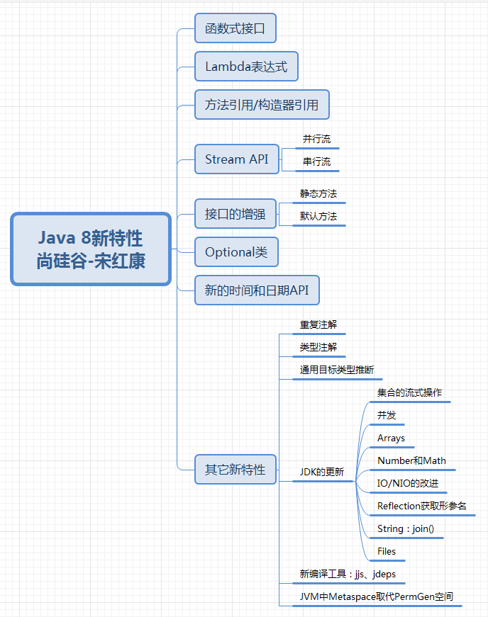

## Lambda 表达式

```txt
左侧：指定了 Lambda 表达式需要的参数列表
右侧：指定了 Lambda 体，是抽象方法的实现逻辑，是 Lambda 表达式要执行的功能

`（） -> {}`
上联：左右遇一括号省 下联：左侧推断类型省 横批：能省就省
Lambda 表达式基于函数式接口实现 


类型推断 L：Lambda 表达式的类型依赖于上下文环境，是由编译器推断出来的。
```

## 函数式接口

> 接口中只有一个抽象方法的接口叫做函数式接口，通过`@FunctionalInterface`修饰判断是否是函数式接口

> 四大主要的函数式接口

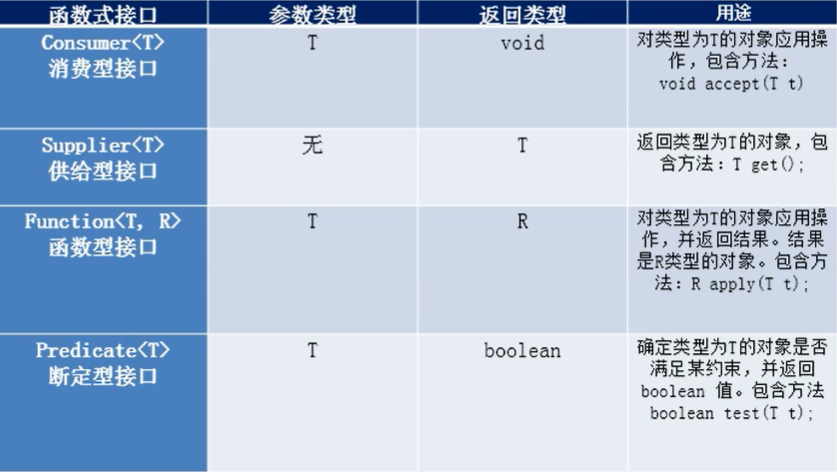

## 方法引用与构造器引用

> 方法引用：Lambda 实现体的代码已经有实现，则可以直接使用方法引用

```txt
对象::实例方法名
类::静态方法名
类::实例方法名
```

> 构造器引用

```java
// 构造器引用
System.out.println("-----------------------------");
Supplier<Emp> supplier3 = () -> new Emp();
Supplier<Emp> supplier4 = Emp::new;
```

## Stream API

> 源数据->流操作->新数据

```txt
Stream 自己不会存储元素。
Stream 不会改变源对象。相反，他们会返回一个持有结果的新 Stream。
Stream 操作是延迟执行的。这意味着他们会等到需要结果的时候才执行。
```

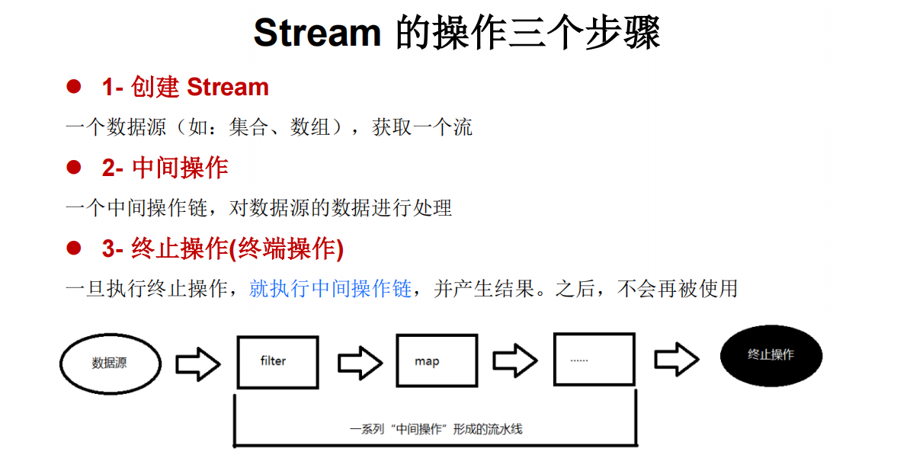

### 创建流

```txt
-- 通过集合
new stream() : 返回一个顺序流
new parallelStream() : 返回一个并行流
-- 通过数组
Arrays.stream()
-- 通过 Stream 的 of()
Stream.of()
-- 创建无限流
Stream.iterate()
Stream.generate()
```

### 中间操作

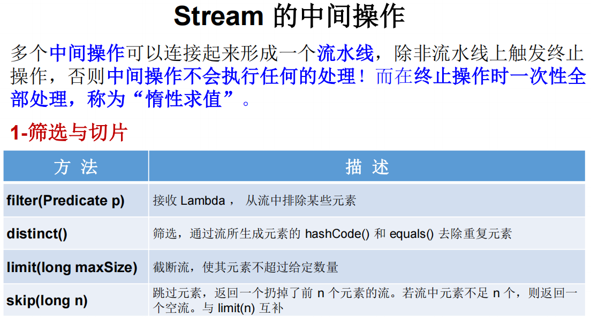

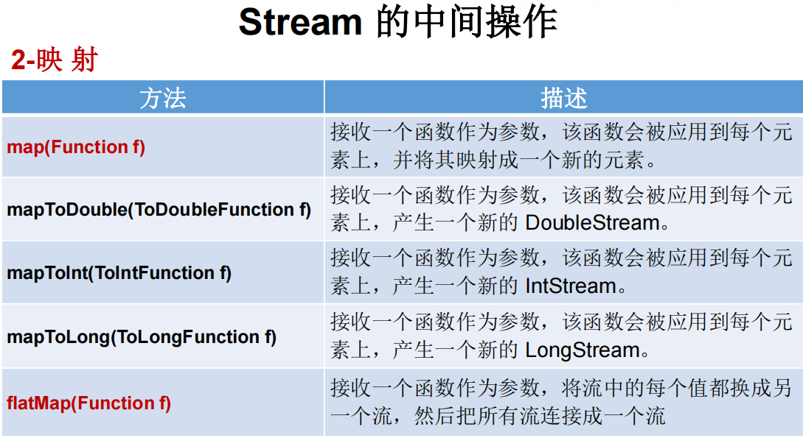

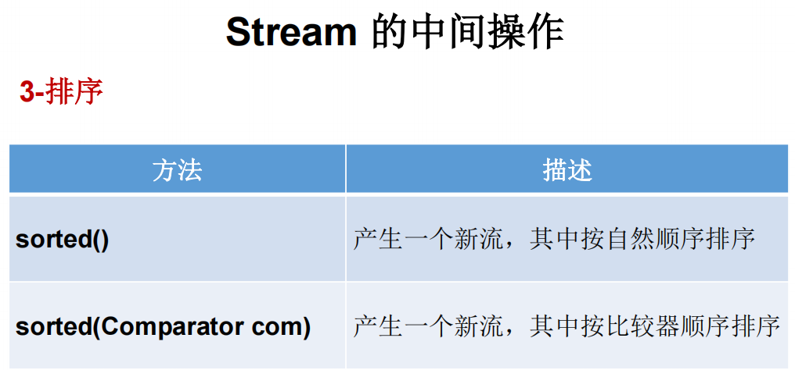

### 终止操作


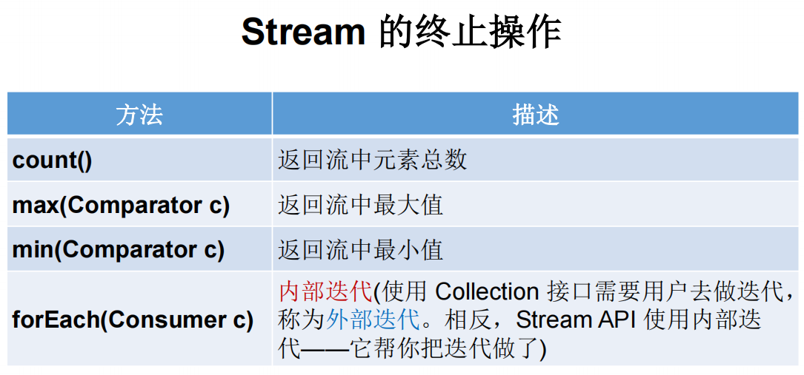

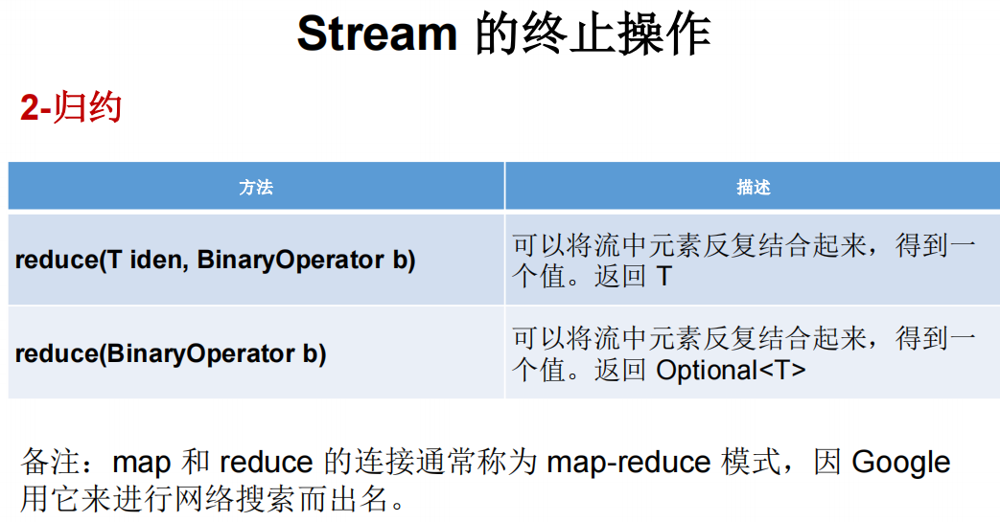

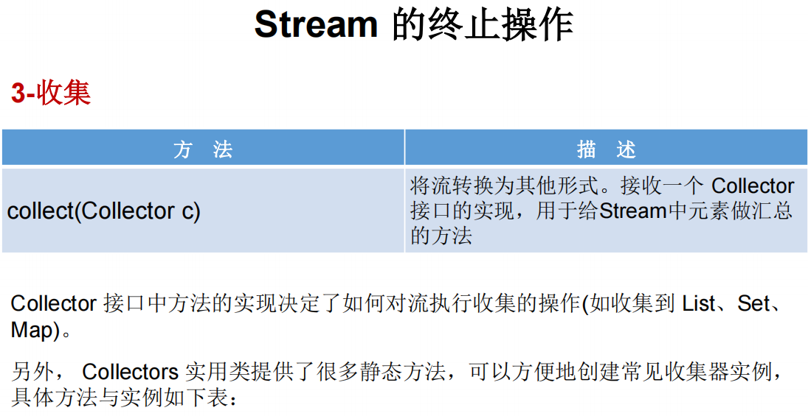

### Collectors

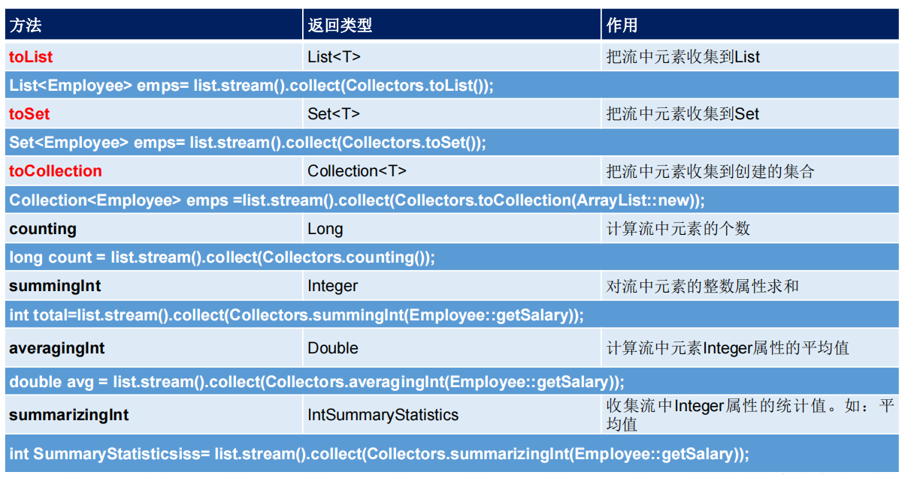

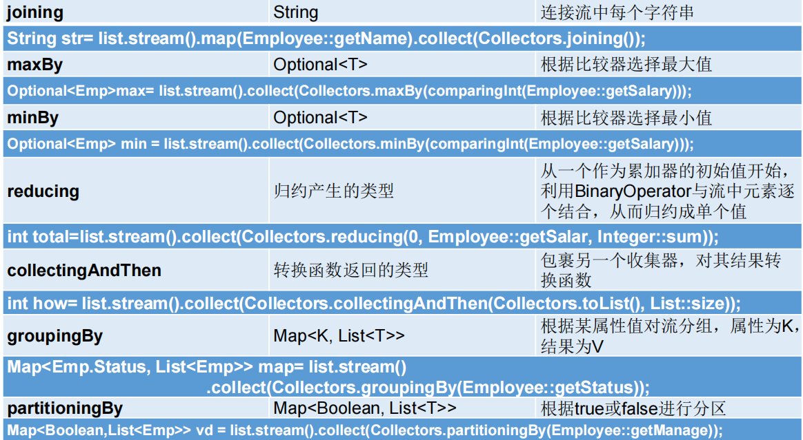

## Optional 类

```txt
Optional<T> 类 (java.util.Optional) 是一个容器类，它可以保存类型 T 的值，代表这个值存在。或者仅仅保存 null，表示这个值不存在。原来用 null 表示一个值不存在，现在 Optional 可以更好的表达这个概念。并且可以避免空指针异常
```

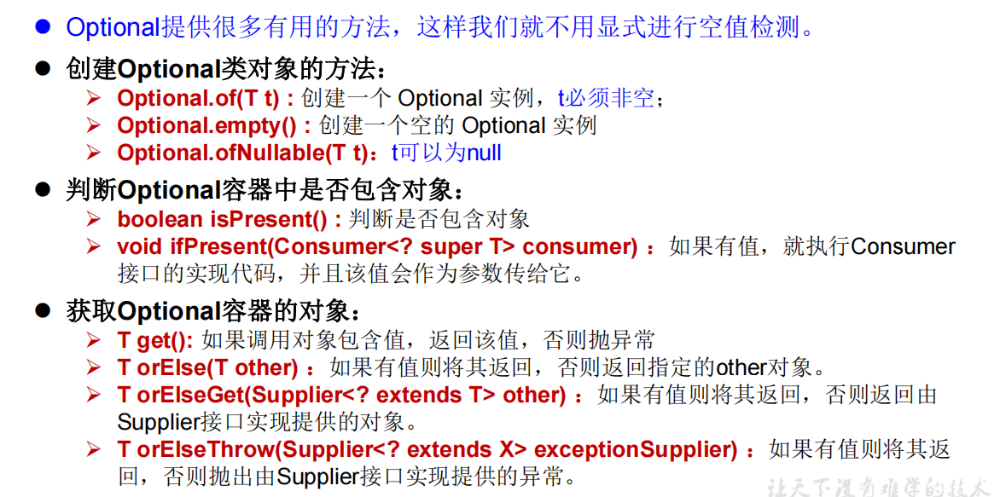

## 接口中的默认方法与静态方法

```java
public interface DefaultMethodDemo {
    default String getName() {
        return "接口中实现的默认方法";
    }

    public static String getTitle() {
        return "接口中的静态方法";
    }
}

class Demo {
    public String getName() {
        return "父类中实现的方法";
    }
}

class Test extends Demo implements DefaultMethodDemo {
    public static void main(String[] args) {
        // 父类优先原则
        System.out.println(new Test().getName());
        // 接口中的静态方法
        System.out.println(DefaultMethodDemo.getTitle());
    }
}
//父类中实现的方法
//接口中的静态方法
```

## 新时间日期 API

> 旧时间 API 线程不安全，新时间 API 线程安全

```java
java.time - 包含值对象的基础包
java.time.chrono - 提供对不同的日历系统的访问
java.time.format - 格式化和解析时间和日期
java.time.temporal - 包括底层框架和拓展特性
java.time.zone - 包含时区支持的类
```

```java
LocalDateTime localDateTime = LocalDateTime.now();
DateTimeFormatter dtf = DateTimeFormatter.ofPattern("yyyy-MM-dd hh:mm:ss");
log.info("=====>" + dtf.format(localDateTime));
```


