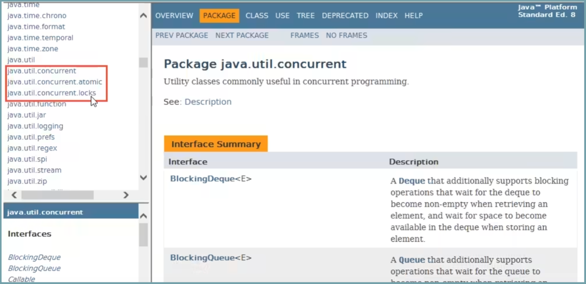
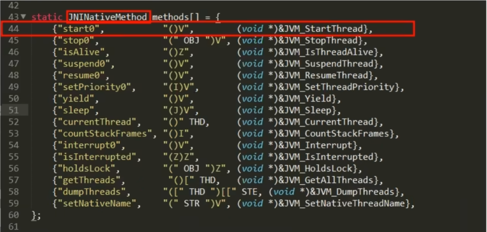
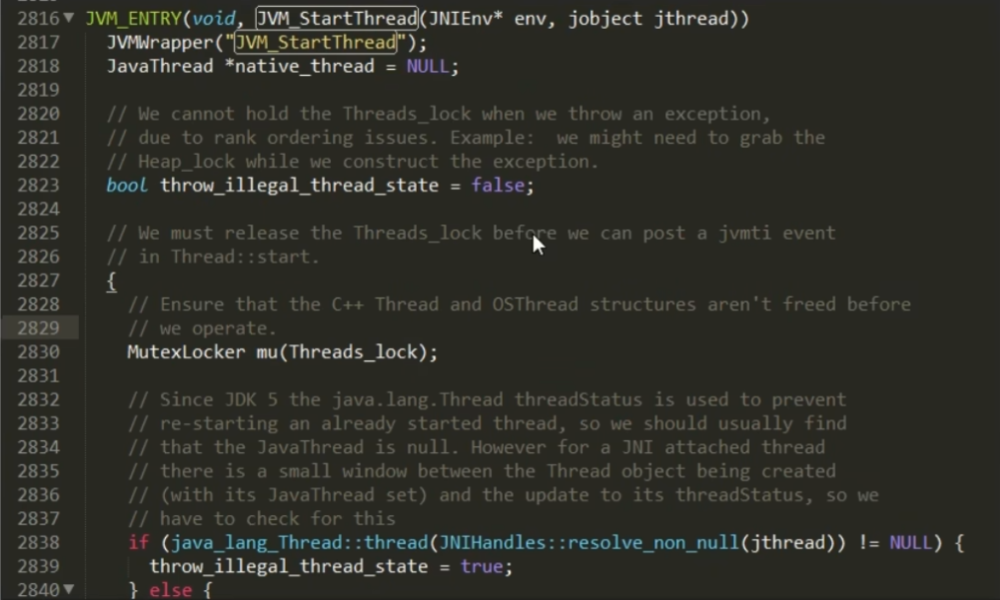
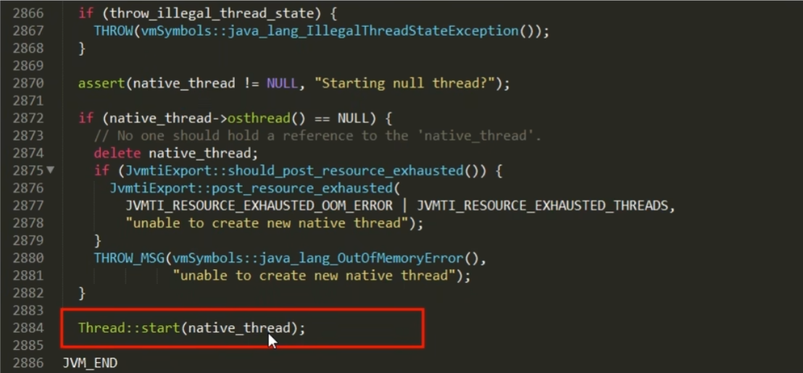
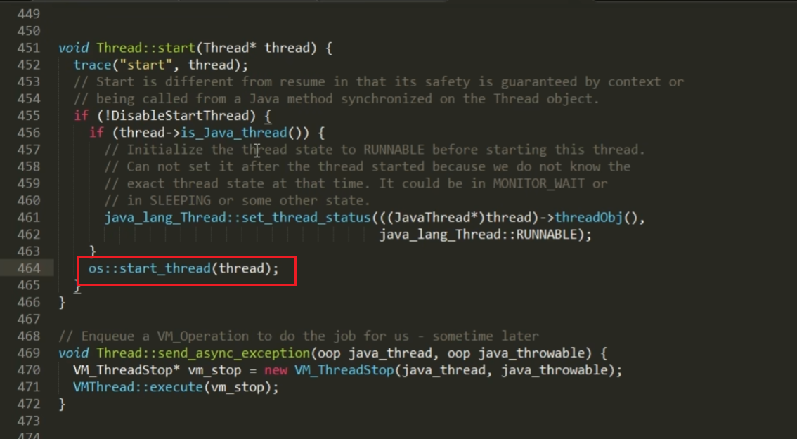
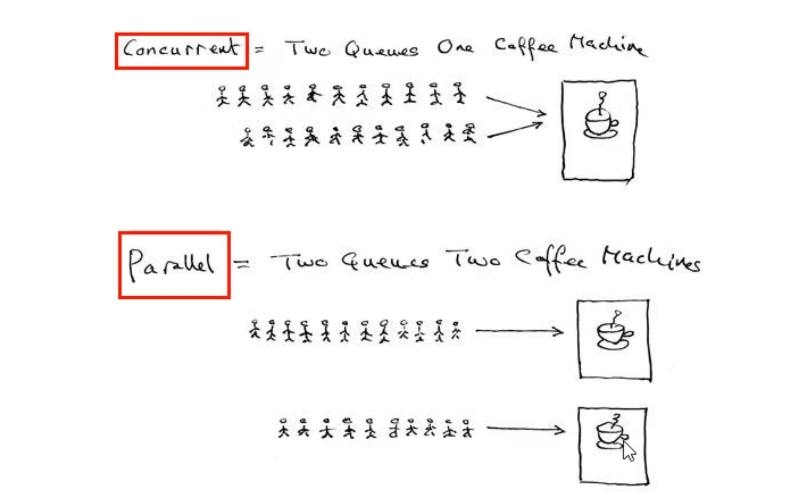
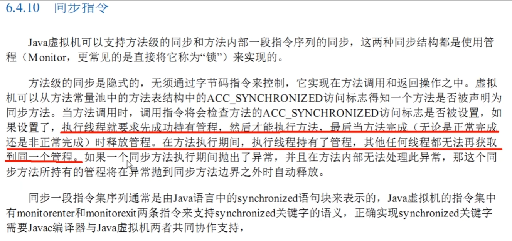

# 线程基础知识复习

## JUC 是什么？

### JUC 包设计开发者


### JUC 工具包

`java.util.concurrent` 在 **并发编程** 中使用的工具包



## 为什么学习并用好多线程极其重要

### 硬件方面

#### 摩尔定律失效

它是由英特尔创始人之一 Gordon Moore(戈登·摩尔) 提出来的。其内容为：当价格不变时，集成电路上可容纳的元器件的数目约每隔 18-24 个月便会增加一倍，性能也将提升一倍。换言之，每一美元所能买到的电脑性能，将每隔 18-24 个月翻一倍以上。这一定律揭示了信息技术进步的速度。可是从 2003 年开始 CPU 主频已经不再翻倍，而是采用多核而不是更快的主频。摩尔定律失效了，在主频不再提高且核数在不断增加的情况下，要想让程序更快就要用到并行或并发编程。

### 软件方面

- 面试 B 格可以高一点点
- 充分利用多核处理器
- 提高程序性能，高并发系统
- 提高程序吞吐量，异步 + 回调等生产需求

### 弊端及问题

- 线程安全性问题
  - i++
  - 集合类安全否
- 线程锁问题
- 线程性能问题

## 从 start 一个线程说起

### start() 方法源码分析

```java
public static void main(String[] args){
	Thread t1 = new Thread(() -> {}，"t1");
	t1.start();
}
```

```java
// start 方法源码
public synchronized void start() {
    /**
     * This method is not invoked for the main method thread or "system"
     * group threads created/set up by the VM. Any new functionality added
     * to this method in the future may have to also be added to the VM.
     *
     * A zero status value corresponds to state "NEW".
     */
    if (threadStatus != 0)
        throw new IllegalThreadStateException();

    /* Notify the group that this thread is about to be started
     * so that it can be added to the group's list of threads
     * and the group's unstarted count can be decremented. */
    group.add(this);

    boolean started = false;
    try {
        // 重点调用了此处的方法
        // private native void start0();//start0 是一个 native 方法
        start0(); 
        started = true;
    } finally {
        try {
            if (!started) {
                group.threadStartFailed(this);
            }
        } catch (Throwable ignore) {
            /* do nothing. If start0 threw a Throwable then
              it will be passed up the call stack */
        }
    }
}
```

> `native`调用的是本地方法，我们可以通过下载官网的 OpenJDK 查看其源码

### Java 线程理解以及 openjdk 中的实现

`private native void starto();`

Java 语言本身底层就是 C++语言

OpenJDK 源码网址：[https://openjdk.org/](https://openjdk.org/)

### 更加底层的 C++源码解读

- `openjdk8\jdk\src\share\native\java\lang` `thread.c`
- `openjdk8\hotspot\src\sharelvm\prims ` `jvm.cpp`
- `openjdk8\hotspot\src\share\vm\runtime` `thread.cpp`

#### thread.c

- java 线程是通过 start 的方法启动执行的，主要内容在 native 方法 start0 中
- openjdk 的写 JNI 一般是一一对应的，Thread.java 对应的就是 Thread.c
- start0 其实是 JVM_StartThread，此时查看源码可以看到在 jvm.h 中找到声明，jvm.cpp 中有实现



#### jvm.cpp





#### thread.cpp

在这里调用了操作系统的线程启动



## Java 多线程相关概念

### 1 把锁

synchronized

### 2 个并

- 并发 (concurrent): 是在同一实体上的多个事件，是在一台处理器上"同时"处理多个任务，同一时刻，其实只有一个事件在发生。
- 并行 (parallel): 是在不同实体上的多个事件，是在多台处理器上同时处理多个任务，同一时刻，大家真的都在做事情，你做你的，我做我的，但是我们都在做。



### 3 个程

> 通过上面 start 线程的案例，其实进程线程都来源于操作系统。

- 进程：系统中运行的一个应用程序就是一个进程，每一个进程都有它自己的内存空间和系统资源。
- 线程：也被称为轻量级进程，在同一进程内基本会有一个或者多个线程，是大多数操作系统进行调度的基本单元。
- 管程：Monitor(监视器)，也就是我们平时说的锁。Monitor 其实是一种同步机制，它的义务是保证 (同一时间) 只有一个线程可以访问被包含的数据和代码。JVM 中同步是基于进入和退出监视器对象 (Monitor 管程对象) 来实现的，每个对象实例都会有一个 Monitor 对象。Monitor 对象会和 Java 对象一同创建并销毁，它的底层是由 C++语言来实现的。



## 用户线程和守护线程

### Java 线程分为用户线程和守护线程

- 一般情况下不做特别说明配置，默认都是用户线程。
- 用户线程 (User Thread)
  - 是系统的工作线程，它会完成这个程序需要完成的业务操作。
- 守护线程 (Daemon Thread)
  - 守护线程 (Daemon Thread): 是一种特殊的线程为其他线程服务的，在后台默默的完成一些系统性的服务，比如垃圾回收线程就是最典型的例子。守护线程作为一个服务线程，没有服务对象就没有必要继续运行了，如果用户线程结束了，意味着程序需要完成的业务操作已经结束了。系统可以退出了。所有假设当系统只剩下守护线程的时候，java 虚拟机会自动退出。

### 线程的 daemon 属性

```java
/* Whether or not the thread is a daemon thread. */
private boolean     daemon = false;
```

true 表示是守护线程

false 表示是用户线程

### code 演示

```java
public class DaemonDemo {
    //一切方法运行的入口
    public static void main(String[] args) {
        Thread t1 = new Thread(() -> {
            System.out.println(Thread.currentThread().getName() + "\t 开始运行，" +
                    (Thread.currentThread().isDaemon() ? "守护线程" : "用户线程"));
            while (true) {

            }
        }, "t1");
        t1.setDaemon(true);
        t1.start();

        //暂停几秒钟线程
        try {
            TimeUnit.SECONDS.sleep(3);
        } catch (InterruptedException e) {
            e.printStackTrace();
        }

        System.out.println(Thread.currentThread().getName() + "\t ----end 主线程");

    }
}
//未加 t1.setDaemon(true);，默认是用户线程，他会继续运行，所以灯亮着
//加了 t1.setDaemon(true);是守护线程，当用户线程 main 方法结束后自动退出了
```

### 小总结

守护线程作为一个服务线程，没有服务对象就没有必要继续运行了，如果用户线程全部结束了，意味着程序需要完成的业务操作已经结束了，系统可退出了。假如当系统只剩下守护线程的时候，java 虚拟机会自动退出。

setDaemon(true) 方法必须在 start() 之前设置，否则报 IIIegalThreadStateException 异常
