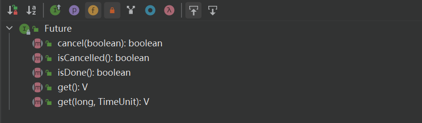
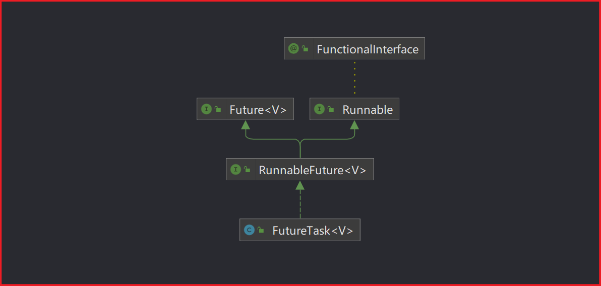
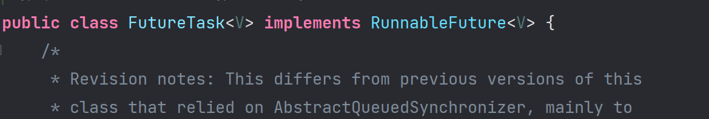
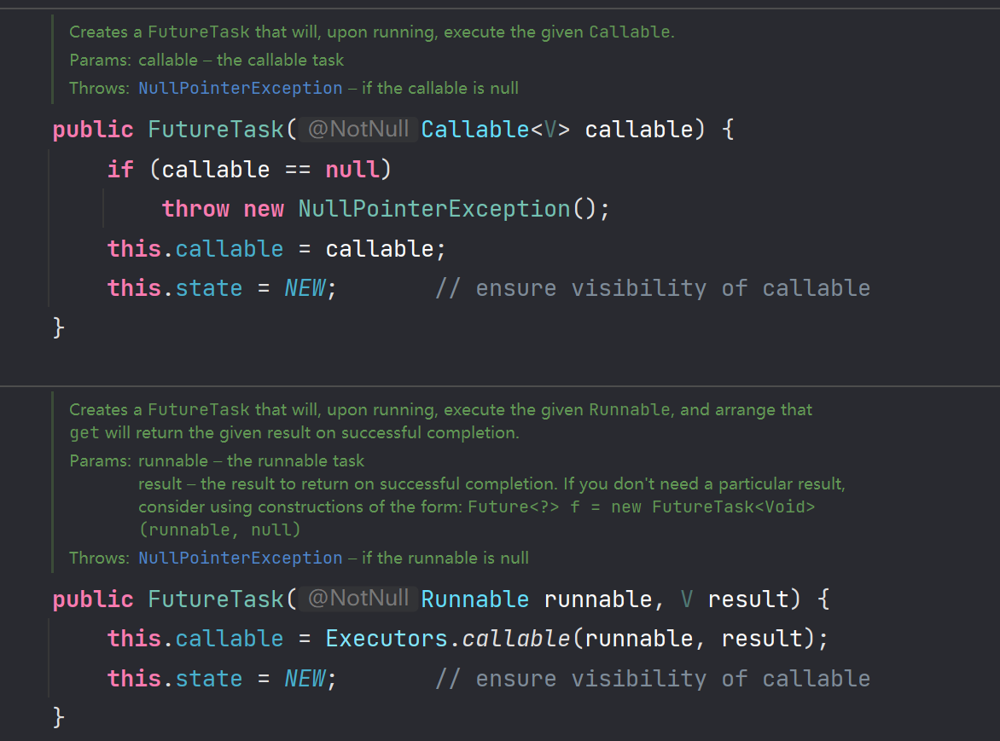
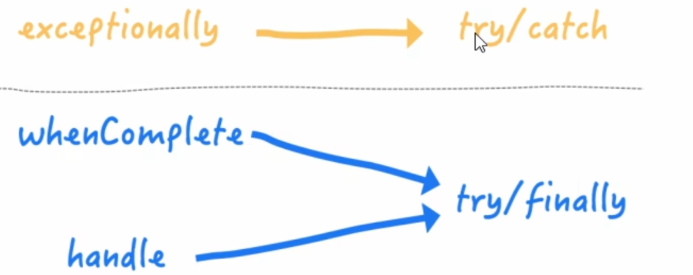
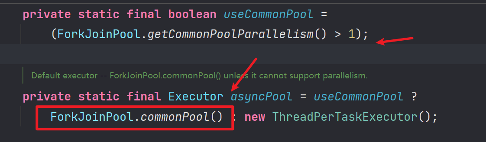

# CompletableFuture

## Future 接口

- Future 接口 (FutureTask 实现类) 定义了操作异步任务执行的一些方法，如获取异步任务的执行结果，取消任务的执行，判断任务是否被取消，判断任务是否执行完毕等。
- 比如主线程让一个子线程取执行任务，子线程可能比较耗时，启动子线程开始执行任务后，主线程就去做其他的事情了，忙其他事情或者先执行完毕，过了一会才去获取子任务的执行结果或者变更的任务状态。
- 一句话：Future 接口可以为主线程开一个分支任务，专门为主线程处理耗时和费力的复杂业务。



## FutureTask 实现类

### Future 接口能干什么

- Future 是 java5 新加的一个接口，它提供了一种异步并行计算的功能。
- 如果主线程需要执行一个很耗时的计算任务，我们就可以通过 Future 吧这个任务放到异步线程中执行。
- 主线程进行处理其他任务或者先行接收，再通过 Future 获取计算结果。
- 目的：异步多线程任务执行且返回结果，三个特点：`多线程，有返回，同步任务`。(班长为老师取买水作为新启动的异步线程任务且买到水有结果返回)

### FutureTask 继承关系



> 在源码中可以看到，FutureTask 既继承了 RunnableFuture 接口，也在构造方法中实现了 Callable 接口和 Runnable 接口（需要传入实现的类作为构造函数的参数）





### 代码演示

```java
public class CompletableFutureDemo {
    public static void main(String[] args) throws ExecutionException, InterruptedException {
        FutureTask<String> futureTask = new FutureTask<>(new MyThread());

        Thread t1 = new Thread(futureTask, "t1");
        t1.start();

        System.out.println(futureTask.get());
    }
}

class MyThread implements Callable<String> {
    @Override
    public String call() throws Exception {
        System.out.println("-----come in call() ");
        return "hello Callable";
    }
}
```

### Future 编码实战

> `Futrue + 线程池`异步多线程任务配合，能显著的提高城乡的执行效率

```java
//示例 1:3 个任务，1 个 main 线程处理，大概耗时 1140 毫秒
public class FutureThreadPoolDemo {
    public static void main(String[] args) {
        m1();
    }
    public static void m1(){
        //3 个任务，只有一个 main 线程执行，耗时多少？
        long startTime = System.currentTimeMillis();
        //暂停毫秒
        try {
            TimeUnit.MILLISECONDS.sleep(500);
        } catch (InterruptedException e) {
            e.printStackTrace();
        }
        try {
            TimeUnit.MILLISECONDS.sleep(300);
        } catch (InterruptedException e) {
            e.printStackTrace();
        }
        try {
            TimeUnit.MILLISECONDS.sleep(300);
        } catch (InterruptedException e) {
            e.printStackTrace();
        }
        long endTime = System.currentTimeMillis();
        System.out.println("相差时间："+ (endTime - startTime) + "毫秒");
        System.out.println(Thread.currentThread().getName()+"线程\t...end");
    }
}
```

```java
//3 个任务 3 个线程，利用线程池（假如每次 new 一个 Thread，太浪费资源），大概 902 毫秒。
public class FutureThreadPoolDemo {
    public static void main(String[] args) throws ExecutionException, InterruptedException {
        //3 个任务，目前开启多个异步任务线程来处理，请问耗时多少？
        ExecutorService threadPool = Executors.newFixedThreadPool(3);

        long startTime = System.currentTimeMillis();

        FutureTask<String> futureTask1 = new FutureTask<String>(() -> {
            try {
                TimeUnit.MILLISECONDS.sleep(500);
            } catch (InterruptedException e) {
                e.printStackTrace();
            }
            return "task1 over";
        });
        threadPool.submit(futureTask1);

        FutureTask<String> futureTask2 = new FutureTask<String>(() -> {
            try {
                TimeUnit.MILLISECONDS.sleep(300);
            } catch (InterruptedException e) {
                e.printStackTrace();
            }
            return "task2 over";
        });
        threadPool.submit(futureTask2);

        System.out.println(futureTask1.get()); //1000
        System.out.println(futureTask2.get()); //300

        try {
            TimeUnit.MILLISECONDS.sleep(300);
        } catch (InterruptedException e) {
            e.printStackTrace();
        }

        long endTime = System.currentTimeMillis();
        System.out.println("----costTime: " + (endTime - startTime) + " 毫秒");

        System.out.println(Thread.currentThread().getName() + "\t -----end");
        threadPool.shutdown();
    }
}
```

### Future 缺点

- `get()方法阻塞`
- `isDone()轮询`
  - 利用`if(futureTask.isDone())`的方式使得 FutureTask 在结束之后才 get(),但是也会消耗 cpu

```java
public class FutureAPIDemo {
    public static void main(String[] args) throws ExecutionException, InterruptedException, TimeoutException {
        FutureTask<String> futureTask = new FutureTask<String>(() -> {
            System.out.println(Thread.currentThread().getName() + "\t -----come in");
            try {
                TimeUnit.SECONDS.sleep(5);
            } catch (InterruptedException e) {
                e.printStackTrace();
            }
            return "task over";
        });
        Thread t1 = new Thread(futureTask, "t1");
        t1.start();

        System.out.println(Thread.currentThread().getName() + "\t ----忙其它任务了");

        //System.out.println(futureTask.get());
        //System.out.println(futureTask.get(3,TimeUnit.SECONDS));

        while (true) {
            if (futureTask.isDone()) {
                System.out.println(futureTask.get());
                break;
            } else {
                //暂停毫秒
                try {
                    TimeUnit.MILLISECONDS.sleep(500);
                } catch (InterruptedException e) {
                    e.printStackTrace();
                }
                System.out.println("正在处理中，不要再催了，越催越慢，再催熄火");
            }
        }
    }
}

/**
 *1 get 容易导致阻塞，一般建议放在程序后面，一旦调用不见不散，非要等到结果才会离开，不管你是否计算完成，容易程序堵塞。
 *2 假如我不愿意等待很长时间，我希望过时不候，可以自动离开.
 */
```

### Future 优缺点分析

- Future 对于结果的获取不是很友好，只能通过阻塞或者轮询的方式的到结果
- 对于简单的业务场景使用 Future 完全可以
- 应对 Future 的完成时间，完成了可以告诉我们，也就是我们的回调通知，通过轮询的方式去判断是否完成这样非常占 CPU 并且代码也不优雅
- 创建异步任务：使用 `Future + 线程池` 配合使用
- 多个任务前后依赖可以组合处理 (水煮鱼): 想将多个异步任务的计算结果组合起来，后一个异步任务的计算结果需要前一个异步任务的值，将两个或多个异步计算合成一个异步计算，这几个异步计算相互独立，同时后面这个又依赖前一个处理的结果 (比如买鱼 - 加料 - 烹饪)
- 对计算速度选最快完成的（并返回结果）：当 Future 集合中某个任务最快结束时，返回结果，返回第一名处理结果

## CompletableFuture 对 Future 改进

- get() 方法在 Future 计算完成之前会一直处在阻塞状态下，isDone() 方法容易耗费 CPU 资源。

- 对于真正的异步处理我们希望是可以通过传入回调函数，在 Futrue 结束时自动调用该回调函数，这样，我们就不用等待结果。

- 阻塞的方式和异步编程的涉及理念相违背，而轮询的方式会耗费无谓的 CPU 资源，因此，JDK8 设计出 CompletableFuture

- CompletableFuture 提供了一种观察者模式类的机制，可以让任务执行完成后通知监听的一方。

- 在 Java 8 中，CompletableFuture 提供了非常强大的 Future 的扩展功能，可以帮助我们简化异步编程的复杂性，并且提供了函数式编程的能力，可以通过回调的方式处理计算结果，也提供了转换和组合 CompletableFuture 的方法

- 它可能代表一个明确完成的 Future，也有可能代表一个完成阶段 (Completion Stage) ，它支持在计算完成以后触发一些函数或执行某些动作。

```java
public class CompletableFuture<T> implements Future<T>, CompletionStage<T> {}
```

### CompletionStage

- CompletionStage 代表异步计算过程中的某一个阶段，一个阶段完成以后可能会触发另外一个阶段。
- 一个阶段的计算执行可以是一个 Function,Consumer 或者 Runnable，比如：`stage.thenApply(x - >square(x)).thenAccept(x -> System.out.print(x)).thenRun(() -> System.out.println())`

- 一个阶段的执行可能是被单个阶段的完成触发，也可能是由多个阶段一起触发。
- 代表异步计算过程中的某一个阶段，一个阶段完成以后可能会触发另外一个阶段，有些类似 Linux 系统的管道分隔符传参数。

### 核心的四个静态方法

- 利用核心的四个静态方法创建一个异步操作，不建议直接 new
- 关键就是有没有返回值，是否用了线程池
- 参数说明：
  - 没有指定 Executor 的方法，直接使用默认的 `ForkJoinPool.commPool()` 作为它的线程池执行异步代码
  - 如果指定线程池，则使用我们定义的或者特别指定的线程池执行异步代码

#### runAsync 无返回值

```java
public static CompletableFuture<Void> runAsync(Runnable runnable) {
    return asyncRunStage(asyncPool, runnable);
}
```

```java
public static CompletableFuture<Void> runAsync(Runnable runnable, Executor executor) {
     return asyncRunStage(screenExecutor(executor), runnable);
}
```

#### supplyAsync 有返回值

```java
public static <U> CompletableFuture<U> supplyAsync(Supplier<U> supplier) {
    return asyncSupplyStage(asyncPool, supplier);
}
```

```java
public static <U> CompletableFuture<U> supplyAsync(Supplier<U> supplier,Executor executor) {
    return asyncSupplyStage(screenExecutor(executor), supplier);
}
```

> 上线方法中 Executor executor 参数说明：
>
> - 如果没有指定 Executor 的方法，直接使用默认的 `ForkJoinPool.commonPool()` 作为它的线程池执行异步代码
> - 如果指定线程池，则使用我们自定义的或者特别指定的线程池执行异步代码

### CompletableFuture 基本演示

#### runAsync

```java
public class CompletableFutureBuildDemo {
    public static void main(String[] args) throws ExecutionException, InterruptedException {
        CompletableFuture<Void> completableFuture= CompletableFuture.runAsync(() -> {
            System.out.println(Thread.currentThread().getName());
            //停顿几秒线程
            try {
                TimeUnit.SECONDS.sleep(1);
            } catch (InterruptedException e) {
                e.printStackTrace();
            }
        });
        System.out.println(completableFuture.get());
    }
}
//ForkJoinPool.commonPool-worker-9 //默认的线程池
//null --- 没有返回值
```

#### runAsync + 线程池

```java
public class CompletableFutureBuildDemo {
    public static void main(String[] args) throws ExecutionException, InterruptedException {
        ExecutorService threadPool = Executors.newFixedThreadPool(3);
        CompletableFuture<Void> completableFuture = CompletableFuture.runAsync(() -> {
            System.out.println(Thread.currentThread().getName());
            //暂停几秒钟线程
            try {
                TimeUnit.SECONDS.sleep(1);
            } catch (InterruptedException e) {
                e.printStackTrace();
            }
        }, threadPool);
        System.out.println(completableFuture.get());
    }
}

```

#### supplyAsync + 线程池

```java
public class CompletableFutureBuildDemo {

    public static void main(String[] args) throws ExecutionException, InterruptedException {

        ExecutorService executorService = Executors.newFixedThreadPool(3);//加入线程池

        CompletableFuture<String> completableFuture = CompletableFuture.supplyAsync(()->{
            System.out.println(Thread.currentThread().getName());
            try {
                TimeUnit.SECONDS.sleep(1);
            } catch (InterruptedException e) {
                e.printStackTrace();
            }
            return "helllo supplyasync";
        });
        System.out.println(completableFuture.get());
    }
    //ForkJoinPool.commonPool-worker-9---------默认的线程池
    //helllo supplyasync-------------supplyasync 有返回值了
}
```

### CompletableFuture 进阶演示

- 从 Java8 开始引入了 CompletableFuture，`它是Future的功能增强版,减少阻塞和轮询`，可以传入回调对象，当异步任务完成或者发生异常时，自动调用回调对象的回调方法。
- 解释下为什么默认线程池关闭，自定义线程池记得关闭（默认线程池是守护线程，随着 main 主线程关闭而关闭，自定义线程池是用户线程）

#### 阻塞演示

`CompletableFuture 完成与 Future 相同的功能，但是使用 get() 依然阻塞`

```java
public class CompletableFutureUseDemo {

    public static void main(String[] args) throws ExecutionException, InterruptedException {
        future1();
    }
    private static void future1() throws ExecutionException, InterruptedException {
        CompletableFuture<Integer> completableFuture = CompletableFuture.supplyAsync(() -> {
            System.out.println(Thread.currentThread().getName() + "...come in");
            int result = ThreadLocalRandom.current().nextInt(10);
            try {
                TimeUnit.SECONDS.sleep(1);
            } catch (InterruptedException e) {
                e.printStackTrace();
            }
            System.out.println("1 秒钟后出结果：" + result);
            return result;
        });
        System.out.println(Thread.currentThread().getName()+"线程先去忙其他任务！");
        System.out.println(completableFuture.get());
    }
}
```

#### 异步非阻塞演示

`CompletableFuture 非阻塞演示`

```java
public class CompletableFutureUseDemo {
    public static void main(String[] args) throws ExecutionException, InterruptedException {
        ExecutorService threadPool = Executors.newFixedThreadPool(3);
        try {
            CompletableFuture.supplyAsync(() -> {
                System.out.println(Thread.currentThread().getName() + "----come in");
                int result = ThreadLocalRandom.current().nextInt(10);
                try {
                    TimeUnit.SECONDS.sleep(1);
                } catch (InterruptedException e) {
                    e.printStackTrace();
                }
                System.out.println("-----1 秒钟后出结果：" + result);
                if (result > 2) {
                    int i = 10 / 0;
                }
                return result;
            }, threadPool).whenComplete((v, e) -> {
                if (e == null) {
                    System.out.println("-----计算完成，更新系统 UpdateValue：" + v);
                }
            }).exceptionally(e -> {
                e.printStackTrace();
                System.out.println("异常情况：" + e.getCause() + "\t" + e.getMessage());
                return null;
            });
            System.out.println(Thread.currentThread().getName() + "线程先去忙其它任务");
        } catch (Exception e) {
            e.printStackTrace();
        } finally {
            threadPool.shutdown();
        }

        //主线程不要立刻结束，否则 CompletableFuture 默认使用的线程池会立刻关闭：暂停 3 秒钟线程
        //try { TimeUnit.SECONDS.sleep(3); } catch (InterruptedException e) { e.printStackTrace(); }
    }
}
```

### CompletableFuture 优点总结

- 异步任务结束时，会`自动回调`某个对象的方法；
- 主线程设置好回调后，不再关心异步任务的执行，异步任务之间可以顺序执行
- 异步任务出错时，会自动回调某个对象的方法

## 案例精讲 - 从电商网站的比价需求说开去

### 复习 - 函数式接口

>任何接口，如果只包含唯一一个抽象方法，那么它就是一个函数式接口，对于函数式接口，我们可以通过 lambda 表达式来创建该接口的对象

- `Runnable`

```java
@FunctionalInterface
public interface Runnable {
    public abstract void run();
}
```

- `Function`

```java
@FunctionalInterface
public interface Function<T, R> {
    R apply(T t);
}
```

- `Supplier`

```java
@FunctionalInterface
public interface Supplier<T> {
    T get();
}
```

- `Biconsumer(Bi代表两个的意思，我们要传入两个参数，在上面的案例中是v和e)`

```java
@FunctionalInterface
public interface BiConsumer<T, U> {
    void accept(T t, U u);
}
```

| 函数式接口名称 | 方法名称 | 参数     | 返回值   |
| -------------- | -------- | -------- | -------- |
| Runnable       | run      | 无参数   | 无返回值 |
| Function       | apply    | 1 个参数 | 有返回值 |
| Consume        | accept   | 1 个参数 | 无返回值 |
| Supplier       | get      | 没有参数 | 有返回值 |
| Biconsumer     | accept   | 2 个参数 | 无返回值 |

### 复习 - 链式调用写法

```java
public class Chain {
    public static void main(String[] args) {
        //-------------------老式写法------------
        //Student student = new Student();
        //student.setId(1);
        //student.setMajor("cs");
        //student.setName("小卡");
        new Student().setId(1).setName("大卡").setMajor("cs");
    } 
}

@NoArgsConstructor
@AllArgsConstructor
@Data
@Accessors(chain = true)//开启链式编程
class Student{
    private int id;
    private String name;
    private String major;
}
```

### 复习-join 和 get 对比

join 和 get 功能几乎一样，区别在于编码时是否需要抛出异常

- `get()`方法需要抛出异常
- `join()`方法不需要抛出异常

```java
public class Chain {
    public static void main(String[] args) throws ExecutionException, InterruptedException {//抛出异常
        CompletableFuture<String> completableFuture = CompletableFuture.supplyAsync(() -> {
            return "hello 12345";
        });
        System.out.println(completableFuture.get());
    }
}

public class Chain {
    public static void main(String[] args)  {//抛出异常
        CompletableFuture<String> completableFuture = CompletableFuture.supplyAsync(() -> {
            return "hello 12345";
        });
        System.out.println(completableFuture.join());
    }
}
```

### 比价需求说明

```java
实战精讲-比价网站
1 需求说明
1.1 同一款产品，同时搜索出同款产品在各大电商平台的售价；
1.2 同一款产品，同时搜索出本产品在同一个电商平台下，各个入驻卖家售价是多少

2 输出返回：
出来结果希望是同款产品的在不同地方的价格清单列表，返回一个List<String>
《mysql》in jd price is 88.05
《mysql》in dang dang price is 86.11
《mysql》in tao bao price is 90.43

3 解决方案，比对同一个商品在各个平台上的价格，要求获得一个清单列表
1   stepbystep，按部就班，查完京东查淘宝，查完淘宝查天猫......
2   all in，万箭齐发，一口气多线程异步任务同时查询......
```

### 代码演示

```java
/**
 *
 * 案例说明：电商比价需求，模拟如下情况：
 *
 * 1 需求：
 *  1.1 同一款产品，同时搜索出同款产品在各大电商平台的售价;
 *  1.2 同一款产品，同时搜索出本产品在同一个电商平台下，各个入驻卖家售价是多少
 *
 * 2 输出：出来结果希望是同款产品的在不同地方的价格清单列表，返回一个 List<String>
 * 《mysql》 in jd price is 88.05
 * 《mysql》 in dangdang price is 86.11
 * 《mysql》 in taobao price is 90.43
 *
 * 3 技术要求
 *   3.1 函数式编程
 *   3.2 链式编程
 *   3.3 Stream 流式计算
 */
public class CompletableFutureMallDemo {
    static List<NetMall> list = Arrays.asList(
            new NetMall("jd"),
            new NetMall("dangdang"),
            new NetMall("taobao"),
            new NetMall("pdd"),
            new NetMall("tmall")
    );

    /**
     * step by step 一家家搜查
     * List<NetMall> ----->map------> List<String>
     * @param list
     * @param productName
     * @return
     */
    public static List<String> getPrice(List<NetMall> list, String productName) {
        //《mysql》 in taobao price is 90.43
        return list
                .stream()
                .map(netMall ->
                        // 格式是 商品 in 网店 is 保留两位数
                        String.format(productName + " in %s price is %.2f",
                                netMall.getNetMallName(),
                                netMall.calcPrice(productName)))
                .collect(Collectors.toList());
    }

    /**
     * List<NetMall> ----->List<CompletableFuture<String>>------> List<String>
     * @param list
     * @param productName
     * @return
     */
    public static List<String> getPriceByCompletableFuture(List<NetMall> list, String productName) {
        return list
                .stream()
                .map(netMall ->
                        CompletableFuture.supplyAsync(() -> String.format(productName + " in %s price is %.2f",
                                netMall.getNetMallName(),
                                netMall.calcPrice(productName))))
                .collect(Collectors.toList())
                .stream()
                .map(s -> s.join())
                .collect(Collectors.toList());
    }


    public static void main(String[] args) {
        //System.out.println(ThreadLocalRandom.current().nextDouble() * 2 + "mysql".charAt(0));
        //System.out.println(ThreadLocalRandom.current().nextDouble()); // [0,1]
        //System.out.println(ThreadLocalRandom.current().nextDouble() * 2);
        //System.out.println("mysql".charAt(0));
        //System.out.println(1 + "aysql".charAt(0));

        long startTime = System.currentTimeMillis();
        List<String> list1 = getPrice(list, "mysql");
        for (String element : list1) {
            System.out.println(element);
        }
        long endTime = System.currentTimeMillis();
        System.out.println("----costTime: " + (endTime - startTime) + " 毫秒");

        System.out.println("--------------------");

        long startTime2 = System.currentTimeMillis();
        List<String> list2 = getPriceByCompletableFuture(list, "mysql");
        for (String element : list2) {
            System.out.println(element);
        }
        long endTime2 = System.currentTimeMillis();
        System.out.println("----costTime: " + (endTime2 - startTime2) + " 毫秒");

    }
}

class NetMall {
    @Getter
    private String netMallName;

    public NetMall(String netMallName) {
        this.netMallName = netMallName;
    }

    public double calcPrice(String productName) {
        try {
            TimeUnit.SECONDS.sleep(1);
        } catch (InterruptedException e) {
            e.printStackTrace();
        }

        // 109.4065199644881 模拟了一个价格，整数位和小数位相加
        return ThreadLocalRandom.current().nextDouble() * 2 + productName.charAt(0);
    }
}
```

```java
mysql in jd price is 110.29
mysql in dangdang price is 110.83
mysql in taobao price is 109.14
mysql in pdd price is 110.87
mysql in tmall price is 110.15
----costTime: 5134 毫秒
--------------------
mysql in jd price is 110.15
mysql in dangdang price is 109.70
mysql in taobao price is 109.07
mysql in pdd price is 110.63
mysql in tmall price is 110.99
----costTime: 1022 毫秒
```

## CompletableFuture 常用方法

### 获得结果和触发计算

#### 获得结果

```java
public T get() 不见不散
public T get(long timeout,TimeUnit unit) 过时不候
public T join()
public T getNow(T valuelfAbsent)
```

#### `get`

#### `join`

#### `getNow`

- 没有计算完成的情况下，直接返回设定的 valuelfAbsent 值
- 计算完成的情况下，返回计算完成后的结果

#### 主动触发计算

```java
public bgolean complete(T value)
```

#### `complete`

- 没有计算完成的情况下，打断 get 方法立即返回括号值
- 计算完成的情况下，返回计算完成后的结果

```java
public class CompletableFutureAPIDemo {
    public static void main(String[] args) throws ExecutionException, InterruptedException {
        group1();
    }

    /**
     * 获得结果和触发计算
     * @throws InterruptedException
     * @throws ExecutionException
     */
    private static void group1() throws InterruptedException, ExecutionException {
        CompletableFuture<String> completableFuture = CompletableFuture.supplyAsync(() -> {
            //暂停几秒钟线程
            try {
                TimeUnit.SECONDS.sleep(2);
            } catch (InterruptedException e) {
                e.printStackTrace();
            }
            return "abc";
        });

        //System.out.println(completableFuture.get());
        //System.out.println(completableFuture.get(2L,TimeUnit.SECONDS));
        //System.out.println(completableFuture.join());

        //暂停几秒钟线程
        try {
            TimeUnit.SECONDS.sleep(1);
        } catch (InterruptedException e) {
            e.printStackTrace();
        }

        System.out.println(completableFuture.getNow("xxx"));
        //System.out.println(completableFuture.complete("completeValue") + "\t" + completableFuture.get());
    }
}
```

### 对计算结果进行处理

#### `thenApply`

- 计算结果存在依赖关系，将这两个线程串行化
- 异常相关：由于存在依赖关系 (当前步错，不走下一步)，当前步骤有异常的话就叫停
- 发生异常后进入 exceptionally 代码块，**但是 thenApply 中的代码不会执行，whenComplete 依旧会执行**

```java
public class CompletableFutureAPI2Demo {
    public static void main(String[] args) {
        group1();
    }

    private static void group1() {
        ExecutorService threadPool = Executors.newFixedThreadPool(3);

        CompletableFuture<Integer> completableFuture = CompletableFuture.supplyAsync(() -> {
            //暂停几秒钟线程
            try {
                TimeUnit.SECONDS.sleep(1);
            } catch (InterruptedException e) {
                e.printStackTrace();
            }
            System.out.println("111");
            return 1;
        }, threadPool).thenApply((f) -> {
            int i = 10 / 0;
            System.out.println("222");
            return f + 2;
        }).thenApply((f) -> {
            System.out.println("333");
            return f + 3;
        }).whenComplete((v, e) -> {
            System.out.println("444");
            if (e == null) {
                System.out.println("----计算结果： " + v);
            }
        }).exceptionally(e -> {
            e.printStackTrace();
            System.out.println(e.getMessage());
            return null;
        });

        System.out.println(Thread.currentThread().getName() + "----主线程先去忙其它任务");
        System.out.println(completableFuture.join());

        threadPool.shutdown();
    }
}

//main----主线程先去忙其它任务
//111
//444
//java.lang.ArithmeticException: / by zero
//null
//java.util.concurrent.CompletionException: java.lang.ArithmeticException: / by zero
```

#### `handle`

- 计算结果存在依赖关系，这两个线程串行化
- 异常相关：有异常也可以往下一步走，根据带的异常参数可以进一步处理
- 发生异常后进入 exceptionally 代码块，**但是 handle 和 whenComplete 依旧会执行**

```java
public class CompletableFutureAPI2Demo {
    public static void main(String[] args) {
        group2();
    }

    private static void group2() {
        ExecutorService threadPool = Executors.newFixedThreadPool(3);

        CompletableFuture<Integer> completableFuture = CompletableFuture.supplyAsync(() -> {
            //暂停几秒钟线程
            try {
                TimeUnit.SECONDS.sleep(1);
            } catch (InterruptedException e) {
                e.printStackTrace();
            }
            System.out.println("111");
            return 1;
        }, threadPool).handle((f, e) -> {
            int i = 10 / 0;
            System.out.println("222");
            return f + 2;
        }).handle((f, e) -> {
            System.out.println("333");
            return f + 3;
        }).whenComplete((v, e) -> {
            System.out.println("444");
            if (e == null) {
                System.out.println("----计算结果： " + v);
            }
        }).exceptionally(e -> {
            e.printStackTrace();
            System.out.println(e.getMessage());
            return null;
        });

        System.out.println(Thread.currentThread().getName() + "----主线程先去忙其它任务");
        System.out.println(completableFuture.join());

        threadPool.shutdown();
    }
}

//main----主线程先去忙其它任务
//111
//333
//444
//java.lang.NullPointerException
//null
//java.util.concurrent.CompletionException: java.lang.NullPointerException
```



### 对计算结果进行消费

#### `thenAccept`

- 接收任务的处理结果，并消费处理，无返回结果

```
public class CompletableFutureAPI3Demo {
    public static void main(String[] args) {
        CompletableFuture<Void> completableFuture = CompletableFuture.supplyAsync(() -> {
            return 1;
        }).thenApply(f -> {
            return f + 2;
        }).thenApply(f -> {
            return f + 3;
        }).thenAccept(System.out::println);

        System.out.println(completableFuture.join());

        //System.out.println(CompletableFuture.supplyAsync(() -> "resultA").thenRun(() -> {}).join());
        //System.out.println(CompletableFuture.supplyAsync(() -> "resultA").thenAccept(r -> System.out.println(r)).join());
        //System.out.println(CompletableFuture.supplyAsync(() -> "resultA").thenApply(r -> r + "resultB").join());

    }
}

//6
//null
```

#### Code 任务之间的顺底执行

- thenRun(Runnable runnable)
  - 任务 A 执行完执行 B，并且 B 不需要 A 的结果
- thenAccept(Consumer action)
  - 任务 A 执行完执行 B，B 需要 A 的结果，但是任务 B 无返回值
- thenApply(Function fn)
  - 任务 A 执行完执行 B，B 需要 A 的结果，同时任务 B 有返回值

```java
public class CompletableFutureAPI3Demo {
    public static void main(String[] args) {
        //CompletableFuture<Void> completableFuture = CompletableFuture.supplyAsync(() -> {
        //    return 1;
        //}).thenApply(f -> {
        //    return f + 2;
        //}).thenApply(f -> {
        //    return f + 3;
        //}).thenAccept(System.out::println);

        //System.out.println(completableFuture.join());

        System.out.println(CompletableFuture.supplyAsync(() -> "resultA").thenRun(() -> {}).join());
        System.out.println(CompletableFuture.supplyAsync(() -> "resultA").thenAccept(r -> System.out.println(r)).join());
        System.out.println(CompletableFuture.supplyAsync(() -> "resultA").thenApply(r -> r + "resultB").join());

    }
}

//null
//resultA
//null
//resultAresultB
```

#### CompletableFuture 和线程池说明

```java
public class CompletableFutureWithThreadPoolDemo {
    public static void main(String[] args) {
        ExecutorService threadPool = Executors.newFixedThreadPool(5);

        try {
            CompletableFuture<Void> completableFuture = CompletableFuture.supplyAsync(() -> {
                try {
                    TimeUnit.MILLISECONDS.sleep(20);
                } catch (InterruptedException e) {
                    e.printStackTrace();
                }
                System.out.println("1 号任务" + "\t" + Thread.currentThread().getName());
                return "abcd";
            }, threadPool).thenRunAsync(() -> {
                try {
                    TimeUnit.MILLISECONDS.sleep(20);
                } catch (InterruptedException e) {
                    e.printStackTrace();
                }
                System.out.println("2 号任务" + "\t" + Thread.currentThread().getName());
            }).thenRun(() -> {
                try {
                    TimeUnit.MILLISECONDS.sleep(10);
                } catch (InterruptedException e) {
                    e.printStackTrace();
                }
                System.out.println("3 号任务" + "\t" + Thread.currentThread().getName());
            }).thenRun(() -> {
                try {
                    TimeUnit.MILLISECONDS.sleep(10);
                } catch (InterruptedException e) {
                    e.printStackTrace();
                }
                System.out.println("4 号任务" + "\t" + Thread.currentThread().getName());
            });
            System.out.println(completableFuture.get(2L, TimeUnit.SECONDS));
        } catch (Exception e) {
            e.printStackTrace();
        } finally {
            threadPool.shutdown();
        }
    }
}

//1 号任务	pool-1-thread-1
//2 号任务	ForkJoinPool.commonPool-worker-25
//3 号任务	ForkJoinPool.commonPool-worker-25
//4 号任务	ForkJoinPool.commonPool-worker-25
//null
```

以 thenRun 和 thenRunAsync 为例，有什么区别？

- 没有传入自定义线程池，都用默认线程池 ForkJoinPool;

- 传入了一个自定义线程池，
- 如果你执行第一个任务的时候，传入了一个自定义线程池：
- 调用 thenRun 方法执行第二个任务时，则第二个任务和第一个任务是共用同一个线程池。
- 调用 thenRunAsync 执行第二个任务时，则第一个任务使用的是你自己传入的线程池，第二个任务使用的是 ForkJoin 线程池

有可能处理太快，系统优化切换原则，直接使用 main 线程处理
其它如：thenAccept 和 thenAcceptAsync，thenApply 和 thenApplyAsync 等，它们之间的区别也是同理

```java
public CompletableFuture<Void> thenRunAsync(Runnable action) {
    return uniRunStage(asyncPool, action);
}
```

`asyncPool`



### 对计算速度进行选用

#### `applyToEither` 

比较异步线程谁快并且就使用谁

```java
public class CompletableFutureFastDemo {
    public static void main(String[] args) {
        CompletableFuture<String> playA = CompletableFuture.supplyAsync(() -> {
            System.out.println("A come in");
            try {
                TimeUnit.SECONDS.sleep(3);
            } catch (InterruptedException e) {
                e.printStackTrace();
            }
            return "playA";
        });

        CompletableFuture<String> playB = CompletableFuture.supplyAsync(() -> {
            System.out.println("B come in");
            try {
                TimeUnit.SECONDS.sleep(1);
            } catch (InterruptedException e) {
                e.printStackTrace();
            }
            return "playB";
        });

        CompletableFuture<String> result = playA.applyToEither(playB, f -> {
            return f + " is winer";
        });

        System.out.println(Thread.currentThread().getName() + "\t" + "-----: " + result.join());
    }
}

//A come in
//B come in
//main	-----: playB is winer
```

### 对计算结果进行合并

#### `thenCombine`

两个 completionStage 任务都完成后，最终能把两个任务的结果一起交给 thenCombine 来处理。先完成的先等着，等待其它分支任务

```java
public class CompletableFutureCombineDemo {
    public static void main(String[] args) {
        CompletableFuture<Integer> completableFuture1 = CompletableFuture.supplyAsync(() -> {
            System.out.println(Thread.currentThread().getName() + "\t ---启动");
            //暂停几秒钟线程
            try {
                TimeUnit.SECONDS.sleep(1);
            } catch (InterruptedException e) {
                e.printStackTrace();
            }
            return 10;
        });

        CompletableFuture<Integer> completableFuture2 = CompletableFuture.supplyAsync(() -> {
            System.out.println(Thread.currentThread().getName() + "\t ---启动");
            //暂停几秒钟线程
            try {
                TimeUnit.SECONDS.sleep(2);
            } catch (InterruptedException e) {
                e.printStackTrace();
            }
            return 20;
        });

        CompletableFuture<Integer> result = completableFuture1.thenCombine(completableFuture2, (x, y) -> {
            System.out.println("-----开始两个结果合并");
            return x + y;
        });

        System.out.println(result.join());

    }
}

//ForkJoinPool.commonPool-worker-25	 ---启动
//ForkJoinPool.commonPool-worker-18	 ---启动
//-----开始两个结果合并
//30
```

