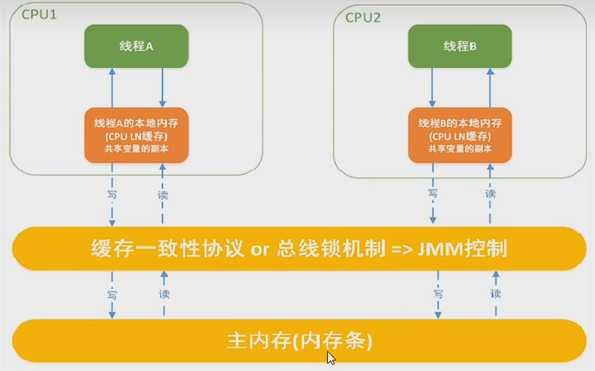

# Java 内存模型 JMM

###  JAVA 内存模型（JMM）

CPU 的运行并不是直接操作内存而是先把内存里边的数据读到缓存，而内存的读和写操作的时候就会造成不一致的问题。

JVM 规范中试图定义一种 Java 内存模型 (java Memory Model，简称 JMM) 来屏蔽掉各种硬件和操作系统的内存访问差异，以实现让 Java 程序在各种平台下都能达到一致的内存访问效果。

JMM(Java 内存模型 Java Memory Model，简称 JMM) 本身是一种抽象的概念并不真实存在它仅仅描述的是一组约定或规范，通过这组规范定义了程序中 (尤其是多线程) 各个变量的读写访问方式并决定一个线程对共享变量的写入何时以及如何变成对另一个线程可见，关键技术点都是围绕多线程的原子性、可见性和有序性展开的。

**作用：**

通过 JMM 来实现线程和主内存之间的抽象关系。屏蔽各个硬件平台和操作系统的内存访问差异以实现让 Java 程序在各种平台下都能达到一致的内存访问效果。

#### 三大特性

**可见性**

是指当一个线程修改了某一个共享变量的值，其他线程是否能够立即知道该变更，JMM 规定了所有的变量都存储在主内存中。

**原子性**

指一个操作是不可打断的，即多线程环境下，操作不能被其他线程干扰。

**有序性**

指令重排

JVM 能根据处理器特性 (CPU 多 级缓存系统、多核处理器等) 适当的对机器指令进行重排序，使机器指令能更符合 CPU 的执行特性，最大限度的发挥机器性能。但是，指令重排可以保证串行语义一致，但没有义务保证多线程间的语义也一致 (即可能产生"脏读")，简单说，两行以上不相干的代码在执行的时候有可能先执行的不是第一条，不见得是从上到下顺序执行，执行顺序会被优化。

#### 多线程对变量的读写过程

(读取赋值等) 必须在工作内存中进行，首先要将变量从主内存拷贝到的线程自己的工作内存空间，然后对变量进行操作，操作完成后再将变量写回主内存，不能直接操作主内存中的变量，各个线程中的工作内存中存储着主内存中的变量副本拷贝，因此不同的线程间无法访问对方的工作内存，线程间的通信 (传值) 必须通过主内存来完成，其简要访问过程如下图：

#### 先行发生原则

**happens-before**

在 JMM 中，如果一个操作执行的结果需要对另一个操作可见性或者代码重排序，那么这两个操作之间必须存在 happens-before(先行发生) 原则。

如果一个操作 happens-before 另一个操作，那么第一个操作的执行结果将对第二个操作可见，而且第一个操作的执行顺序排在第二个操作之前。两个操作之间存在 happens-before 关系，并不意味着一定要按照 happens-before 原则制定的顺序来执行。如果重排序之后的执行结果与按照 happens-before 关系来执行的结果一致，那么这种重排序并不非法。

**八条**

- 次序规则

  前一个操作的结果可以被后续的操作获取。讲白点就是前面一个操作把变量 X 赋值为 1，那后面一个操作肯定能知道 X 已经变成了 1。

- 锁定规则

  一个 unLock 操作先行发生于后面 (这里的“后面”是指时间上的先后) 对同一个锁的 Iock 操作。

- volatile 变量规则

  对一个 volatile 变量的写操作先行发生于后面对这个变量的读操作，前面的写对后面的读是可见的，这里的”后面"同样是指时间上的先后。

- 传递规则

  如果操作 A 先行发生于操作 B，而操作 B 又先行发生于操作 C，则可以得出操作 A 先行发生于操作 C;

- 线程启动规则（Thread Start Rule）

  Thread 对象的 start() 方法先行发生于此线程的每一个动作

- 线程中断规则 (Thread Interruption Rule)

  对线程 interrupt() 方法的调用先行发生于被中断线程的代码检测到中断事件的发生 可以通过 Thread.interrupted() 检测到是否发生中断 也就是说你要先调用 interrupt() 方法设置过中断标志位，我才能检测到中断发送。

- 线程终止规则 (Thread Termination Rule)

  线程中的所有操作都先行发生于对此线程的终止检测，我们可以通过 isAlive() 等手段检测线程是否已经终止执行。

- 对象终结规则 (Finalizer Rule)

  一个对象的初始化完成 (构造函数执行结束) 先行发生于它的 finalize() 方法的开始
