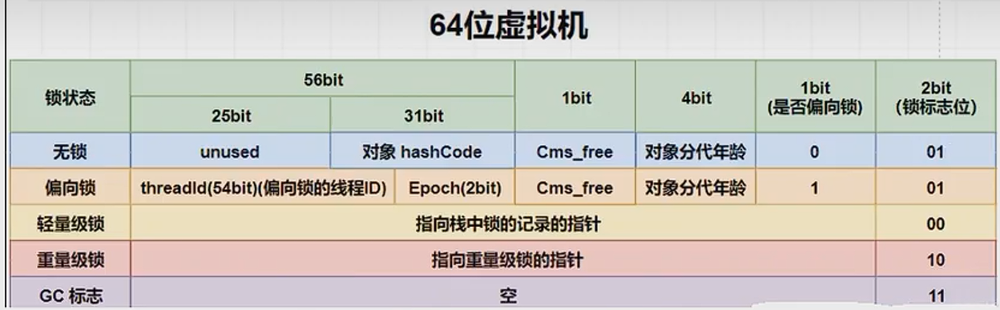

# Java 对象内存布局和对象头

### 对象内存布局

在 HotSpot 虚拟机里，对象在堆内存中的存储布局可以划分为三个部分：对象头 (Header) 、实例数据 (Instance Data) 和对齐填充 (Padding)。

#### 对象头



**组成：**

- 对象标记 Mark Word

  默认存储对象的 HashCode、分代年龄和锁标志位等信息。这些信息都是与对象自身定义无关的数据，所以 MarkWord 被设计成一个非固定的数据结构以便在极小的空间内存存储尽量多的数据。它会根据对象的状态复用自己的存储空间，也就是说在运行期间 MarkWord 里存储的数据会随着锁标志位的变化时变化。

- 类元信息（类型指针）

  对象指向它的类元数据的指针（方法区），虚拟机通过这个指针来确定这个对象是哪个类的实例。

  默认启用压缩指针。

#### 对象中的实际数据

存放类的属性 (Field) 数据信息，包括父类的属性信息

#### 对齐填充

虚拟机要求对象起始地址必须是 8 字节的整数倍。填充数据不是必须存在的，仅仅是为了字节对齐这部分内存按 8 字节补充对齐。

#### JOL 工具

分析对象在 JVM 虚拟机的大小和布局

```java
<!-- JOL工具 -->
<dependency>
	<groupId>org.openjdk.jol</groupId>
	<artifactId>jol-core</artifactId>
	<version>0.9</version>
</dependency>
class Customer {
    int id;
    boolean flag = false;
}
public class JucTest {
    public static void main(String[] args) {
        Object o = new Object();//16 bytes
        //System.out.println(ClassLayout.parseInstance(o).toPrintable());
        //1. Customer 只有对象头没有任何 Field 16 bytes
        //2. int+boolean 默认满足对齐填充 24
        Customer c1 = new Customer();
        System.out.println(ClassLayout.parseInstance(c1).toPrintable());
    }
}
```

