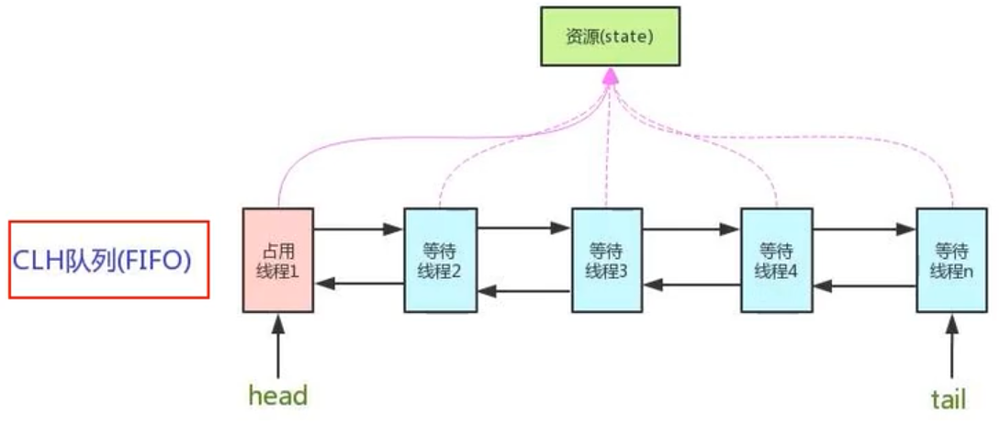

# AbstractQueuedSynchronizer 之 AQS

###  AQS

AbstractQueuedSynchronizer 简称为 AQS，抽象的对列同步器。

是用来实现锁或者其它同步器组件的公共基础部分的抽象实现，是**重量级基础框架及整个 JUC 体系的基石**，主要用于解决锁分配给"谁"的问题。

整体就是一个抽象的 FIFO 队列（双向循环列表）来完成资源获取线程的排队工作，并通过一个 int 类变量表示持有锁的状态。

AbstractQueuedSynchronizer 类内部类 Node，属性 state 为同步状态。

### 
