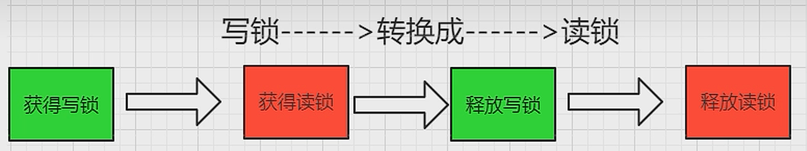

# ReentrantLock、ReentrantReadWriteLock、StampedLock 讲解

### 读写锁

#### ReentrantReadWriteLock

悲观锁

读写锁定义为：一个资源能够被多个读线程访问，或者被一个写线程访问，但是不能同时存在读写线程。

- 读读可以共享，多线程并发可以访问，大面积的可以容许多个线程来读取读多写少的时候，读写锁优先。
- 读写、写写互斥

readLock()

writeLock()

缺点：

- 写饥饿

- 锁降级

   写锁降级为读锁

  - 如果同一个线程持有了写锁，在没有释放写锁的情况下，它还可以继续获得读锁。这就是写锁的降级，降级成为了读锁。
  - 规则惯例，先获取写锁，然后获取读锁，再释放写锁的次序。
  - 如果释放了写锁，那么就完全转换为读锁。



```
public class JucTest {
    public static void main(String[] args) {
        ReentrantReadWriteLock readWriteLock = new ReentrantReadWriteLock();
        ReentrantReadWriteLock.ReadLock readLock = readWriteLock.readLock();
        ReentrantReadWriteLock.WriteLock writeLock = readWriteLock.writeLock();

        writeLock.lock();
        System.out.println("----wirte");
        
        readLock.lock();
        System.out.println("----read");

        writeLock.unlock();
        readLock.unlock();
    }
}
```

**锁降级设计思想**

```
//锁降级设计思想，保证数据可见性。写锁降级为读锁，本质相当于重入，这种机制专门为缓存设计的。
Object data;
volatile boolean cacheValid;
final ReentrantReadWriteLock rwl = new ReentrantReadWriteLock();
void processCachedData() {
    rwl.readLock().lock();
    if (!cacheValid) {
        // Must release read lock before acquiring write lock
        rwl.readLock().unlock();
        rwl.writeLock().lock();
        try {
        	// Recheck state because another thread might have
        	// acquired write lock and changed state before we did.
        	if (!cacheValid) {
        		data = ...
        		cacheValid = true;
        	}
        	// Downgrade by acquiring read lock before releasing write lock
        	rwl.readLock().lock();
        } finally {
        	rwl.writeLock().unlock(); // Unlock write, still hold read
        }
    }
    try {
    	use(data);
    } finally {
        rwl.readLock().unlock();
    }
}
```

#### StampedLock

是一种乐观锁

**解决锁饥饿问题**

- 公平锁，牺牲吞吐量
- 乐观读锁（读的过程允许写的介入）

**缺点**

- 不支持重入
- 不支持条件变量 Condition
- 不要调用中断

```
public class JucTest {
    static int nuumber = 17;
    static StampedLock stampedLock = new StampedLock();
    public void write() {
        System.out.println(Thread.currentThread().getName() + "\t" + "wirte thread prepare to wirte");
        long stamp = stampedLock.writeLock();
        try {
            nuumber = nuumber + 13;
        } finally {
            stampedLock.unlockWrite(stamp);
        }
        System.out.println(Thread.currentThread().getName() + "\t" + "wirte thread end to wirte");
    }
    //悲观读
    public void read() {
        System.out.println(Thread.currentThread().getName() + "\t" + "wirte thread prepare to read");
        long stamp = stampedLock.readLock();
        for (int i = 0; i < 4; i++) {
            try {
                TimeUnit.SECONDS.sleep(1);
                System.out.println("reading...");
            } catch (InterruptedException e) {
                e.printStackTrace();
            }
        }
        try {
            int result = nuumber;
            System.out.println("read: " + result);
        } finally {
            stampedLock.unlockRead(stamp);
        }
        System.out.println(Thread.currentThread().getName() + "\t" + "wirte thread end to read");
    }
    //乐观读
    public void tryOptimisticRead() {
        long stamp = stampedLock.tryOptimisticRead();
        int result = nuumber;
        System.out.println("判断是否有修改" + "\t" + stampedLock.validate(stamp));
        for (int i = 0; i < 4; i++) {
            try {
                TimeUnit.SECONDS.sleep(1);
                System.out.println("reading stampedLockValidate: " + stampedLock.validate(stamp));
            } catch (InterruptedException e) {
                e.printStackTrace();
            }
        }
        if (!stampedLock.validate(stamp)) {
            System.out.println("value modified by someone");
            stamp = stampedLock.readLock();
            try {
                System.out.println("乐观读升级为悲观读");
                result = nuumber;
                System.out.println("悲观读后: " + result);
            } finally {
                stampedLock.unlockRead(stamp);
            }
        }
        System.out.println("finally value: " + result);
    }
    public static void main(String[] args) {
        JucTest jucTest = new JucTest();
        new Thread(() -> {
            jucTest.tryOptimisticRead();
        }, "readThread").start();
        try {
            TimeUnit.SECONDS.sleep(1);
        } catch (InterruptedException e) {
            e.printStackTrace();
        }
        new Thread(() -> {
            jucTest.write();
        }, "writeThread").start();
        System.out.println(Thread.currentThread().getName() + "\t" + nuumber);
    }
}
```

### 
