# 类加载子系统

## 概述

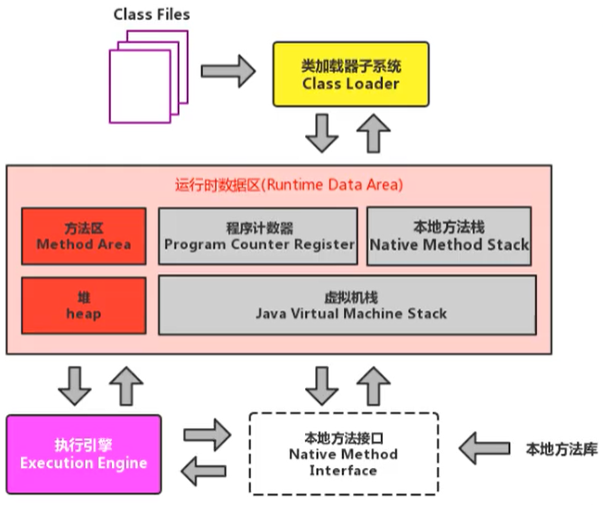

完整版如下

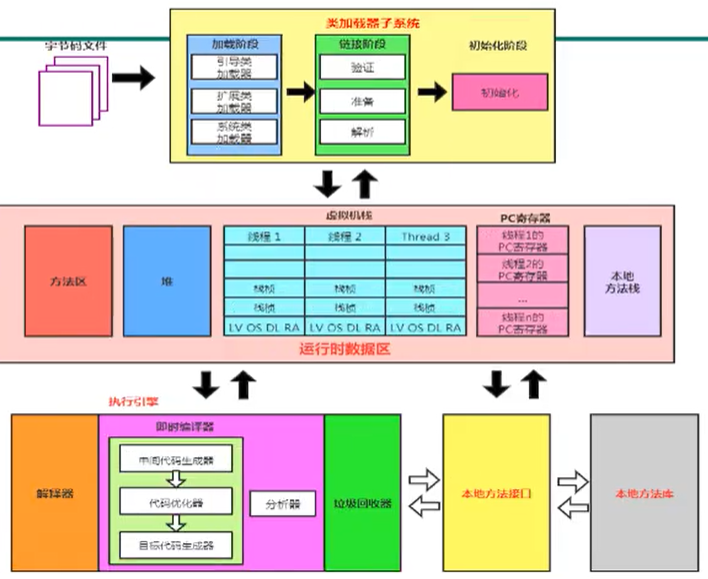

如果自己想手写一个 Java 虚拟机的话，主要考虑哪些结构呢？

- 类加载器
- 执行引擎

## 类加载器子系统作用

类加载器子系统负责从文件系统或者网络中加载 Class 文件，class 文件在文件开头有特定的文件标识。

ClassLoader 只负责 class 文件的加载，至于它是否可以运行，则由 Execution Engine 决定。

加载的类信息存放于一块称为方法区的内存空间。除了类的信息外，方法区中还会存放运行时常量池信息，可能还包括字符串字面量和数字常量（这部分常量信息是 Class 文件中常量池部分的内存映射）

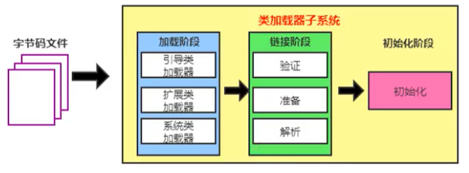

- class file 存在于本地硬盘上，可以理解为设计师画在纸上的模板，而最终这个模板在执行的时候是要加载到 JVM 当中来根据这个文件实例化出 n 个一模一样的实例
- class file 加载到 JVM 中，被称为 DNA 元数据模板，放在方法区
- 在.class 文件->JVM->最终成为元数据模板，此过程就要一个运输工具（类装载器 Class Loader），扮演一个快递员的角色

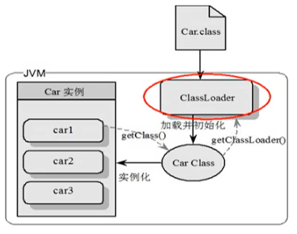

## 类的加载过程

例如下面的一段简单的代码

```java
public class HelloLoader {
    public static void main(String[] args) {
        System.out.println("我已经被加载啦");
    }
}
```

它的加载过程是怎么样的呢？

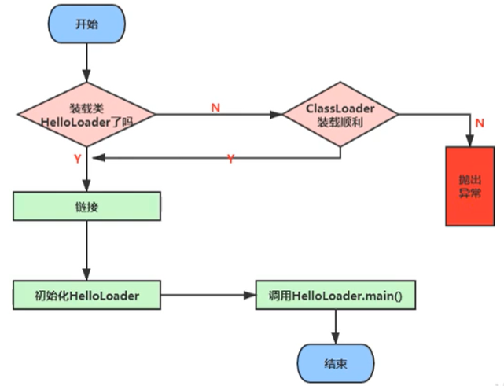

完整的流程图如下所示

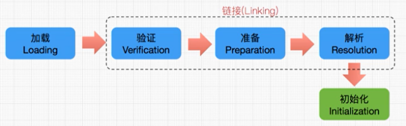

### 加载阶段

通过一个类的全限定名获取定义此类的二进制字节流

将这个字节流所代表的静态存储结构转化为方法区的运行时数据结构

在内存中生成一个代表这个类的 java.lang.Class 对象，作为方法区这个类的各种数据的访问入口

#### 加载 class 文件的方式

- 从本地系统中直接加载
- 通过网络获取，典型场景：Web Applet
- 从 zip 压缩包中读取，成为日后 jar、war 格式的基础
- 运行时计算生成，使用最多的是：动态代理技术
- 由其他文件生成，典型场景：JSP 应用从专有数据库中提取.class 文件，比较少见
- 从加密文件中获取，典型的防 Class 文件被反编译的保护措施

### 链接阶段

#### 验证 Verify

目的在于确保 Class 文件的字节流中包含信息符合当前虚拟机要求，保证被加载类的正确性，不会危害虚拟机自身安全。

主要包括四种验证，文件格式验证，元数据验证，字节码验证，符号引用验证。


如果出现不合法的字节码文件，那么将会验证不通过

同时我们可以通过安装 IDEA 的插件，来查看我们的 Class 文件

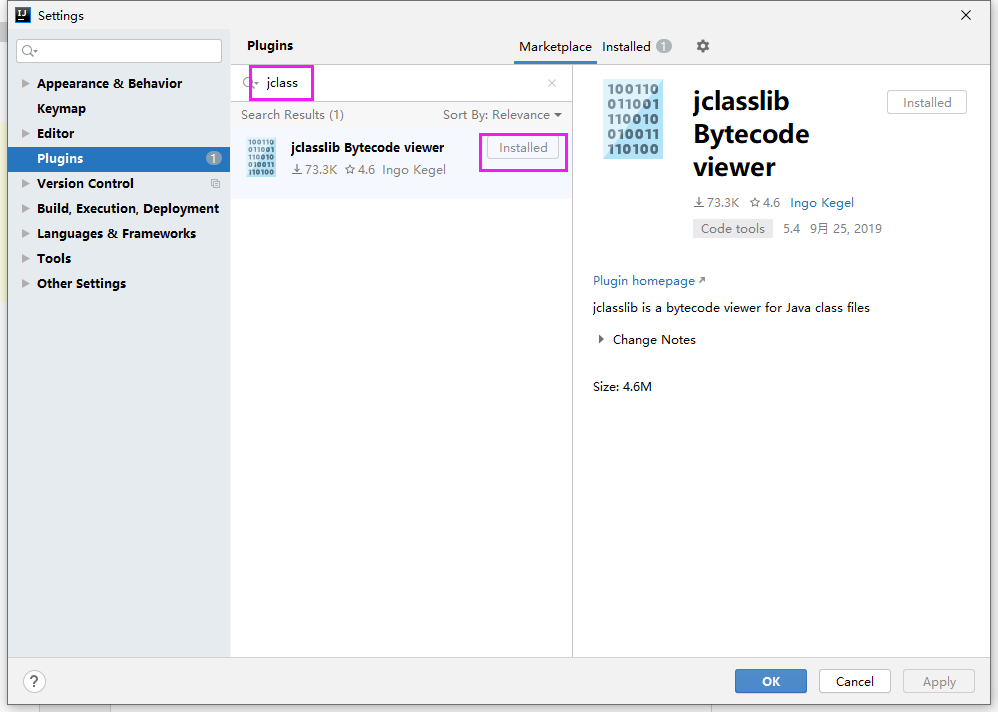

安装完成后，我们编译完一个 class 文件后，点击 view 即可显示我们安装的插件来查看字节码方法了

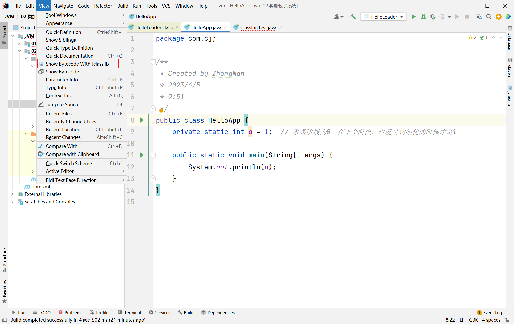

#### 准备 Prepare

为类变量分配内存并且设置该类变量的默认初始值，即零值。

```java
public class HelloApp {
    private static int a = 1;  // 准备阶段为 0，在下个阶段，也就是初始化的时候才是 1
    public static void main(String[] args) {
        System.out.println(a);
    }
}
```

上面的变量 a 在准备阶段会赋初始值，但不是 1，而是 0。

这里不包含用 final 修饰的 static，因为 final 在编译的时候就会分配了，准备阶段会显式初始化；

这里不会为实例变量分配初始化，类变量会分配在方法区中，而实例变量是会随着对象一起分配到 Java 堆中。

#### 解析 Resolve

将常量池内的符号引用转换为直接引用的过程。

事实上，解析操作往往会伴随着 JVM 在执行完初始化之后再执行。

符号引用指的是在类的字节码中使用的一种符号化的引用方式。

直接引用则是指具体的内存地址或偏移量等实际的引用方式。

解析动作主要针对类或接口、字段、类方法、接口方法、方法类型等。对应常量池中的 CONSTANT Class info、CONSTANT Fieldref info、CONSTANT Methodref info 等

### 初始化阶段

- 初始化阶段就是执行类构造器法 `<clinit>（）` 的过程

- 此方法不需定义，是 javac 编译器自动收集类中的所有类变量的赋值动作和静态代码块中的语句合并而来

- **也就是说，当我们代码中包含 static 变量的时候，就会有 `<clinit>（）`  方法**

- 构造器方法中指令按语句在源文件中出现的顺序执行

- `<clinit>（）` 不同于类的构造器。（关联：构造器是虚拟机视角下的 `<init>（）` ）

- 若该类具有父类，JVM 会保证子类的 `<clinit>（）` 执行前，父类的 `<clinit>（）` 已经执行完毕

- 关于涉及到父类时候的变量赋值过程

  ```java
  public class ClinitTest1 {
      static class Father {
          public static int A = 1;
          static {
              A = 2;
          }
      }
  
      static class Son extends Father {
          public static int b = A;
      }
  
      public static void main(String[] args) {
          System.out.println(Son.b);
      }
  }
  
  // 我们输出结果为 2，也就是说首先加载 ClinitTest1 的时候，会找到 main 方法，然后执行 Son 的初始化，但是 Son 继承了 Father，因此还需要执行 Father 的初始化，同时将 A 赋值为 2。我们通过反编译得到 Father 的加载过程，首先我们看到原来的值被赋值成 1，然后又被复制成 2，最后返回
  ```

- 虚拟机必须保证一个类的`<clinit>（）`方法在多线程下被同步加锁

  ```java
  public class DeadThreadTest {
      public static void main(String[] args) {
          new Thread(() -> {
              System.out.println(Thread.currentThread().getName() + "\t 线程 t1 开始");
              new DeadThread();
          }, "t1").start();
  
          new Thread(() -> {
              System.out.println(Thread.currentThread().getName() + "\t 线程 t2 开始");
              new DeadThread();
          }, "t2").start();
      }
  }
  
  class DeadThread {
      static {
          if (true) {
              System.out.println(Thread.currentThread().getName() + "\t 初始化当前类");
              while (true) {
  
              }
          }
      }
  }
  
  // 线程 t1 开始
  // 线程 t2 开始
  // 线程 t2 初始化当前类
  ```

  从上面可以看出初始化后，只能够执行一次初始化，这也就是同步加锁的过程

### ⭐小总结

Java 类的加载过程是将类文件中的二进制代码加载到内存中并转化为 Java 类型的过程，主要包括以下几个步骤：

1. 加载：通过类加载器加载类文件，并将类的信息存储在方法区中，包括类的全限定名、访问修饰符、常量池、字段和方法等信息。
2. 验证：验证类文件的正确性，包括语法和语义检查，以确保其符合 JVM 规范。
3. 准备：为类的静态变量分配内存，并将其初始化为默认值，如 int 类型为 0，对象引用类型为 null。
4. 解析：将类中的符号引用转换为直接引用，以便在运行时直接调用类中的方法和字段。
5. 初始化：执行类的初始化代码，包括静态变量的赋值和静态代码块的执行。

总的来说，类的加载过程主要是将类文件加载到内存中，并对其进行验证、准备、解析和初始化等操作，以便在程序运行时能够正确地使用类的各种成员。

## 类加载器的分类

JVM 支持两种类型的类加载器。分别为引导类加载器（Bootstrap ClassLoader）和自定义类加载器（User-Defined ClassLoader）。

从概念上来讲，自定义类加载器一般指的是程序中由开发人员自定义的一类类加载器，但是 Java 虚拟机规范却没有这么定义，**而是将所有派生于抽象类 ClassLoader 的类加载器都划分为自定义类加载器。**

无论类加载器的类型如何划分，在程序中我们最常见的类加载器始终只有 3 个，如下所示：

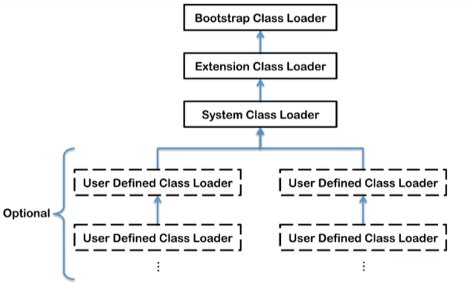

这里的四者之间是包含关系，不是上层和下层，也不是子系统的继承关系。

我们通过一个类，获取它不同的加载器

```java
public class ClassLoaderTest {
    public static void main(String[] args) {
        // 获取系统类加载器
        ClassLoader systemClassLoader = ClassLoader.getSystemClassLoader();
        System.out.println(systemClassLoader);

        // 获取其上层的：扩展类加载器
        ClassLoader extClassLoader = systemClassLoader.getParent();
        System.out.println(extClassLoader);

        // 试图获取 根加载器
        ClassLoader bootstrapClassLoader = extClassLoader.getParent();
        System.out.println(bootstrapClassLoader);

        // 获取自定义加载器
        ClassLoader classLoader = ClassLoaderTest.class.getClassLoader();
        System.out.println(classLoader);
        
        // 获取 String 类型的加载器
        ClassLoader classLoader1 = String.class.getClassLoader();
        System.out.println(classLoader1);
    }
}
```

得到的结果，从结果可以看出根加载器无法直接通过代码获取，同时目前用户代码所使用的加载器为系统类加载器。同时我们通过获取 String 类型的加载器，发现是 null，那么说明 String 类型是通过根加载器进行加载的，也就是说 Java 的核心类库都是使用根加载器进行加载的。

```
sun.misc.Launcher$AppClassLoader@18b4aac2
sun.misc.Launcher$ExtClassLoader@1540e19d
null
sun.misc.Launcher$AppClassLoader@18b4aac2
null 
```

### 虚拟机自带的加载器

#### 启动类加载器（引导类加载器，Bootstrap ClassLoader）

- 这个类加载使用C/C++语言实现的，嵌套在JVM内部。
- 它用来加载 Java 的核心库（JAVAHOME/jre/lib/rt.jar、resources.jar 或 sun.boot.class.path 路径下的内容），用于提供 JVM 自身需要的类
- 并不继承自 java.lang.ClassLoader，没有父加载器。
- 加载扩展类和应用程序类加载器，并指定为他们的父类加载器。
- 出于安全考虑，Bootstrap 启动类加载器只加载包名为 java、javax、sun 等开头的类

#### 扩展类加载器（Extension ClassLoader）

- Java 语言编写，由 sun.misc.Launcher$ExtClassLoader 实现。
- 派生于 ClassLoader 类
- 父类加载器为启动类加载器
- 从 java.ext.dirs 系统属性所指定的目录中加载类库，或从 JDK 的安装目录的 jre/lib/ext 子目录（扩展目录）下加载类库。如果用户创建的 JAR 放在此目录下，也会自动由扩展类加载器加载。

#### 应用程序类加载器（系统类加载器，AppClassLoader）

- javI 语言编写，由 sun.misc.LaunchersAppClassLoader 实现
- 派生于 ClassLoader 类
- 父类加载器为扩展类加载器
- 它负责加载环境变量 classpath 或系统属性 java.class.path 指定路径下的类库
- 该类加载是程序中默认的类加载器，一般来说，Java 应用的类都是由它来完成加载
- 通过 classLoader#getSystemclassLoader（）方法可以获取到该类加载器

### 用户自定义类加载器

在 Java 的日常应用程序开发中，类的加载几乎是由上述 3 种类加载器相互配合执行的，在必要时，我们还可以自定义类加载器，来定制类的加载方式。
为什么要自定义类加载器？

- 隔离加载类
- 修改类加载的方式
- 扩展加载源
- 防止源码泄漏

用户自定义类加载器实现步骤：

- 开发人员可以通过继承抽象类 java.lang.ClassLoader 类的方式，实现自己的类加载器，以满足一些特殊的需求
- 在 JDK1.2 之前，在自定义类加载器时，总会去继承 ClassLoader 类并重写 loadClass（）方法，从而实现自定义的类加载类，但是在 JDK1.2 之后已不再建议用户去覆盖 loadclass（）方法，而是建议把自定义的类加载逻辑写在 findclass（）方法中
- 在编写自定义类加载器时，如果没有太过于复杂的需求，可以直接继承 URIClassLoader 类，这样就可以避免自己去编写 findclass（）方法及其获取字节码流的方式，使自定义类加载器编写更加简洁。

### 查看根加载器所能加载的目录

刚刚我们通过概念了解到了，根加载器只能够加载 java /lib 目录下的 class，我们通过下面代码验证一下

```java
public class ClassLoaderTest1 {
    public static void main(String[] args) {
        System.out.println("*********启动类加载器************");
        // 获取 BootstrapClassLoader 能够加载的 API 的路径
        URL[] urls = sun.misc.Launcher.getBootstrapClassPath().getURLs();
        for (URL url : urls) {
            System.out.println(url.toExternalForm());
        }

        // 从上面路径中，随意选择一个类，来看看他的类加载器是什么：得到的是 null，说明是  根加载器
        ClassLoader classLoader = Provider.class.getClassLoader();
        System.out.println(classLoader);
    }
}
```

得到的结果

```
*********启动类加载器************
file:/E:/Software/JDK1.8/Java/jre/lib/resources.jar
file:/E:/Software/JDK1.8/Java/jre/lib/rt.jar
file:/E:/Software/JDK1.8/Java/jre/lib/sunrsasign.jar
file:/E:/Software/JDK1.8/Java/jre/lib/jsse.jar
file:/E:/Software/JDK1.8/Java/jre/lib/jce.jar
file:/E:/Software/JDK1.8/Java/jre/lib/charsets.jar
file:/E:/Software/JDK1.8/Java/jre/lib/jfr.jar
file:/E:/Software/JDK1.8/Java/jre/classes
null
```

### 关于 ClassLoader

ClassLoader 类，它是一个抽象类，其后所有的类加载器都继承自 ClassLoader（不包括启动类加载器）

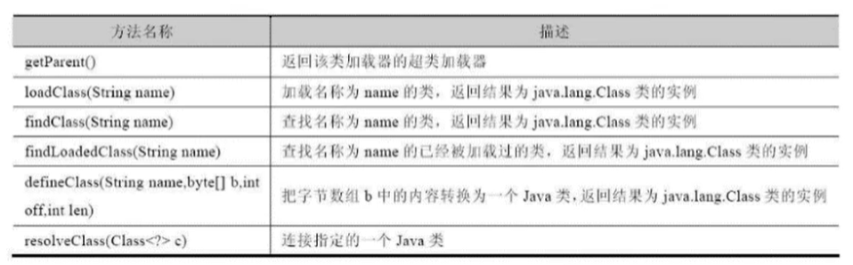

sun.misc.Launcher 它是一个 java 虚拟机的入口应用

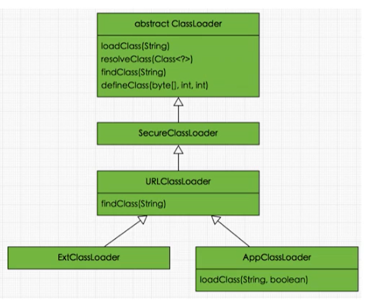

获取 ClassLoader 的途径

- 获取当前 ClassLoader：clazz.getClassLoader()
- 获取当前线程上下文的 ClassLoader：Thread.currentThread().getContextClassLoader()
- 获取系统的 ClassLoader：ClassLoader.getSystemClassLoader()
- 获取调用者的 ClassLoader：DriverManager.getCallerClassLoader()

### ⭐小总结

类加载器是 Java 虚拟机的核心组件之一，它负责将 Java 类文件加载到内存中，并转换成 Java 类的对象。根据 Java 虚拟机规范的定义，类加载器被分为三种：启动类加载器（Bootstrap ClassLoader）、扩展类加载器（Extension ClassLoader）和系统类加载器（System ClassLoader）。

1. 启动类加载器（Bootstrap ClassLoader）

启动类加载器是 Java 虚拟机内置的类加载器，它负责加载 Java 平台核心库（如 rt.jar、charsets.jar 等）以及其他被虚拟机认为是基础的类，例如 java.lang.Object 等。启动类加载器是虚拟机的一部分，它不是 Java 类，因此没有相应的 Class 对象与之对应。

1. 扩展类加载器（Extension ClassLoader）

扩展类加载器负责加载 Java 平台扩展库中的类，例如 javax.* 等扩展包中的类。扩展类加载器是由启动类加载器加载的，它的父加载器是启动类加载器。扩展类加载器通常位于 jre/lib/ext 目录下。

1. 系统类加载器（System ClassLoader）

系统类加载器也称为应用类加载器，它负责加载应用程序的类。系统类加载器是由启动类加载器和扩展类加载器的子类加载的，它的父加载器是扩展类加载器。系统类加载器通常位于 classpath 路径下。

除了上述三种标准的类加载器，Java 还支持自定义类加载器。自定义类加载器需要继承自 java.lang.ClassLoader 类，并覆盖其 findClass() 方法，以实现自己的类加载逻辑。自定义类加载器可以用于实现模块化、插件化等功能。

## 双亲委派机制

Java 虚拟机对 class 文件采用的是按需加载的方式，也就是说当需要使用该类时才会将它的 class 文件加载到内存生成 class 对象。而且加载某个类的 class 文件时，Java 虚拟机采用的是双亲委派模式，即把请求交由父类处理，它是一种任务委派模式。

### 工作原理

- 如果一个类加载器收到了类加载请求，它并不会自己先去加载，而是把这个请求委托给父类的加载器去执行；
- 如果父类加载器还存在其父类加载器，则进一步向上委托，依次递归，请求最终将到达顶层的启动类加载器；
- 如果父类加载器可以完成类加载任务，就成功返回，倘若父类加载器无法完成此加载任务，子加载器才会尝试自己去加载，这就是双亲委派模式。

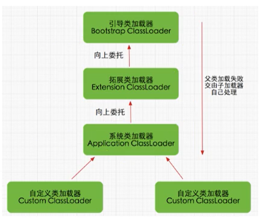

### 双亲委派机制举例

当我们加载 jdbc.jar 用于实现数据库连接的时候，首先我们需要知道的是 jdbc.jar 是基于 SPI 接口进行实现的，所以在加载的时候，会进行双亲委派，最终从根加载器中加载 SPI 核心类，然后在加载 SPI 接口类，接着在进行反向委派，通过线程上下文类加载器进行实现类 jdbc.jar 的加载。

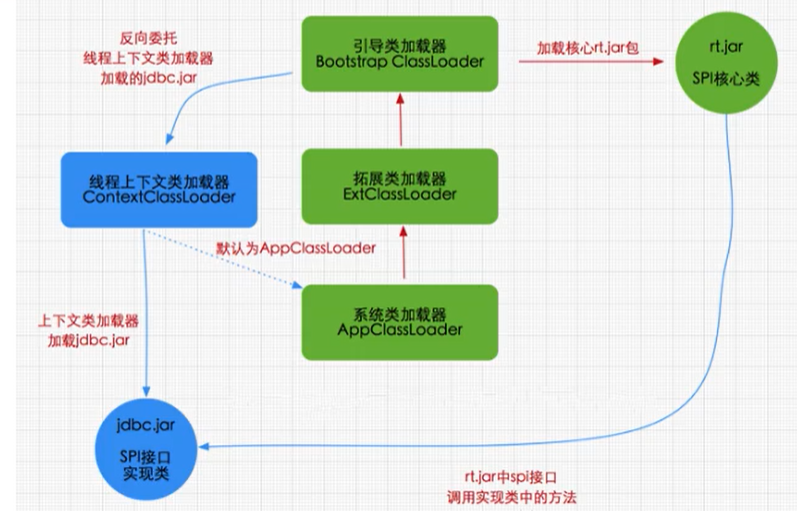

### 沙箱安全机制

**自定义 string 类，但是在加载自定义 String 类的时候会率先使用引导类加载器加载，而引导类加载器在加载的过程中会先加载 jdk 自带的文件（rt.jar 包中 java\lang\String.class），报错信息说没有 main 方法，就是因为加载的是 rt.jar 包中的 string 类。这样可以保证对 java 核心源代码的保护，这就是沙箱安全机制。**

### 双亲委派机制的优势

通过上面的例子，我们可以知道，双亲机制可以

- **避免类的重复加载**
- **保护程序安全，防止核心 API 被随意篡改**
  - **自定义类：java.lang.String**
  - **自定义类：java.lang.ShkStart（报错：阻止创建 java.lang 开头的类）**

## 其它内容

###  如何判断两个 class 对象是否相同

在 JVM 中表示两个 class 对象是否为同一个类存在两个必要条件：

- 类的完整类名必须一致，包括包名。
- 加载这个类的 ClassLoader（指 ClassLoader 实例对象）必须相同。

换句话说，在 JvM 中，即使这两个类对象（class 对象）来源同一个 Class 文件，被同一个虚拟机所加载，但只要加载它们的 ClassLoader 实例对象不同，那么这两个类对象也是不相等的。

JVM 必须知道一个类型是由启动加载器加载的还是由用户类加载器加载的。如果一个类型是由用户类加载器加载的，那么 JVM 会将这个类加载器的一个引用作为类型信息的一部分保存在方法区中。当解析一个类型到另一个类型的引用的时候，JVM 需要保证这两个类型的类加载器是相同的。

### 类的主动使用和被动使用

Java 程序对类的使用方式分为：主动使用（主动加载）和被动使用（被动加载）。

- 程序中使用了该类的实例化对象，或者使用了该类的静态成员变量或静态方法，这将触发该类的加载。
- 通过反射机制动态加载类，例如通过 Class.forName() 方法或 ClassLoader 类的 loadClass() 方法。
- 在一个类中继承了另一个类或实现了接口，子类或实现类需要在父类或接口中定义的所有类都被加载后才能被加载。
- 启动 JVM 时需要加载的类，例如 java.lang.Object 和 java.lang.Class。
- 使用 JVM 命令行参数-Xbootclasspath 指定的类。

除了以上情况，其他使用 Java 类的方式都被看作是对类的被动使用，都不会导致类的初始化。
