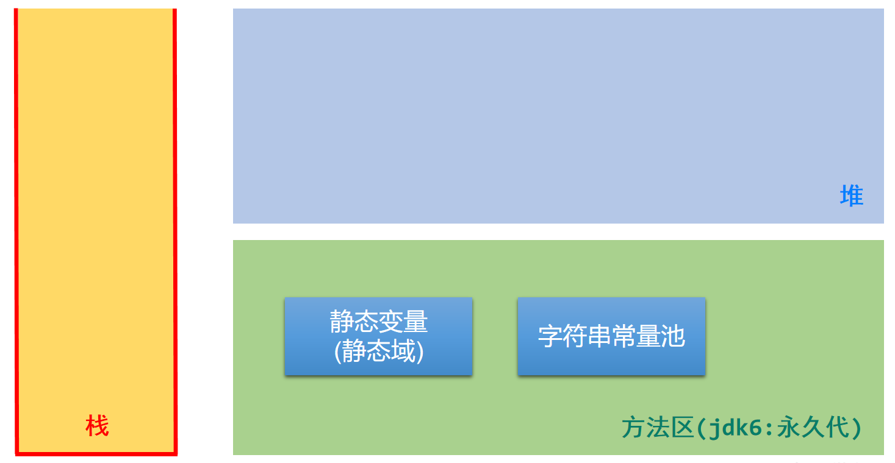
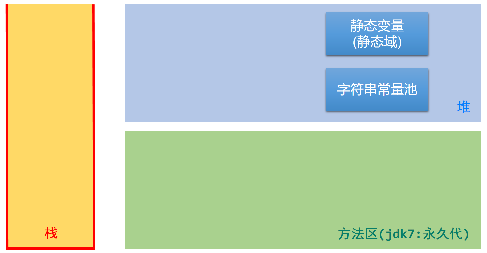
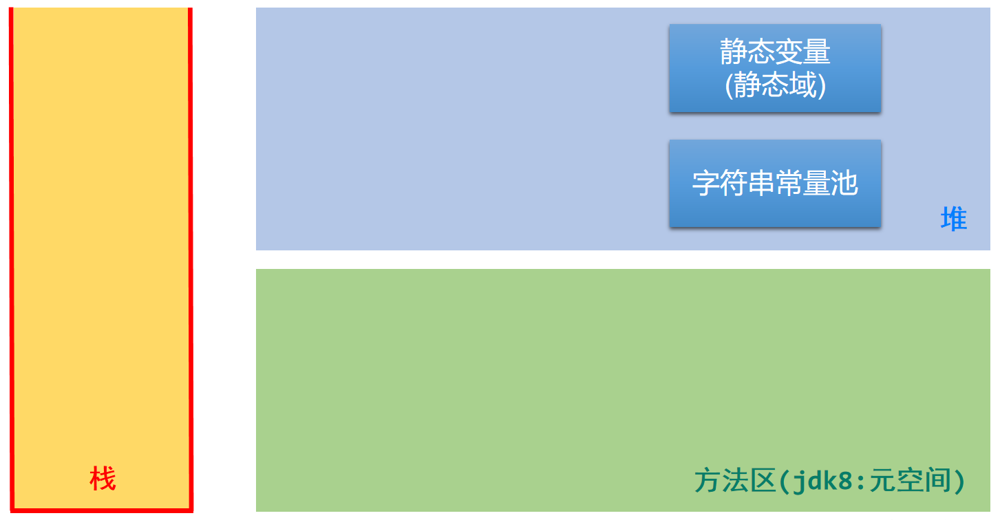
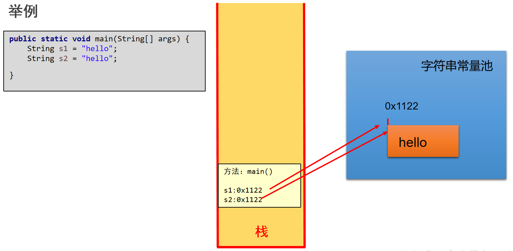
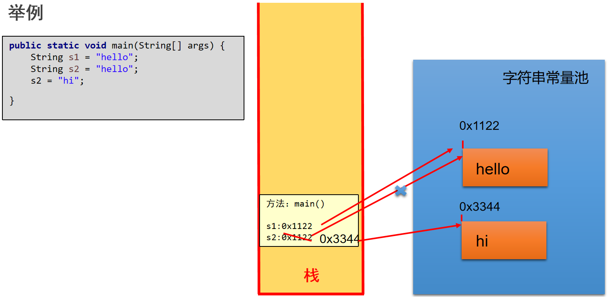
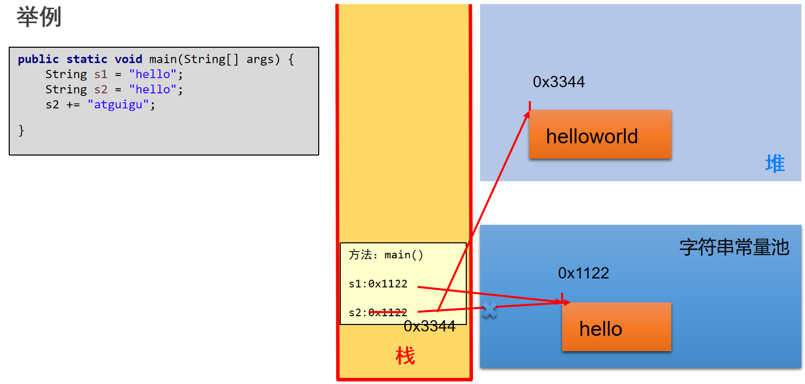
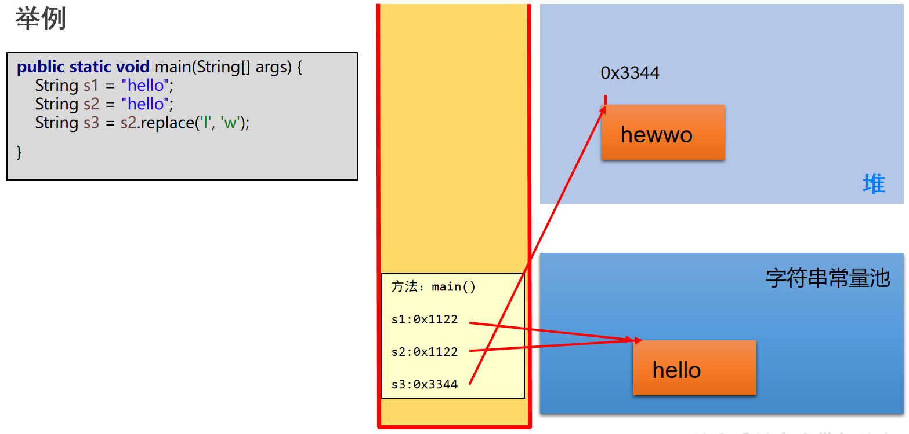
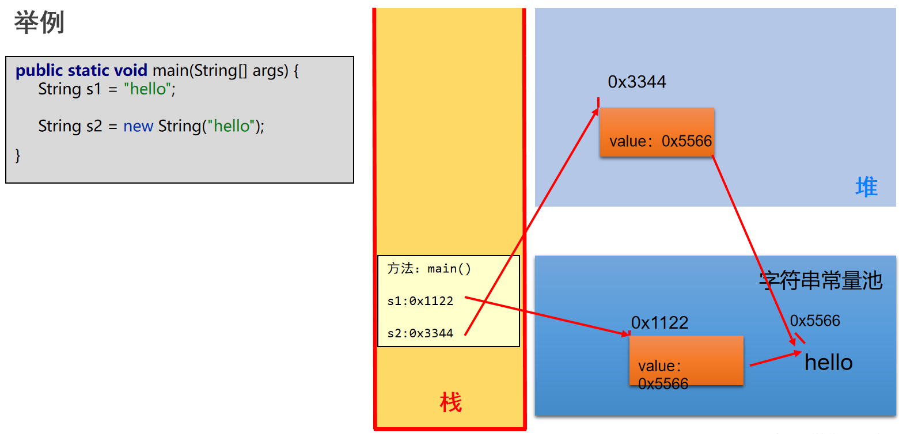
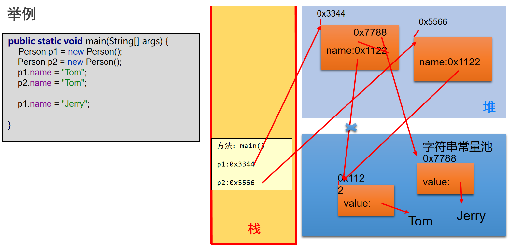

# Java String 的内存结构

## String、静态变量的存储位置演进 (jdk6)

## String、静态变量的存储位置演进 (jdk7)

## String、静态变量的存储位置演进 (jdk8 及之后)

## String 的内存结构

## String 的不可变性举例 1

## String 的不可变性举例 2

## String 的不可变性举例 3

## new 的方式创建 String

## String 内存分析

