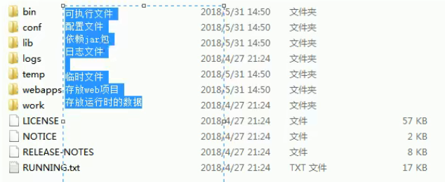

# JavaWeb 基础

## 网络通信三要素

- IP：计算机在网络中的唯一标识
- 端口：应用程序在网络中的唯一标识 (0~65535)
- 传输协议：`tcp:安全 三次握手 速度稍慢 udp:不安全 速度快`

## Tomcat

- Tomcat 是 web 服务器，存放项目的静态资源和动态资源

- Tomcat 目录结构

- 简单部署：将项目打成 war 包，将 war 放到 webapps 目录下，war 包会自动解压缩
