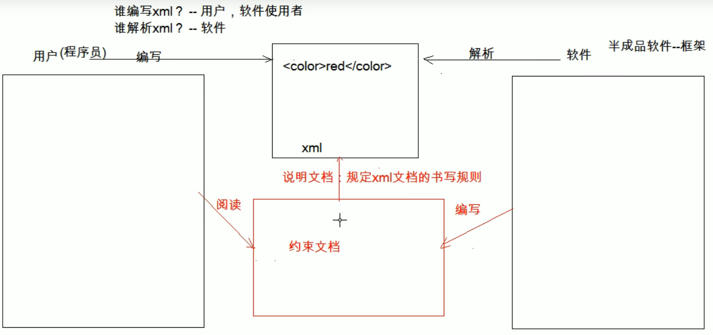

# xml 标记语言

## 入门

- xml 可拓展标记语言
- 作用：存储数据，作为配置文件，html 是用来展示数据
- 区分大小写

## 组成部分

1. 文档声明 `<?xml version="1.0" encoding="UTF-8"?>`
2. 指令：了解 引入 css 样式
3. 标签：自定义标签
4. 属性：id 属性唯一
5. 文本：CDATA 区原样展示数据 `<![CDATA[展示的数据]]>`

## 约束



## 约束分类

### dtd

```
内部dtd
外部本地dtd
外部网络did
```

### schema

- 填写 xml 文档的根元素
- `<beans></beans>`

- 引入 xsi 前缀
- `xmlns:xsi="http://www.w3.org/2001/XMLSchema-instance"`

- 引入 xsd 文件命名空间
- `xsi:schemaLocation="`
  `http://www.springframework.org/schema/beans`
  `http://www.springframework.org/schema/beans/spring-beans.xsd`
  `http://www.springframework.org/schema/context` 
  `http://www.springframework.org/schema/context/spring-context.xsd`

- 为每一个 xsd 约束声明一个前缀作为标识
- `xmlns:context="http://www.springframework.org/schema/context"`

## 解析

1. DOM
2. SAX

## Jsoup

> 解析 xml 文件的工具类
