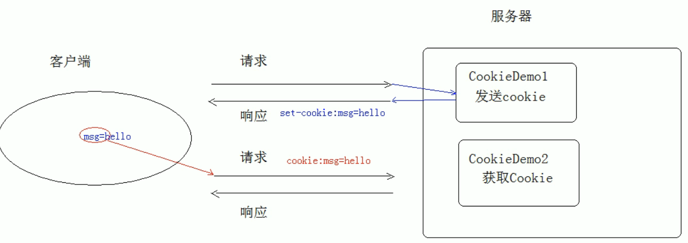

# Cookie

## Cookie 概念

> 会话技术：服务器和浏览器建立连接，共享数据，直到一方断开为止，称为一次会话

- 客户端 (浏览器) 会话技术：Cookie
- 服务端 (服务器) 会话技术：Session

| 创建 Cookie 对象 | new Cookie(String name, String value) |
| -------------- | ------------------------------------- |
| 发送 Cookie 对象 | response.addCookie(Cookie cookie)     |
| 获取 Cookie 对象 | Cookie[]  request.getCookies()        |

## Cookie 原理

>发送 Cookie 对象 是将信息设置到响应头里面
>
>获取 Cookie 对象 是把消息从响应头中取出来

## Cookie 细节

- 可以一次发送多个 cookie 对象，多次调用 response.addCookie(Cookie cookie) 方法

- 默认情况下浏览器关闭 cookie 信息就销毁

- 可以设置 cookie 持久化存储

  | setMaxAge(int seconds) |                                 |
  | ---------------------- | ------------------------------- |
  | 正数                   | 将 cookie 信息写入硬盘，持久化存储 |
  | 负数                   | 存在内存中，默认浏览器关闭就销毁 |
  | 零                     | 删除 cookie 信息                  |

- Tomcat8 之后 cookie 可以使用中文

- cookie 共享问题:cooike 默认当前项目使用

  | cookie.setPath("/")    | 在服务器下共享 cookie                            |
  | ---------------------- | ----------------------------------------------- |
  | setDomain(String path) | 如果一级域名相同，则多个服务器之间 cookie 可以共享 |

## Cookie 特点

1. cookie 数据存储在客户端浏览器中，不安全
2. cookie 对单个 cookie 的大小限制 4kb，对同一个域名下的 cookie 持久化最多设置 20 个左右
3. cookie 的作用是存储少量不重要的数据到浏览器
4. URLEncoder 编码
