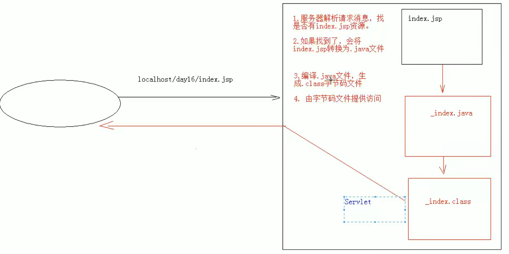
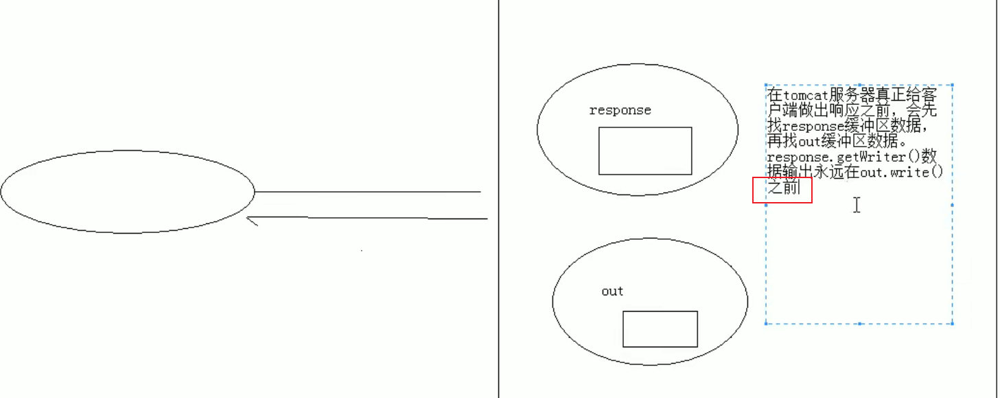

# JSP

## JSP 概念

> java 服务端页面，功能：简化书写

## jsp 原理

> jsp 本质上就是一个 servlet

- 相关源码在 Tomcat 源码中
- index_jsp extends HttpJspBase
- HttpJspBase extends HttpServlet

## jsp 脚本

| <% 代码 %>  | service() | 定义的 java 语句，在 service 方法 |
| ----------- | --------- | ---------------------------- |
| <%! 代码 %> | 成员位置  | 定义成员变量，成员方法 (不用)  |
| <%= 代码 %> | 输出页面  | 输出到页面上                 |

## jsp 内置对象

| request         | HttpRequest        | 域对象：一次请求共享数据 (转发)          |
| --------------- | ------------------ | -------------------------------------- |
| response        | HttpRresponse      | 响应对象                               |
| out             | JspWriter          | 字符输出流对象                         |
| **pageContext** | **PageContext**    | **域对象：当前页面共享数据**            |
| **session**     | **HttpSession**    | **域对象：一次会话的多个请求共享数据**  |
| **application** | **ServletContext** | **域对象：所有用户共享数据**            |
| config          | ServletConfig      | 配置文件                               |
| page            | Object             | this，当前                              |
| exception       | Throwable          | isErrorPage(true) 可以使用 exception 对象 |

## jsp 指令

><%@ page contentType="text/html;charset=UTF-8" language="java" %>

| page 指令    | contentType    | 设置 MIME 和字符集                          |
| ----------- | -------------- | ----------------------------------------- |
|             | language       | 设置语言                                  |
|             | buffer         | 设置缓冲区                                |
|             | import         | 设置导包                                  |
|             | errorPage      | 错误页面                                  |
|             | isErrorPage    | 是否是错误页面 (true) 可以使用 exception 对象 |
| include 指令 | 引入重复的页面 |                                           |
| taglib 指令  | 导入标签库     | 比如 jstl 标签库                            |
