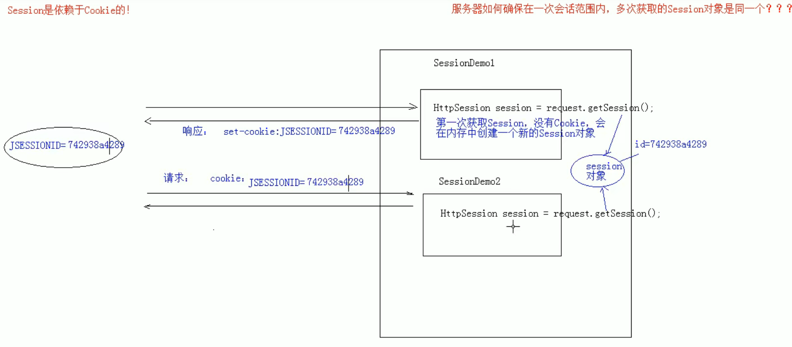

# Session

## Session 概念

> 服务器端会话技术，将数据保存在服务器 HttpSession 对象

| 获取 httpSession 对象 | request.getSession() |
| ------------------- | -------------------- |
| 存取数据            | getAttribute()       |
| 获取数据            | setAttribute()       |
| 移出数据            | removeAttribute()    |

## Session 原理

## Session 细节

- 默认情况 Session 是一次会话，如果要关闭浏览器后还能获取相同的 Session 对象，就需要创建 Cookie 持久化保存
- Session 钝化和活化：在服务器正常关闭后，将 Session 对象序列化到硬盘上，在服务器正常启动后，将 Session 序列化转化为内存中的 Session 对象，Tomcat 会自动完成，生成的文件在 tomcat 的 work 目录中
- Session 失效时间:1.服务器关闭，2 默认失效时间 30 分钟

## Session 特点

- 一次会话多次请求，存在服务器端
- Session 存储任意类型，任意大小
