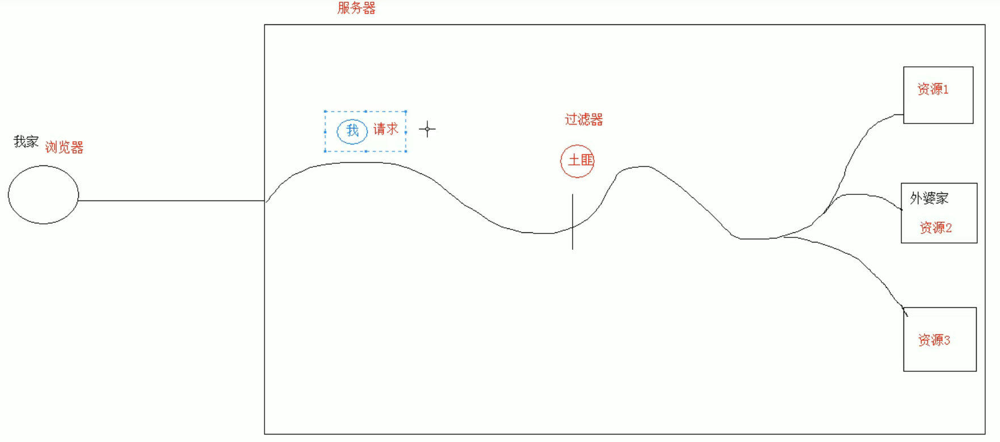
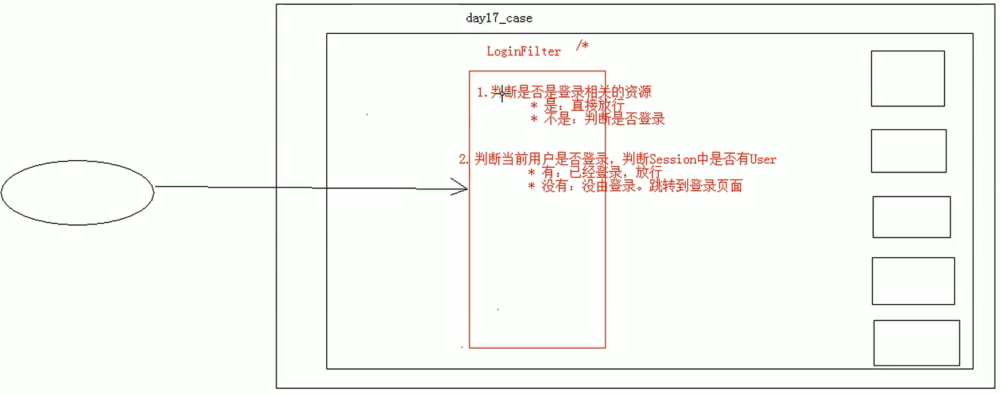

# Filter 过滤器

## Filter 过滤器概念

> 拦截请求，增强功能，通用功能



##  Filter 常见功能

- 登录验证
- 统一编码
- 敏感字符过滤

## Filter 实现细节

- 实现 Filter 接口

- Filter[xml 配置]和注解配置

```xml
<filter>
    <filter-name>myFilter</filter-name>
    <filter-class>filter.MyFilter01</filter-class>
</filter>
<filter-mapping>
    <filter-name>myFilter</filter-name>
    <url-pattern>/*</url-pattern>
</filter-mapping>
```

- 配置@WebFilter("/*")
- 过滤器执行流程

`请求`->`过滤器`->`对Request进行增强`->`放行`->`响应`->`过滤器`->`对Response进行增强`

- Filter 生命周期：参考 Servlet
  - init
  - doFilter
  - destroy
- Filter 配置
  - 拦截路径配置：`/*` `/user/*` `*.jsp` `/index.jsp`
  - 拦截方式配置：
    - 资源访问方式:dispatcherTypes
    - DispatcherType.REQUEST:浏览器直接访问资源
    - DispatcherType.FORWARD:转发访问资源
    - DispatcherType.INCLUDE:包含访问资源
    - DispatcherType.ERROR:错误跳转资源
    - DispatcherType.ASYNC:异部访问
- Filter 链
  - `Filter1`->`Filter2`->`Filter2`->`Filter1`

## Filter 案例


