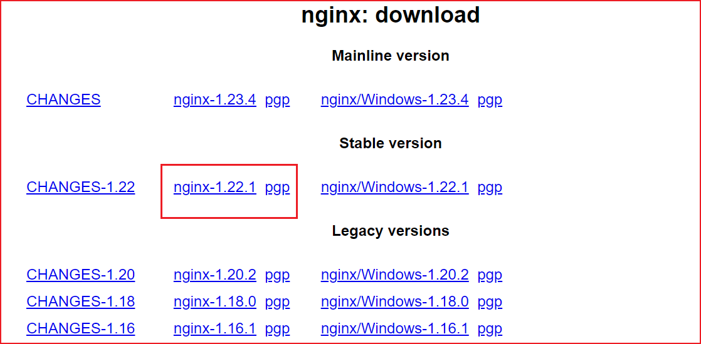
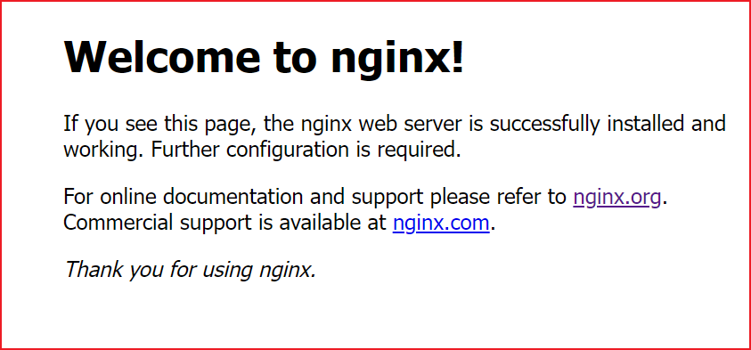

# Nginx 安装和常用命令

## 下载

[http://nginx.org/en/download.html](http://nginx.org/en/download.html)



## 编译安装与依赖检查

```sh
# 安装编译 gcc 环境
yum -y install gcc-c++

# 安装 Perl 库，解析正则表达式
yum -y install pcre pcre-devel

# zlib 库提供了很多种压缩和解压缩
yum -y install zlib zlib-devel

# 强大的安全套接字层密码库
yum -y install openssl openssl-devel

# 一键执行
yum -y install gcc-c++ pcre pcre-devel zlib zlib-devel openssl openssl-devel

# 解压到 /usr/local 下面
# tar -zxvf nginx-1.24.0.tar.gz -C /usr/local
tar -zxvf nginx-1.24.0.tar.gz

# 重命名
mv nginx-1.22.1 nginx

# 进入到 nginx 编译安装,✨✨✨注意不要占用到默认位置
cd nginx
./configure --prefix=/usr/local/nginx
make && make install

# 将配置文件拷贝到 /etc/nginx.conf
cp /usr/local/nginx/conf/nginx.conf /etc/nginx.conf

# 我这里报错，提示没有日志
# "/usr/local/nginx/logs/error.log" failed (2: No such file or directory)
mkdir /usr/local/nginx/logs 
touch /usr/local/nginx/logs/error.log
touch /usr/local/nginx/logs/access.log
```

## Nginx 命令

```sh
# 进入安装好的目录
/usr/local/nginx/sbin

# 启动
./nginx

# 配置文件启动
./nginx -c /usr/local/nginx/conf/nginx.conf

# 快速停止
./nginx -s stop

# 优雅关闭，在退出前完成已经接受的连接请求
./nginx -s quit

# 重新加载配置
./nginx -s reload

# 查看 nginx 状态
service nginx status

# 检查配置文件
/usr/local/nginx -t -c /usr/local/nginx/conf/nginx.conf
```



## 防火墙命令

```sh
# 关闭防火墙
systemctl stop firewalld.service

# 禁止防火墙开机启动
systemctl disable firewalld.service

# 放行端口
firewall-cmd --zone=public --add-port=80/tcp --permanent

# 重启防火墙
firewall-cmd --reload
```

## 系统服务命令

```sh
# 创建服务脚本
vim /usr/lib/systemd/system/nginx.service

# 服务脚本内容
[Unit]
Description=nginx web service
Documentation=http://nginx.org/en/docs/
After=network.target

[Service]
Type=forking
PIDFile=/usr/local/nginx/logs/nginx.pid
ExecStartPre=/usr/local/nginx/sbin/nginx -t -c /usr/local/nginx/conf/nginx.conf
ExecStart=/usr/local/nginx/sbin/nginx
ExecReload=/usr/local/nginx/sbin/nginx -s reload
ExecStop=/usr/local/nginx/sbin/nginx -s stop
PrivateTmp=true

[Install]
WantedBy=default.target

# 添加完成后如果权限有问题需要进行权限设置
chmod 755 /usr/lib/systemd/system/nginx.service
systemctl daemon-reload

启动: systemctl start nginx
停止: systemctl stop nginx
重启: systemctl restart nginx
重新加载配置文件: systemctl reload nginx
查看nginx状态: systemctl status nginx
开机启动: systemctl enable nginx
查看端口: netstat -nap | grep 80
```
