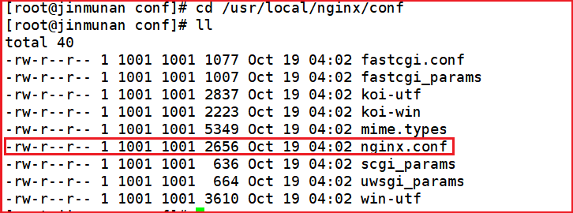

# Nginx 配置文件

nginx 安装目录下，其默认的配置文件都放在这个目录的 conf 目录下，而主配置文件 `nginx.conf` 也在其中，后续对 nginx 的使用基本上都是对此配置文件进行相应的修改。



## Nginx 最简配置文件

根据文件，我们可以很明显的将 nginx.conf 配置文件分为三部分

```nginx
# 默认为 1，表示开启一个业务进程
worker_processes  1; 

events {
	# 单个业务进程可接受连接数
    worker_connections  1024;
}

http {
    # 引入 http mime 类型
    include       mime.types;
    # 如果 mime 类型没匹配上，默认使用二进制流的方式传输。
    default_type  application/octet-stream;
	
	 # 使用 linux 的 sendfile(socket, file, len) 高效网络传输，也就是数据 0 拷贝。
    sendfile        on;
    keepalive_timeout  65;

    # 配置虚拟主机
    server {
        listen       80;
        server_name  localhost;

        location / {
            root   html;
            index  index.html index.htm;
        }
        error_page   500 502 503 504  /50x.html;
        location = /50x.html {
            root   html;
        }
    }
}
```

## `全局块 `

 从配置文件开始到 events 块之间的内容，主要会设置一些影响 nginx 服务器整体运行的配置指令，主要包括配置**运行 Nginx 服务器的用户（组）**、**允许生成的 worker process 数**，**进程 PID 存放路径**、**日志存放路径**和**类型以及配置文件的引入**等。

 比如上面第一行配置的

```nginx
worker_processes  1; 
```

这是 Nginx 服务器并发处理服务的关键配置，worker_processes 值越大，可以支持的并发处理量也越多，但是会受到硬件、软件等设备的制约。

## `events 块 `

比如上面的配置：

```nginx
events {
    worker_connections  1024;
}
```

events 块涉及的指令主要影响 Nginx 服务器与用户的网络连接，常用的设置包括**是否开启对多 work process 下的网络连接进行序列化**，**是否允许同时接收多个网络连接**，**选取哪种事件驱动模型来处理连接请求**，**每个 work process 可以同时支持的最大连接数**等。

 上述例子就表示每个 work process 支持的最大连接数为 1024。

 这部分的配置对 Nginx 的性能影响较大，在实际中应该灵活配置。

## `http 块`

```nginx 
http {
    include       mime.types;
    default_type  application/octet-stream;
	
    sendfile        on;
    keepalive_timeout  65;

    server {
        listen       80;
        server_name  localhost;

        location / {
            root   html;
            index  index.html index.htm;
        }
        error_page   500 502 503 504  /50x.html;
        location = /50x.html {
            root   html;
        }
    }
}
```

这算是 Nginx 服务器配置中最频繁的部分，**代理**、**缓存**和**日志**定义等绝大多数功能和**第三方模块的配置**都在这里。

 需要注意的是：**http 块**也可以包括 **http 全局块**、**server 块**。

### `http 全局块`

 http 全局块配置的指令包括**文件引入**、**MIME-TYPE 定义**、**日志自定义**、**连接超时时间**、**单链接请求数上限**等。

### `server 块`

这块和虚拟主机有密切关系，虚拟主机从用户角度看，和一台独立的硬件主机是完全一样的，该技术的产生是为了节省互联网服务器硬件成本。

每个 http 块可以包括多个 server 块，而每个 server 块就相当于一个虚拟主机。

而每个 server 块也分为**全局 server 块**，以及可以同时包含多个 **location 块**。

#### `全局 server 块`

最常见的配置是本虚拟机主机的监听配置和本虚拟主机的名称或 IP 配置。

#### `location 块`

**一个 server 块**可以配置**多个 location 块**。

这块的主要作用是基于 Nginx 服务器接收到的请求字符串（例如 server_name/uri-string），对虚拟主机名称（也可以是 IP 别名）之外的字符串（例如 前面的 /uri-string）进行匹配，对特定的请求进行处理。**地址定向**、数据缓存和**应答控制**等功能，还有许多**第三方模块的配置**也在这里进行。
