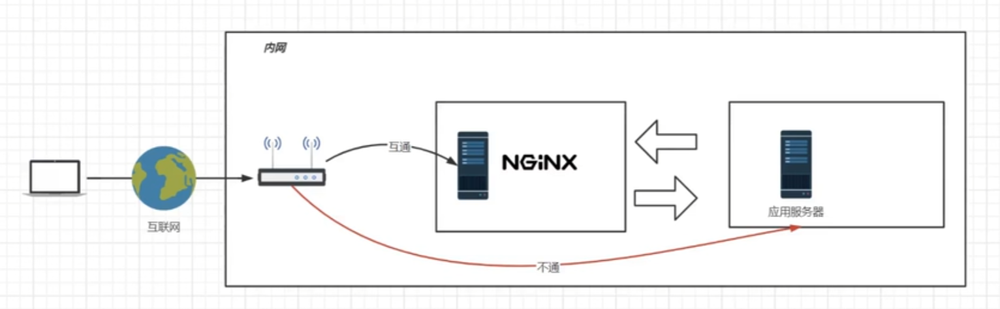
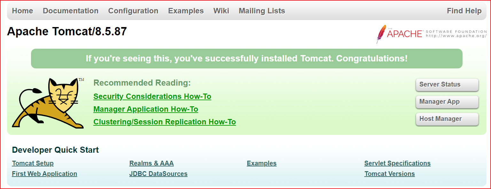
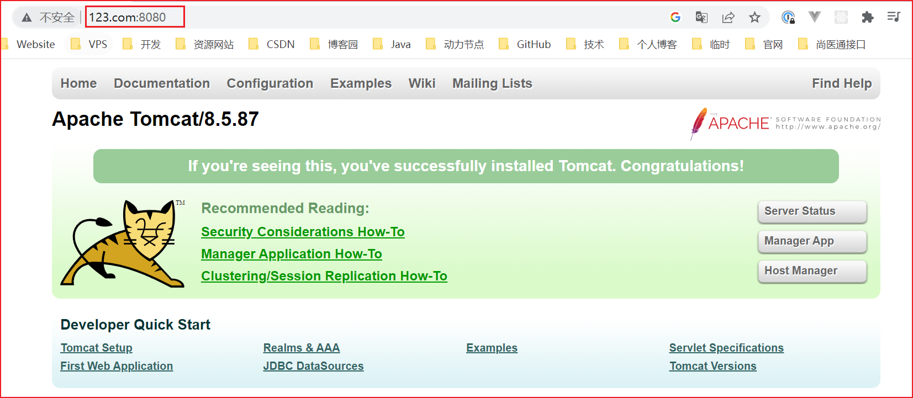
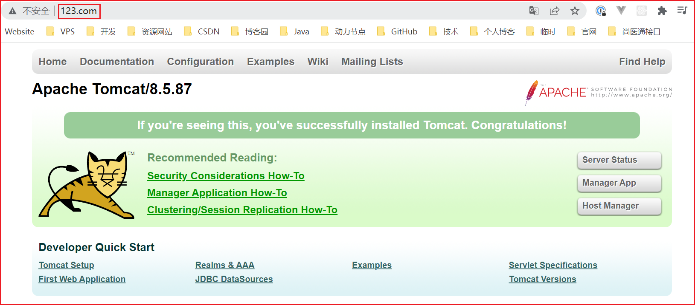
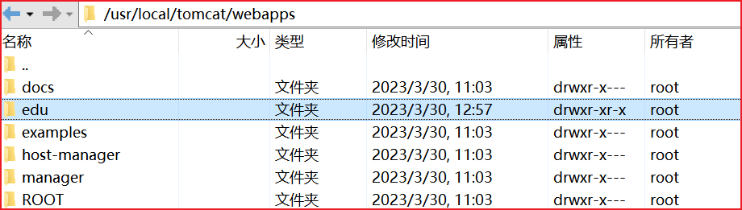
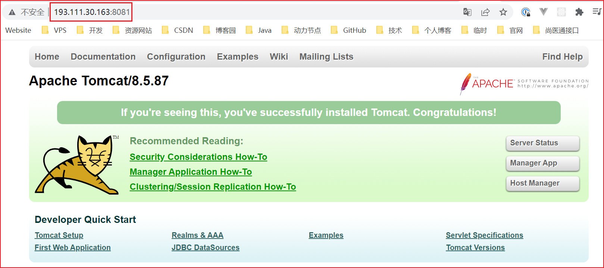
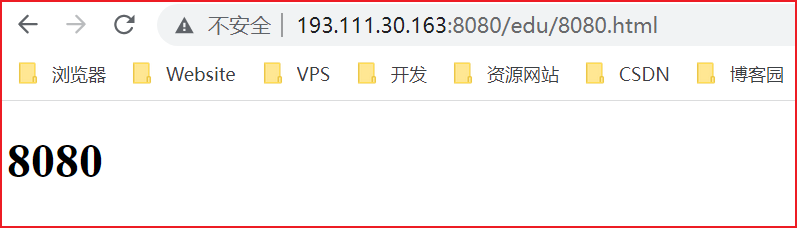
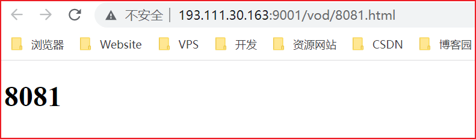

# Nginx 反向代理

## 什么是反向代理？

反向代理：这种代理方式叫做隧道代理。有性能瓶颈，因为所有的数据都经过 Nginx，所以 Nginx 服务器的性能至关重要



## 反向代理案例

### nginx 跳转 tomcat1

实现效果：使用 nginx 反向代理，访问 www.123.com 直接跳转到 `193.111.30.163:8080` Tomcat 欢迎页面。

浏览器输入`193.111.30.163:8080`，出现 Tomcat 欢迎页面



通过修改本地 host 文件，将 www.123.com 映射到 193.111.30.163

```sh
# 通过修改本地 host 文件，将 www.123.com 映射到 193.111.30.163
C:\Windows\System32\drivers\etc\host
193.111.30.163   www.123.com
```

浏览器输入`www.123.com:8080`，出现 Tomcat 欢迎页面

配置完成之后，我们便可以通过 www.123.com:8080 访问到第一步出现的 Tomcat 初始界面。那么如何只需要输入 www.123.com 便可以跳转到 Tomcat 初始界面呢？便用到 nginx 的反向代理。



在 nginx.conf 配置文件中增加如下配置

```sh
# 先拷贝一份备份
cp nginx.conf nginx.conf.bak
```

```nginx
# 默认为 1，表示开启一个业务进程
worker_processes  1; 

events {
	# 单个业务进程可接受连接数
    worker_connections  1024;
}

http {
    # 引入 http mime 类型
    include       mime.types;
    # 如果 mime 类型没匹配上，默认使用二进制流的方式传输。
    default_type  application/octet-stream;
	
	 # 使用 linux 的 sendfile(socket, file, len) 高效网络传输，也就是数据 0 拷贝。
    sendfile        on;
    keepalive_timeout  65;

    # 配置虚拟主机
    # server {
    #     listen       80;
    #     server_name  localhost;

    #     location / {
    #         root   html;
    #         index  index.html index.htm;
    #     }
    #     error_page   500 502 503 504  /50x.html;
    #     location = /50x.html {
    #         root   html;
    #     }
    # }

    # 配置虚拟主机 
    # 以下的意思是：访问 www.123.com。跳转到本地的 193.111.30.163:8080
    server {
        listen       80;
        server_name  www.123.com;

        location / {
            proxy_pass http://127.0.0.1:8080;
        }
    }
}
```

如上配置，我们监听 80 端口，访问域名为 www.123.com，不加端口号时默认为 80 端口，故访问该域名时会跳转到 127.0.0.1:8080 路径上。在浏览器端输入 www.123.com 结果如下：



### ngixn 跳转 tomcat2

实现效果：使用 nginx 反向代理，根据访问的路径跳转到不同端口的服务中

nginx 监听端口为 9001，

访问 http://193.111.30.163:9001/edu/ 直接跳转到 193.111.30.163:8080

访问 http://193.111.30.163:9001/vod/ 直接跳转到 193.111.30.163:8081

准备两个 tomcat，一个 8081 端口，一个 8082 端口，并准备好测试的页面

[修改 tomcat 端口](https://blog.csdn.net/weixin_44842084/article/details/104961800)

```sh
# 修改端口号码
vim server.xml

<Connector port="8081" protocol="HTTP/1.1"
               connectionTimeout="20000"
               redirectPort="8443" />
# 因为这里是胡乱修改的，就不展示了，只要两台 tomcat 端口号不冲突就行
```

8080




```html
<!DOCTYPE html>
<html lang="en">
<head>
    <meta charset="UTF-8">
    <title>8080</title>
</head>
<body>
    <h1>8080</h1>
</body>
</html>
```

8081




```html
<!DOCTYPE html>
<html lang="en">
<head>
    <meta charset="UTF-8">
    <title>8081</title>
</head>
<body>
    <h1>8081</h1>
</body>
</html>
```

修改 nginx 的配置文件

```nginx
# 默认为 1，表示开启一个业务进程
worker_processes  1; 

events {
	# 单个业务进程可接受连接数
    worker_connections  1024;
}

http {
    # 引入 http mime 类型
    include       mime.types;
    # 如果 mime 类型没匹配上，默认使用二进制流的方式传输。
    default_type  application/octet-stream;
	
	 # 使用 linux 的 sendfile(socket, file, len) 高效网络传输，也就是数据 0 拷贝。
    sendfile        on;
    keepalive_timeout  65;

    # 配置虚拟主机
    # server {
    #     listen       80;
    #     server_name  localhost;

    #     location / {
    #         root   html;
    #         index  index.html index.htm;
    #     }
    #     error_page   500 502 503 504  /50x.html;
    #     location = /50x.html {
    #         root   html;
    #     }
    # }

    # # 配置虚拟主机 
    # # 以下的意思是：访问 www.123.com。跳转到本地的 193.111.30.163:8080
    # server {
    #     listen       80;
    #     server_name  www.123.com;

    #     location / {
    #         proxy_pass http://127.0.0.1:8080;
    #     }
    # }

    # 配置虚拟主机 
    # 以下的意思是：访问 www.123.com。跳转到本地的 193.111.30.163:8080
    server {
        listen       9001;
        server_name  localhost;

        # 用于匹配 edu 的 uri，区分大小写
        location ~ /edu {
            proxy_pass  http://193.111.30.163:8080;
        }
	
        # 用于匹配 vod 的 uri，不区分大小写
        location ~ /vod {
            proxy_pass  http://193.111.30.163:9999;
        }
    }
}
```

访问 http://193.111.30.163:9001/edu/8080.html



访问 http://193.111.30.163:9001/vod/8081.html



