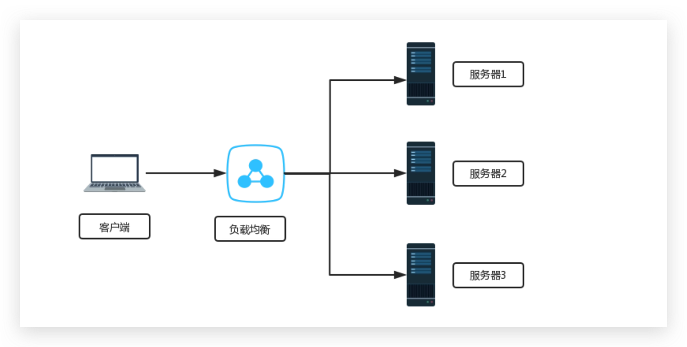
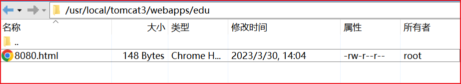

# Nginx 负载均衡

负载均衡：把请求，按照一定算法规则，分配给多台业务服务器（即使其中一个坏了/维护升级，还有其他服务器可以继续提供服务）



## 配置负载均衡

首先准备两个同时启动的 Tomcat

在 8081 中添加和 8080 一样的 edu 文件夹，测试 Nginx 能否访问不同的服务器进行负载均衡



在 nginx.conf 中进行配置

```nginx {62-68}
# 默认为 1，表示开启一个业务进程
worker_processes  1; 

events {
	# 单个业务进程可接受连接数
    worker_connections  1024;
}

http {
    # 引入 http mime 类型
    include       mime.types;
    # 如果 mime 类型没匹配上，默认使用二进制流的方式传输。
    default_type  application/octet-stream;
	
	 # 使用 linux 的 sendfile(socket, file, len) 高效网络传输，也就是数据 0 拷贝。
    sendfile        on;
    keepalive_timeout  65;

    # 配置虚拟主机
    # server {
    #     listen       80;
    #     server_name  localhost;

    #     location / {
    #         root   html;
    #         index  index.html index.htm;
    #     }
    #     error_page   500 502 503 504  /50x.html;
    #     location = /50x.html {
    #         root   html;
    #     }
    # }

    # # 配置虚拟主机 
    # # 以下的意思是：访问 www.123.com。跳转到本地的 193.111.30.163:8080
    # server {
    #     listen       80;
    #     server_name  www.123.com;

    #     location / {
    #         proxy_pass http://127.0.0.1:8080;
    #     }
    # }

    # # 配置虚拟主机 
    # # 以下的意思是：访问 www.123.com。跳转到本地的 193.111.30.163:8080
    # server {
    #     listen       9001;
    #     server_name  localhost;

    #     # 用于匹配 edu 的 uri，区分大小写
    #     location ~ /edu {
    #         proxy_pass  http://193.111.30.163:8080;
    #     }
	
    #     # 用于匹配 vod 的 uri，不区分大小写
    #     location ~ /vod {
    #         proxy_pass  http://193.111.30.163:9999;
    #     }
    # }

    # 负载均衡配置
    upstream myserver{
        # ip_hash; # 默认是轮询策略
        # docker容器起的 tomcat 服务，端口不同
        server 193.111.30.163:8080 weight=1;
        server 193.111.30.163:9999 weight=1;
    }
    
    # 配置虚拟主机 
    # 以下的意思是：访问 www.123.com。跳转到本地的 193.111.30.163:8080
    server {
        listen       9001;
        server_name  localhost;

        # 用于匹配 edu 的 uri，区分大小写
        location ~ /edu {
            proxy_pass  http://myserver;
            proxy_connect_timeout 10;
        }
	
        # 用于匹配 vod 的 uri，不区分大小写
        location ~ /vod {
            proxy_pass  http://193.111.30.163:9999;
        }
    }
}
```

访问 http://193.111.30.163:9001/edu/8080.html


随着互联网信息的爆炸性增长，负载均衡（load balance）已经不再是一个很陌生的话题，顾名思义，负载均衡即是将负载分摊到不同的服务单元，既保证服务的可用性，又保证响应足够快，给用户很好的体验。快速增长的访问量和数据流量催生了各式各样的负载均衡产品，很多专业的负载均衡硬件提供了很好的功能，但却价格不菲，这使得负载均衡软件大受欢迎，nginx 就是其中的一个，在 linux 下有 Nginx、LVS、Haproxy 等等服务可以提供负载均衡服务，而且 Nginx 提供了几种分配方式 (策略)：

## 负载均衡策略

### ✨轮询（默认）（常用）

每个请求按时间顺序逐一分配到不同的后端服务器，如果后端服务器 down 掉，能自动剔除。

虽然存在 session 的问题，但是可以在 Java 客户端通过 JWT 解决

### weight（常用）

weight 代表权重默认为 1，权重越高被分配的客户端越多

指定轮询几率，weight 和访问比率成正比，用于后端服务器性能不均的情况。

```nginx
# 负载均衡配置
upstream myserver{
    server 193.111.30.163:8080 weight=1;
    server 193.111.30.163:9999 weight=10;
}

upstream myserver{
    # backup 表示备用机器，平时不参与负载均衡，没有服务器用了再启用
    server 193.111.30.163:8080 weight=1 backup;
    # down 表示不参与负载均衡
    server 193.111.30.163:9999 weight=10 down;
}
```

- down：表示当前的 server 暂时不参与负载
- weight：默认为 1。weight 越大，负载的权重就越大。
- backup：其它所有的非 backup 机器 down 或者忙的时候，请求 backup 机器

### ip_hash（不常用）

每个请求按访问 ip 的 hash 结果分配，这样每个访客固定访问一个后端服务器，可以解决 session 的问题。 

```nginx
# 负载均衡配置
upstream myserver{
    ip_hash; 
    server 193.111.30.163:8080 weight=10;
    server 193.111.30.163:9999 weight=10;
}
```

### fair（第三方）（不常用）

按后端服务器的响应时间来分配请求，响应时间短的优先分配。

```nginx
# 负载均衡配置
upstream myserver{
    server 193.111.30.163:8080;
    server 193.111.30.163:9999;
    fair;
}
```

### least_conn（了解）（不常用）

最少连接访问：就是将请求访问发给连接数最少的 Nginx 服务器上

### url_hash（了解）（不常用）

根据用户访问的 url 定向转发请求
