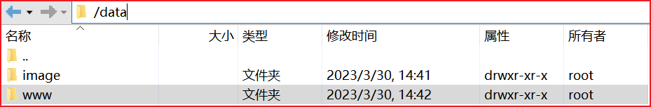
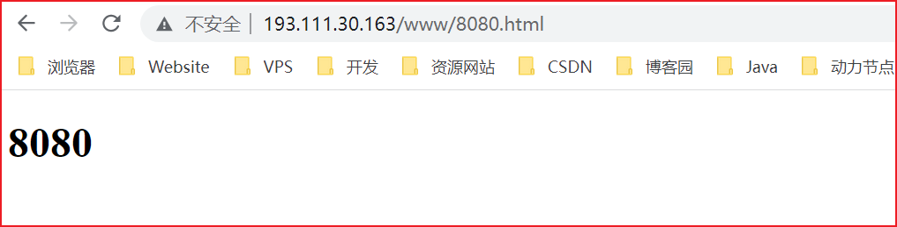
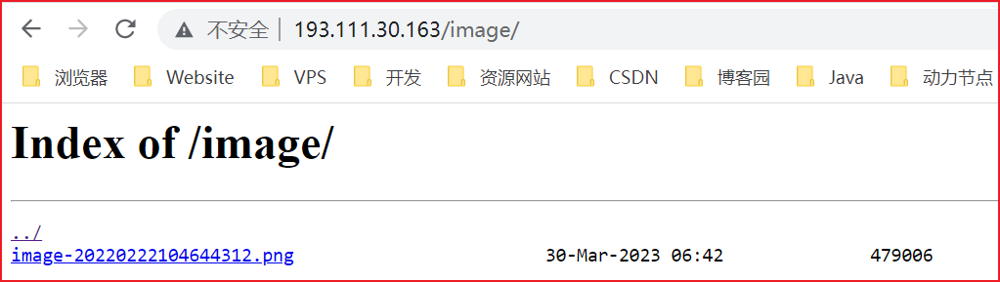

# Nginx 动静分离

## 动静分离概念

Nginx 动静分离简单来说就是把动态跟静态请求分开，不能理解成只是单纯的把动态页面和静态页面物理分离。严格意义上说应该是动态请求跟静态请求分开，可以理解成使用 Nginx 处理静态页面，Tomcat 处理动态页面。

动静分离从目前实现角度来讲大致分为两种，一种是纯粹把静态文件独立成单独的域名，放在独立的服务器上，也是目前主流推崇的方案；另外一种方法就是动态跟静态文件混合在一起发布，通过 nginx 来分开。

通过 location 指定不同的后缀名实现不同的请求转发。

通过 expires 参数设置，可以使浏览器缓存过期时间，减少与服务器之前的请求和流量。具体 Expires 定义：是给一个资源设定一个过期时间，也就是说无需去服务端验证，直接通过浏览器自身确认是否过期即可，所以不会产生额外的流量。此种方法非常适合不经常变动的资源。（如果经常更新的文件，不建议使用 Expires 来缓存），

我这里设置 3d，表示在这 3 天之内访问这个 URL，发送一个请求，比对服务器该文件最后更新时间没有变化，则不会从服务器抓取，返回状态码 304，如果有修改，则直接从服务器重新下载，返回状态码 200。

## 配置 Nginx 静态服务器



找到 nginx 安装目录，打开 `/conf/nginx.conf` 配置文件，

```nginx
# 默认为 1，表示开启一个业务进程
worker_processes  1; 

events {
	# 单个业务进程可接受连接数
    worker_connections  1024;
}

http {
    # 引入 http mime 类型
    include       mime.types;
    # 如果 mime 类型没匹配上，默认使用二进制流的方式传输。
    default_type  application/octet-stream;
	
	 # 使用 linux 的 sendfile(socket, file, len) 高效网络传输，也就是数据 0 拷贝。
    sendfile        on;
    keepalive_timeout  65;

    # 配置虚拟主机
    # server {
    #     listen       80;
    #     server_name  localhost;

    #     location / {
    #         root   html;
    #         index  index.html index.htm;
    #     }
    #     error_page   500 502 503 504  /50x.html;
    #     location = /50x.html {
    #         root   html;
    #     }
    # }

    # # 配置虚拟主机 
    # # 以下的意思是：访问 www.123.com。跳转到本地的 193.111.30.163:8080
    # server {
    #     listen       80;
    #     server_name  www.123.com;

    #     location / {
    #         proxy_pass http://127.0.0.1:8080;
    #     }
    # }

    # # 配置虚拟主机 
    # # 以下的意思是：访问 www.123.com。跳转到本地的 193.111.30.163:8080
    # server {
    #     listen       9001;
    #     server_name  localhost;

    #     # 用于匹配 edu 的 uri，区分大小写
    #     location ~ /edu {
    #         proxy_pass  http://193.111.30.163:8080;
    #     }
	
    #     # 用于匹配 vod 的 uri，不区分大小写
    #     location ~ /vod {
    #         proxy_pass  http://193.111.30.163:9999;
    #     }
    # }

    # # 负载均衡配置
    # upstream myserver{
    #     # ip_hash; # 策略
    #     server 193.111.30.163:8080 weight=1;
    #     server 193.111.30.163:9999 weight=1;
    # }
    
    # # 配置虚拟主机 
    # # 以下的意思是：访问 www.123.com。跳转到本地的 193.111.30.163:8080
    # server {
    #     listen       9001;
    #     server_name  localhost;

    #     # 用于匹配 edu 的 uri，区分大小写
    #     location ~ /edu {
    #         proxy_pass  http://myserver;
    #         proxy_connect_timeout 10;
    #     }
	
    #     # 用于匹配 vod 的 uri，不区分大小写
    #     location ~ /vod {
    #         proxy_pass  http://193.111.30.163:9999;
    #     }
    # }
    
    # 配置虚拟主机 
    # 以下的意思是：访问 www.123.com。跳转到本地的 193.111.30.163:8080
    server {
        listen       80;
        server_name  193.111.30.163;

        # 查找静态资源
        location /www/ {
            root    /data/; # 返回date下的www
            index index.html index.htm;
        }

        # 查找静态资源
        location /image/{
            root    /data/; # 返回date下的image
            autoindex on; # 列出访问目录
        } 
    }
}
```

最后检查 Nginx 配置是否正确即可，然后测试动静分离是否成功，之需要删除后端 tomcat 服务器上的某个静态文件，查看是否能访问，如果可以访问说明静态资源 nginx 直接返回了，不走后端 tomcat 服务器

访问 http://193.111.30.163/www/8080.html



访问 http://193.111.30.163/image/



## location 指令说明

该指令用于匹配 URL。

```nginx
location [ = | ~ | ~* | ^~ ] uri {
    proxy_pass  http://193.111.30.163:9999;
}
```

语法如下：

1. `=`用于不含正则表达式的 uri 前，要求请求字符串与 uri 严格匹配，如果匹配成功，就停止继续向下搜索并立即处理该请求。
2. `~`用于表示 uri 包含正则表达式，并且区分大小写。
3. `~*`用于表示 uri 包含正则表达式，并且不区分大小写。
4. `^~`用于不含正则表达式的 uri 前，要求 Nginx 服务器找到标识 uri 和请求字符串匹配度最高的 location 后，立即使用此 location 处理请求，而不再使用 location 块中的正则 uri 和请求字符串做匹配。

注意：如果 uri 包含正则表达式，则必须要有 `~` 或者 `~*` 标识。

## 使用正则配置动静分离

```nginx
server {
        listen       80;
        server_name  localhost;
				
				location / { # /的优先级比较低，如果下面的location没匹配到，就会走http://xxx这个地址的机器
        		proxy_pass http://xxx;
        }
        
        location /css {  # root指的是html，location/css指的是root下的css，所以地址就是html/css
        		root html;
            index  index.html index.htm;
        }
    
        location ~*/(js|css|img){ # 表示正则匹配html下的js|css|img文件，可以少些几个 location
            root html;
          index  index.html index.htm;
        }

        error_page   500 502 503 504  /50x.html;
        location = /50x.html {
            root   html;
        }
}
```

## alias 与 root

```nginx
location /css {
    alias /usr/local/nginx/static/css;
    index index.html index.htm;
}
```

**root 用来设置根目录，而 alias 在接受请求的时候在路径上不会加上 location。**

alias 指定的目录是准确的，即 location 匹配访问的 path 目录下的文件直接是在 alias 目录下查找的

root 指定的目录是 location 匹配访问的 path 目录的上一级目录，这个 path 目录一定要是真实存在 root 指定目录下的

使用 alias 标签的目录块中不能使用 rewrite 的 break（具体原因不明）

alias 匹配的目录后面必须要加上"/"符号

root 匹配的目录后面带不带"/"，都不会影响访问

## UrlRewrite

```sh
rewrite是URL重写的关键指令，根据regex（正则表达式）部分内容，重定向到replacement，结尼是flag标记。

rewrite    <regex>   <replacement>  [flag];
关键字		正则		替代内容     flagt标记

正则：per1使用正则表达式语句进行规则匹配
替代内容：将正则匹配的内容替换成replacement

flag标记说明：
last     # 本条规则匹配完成后，继续向下匹配新的1ocation URI规则
break    # 本条规则匹配完成即终止，不再匹配后面的任何规则

redirect  # 返回302临时重定向，游览器地址会显示跳转后的URL地址
permanent  # 返回301永久重定向，测览器地址栏会显示跳转后的URL地址
```

> 浏览器地址栏访问 `/123.html`实际上是访问`/index.jsp?pageNum=123`

```nginx
server {
    listen       80;
    server_name  localhost;
    location / { 
        rewrite ^/([0-9]+).html$ /index.jsp?pageNum=$1  break;
        proxy_pass http://xxx;
    }
}
```

