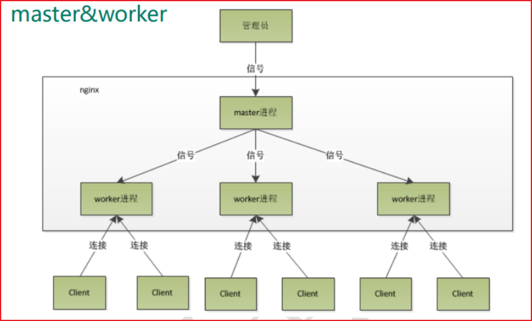
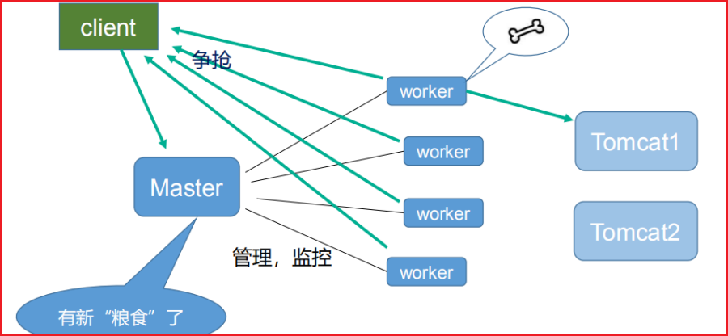
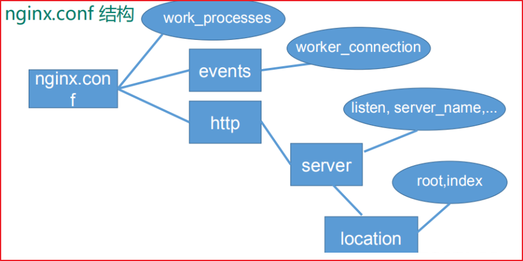

# Nginx 原理与优化参数配置





## master-workers 的机制的好处 

首先，对于每个 worker 进程来说，独立的进程，不需要加锁，所以省掉了锁带来的开销，同时在编程以及问题查找时，也会方便很多。其次，采用独立的进程，可以让互相之间不会影响，一个进程退出后，其它进程还在工作，服务不会中断，master 进程则很快启动新的 worker 进程。当然，worker 进程的异常退出，肯定是程序有 bug 了，异常退出，会导致当前 worker 上的所有请求失败，不过不会影响到所有请求，所以降低了风险。

## 需要设置多少个 worker

Nginx 同 redis 类似都采用了 io 多路复用机制，每个 worker 都是一个独立的进程，但每个进程里只有一个主线程，通过异步非阻塞的方式来处理请求，即使是千上万个请求也不在话下。每个 worker 的线程可以把一个 cpu 的性能发挥到极致。所以 **worker 数和服务器的 cpu 数相等是最为适宜** 的。设少了会浪费 cpu，设多了会造成 cpu 频繁切换上下文带来的损耗。

## 设置 worker 数量

```nginx
worker_processes 4

# work 绑定 cpu(4 work 绑定 4cpu)。
worker_cpu_affinity 0001 0010 0100 1000

# work 绑定 cpu (4 work 绑定 8cpu 中的 4 个) 。
worker_cpu_affinity 0000001 00000010 00000100 00001000
```

## 连接数 worker_connection

这个值是表示每个 worker 进程所能建立连接的最大值，所以，一个 nginx 能建立的最大连接数，应该是 `worker_connections * worker_processes`。当然，这里说的是最大连接数，

- 对于 HTTP 请求本地资源来说，能够支持的最大并发数量是 `worker_connections * worker_processes`，
- 如果是支持 http1.1 的浏览器每次访问要占两个连接，所以普通的静态访问最大并发数是：`worker_connections * worker_processes /2`，
- 如果是 HTTP 作 为反向代理来说，最大并发数量应该是 `worker_connections * worker_processes/4`。因为作为反向代理服务器，每个并发会建立与客户端的连接和与后端服务的连接，会占用两个连接。



## 面试题

```
1、一个 master 和多个 woker 有好处
（1）可以使用 nginx –s reload 热部署，利用 nginx 进行热部署操作
（2）每个 woker 是独立的进程，如果有其中的一个 woker 出现问题，其他 woker 独立的，继续进行争抢，实现请求过程，不会造成服务中断

2、设置多少个 woker 合适
worker 数和服务器的 cpu 数相等是最为适宜的

3、连接数 worker_connection
第一个：发送请求，占用了 woker 的几个连接数？
答案：静态连接 2 个（来回）动态连接要访问 tomcat 4 个 (来来回回)

4、nginx 有一个 master，有四个 woker，每个 woker 支持最大的连接数 1024，支持的最大并发数是多少？
普通的静态访问最大并发数是：worker_connections * worker_processes /2，
而如果是 HTTP 作 为反向代理来说，最大并发数量应该是 worker_connections * worker_processes/4。
```
