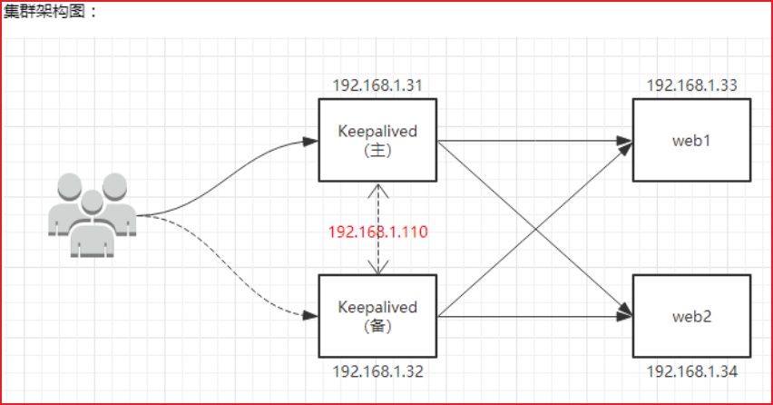

# Nginx 搭建高可用集群

## 安装 Nginx

略

## 安装 keepalived

```sh
apt install -y keepalived
yum -y install keepalived
# 安装之后，在 etc 里面生成目录 keepalived，有文件 keepalived.conf
```

## Keepalived+Nginx 高可用集群（主从模式）

### 什么是 nginx 高可用？

- 需要两台 nginx 服务器
- 需要 keepalived
- 需要虚拟 ip




### 修改主机 keepalived.conf

```conf
# 定义防火墙全局配置中的邮件通知和 SMTP 服务器相关的参数。
global_defs {
    # 定义了邮件通知的收件人，可以是多个人。
    # 在防火墙出现故障或者状态改变时，系统会自动向这些收件人发送通知邮件。
    notification_email {
        acassen@firewall.loc
        failover@firewall.loc
        sysadmin@firewall.loc
    }
    # 定义了邮件通知的发件人
    notification_email_from Alexandre.Cassen@firewall.loc
    # 定义了 SMTP 服务器的 IP 地址或域名，用来发送邮件
    smtp_server 124.222.44.188
    # 定义了 SMTP 连接超时时间，单位为秒
    smtp_connect_timeout 30
    # 主机名字 /etc/host
    router_id VM-16-3-centos
}

# 脚本配置
# 这个脚本可以在 VRRP 协议中使用，以确保可用性和容错性。
# 如果 Nginx 服务出现故障，VRRP 协议可以自动切换到备用 Nginx 服务器，保证服务的可用性。
vrrp_script chk_http_port {
    # 脚本名称 chk_http_port
    script "/usr/local/src/nginx_check.sh"
    # 检测脚本执行的间隔
    interval 2
    # 权重值为 2
    weight 2
}

# 定义一个 VRRP 实例，名称为 VI_1
vrrp_instance VI_1 {
    # 指定当前设备的状态为备份（备份服务器上将 MASTER 改为 BACKUP）
    state MASTER
    # 指定 VRRP 实例使用的网卡接口，这里是 eth0
    interface eth0
    # 主、备机的 virtual_router_id 必须相同
    virtual_router_id 51
    # 主、备机取不同的优先级，主机值较大，备份机值较小
    priority 90
    # 心跳间隔为 1 秒
    advert_int 1

    # 指定 VRRP 实例的认证方式和密码
    authentication {
        # 指定认证方式为密码认证
        auth_type PASS
        # 指定认证密码为 1111
        auth_pass 1111
    }

    # 指定 VRRP 实例的虚拟 IP 地址，这里是 192.168.17.50
    virtual_ipaddress {
        192.168.17.50
    }
}


# 无配置版本
global_defs {
    notification_email {
        acassen@firewall.loc
        failover@firewall.loc
        sysadmin@firewall.loc
    }
    notification_email_from Alexandre.Cassen@firewall.loc
    smtp_server 124.222.44.188
    smtp_connect_timeout 30
    router_id VM-16-3-centos
}


vrrp_script chk_http_port {
    script "/usr/local/src/nginx_check.sh"
    interval 2
    weight 2
}


vrrp_instance VI_1 {
    state MASTER
    interface eth0
    virtual_router_id 51
    priority 90
    advert_int 1
    authentication {
        auth_type PASS
        auth_pass 1111
    }
    virtual_ipaddress {
        192.168.17.50
    }
}
```

### 修改从机 keepalived.conf

```java
# 定义防火墙全局配置中的邮件通知和SMTP服务器相关的参数。
global_defs {
    # 定义了邮件通知的收件人，可以是多个人。
    # 在防火墙出现故障或者状态改变时，系统会自动向这些收件人发送通知邮件。
    notification_email {
        acassen@firewall.loc
        failover@firewall.loc
        sysadmin@firewall.loc
    }
    # 定义了邮件通知的发件人
    notification_email_from Alexandre.Cassen@firewall.loc
    # 定义了SMTP服务器的IP地址或域名，用来发送邮件
    smtp_server 124.222.44.188
    # 定义了SMTP连接超时时间，单位为秒
    smtp_connect_timeout 30
    # 主机名字 /etc/host
    router_id VM-16-3-centos
}

# 脚本配置
# 这个脚本可以在VRRP协议中使用，以确保可用性和容错性。
# 如果Nginx服务出现故障，VRRP协议可以自动切换到备用Nginx服务器，保证服务的可用性。
vrrp_script chk_http_port {
    # 脚本名称 chk_http_port
    script "/usr/local/src/nginx_check.sh"
    # 检测脚本执行的间隔
    interval 2
    # 权重值为2
    weight 2
}

# 定义一个VRRP实例，名称为VI_1
vrrp_instance VI_1 {
    # 指定当前设备的状态为备份（备份服务器上将 MASTER 改为 BACKUP）
    state BACKUP
    # 指定 VRRP 实例使用的网卡接口，这里是 eth0
    interface eth0
    # 主、备机的 virtual_router_id 必须相同
    virtual_router_id 51
    # 主、备机取不同的优先级，主机值较大，备份机值较小
    priority 90
    # 心跳间隔为1秒
    advert_int 1

    # 指定 VRRP 实例的认证方式和密码
    authentication {
        # 指定认证方式为密码认证
        auth_type PASS
        # 指定认证密码为1111
        auth_pass 1111
    }

    # 指定VRRP实例的虚拟IP地址，这里是192.168.17.50
    virtual_ipaddress {
        192.168.17.50
    }
}


# 无配置版本
global_defs {
    notification_email {
        acassen@firewall.loc
        failover@firewall.loc
        sysadmin@firewall.loc
    }
    notification_email_from Alexandre.Cassen@firewall.loc
    smtp_server 124.222.44.188
    smtp_connect_timeout 30
    router_id VM-16-3-centos
}


vrrp_script chk_http_port {
    script "/usr/local/src/nginx_check.sh"
    interval 2
    weight 2
}


vrrp_instance VI_1 {
    state BACKUP
    interface eth0
    virtual_router_id 51
    priority 90
    advert_int 1
    authentication {
        auth_type PASS
        auth_pass 1111
    }
    virtual_ipaddress {
        192.168.17.50
    }
}
```

### 脚本文件

```sh
vim /usr/local/src/nginx_check.sh

#!/bin/bash
A=`ps -C nginx –no-header |wc -l`
  if [ $A -eq 0 ];then
    /usr/local/usr/sbin/nginx
  sleep 2
  if [ `ps -C nginx --no-header |wc -l` -eq 0 ];then
    killall keepalived
  fi
fi
```

### 重启服务

```sh
systemctl restart nginx
systemctl start keepalived.service
```

### 最终测试

没什么用，心态已经爆炸


