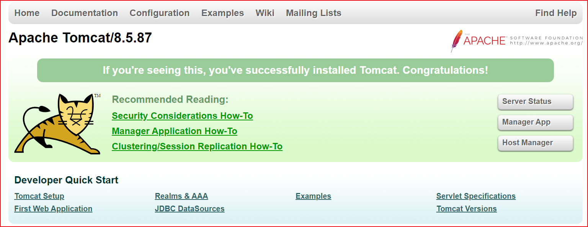

# Tomcat 和 Java 安装

[wget 镜像站](https://mirrors.cnnic.cn)

## Tomcat 安装

```sh
# 解压
# 如果 wget 报错,重新安装 wget
yum -y remove wget
yum -y install wget
cd  /opt/tomcat
wget https://mirrors.cnnic.cn/apache/tomcat/tomcat-8/v8.5.87/bin/apache-tomcat-8.5.87.tar.gz

# 解压
tar -zxvf apache-tomcat-8.5.87.tar.gz -C /usr/local
mv apache-tomcat-8.5.87 tomcat

# 启动,需要 Java 环境支持
./startup.sh

# 查看输出日期
tail -f catalina.out
```

## Java8 安装

```sh
# 解压
tar -zxvf jdk-8u181-linux-x64.tar.gz -C /usr/local
mv jdk1.8.0_181 jdk

# 编辑配置文件
vim /etc/profile

# jdk 安装目录
export JAVA_HOME=/usr/local/jdk
export JRE_HOME=${JAVA_HOME}/jre
export CLASSPATH=.:${JAVA_HOME}/lib:${JRE_HOME}/lib:$CLASSPATH
export JAVA_PATH=${JAVA_HOME}/bin:${JRE_HOME}/bin
export PATH=$PATH:${JAVA_PATH}

# 刷新配置文件
source /etc/profile
```

## 测试

http://193.111.30.163:8080/


