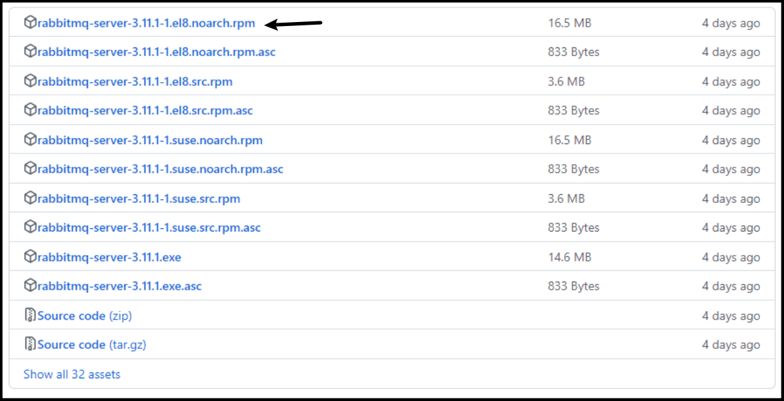
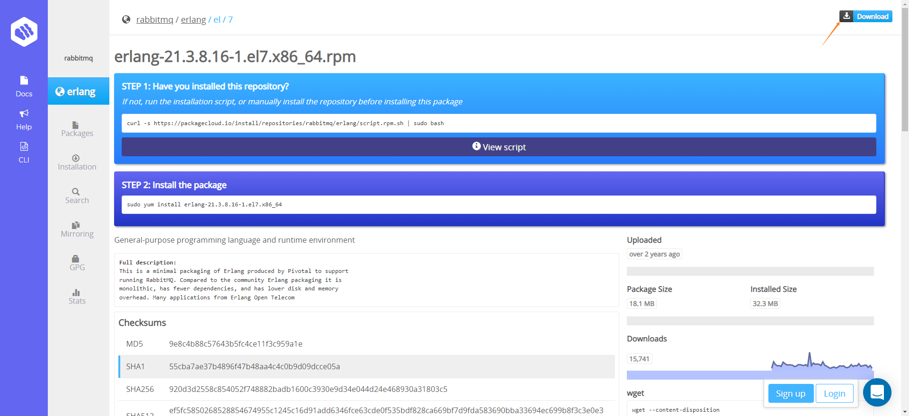
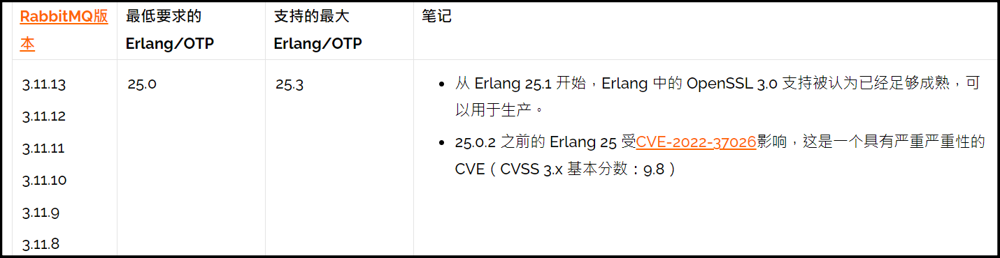
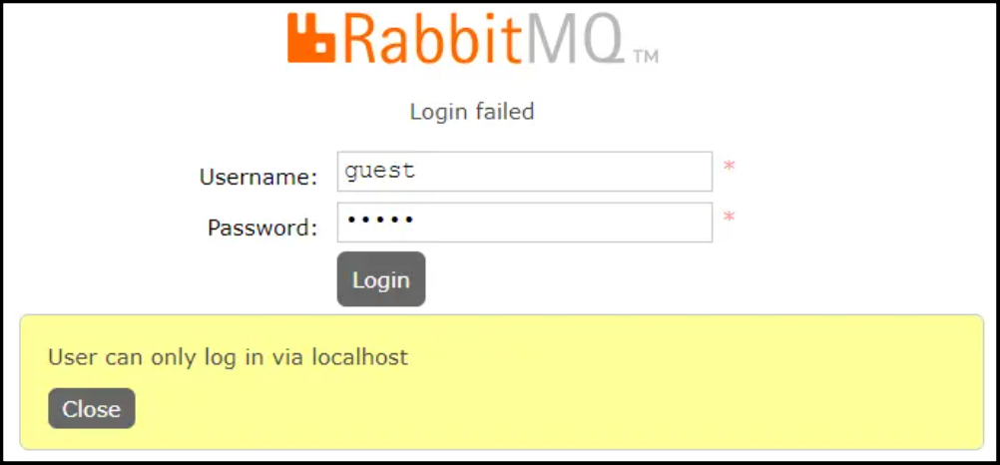

# RabbitMQ 安装

## 下载 RabbitMQ

RabbitMQ: https://github.com/rabbitmq/rabbitmq-server/releases

选择以 `noarch.rpm` 结尾的安装包



## 下载 Erlang

Erlang: https://packagecloud.io/rabbitmq/erlang

RabbitMQ 是采用 Erlang 语言开发的，所以系统环境必须提供 Erlang 环境，需要先安装 Erlang。



## 版本对比

RabbitMQ 和 Erlang 版本对比：https://www.rabbitmq.com/which-erlang.html



## 安装流程

### ①上传

```sh
# 将在 Windows 或 Mac 下载好的安装包传输到 Linux 中。
# 首先在 Linux 的 `/usr/local` 目录下创建一个文件夹 `rabbitmq`。请根据需求自定义路径
# 利用 `xftp` 工具将两个 `.rpm` 文件传输到刚刚创建的文件夹里
mkdir /usr/local/rabbitmq
```

### ②安装 Erlang

```sh
# 进入 /usr/local/rabbitmq 目录，解压安装 Erlang
cd /usr/local/rabbitmq
rpm -ivh erlang-21.3-1.el7.x86_64.rpm

# 安装完成后输入指令查看到版本号，代表成功
erl -v
```

### ③安装 RabbitMQ

```sh
# 在 RabiitMQ 安装过程中需要依赖 socat 插件，首先安装该插件
yum -y install socat

# 解压 RabbitMQ 安装包
rpm -ivh rabbitmq-server-3.8.8-1.el7.noarch.rpm
```

### ④启动

```sh
# 启动服务
systemctl start rabbitmq-server

# 查看服务状态
systemctl status rabbitmq-server

# 开机自启动
systemctl enable rabbitmq-server

# 停止服务
systemctl stop rabbitmq-server

# 重启服务
systemctl restart rabbitmq-server

# 启动 RabbitMQ 服务后，查看该服务状态，显示绿色的 active 则表示服务安装并启动成功
```

## Web 管理界面及授权操作

### 开启 web 管理界面

```sh
# 默认情况下，RabbitMQ 没有安装 Web 端的客户端软件，需要安装才可以生效
rabbitmq-plugins enable rabbitmq_management

# 安装完毕以后，重启服务	
systemctl restart rabbitmq-server
```

### 访问 web 管理界面

通过 `http://ip:15672` 访问，ip 为 Linux 的 ip。`rabbitmq` 有一个默认的账号密码 `guest`，但是登录该账号密码会出现权限问题

默认的账号密码仅限于本机 localhost 进行访问，所以需要添加一个远程登录的用户



```sh
# 创建账号和密码
rabbitmqctl add_user admin 123456

# 设置用户角色
rabbitmqctl set_user_tags admin administrator

# 为用户添加资源权限，添加配置、写、读权限
rabbitmqctl set_permissions -p "/" admin ".*" ".*" ".*"
```

### 角色级别

- `administrator`：可以登录控制台、查看所有信息、并对 rabbitmq 进行管理
- `monToring`：监控者；登录控制台，查看所有信息
- `policymaker`：策略制定者；登录控制台指定策略
- `managment`：普通管理员；登录控制

添加用户和权限后，再次访问 `http://ip:15672` 登录，输入添加好的用户名和密码，即可进入后台

### 其他指令

```sh
# 修改密码
rabbitmqctl change_ password 用户名 新密码

# 删除用户
rabbitmqctl delete_user 用户名

# 查看用户清单
rabbitmqctl list_user

# 查看 RabbitMQ 版本
rabbitmqctl version
```

## Docker 安装

官网：https://registry.hub.docker.com/_/rabbitmq/

```sh
# 安装启动 rabbitmq 容器
docker run -d --name mq -e RABBITMQ_DEFAULT_USER=admin -e RABBITMQ_DEFAULT_PASS=123456 -p 15672:15672 -p 5672:5672 rabbitmq:3-management
```

### 新添加一个账户

默认的`guest` 账户有访问限制，默认只能通过本地网络 (如 localhost) 访问，远程网络访问受限，所以在使用时我们一般另外添加用户，例如我们添加一个 root 用户：

```sh
# ①执行`docker exec -i -t 3ae bin/bash`进入到rabbitMq容器内部
docker exec -i -t myrabbit bin/bash

# ②执行`rabbitmqctl add_user root 123456` 添加用户，用户名为admin,密码为123456
rabbitmqctl add_user admin 123456 

# ③执行`abbitmqctl set_permissions -p / root ".*" ".*" ".*"` 赋予root用户所有权限
rabbitmqctl set_permissions -p / admin ".*" ".*" ".*"

# ④执行`rabbitmqctl set_user_tags root administrator`赋予root用户administrator角色
rabbitmqctl set_user_tags admin administrator

# ⑤执行`rabbitmqctl list_users`查看所有用户即可看到root用户已经添加成功
rabbitmqctl list_users
```

执行`exit`命令，从容器内部退出即可。这时我们使用 root 账户登录 web 界面也是可以的。到此，rabbitMq 的安装就结束了，接下里就实际代码开发。
