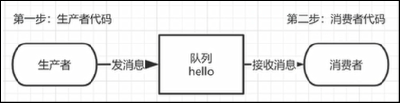
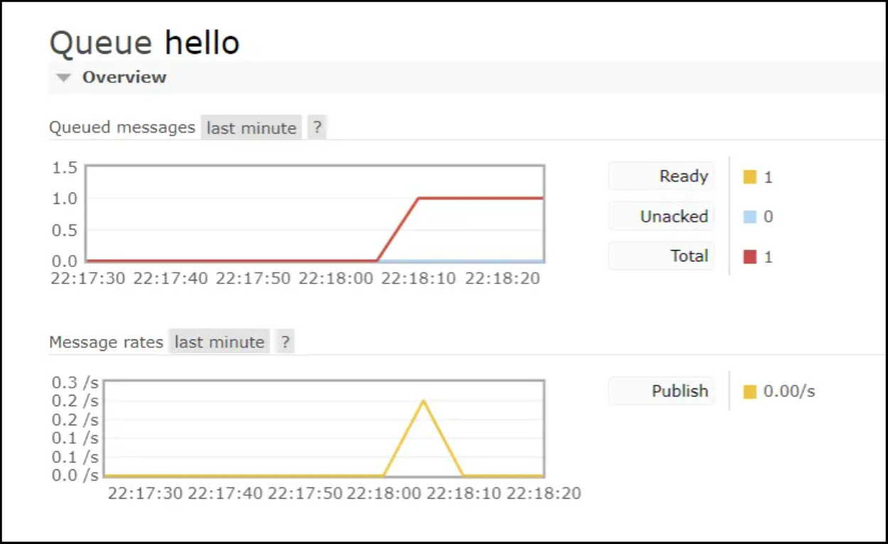
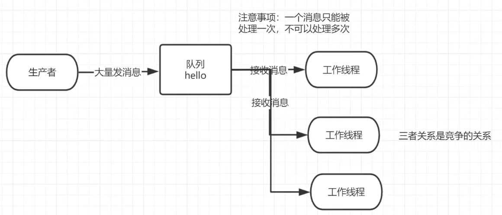
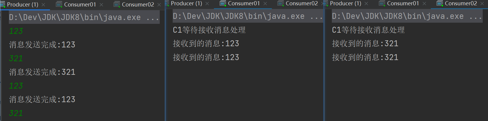
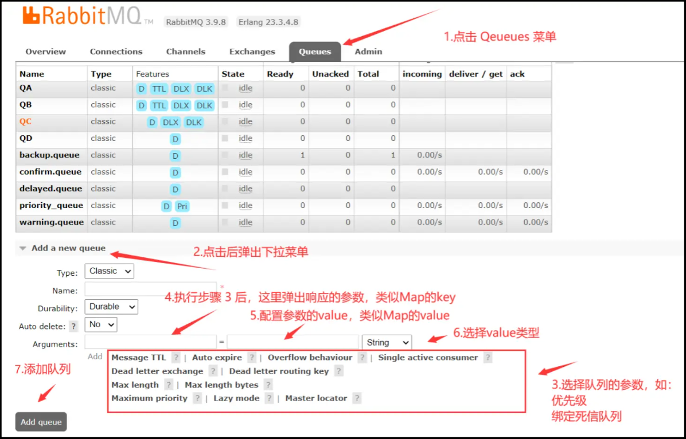

# RabbitMQ 入门案例

> Q86N1pO4HH1scZk2bx

## Hello world

我们将用 Java 编写两个程序。发送单个消息的生产者和接收消息并打印出来的消费者

在下图中，“P”是我们的生产者，“C”是我们的消费者。中间的框是一个队列 RabbitMQ 代表使用者保留的消息缓冲区


Java 进行连接的时候，需要 Linux 开放 5672 端口，否则会连接超时

访问 Web 界面的端口是 15672，连接服务器的端口是 5672



### POM 依赖

```xml
<!--指定 jdk 编译版本-->
<build>
    <plugins>
        <plugin>
            <groupId>org.apache.maven.plugins</groupId>
            <artifactId>maven-compiler-plugin</artifactId>
            <configuration>
                <source>8</source>
                <target>8</target>
            </configuration>
        </plugin>
    </plugins>
</build>
<dependencies>
    <!--rabbitmq 依赖客户端-->
    <dependency>
        <groupId>com.rabbitmq</groupId>
        <artifactId>amqp-client</artifactId>
        <version>5.8.0</version>
    </dependency>
    <!--操作文件流的一个依赖-->
    <dependency>
        <groupId>commons-io</groupId>
        <artifactId>commons-io</artifactId>
        <version>2.6</version>
    </dependency>
</dependencies>
```

### 消息生产者

创建一个类作为生产者，最终生产消息到 RabbitMQ 的队列里

步骤：

1. 创建 RabbitMQ 连接工厂
2. 进行 RabbitMQ 工厂配置信息
3. 创建 RabbitMQ 连接
4. 创建 RabbitMQ 信道
5. 生成一个队列
6. 发送一个消息到交换机，交换机发送到队列。"" 代表默认交换机

```java
public class Producer {
    //队列名称
    public static final String QUEUE_NAME = "hello";

    //发消息
    public static void main(String[] args) throws IOException, TimeoutException {
        Channel channel = RabbitMqUtils.getChannel();
        /**
         * 生成一个队列
         *  1.队列名
         *  2.消息是否持久化，默认情况下消息存储在内存中
         *  3.该队列是否只供一个消费之消费 是否进行消息共享 true 可以多个消费者消费 ,
         *                                  false 只能一个消费者消费
         *  4.是否自动删除 最后一个消费者端开连接后 该队列是否自动删除
         *  5.其他参数...null  死信队列...
         */
        channel.queueDeclare(QUEUE_NAME, false, false, false, null);
        //发消息
        String message = "hello world";
        /**
         *  1.发送到哪个交换机
         *  2.路由的 key 值是哪个
         *  3.其他参数信息
         *  4.发送的消息
         */
        channel.basicPublish("", QUEUE_NAME, null, message.getBytes(StandardCharsets.UTF_8));
        System.out.println("消息发送完毕");
    }
}
```



### 消息消费者

获取“生产者”发出的消息

```java
public class Consumer {
    //队列的名称
    public static final String QUEUE_NAME = "hello";

    //接收消息
    public static void main(String[] args) throws IOException, TimeoutException {
        Channel channel = RabbitMqUtils.getChannel();

        //声明接收消息
        DeliverCallback deliverCallback = (consumerTag, message) -> {
            System.out.println(new String(message.getBody()));
        };

        //取消消息时的回调
        CancelCallback cancelCallback = (consumerTag) -> {
            System.out.println("消息消费被中断");
        };

        /**
         * 消费者消费消息
         *  1.消费哪个队列
         *  2.消费成功之后是否自动应答
         *  3.消费者未成功消费的回调
         *  4.消费者取消消费的回调
         */
        channel.basicConsume(QUEUE_NAME, true, deliverCallback, cancelCallback);
    }
}
```

### 工具类

```java
public class RabbitMqUtils {
    // 获得信道
    public static Channel getChannel() throws IOException, TimeoutException {
        // 创建连接工厂
        ConnectionFactory factory = new ConnectionFactory();
        factory.setHost("193.111.30.163");
        factory.setUsername("admin");
        factory.setPassword("123456");
        Connection connection = factory.newConnection();
        return connection.createChannel();
    }
}
```

### 效果演示


## Work Queues

Work Queues 是工作队列（又称任务队列）的主要思想是避免立即执行资源密集型任务，而不得不等待它完成。相反我们安排任务在之后执行。我们把任务封装为消息并将其发送到队列。在后台运行的工作进程将弹出任务并最终执行作业。当有多个工作线程时，这些工作线程将一起处理这些任务。

### 轮询消费

轮询消费消息指的是轮流消费消息，即每个工作队列都会获取一个消息进行消费，并且获取的次数按照顺序依次往下轮流。

案例中生产者叫做 Task，一个消费者就是一个工作队列，启动两个工作队列消费消息，这个两个工作队列会以轮询的方式消费消息。



### 消息生产者

```java
public class Producer {

    //队列名称
    public static final String QUEUE_NAME = "work";

    //发送大量消息
    public static void main(String[] args) throws IOException, TimeoutException {

        Channel channel = RabbitMqUtils.getChannel();
        //队列的声明
        channel.queueDeclare(QUEUE_NAME, false, false, false, null);

        //发送消息
        //从控制台当中接受信息
        Scanner scanner = new Scanner(System.in);
        while (scanner.hasNext()) {
            String message = scanner.next();
            channel.basicPublish("", QUEUE_NAME, null, message.getBytes());
            System.out.println("消息发送完成：" + message);
        }
    }
}
```

### 消息消费者

#### ①工作线程一

```java
public class Consumer01 {
    public static final String TASK_QUEUE_NAME = "work";

    public static void main(String[] args) throws IOException, TimeoutException {
        Channel channel = RabbitMqUtils.getChannel();

        //接收消息
        System.out.println("C1 等待接收消息处理");

        //消息的接受
        DeliverCallback deliverCallback = (consumerTag, message) -> {
            System.out.println("接收到的消息：" + new String(message.getBody()));
        };

        //消息接受被取消时，执行下面的内容
        CancelCallback cancelCallback = consumerTag -> {
            System.out.println(consumerTag + "消息被消费者取消消费接口回调逻辑");
        };

        //消息的接受
        channel.basicConsume(TASK_QUEUE_NAME, true, deliverCallback, cancelCallback);
    }
}
```

#### ②工作线程二

```java
public class Consumer02 {
    public static final String TASK_QUEUE_NAME = "work";

    public static void main(String[] args) throws IOException, TimeoutException {
        Channel channel = RabbitMqUtils.getChannel();

        //接收消息
        System.out.println("C1 等待接收消息处理");

        //消息的接受
        DeliverCallback deliverCallback = (consumerTag, message) -> {
            System.out.println("接收到的消息：" + new String(message.getBody()));
        };

        //消息接受被取消时，执行下面的内容
        CancelCallback cancelCallback = consumerTag -> {
            System.out.println(consumerTag + "消息被消费者取消消费接口回调逻辑");
        };

        //消息的接受
        channel.basicConsume(TASK_QUEUE_NAME, true, deliverCallback, cancelCallback);
    }
}
```

### 多线程开启的方式


### 效果演示



## Web 页面添加队列

进入自己的 RabbitMQ Web 页面，点击 Queues 菜单



1. 点击 `Queues` 菜单
2. 点击 `Add a new queue`，弹出下拉菜单
3. 下方的很多参数可以进行选择（旁边有？的参数），如优先级（`Lazy mode`）、绑定死信队列（`Dead letter exchange/routing key`）
4. 执行步骤 3 后，在 `Arguments` 的第一个文本框弹出对应的参数，类似于 Map 的 key
5. 第二个文本框填写参数，类似于 Map 的 value
6. 第三个是下拉菜单，选择 value 类型
7. 点击 `Add queue`，添加队列


