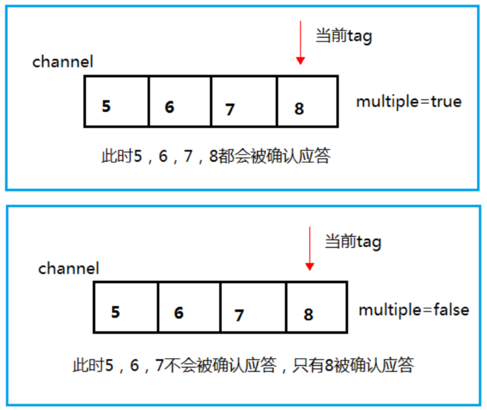
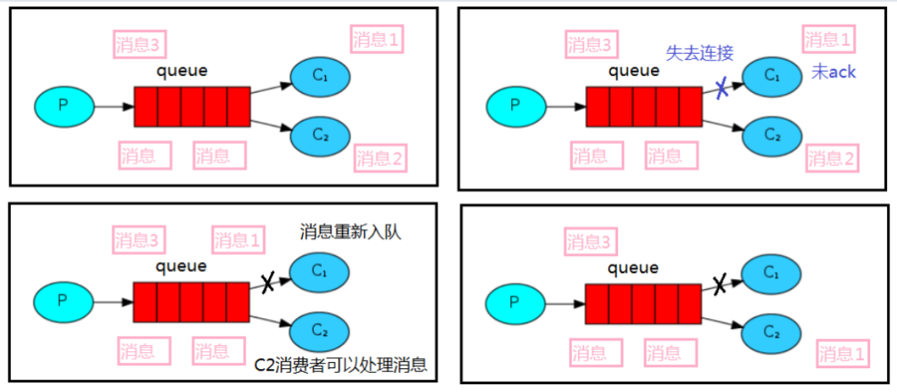
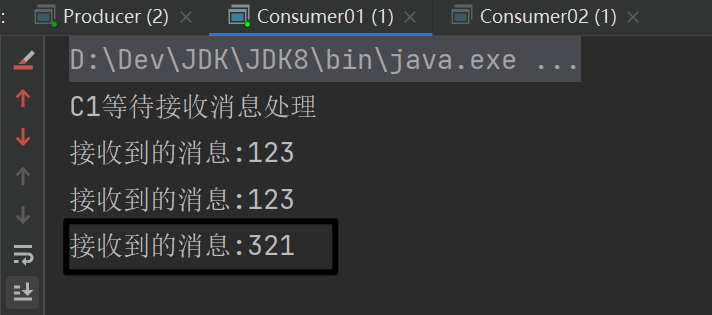
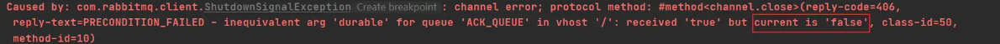
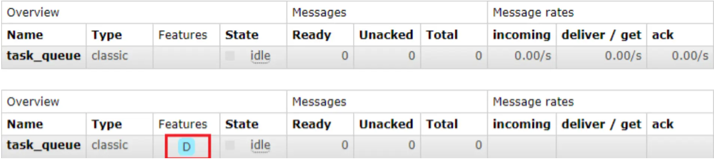
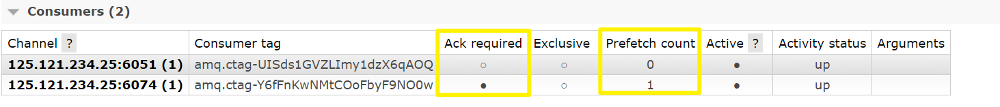
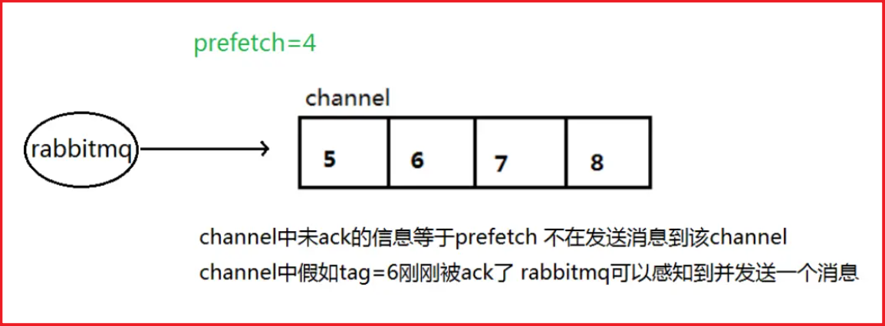
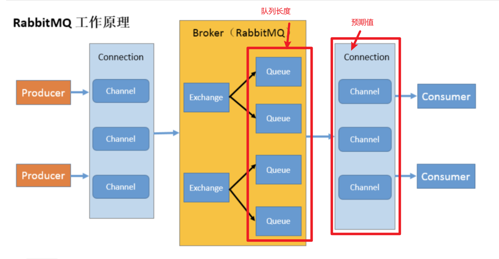
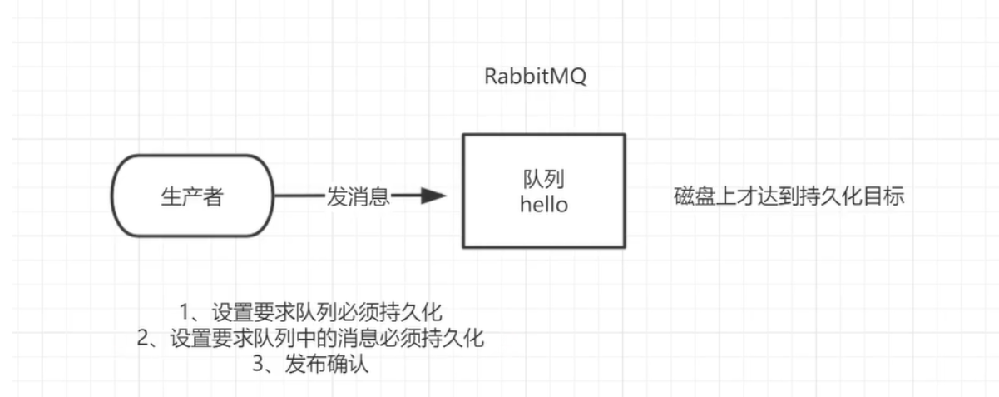
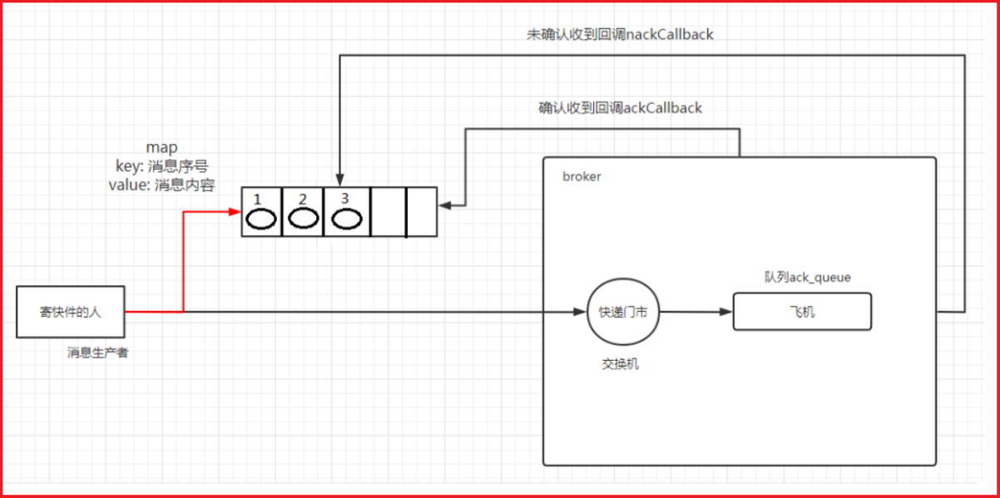

# RabbitMQ 消息应答与发布

## 消息应答

消费者完成一个任务可能需要一段时间，如果其中一个消费者处理一个长的任务并仅只完成了部分突然它挂掉了，会发生什么情况。RabbitMQ 一旦向消费者传递了一条消息，便立即将该消息标记为删除。在这种情况下，突然有个消费者挂掉了，我们将丢失正在处理的消息。以及后续发送给该消费者的消息，因为它无法接收到。

**为了保证消息在发送过程中不丢失，引入消息应答机制，消息应答就是：消费者在接收到消息并且处理该消息之后，告诉 RabbitMQ 它已经处理了，RabbitMQ 可以把该消息删除了。**

### 自动应答

消息发送后立即被认为已经传送成功，这种模式需要在**高吞吐量和数据传输安全性方面做权衡**，因为这种模式如果消息在接收到之前，消费者那边出现连接或者 channel 关闭，那么消息就丢失了，当然另一方面这种模式消费者那边可以传递过载的消息，**没有对传递的消息数量进行限制**，当然这样有可能使得消费者这边由于接收太多还来不及处理的消息，导致这些消息的积压，最终使得内存耗尽，最终这些消费者线程被操作系统杀死，**所以这种模式仅适用在消费者可以高效并以某种速率能够处理这些消息的情况下使用。**

### 手动消息应答的方法

```java
channel.basicAck(long deliveryTag, boolean multiple);
# 第一个参数是消息的标记，
# 第二个参数表示是否应用于多消息
# RabbitMQ 已知道该消息并且成功的处理消息，可以将其丢弃了
    
channel.basicReject(long deliveryTag, boolean requeue);
# 第一个参数表示拒绝 deliveryTag 对应的消息，
# 第二个参数表示是否 requeue：true 则重新入队列，false 则丢弃或者进入死信队列。
# 该方法 reject 后，该消费者还是会消费到被 reject 的消息
    
channel.basicRecover(boolean requeue);
# 是否恢复消息到队列，参数是否 requeue，true 则重新入队列，
# 并且尽可能的将之前 recover 的消息投递给其他消费者消费，而不是自己再次消费。
# false 则消息会重新被投递给自己。    
```

#### Multiple 的解释：

手动应答的好处是可以批量应答并且减少网络拥堵

- true 代表批量应答 channel 上未应答的消息，比如说 channel 上有传送 tag 的消息 5,6,7,8 当前 tag 是 8 那么此时 5-8 的这些还未应答的消息都会被确认收到消息应答
- false 同上面相比只会应答 tag=8 的消息 5,6,7 这三个消息依然不会被确认收到消息应答



### 消息自动重新入队

如果消费者由于某些原因失去连接（其通道已关闭，连接已关闭或 TCP 连接丢失），导致消息未发送 ACK 确认，RabbitMQ 将了解到消息未完全处理，并将对其重新排队。如果此时其他消费者可以处理，它将很快将其重新分发给另一个消费者。这样，即使某个消费者偶尔死亡，也可以确保不会丢失任何消息。



### 手动应答案例

默认消息采用的是自动应答，所以我们要想实现消息消费过程中不丢失，需要把自动应答改为手动应答

消费者启用两个线程，消费线程一在 1 秒消费一个消息，消费线程二在 10 秒消费一个消息，然后在消费线程二 消费消息的时候，停止运行，这时正在消费的消息是否会重新进入队列，而后给消费线程一消费呢？

#### 工具类

```java
public class SleepUtils {
    public static void sleep(int second){
        try {
            Thread.sleep(1000*second);
        } catch (InterruptedException e) {
            Thread.currentThread().interrupt();
        }
    }
}
```

#### 消息生产者

```java
public class Producer {

    public static final String TASK_QUEUE_NAME = "ack_queue";

    public static void main(String[] args) throws Exception {
        Channel channel = RabbitMqUtils.getChannel();
        //声明队列
        channel.queueDeclare(TASK_QUEUE_NAME, false, false, false, null);

        //冲控制台输入信息
        Scanner scanner = new Scanner(System.in);
        while (scanner.hasNext()) {
            String message = scanner.next();
            channel.basicPublish("", TASK_QUEUE_NAME, null, message.getBytes(StandardCharsets.UTF_8));
            System.out.println("生产者发出消息" + message);
        }
    }
}
```

#### 消息线程一

```java
public class Consumer01 {
    public static final String TASK_QUEUE_NAME = "ack_queue";

    public static void main(String[] args) throws IOException, TimeoutException {
        Channel channel = RabbitMqUtils.getChannel();
        //接收消息
        System.out.println("C1 等待接收消息处理");

        //消息的接受
        DeliverCallback deliverCallback = (consumerTag, message) -> {
            //线程沉睡
            SleepUtils.sleep(1);
            System.out.println("接收到的消息：" + new String(message.getBody(), StandardCharsets.UTF_8));
        };

        //消息接受被取消时，执行下面的内容
        CancelCallback cancelCallback = consumerTag -> {
            System.out.println(consumerTag + "消息消费被中断");
        };

        //消息的接受
        channel.basicConsume(TASK_QUEUE_NAME, true, deliverCallback, cancelCallback);
    }
}
```

#### 消息线程二

```java
public class Consumer02 {
    public static final String TASK_QUEUE_NAME = "ack_queue";

    public static void main(String[] args) throws IOException, TimeoutException {
        Channel channel = RabbitMqUtils.getChannel();
        //接收消息
        System.out.println("C2 等待接收消息处理");

        //消息的接受
        DeliverCallback deliverCallback = (consumerTag, message) -> {
            //线程沉睡
            SleepUtils.sleep(10);
            System.out.println("接收到的消息：" + new String(message.getBody(), StandardCharsets.UTF_8));
            channel.basicAck(message.getEnvelope().getDeliveryTag(), false);
        };

        //消息接受被取消时，执行下面的内容
        CancelCallback cancelCallback = consumerTag -> {
            System.out.println(consumerTag + "消息消费被中断");
        };

        //消息的接受
        channel.basicConsume(TASK_QUEUE_NAME, false, deliverCallback, cancelCallback);
    }
}
```

#### 效果演示



## 持久化

当 RabbitMQ 服务停掉以后，消息生产者发送过来的消息不丢失要如何保障？默认情况下 RabbitMQ 退出或由于某种原因崩溃时，它忽视队列和消息，除非告知它不要这样做。确保消息不会丢失需要做两件事：**我们需要将队列和消息都标记为持久化。**

###  队列持久化

之前我们创建的队列都是非持久化的，RabbitMQ 如果重启的化，该队列就会被删除掉，如果要队列实现持久化需要在声明队列的时候把 durable 参数设置为 true，代表开启持久化

```java,{6-11}
public class Producer {

    public static final String TASK_QUEUE_NAME = "ack_queue";

    public static void main(String[] args) throws Exception {
        Channel channel = RabbitMqUtils.getChannel();
        //生产者队列持久化
        boolean durable = true;
        //生产者声明队列
        channel.queueDeclare(TASK_QUEUE_NAME, durable, false, false, null);

        //冲控制台输入信息
        Scanner scanner = new Scanner(System.in);
        while (scanner.hasNext()) {
            String message = scanner.next();
            //消息持久化:MessageProperties.PERSISTENT_TEXT_PLAIN
            channel.basicPublish("", TASK_QUEUE_NAME, MessageProperties.PERSISTENT_TEXT_PLAIN, message.getBytes(StandardCharsets.UTF_8));
            System.out.println("生产者发出消息" + message);
        }
    }
}
```

> 如果之前声明的队列不是持久化的，需要把原先队列先删除，或者重新创建一个持久化的队列

不然就会出现如下错误：





### 消息持久化

将消息标记为持久化并不能完全保证不会丢失消息。尽管它告诉 RabbitMQ 将消息保存到磁盘，但是这里依然存在当消息刚准备存储在磁盘的时候但是还没有存储完，消息还在缓存的一个间隔点。此时并没有真正写入磁盘。持久性保证并不强，但是对于我们的简单任务队列而言，这已经绰绰有余了。

```java,{16-19}
public class Producer {

    public static final String TASK_QUEUE_NAME = "ack_queue";

    public static void main(String[] args) throws Exception {
        Channel channel = RabbitMqUtils.getChannel();
        //生产者队列持久化
        boolean durable = true;
        //生产者声明队列
        channel.queueDeclare(TASK_QUEUE_NAME, durable, false, false, null);

        //冲控制台输入信息
        Scanner scanner = new Scanner(System.in);
        while (scanner.hasNext()) {
            String message = scanner.next();
            //消息持久化:MessageProperties.PERSISTENT_TEXT_PLAIN
            channel.basicPublish("", TASK_QUEUE_NAME, MessageProperties.PERSISTENT_TEXT_PLAIN, message.getBytes(StandardCharsets.UTF_8));
            System.out.println("生产者发出消息" + message);
        }
    }
}

```

## 不公平分发

在最开始的时候我们学习到 RabbitMQ 分发消息采用的轮询分发，但是在某种场景下这种策略并不是很好，比方说有两个消费者在处理任务，其中有个**消费者一** 处理任务的速度非常快，而另外一个**消费者二**处理速度却很慢，这个时候我们还是采用轮询分发的化就会到这处理速度快的这个消费者很大一部分时间处于空闲状态，而处理慢的那个消费者一直在干活，这种分配方式在这种情况下其实就不太好，但是 RabbitMQ 并不知道这种情况它依然很公平的进行分发。0 表示轮询分发

- 1 表示不公平分发
- 充分利用服务器资源

```java,{20-24}
public class Consumer01 {
    public static final String TASK_QUEUE_NAME = "ack_queue";

    public static void main(String[] args) throws IOException, TimeoutException {
        Channel channel = RabbitMqUtils.getChannel();
        //接收消息
        System.out.println("C1 等待接收消息处理");

        //消息的接受
        DeliverCallback deliverCallback = (consumerTag, message) -> {
            //线程沉睡
            SleepUtils.sleep(1);
            System.out.println("接收到的消息：" + new String(message.getBody(), StandardCharsets.UTF_8));
        };

        //消息接受被取消时，执行下面的内容
        CancelCallback cancelCallback = consumerTag -> {
            System.out.println(consumerTag + "消息消费被中断");
        };

        //0，默认轮询分发，1 不公平分发，能者多劳
        int prefetchCount = 0;
        channel.basicQos(prefetchCount);

        //消息的接受
        channel.basicConsume(TASK_QUEUE_NAME, true, deliverCallback, cancelCallback);

    }
}
```

不公平分发思想：如果一个工作队列还没有处理完或者没有应答签收一个消息，则不拒绝 RabbitMQ 分配新的消息到该工作队列。此时 RabbitMQ 会优先分配给其他已经处理完消息或者空闲的工作队列。如果所有的消费者都没有完成手上任务，队列还在不停的添加新任务，队列有可能就会遇到队列被撑满的情况，这个时候就只能添加新的 worker (工作队列) 或者改变其他存储任务的策略。



### 效果演示


## 预取值分发

默认消息的发送是异步发送的，所以在任何时候，channel 上不止只有一个消息来自消费者的手动确认，所以本质上是异步的。因此这里就存在一个未确认的消息缓冲区，因此希望开发人员能限制此缓冲区的大小，以避免缓冲区里面无限制的未确认消息问题。这个时候就可以通过使用 `basic.qos` 方法设置「预取计数」值来完成的。

该值定义通道上允许的未确认消息的最大数量。一旦数量达到配置的数量，RabbitMQ 将停止在通道上传递更多消息，除非至少有一个未处理的消息被确认，例如，假设在通道上有未确认的消息 5、6、7，8，并且通道的预取计数设置为 4，此时 RabbitMQ 将不会在该通道上再传递任何消息，除非至少有一个未应答的消息被 ack。比方说 tag=6 这个消息刚刚被确认 ACK，RabbitMQ 将会感知这个情况到并再发送一条消息。消息应答和 QoS 预取值对用户吞吐量有重大影响。

通常，增加预取值将提高向消费者传递消息的速度。虽然自动应答传输消息速率是最佳的，但是，在这种情况下已传递但尚未处理的消息的数量也会增加，从而增加了消费者的 RAM 消耗 (随机存取存储器) 应该小心使用具有无限预处理的自动确认模式或手动确认模式，消费者消费了大量的消息如果没有确认的话，会导致消费者连接节点的内存消耗变大，所以找到合适的预取值是一个反复试验的过程，不同的负载该值取值也不同 100 到 300 范围内的值通常可提供最佳的吞吐量，并且不会给消费者带来太大的风险。

预取值为 1 是最保守的。当然这将使吞吐量变得很低，特别是消费者连接延迟很严重的情况下，特别是在消费者连接等待时间较长的环境中。对于大多数应用来说，稍微高一点的值将是最佳的。



```java
int prefetchCount = 2;
channel.basicQos(prefetchCount);
```

### ⭐特别注意

**不公平分发和预取值分发都用到 `basic.qos` 方法，如果取值为 1，代表不公平分发，取值不为 1，代表预取值分发，取值为 0，代表轮询分发**

### 区分预期值和队列长度

在 RabbitMQ 中，预取值（Prefetch）指的是消费者从队列中预先拉取一定数量的消息到本地缓存，而不是一条一条地消费队列中的消息。通过设置预取值，可以在一定程度上控制消费者从队列中获取的消息数量，从而达到优化消息消费的目的。

当消费者与 RabbitMQ 之间建立了连接后，消费者可以通过调用 `basic.qos` 方法设置预取值。这个方法接受两个参数：`prefetch_size` 和 `prefetch_count`。其中，`prefetch_count` 表示消费者从队列中预先拉取的消息数量，`prefetch_size` 表示预取的消息总大小（以字节为单位）。如果设置了 `prefetch_size`，则 `prefetch_count` 参数将被忽略。

通过设置预取值，可以避免消费者一次性获取过多的消息，导致消息堆积和内存占用过高。同时，预取值还可以优化消息消费的效率，使得消费者能够更快地消费队列中的消息，提高整个系统的吞吐量。



## 发布确认

生产者发布消息到 RabbitMQ 后，需要 RabbitMQ 返回「ACK（已收到）」给生产者，这样生产者才知道自己生产的消息成功发布出去。

发布确认指的是当生产者将消息发送到队列上，队列将消息持久化，然后发送一个确认给生产者



## 发布确认逻辑

生产者将信道设置成 confirm 模式，一旦信道进入 confirm 模式，所有在该信道上面发布的消息都将会被指派一个唯一的 ID(从 1 开始)，一旦消息被投递到所有匹配的队列之后，broker 就会发送一个确认给生产者 (包含消息的唯一 ID)，这就使得生产者知道消息已经正确到达目的队列了，如果消息和队列是可持久化的，那么确认消息会在将消息写入磁盘之后发出，broker 回传给生产者的确认消息中 delivery-tag 域包含了确认消息的序列号，此外 broker 也可以设置 basic.ack 的 multiple 域，表示到这个序列号之前的所有消息都已经得到了处理。

confirm 模式最大的好处在于是异步的，一旦发布一条消息，生产者应用程序就可以在等信道返回确认的同时继续发送下一条消息，当消息最终得到确认之后，生产者应用便可以通过回调方法来处理该确认消息，如果 RabbitMQ 因为自身内部错误导致消息丢失，就会发送一条 nack 消息，生产者应用程序同样可以在回调方法中处理该 nack 消息。

### 开启发布确认

```java
// 开启发布确认的方法
// 确认发布指的是成功发送到了队列，并不是消费者消费了消息。
channel.confirmSelect();

// 消息被确认是返回 true
channel.waitForConfirms();
```

### 单个发布确认

这是一种简单的确认方式，它是一种**同步确认发布**的方式，也就是发布一个消息之后只有它被确认发布，后续的消息才能继续发布，`waitForConfirmsOrDie(long)` 这个方法只有在消息被确认的时候才返回，如果在指定时间范围内这个消息没有被确认那么它将抛出异常。

这种确认方式有一个最大的缺点就是：**发布速度特别的慢**，因为如果没有确认发布的消息就会阻塞所有后续消息的发布，这种方式最多提供每秒不超过数百条发布消息的吞吐量。当然对于某些应用程序来说这可能已经足够了。

```java
public class ProducerConfirmMessage {

    //批量发消息的格式
    public static final int MESSAGE_COUNT = 1000;

    public static void main(String[] args) throws Exception {
        publishMessage();
    }

    //单个消息单个确认
    private static void publishMessage() throws Exception {
        Channel channel = RabbitMqUtils.getChannel();
        String queueName = UUID.randomUUID().toString();
        //队列声明
        channel.queueDeclare(queueName, true, false, false, null);
        //开启发布确认模式
        channel.confirmSelect();
        //开始时间
        long begin = System.currentTimeMillis();
        //批量发消息
        for (int i = 0; i < MESSAGE_COUNT; i++) {
            String message = i + "";
            channel.basicPublish("", queueName, null, message.getBytes(StandardCharsets.UTF_8));
            //单个消息马上确认发布
            boolean flag = channel.waitForConfirms();
            if (flag) System.out.println("消息发送成功");
        }
        //结束时间
        long end = System.currentTimeMillis();
        System.out.println("发布" + MESSAGE_COUNT + "条单独确认数据" + "耗时" + (end - begin) + "ms");
    }
}

//发布 1000 条单独确认数据耗时 42590ms
```

### 批量发布确认

发布一批消息，确认一批消息，速度快但是无法保证某批消息丢失具体是哪一条

单个确认发布方式非常慢，与单个等待确认消息相比，先发布一批消息然后一起确认可以极大地提高吞吐量，当然这种方式的缺点就是：当发生故障导致发布出现问题时，不知道是哪个消息出问题了，我们必须将整个批处理保存在内存中，以记录重要的信息而后重新发布消息。当然这种方案仍然是同步的，也一样阻塞消息的发布。

```java
//批量消息批量确认
private static void publishMessageBatch() throws Exception {
    Channel channel = RabbitMqUtils.getChannel();
    String queueName = UUID.randomUUID().toString();
    //队列声明
    channel.queueDeclare(queueName, true, false, false, null);
    //开启发布确认模式
    channel.confirmSelect();
    //开始时间
    long begin = System.currentTimeMillis();
    //批量确认的大小
    int batchSize = 100;

    //批量发消息，批量确认消息
    for (int i = 0; i < MESSAGE_COUNT; i++) {
        String message = i + "";
        channel.basicPublish("", queueName, null, message.getBytes(StandardCharsets.UTF_8));
        //判断到 100 条时批量确认
        if (i % batchSize == 0) {
            boolean flag = channel.waitForConfirms();
            if (flag) System.out.println("消息发送成功");
        }
    }
    //结束时间
    long end = System.currentTimeMillis();
    System.out.println("发布" + MESSAGE_COUNT + "条批量数据" + "耗时" + (end - begin) + "ms");
}
//发布 1000 条批量数据耗时 960ms
```

### 异步发布确认

原理：通过给发布的消息编号，再通过 Broker 的回调函数确认，实现异步发布确认的效果，而且保证消息不丢失

异步确认虽然编程逻辑比上两个要复杂，但是性价比最高，无论是可靠性还是效率都很好，利用了回调函数来达到消息可靠性传递的，这个中间件也是通过函数回调来保证是否投递成功。



```java
//异步消息异步确认
private static void publishMessageAsync() throws Exception {
    Channel channel = RabbitMqUtils.getChannel();
    String queueName = UUID.randomUUID().toString();
    //队列声明
    channel.queueDeclare(queueName, true, false, false, null);
    //开启发布确认模式
    channel.confirmSelect();

    /**
     * 线程安全有序的哈希表，适用于高并发的情况
     * 1、将序号和消息关联
     * 2、批量删除条目
     * 3、支持高并发
     */
    ConcurrentSkipListMap<Long, String> outConfirms = new ConcurrentSkipListMap<>();


    //消息监听器，哪些消息发送成功，哪些消息发送失败
    channel.addConfirmListener(
            //消息确认成功回调的函数
            //deliveryTag 是消息的 Tag
            //multiple 是批量的标识
            (deliveryTag, multiple) -> {
                if (multiple) {
                    //2.删除已确认的消息
                    ConcurrentNavigableMap<Long, String> confirmId = outConfirms.headMap(deliveryTag);
                    System.out.println("确认的消息" + deliveryTag);
                    confirmId.clear();
                } else {
                    outConfirms.remove(deliveryTag);
                }
            },
            //消息确认失败回调的函数
            (deliveryTag, multiple) -> {
                //3.未确认的消息
                String message = outConfirms.get(deliveryTag);
                System.out.println("未确认的消息" + message);
                System.out.println("未确认的消息" + deliveryTag);
            }
    );

    //开始时间
    long begin = System.currentTimeMillis();

    //批量发消息，批量确认消息
    for (int i = 0; i < MESSAGE_COUNT; i++) {
        String message = i + "";
        channel.basicPublish("", queueName, null, message.getBytes(StandardCharsets.UTF_8));
        //记录所有消息的总和
        outConfirms.put(channel.getNextPublishSeqNo(), message);
    }
    //结束时间
    long end = System.currentTimeMillis();
    System.out.println("发布" + MESSAGE_COUNT + "条异步确认发布数据" + "耗时" + (end - begin) + "ms");
}
//发布 1000 条异步确认发布数据耗时 119ms
```

### 处理异步未确认消息

把未确认的消息放到一个基于内存的能被发布线程访问的队列 ConcurrentLinkedQueue 这个队列在监听回调线程与发布线程之间进行消息的传递

### 小总结

处理异步未确认消息思路

1. 发布消息时记录**所有消息的总和**
2. 在消息确认成功回调时**删除已确认的消息**
3. 在消息确认失败回调时**获取失败的消息**

## 应答和发布区别

应答功能属于消费者，消费完消息告诉 RabbitMQ 已经消费成功。

发布功能属于生产者，生产消息到 RabbitMQ，RabbitMQ 需要告诉生产者已经收到消息。

