# RabbitMQ 交换机

## Exchanges 概念

RabbitMQ 消息传递模型的核心思想是：**生产者生产的消息从不会直接发送到队列**。实际上，通常生产者甚至都不知道这些消息传递传递到了哪些队列中。

相反，**生产者只能将消息发送到交换机 (exchange)**，交换机工作的内容非常简单，一方面它接收来自生产者的消息，另一方面将它们推入队列。交换机必须确切知道如何处理收到的消息。是应该把这些消息放到特定队列还是说把他们到许多队列中还是说应该丢弃它们。这就得由交换机的类型来决定。

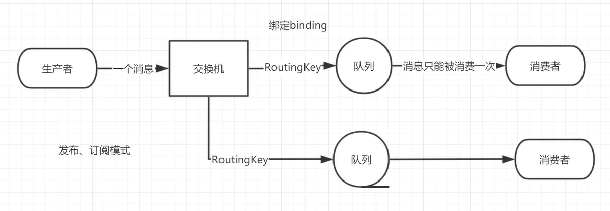

## Exchanges 类型

### 直接 (direct)

处理路由键。需要将一个队列绑定到交换机上，要求该消息与一个特定的路由键完全匹配。这是一个完整的匹配。如果一个队列绑定到该交换机上要求路由键 abc，则只有被标记为 abc 的消息才被转发，不会转发 abc.def，也不会转发 dog.ghi，只会转发 abc。

### 主题 (topic)

将路由键和某模式进行匹配。此时队列需要绑定要一个模式上。符号“#”匹配一个或多个词，符号 * 匹配不多不少一个词。因此 abc.# 能够匹配到 abc.def.ghi，但是 abc.* 只会匹配到 abc.def。

### 标题 (headers)

不处理路由键。而是根据发送的消息内容中的 headers 属性进行匹配。在绑定 Queue 与 Exchange 时指定一组键值对；当消息发送到 RabbitMQ 时会取到该消息的 headers 与 Exchange 绑定时指定的键值对进行匹配；如果完全匹配则消息会路由到该队列，否则不会路由到该队列。headers 属性是一个键值对，可以是 Hashtable，键值对的值可以是任何类型。而 fanout，direct，topic 的路由键都需要要字符串形式的。

匹配规则 x-match 有下列两种类型：

x-match = all：表示所有的键值对都匹配才能接受到消息

x-match = any：表示只要有键值对匹配就能接受到消息

### 扇出 (fanout)

不处理路由键。你只需要简单的将队列绑定到交换机上。一个发送到交换机的消息都会被转发到与该交换机绑定的所有队列上。很像子网广播，每台子网内的主机都获得了一份复制的消息。Fanout 交换机转发消息是最快的

## 默认 Exchange

通过空字符串（""）进行标识的交换机是默认交换

```java
channel.basicPublish("", TASK_QUEUE_NAME, null, message.getBytes("UTF-8"));
```

第一个参数是交换机的名称。空字符串表示默认或无名称交换机：消息能路由发送到队列中其实是由 routingKey(bindingkey) 绑定指定的 key

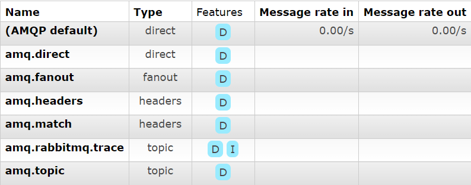

## 临时队列

之前的章节我们使用的是具有特定名称的队列（还记得 hello 和 ack_queue 吗？）。队列的名称我们来说至关重要，我们需要指定我们的消费者去消费哪个队列的消息。

每当我们连接到 Rabbit 时，我们都需要一个全新的空队列，为此我们可以创建一个具有**随机名称的队列**，或者能让服务器为我们选择一个随机队列名称那就更好了。其次一旦我们断开了消费者的连接，**队列将被自动删除**。

创建临时队列的方式如下：

```java
String queueName = channel.queueDeclare().getQueue();
```

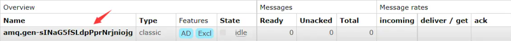

## 绑定 bindings

什么是 bingding 呢，binding 其实是 exchange 和 queue 之间的桥梁，它告诉我们 exchange 和那个队列进行了绑定关系。比如说下面这张图告诉我们的就是 X 与 Q1 和 Q2 进行了绑定


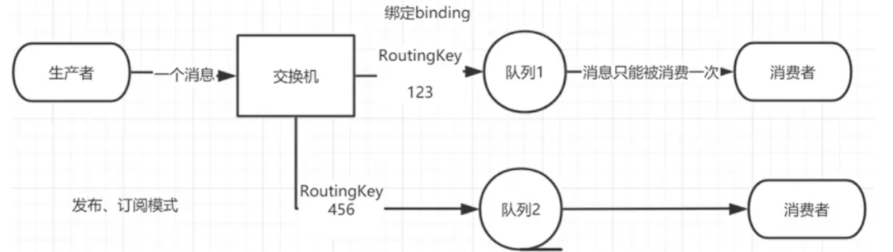

## Fanout 模式

### Fanout 实战

一个发送，多个接受，发布/订阅模式

为了说明这种模式，我们将构建一个简单的日志系统。它将由两个程序组成：第一个程序将发出日志消息，第二个程序是消费者。其中启动两个消费者，其中一个消费者接收到消息后把日志存储在磁盘

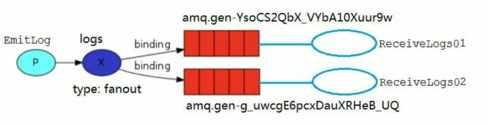

### 绑定关系

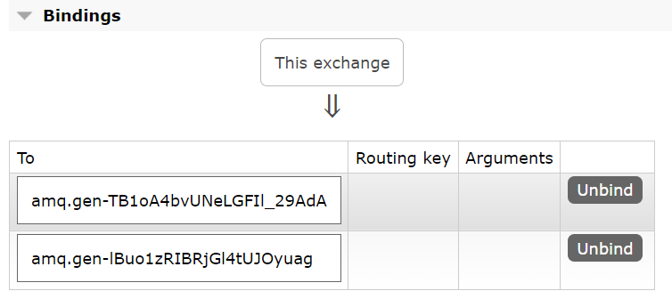

>注意：
>
>- 先启动两个消费者再启动生产者。
>- 生产者生产消息后，如果没有对应的消费者接收，则该消息是遗弃的消息

### 消息生产者

```java
public class EmitLog {
    //声明交换机名称
    private static final String EXCHANGE_NAME = "logs";

    public static void main(String[] args) throws Exception {
        Channel channel = RabbitMqUtils.getChannel();
        /**
         * 声明一个 exchange
         * 1.exchange 的名称
         * 2.exchange 的类型
         */
        channel.exchangeDeclare(EXCHANGE_NAME, BuiltinExchangeType.FANOUT);
        Scanner sc = new Scanner(System.in);
        System.out.println("请输入信息");
        while (sc.hasNext()) {
            String message = sc.nextLine();
            channel.basicPublish(EXCHANGE_NAME, "", null, message.getBytes(StandardCharsets.UTF_8));
            System.out.println("生产者发出消息" + message);
        }
    }
}
```

### 消息消费者一

```java
public class ReceiveLogs01 {
    //声明交换机名称
    private static final String EXCHANGE_NAME = "logs";

    public static void main(String[] args) throws Exception {
        Channel channel = RabbitMqUtils.getChannel();
        channel.exchangeDeclare(EXCHANGE_NAME, BuiltinExchangeType.FANOUT);
        /**
         * 生成一个临时的队列 队列的名称是随机的
         * 当消费者断开和该队列的连接时 队列自动删除
         */
        String queueName = channel.queueDeclare().getQueue();
        //绑定临时队列
        channel.queueBind(queueName, EXCHANGE_NAME, "");
        System.out.println("等待接收消息，把接收到的消息打印在屏幕.....");
        channel.basicConsume(
                queueName,
                true,
                (consumerTag, delivery) -> {
                    String message = new String(delivery.getBody(), "UTF-8");
                    System.out.println("消息应答的回调：控制台打印接收到的消息" + message);
                },
                consumerTag -> {
                    System.out.println("消息中断的回调");
                }
        );
    }
}
```

### 消息消费者二

```java
public class ReceiveLogs02 {
    private static final String EXCHANGE_NAME = "logs";

    public static void main(String[] args) throws Exception {
        Channel channel = RabbitMqUtils.getChannel();
        channel.exchangeDeclare(EXCHANGE_NAME, BuiltinExchangeType.FANOUT);
        /**
         * 生成一个临时的队列 队列的名称是随机的
         * 当消费者断开和该队列的连接时 队列自动删除
         */
        String queueName = channel.queueDeclare().getQueue();
        //绑定临时队列
        channel.queueBind(queueName, EXCHANGE_NAME, "");
        System.out.println("等待接收消息，把接收到的消息写到文件.....");
        channel.basicConsume(
                queueName,
                true,
                (consumerTag, delivery) -> {
                    String message = new String(delivery.getBody(), StandardCharsets.UTF_8);
                    File file = new File("D:\\rabbit_logs\\rabbitmq_info.txt");
                    if (!file.exists()) {
                        FileUtils.writeStringToFile(file, message, "UTF-8");
                    }
                    System.out.println("数据写入文件成功");
                }
                , consumerTag -> {
                    System.out.println("消息中断的回调");
                }
        );
    }
}
```

### 效果演示

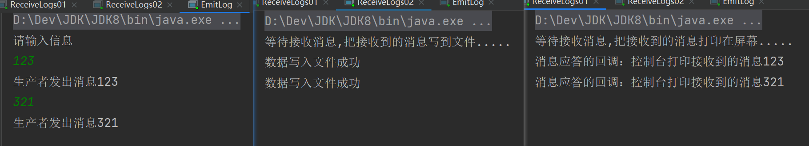

## Direct 模式

### Direct 实战

在上一节中，我们构建了一个简单的日志记录系统。我们能够向许多接收者广播日志消息。在本节我们将向其中添加一些特别的功能，让某个消费者订阅发布的部分消息。例如我们只把严重错误消息定向存储到日志文件（以节省磁盘空间），同时仍然能够在控制台上打印所有日志消息。Fanout 这种交换类型并不能给我们带来很大的灵活性，它只能进行无意识的广播，在这里我们将使用 direct 这种类型来进行替换，这种类型的工作方式是，消息只去到它绑定的 routingKey 队列中去。

我们再次来回顾一下什么是 bindings，绑定是交换机和队列之间的桥梁关系。也可以这么理解： **队列只对它绑定的交换机的消息感兴趣**。绑定用参数：routingKey 来表示也可称该参数为 binding key，创建绑定我们用代码：`channel.queueBind(queueName, EXCHANGE_NAME, "routingKey");`

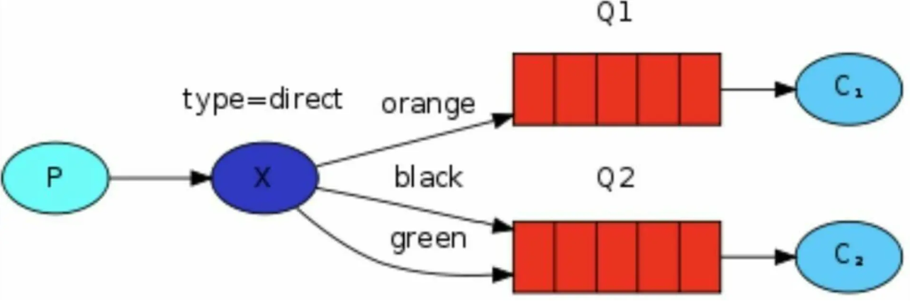

在上面这张图中，我们可以看到 X 绑定了两个队列，绑定类型是 direct。队列 Q1 绑定键为 orange，队列 Q2 绑定键有两个：一个绑定键为 black，另一个绑定键为 green。

在这种绑定情况下，生产者发布消息到 exchange 上，绑定键为 orange 的消息会被发布到队列 Q1。绑定键为 black 和 green 的消息会被发布到队列 Q2，其他消息类型的消息将被丢弃。

### 多重绑定

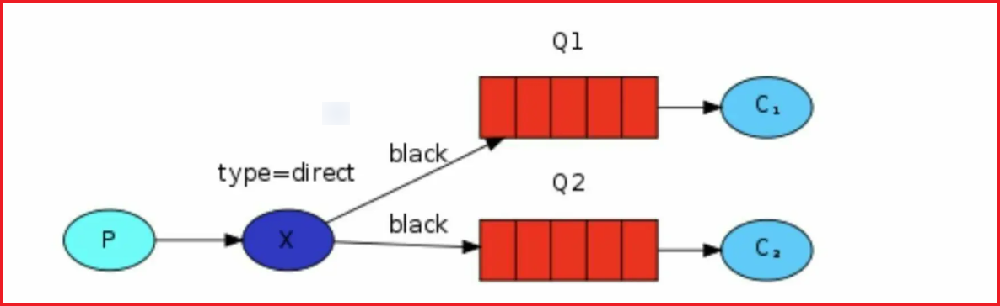

当然如果 exchange 的绑定类型是 direct，**但是它绑定的多个队列的 key 如果都相同**，在这种情况下虽然绑定类型是 direct **但是它表现的就和 fanout 有点类似了**，就跟广播差不多，如上图所示。

### 绑定关系

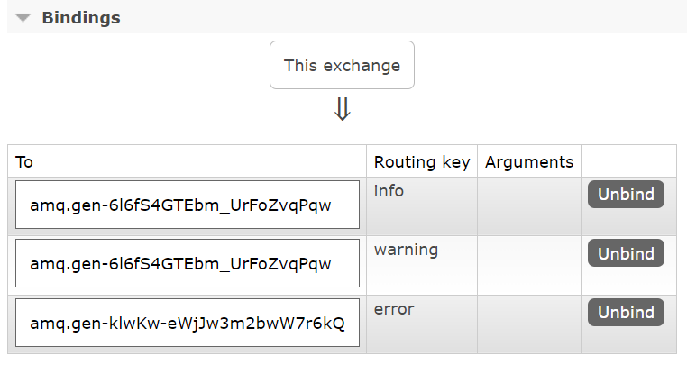

C1 消费者：绑定 console 队列，routingKey 为 info、warning

C2 消费者：绑定 disk 队列，routingKey 为 error

当生产者生产消息到 `direct_logs` 交换机里，该交换机会检测消息的 routingKey 条件，然后分配到满足条件的队列里，最后由消费者从队列消费消息。

### 消息生产者

```java
public class EmitLogDirect {
    private static final String EXCHANGE_NAME = "direct_logs";

    public static void main(String[] argv) throws Exception {
        Channel channel = RabbitMqUtils.getChannel();
        channel.exchangeDeclare(EXCHANGE_NAME, BuiltinExchangeType.DIRECT);
        //创建多个 bindingKey
        Map<String, String> bindingKeyMap = new HashMap<>();
        bindingKeyMap.put("info", "普通 info 信息");
        bindingKeyMap.put("warning", "警告 warning 信息");
        bindingKeyMap.put("error", "错误 error 信息");
        //debug 没有消费这接收这个消息 所有就丢失了
        bindingKeyMap.put("debug", "调试 debug 信息");
        for (Map.Entry<String, String> bindingKeyEntry : bindingKeyMap.entrySet()) {
            /*key 作为路由*/
            String bindingKey = bindingKeyEntry.getKey();
            /*value 作为消息*/
            String message = bindingKeyEntry.getValue();
            /*发布了三个队列*/
            channel.basicPublish(EXCHANGE_NAME, bindingKey, null,
                                 message.getBytes(StandardCharsets.UTF_8));
            System.out.println("生产者发出消息：" + message);
        }
    }
}
```

### 消息消费者一

```java
public class ReceiveLogsDirect01 {
    private static final String EXCHANGE_NAME = "direct_logs";

    public static void main(String[] args) throws Exception {
        Channel channel = RabbitMqUtils.getChannel();
        //声明交换机
        channel.exchangeDeclare(EXCHANGE_NAME, BuiltinExchangeType.DIRECT);
        /*连接 console 的交换机的队列*/
        String queueName = channel.queueDeclare().getQueue();
        channel.queueBind(queueName, EXCHANGE_NAME, "info");
        channel.queueBind(queueName, EXCHANGE_NAME, "warning");
        System.out.println("等待接收消息.....");
        /*消费消息*/
        channel.basicConsume(
                queueName,
                true,
                (consumerTag, delivery) -> {
                    String message = new String(delivery.getBody(), StandardCharsets.UTF_8);
                    System.out.println("绑定的路由键是：" + delivery.getEnvelope().getRoutingKey() + ",消息：" + message);
                },
                consumerTag -> {
                }
        );
    }
}
```

### 消息消费者二

```java
public class ReceiveLogsDirect02 {
    private static final String EXCHANGE_NAME = "direct_logs";

    public static void main(String[] argv) throws Exception {
        Channel channel = RabbitMqUtils.getChannel();
        channel.exchangeDeclare(EXCHANGE_NAME, BuiltinExchangeType.DIRECT);
        String queueName = channel.queueDeclare().getQueue();
        channel.queueBind(queueName, EXCHANGE_NAME, "error");
        System.out.println("等待接收消息.....");
        channel.basicConsume(
                queueName,
                true,
                (consumerTag, delivery) -> {
                    String message = new String(delivery.getBody(), StandardCharsets.UTF_8);
                    message = "绑定的路由键是：" + delivery.getEnvelope().getRoutingKey() + ",消息：" + message;
                    File file = new File("D:\\rabbit_logs\\rabbitmq_info.txt");
                    FileUtils.writeStringToFile(file, message, "UTF-8");
                    System.out.println("错误日志已经接收");
                },
                consumerTag -> {
                }
        );
    }
}
```

### 效果演示

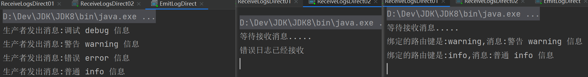

## Topics 模式

### Topic 实战

在上一个小节中，我们改进了日志记录系统。我们没有使用只能进行随意广播的 fanout 交换机，而是使用了 direct 交换机，从而有能实现有选择性地接收日志。

尽管使用 direct 交换机改进了我们的系统，但是它仍然存在局限性，比方说我们想接收的日志类型有 info.base 和 info.advantage，某个队列只想 info.base 的消息，那这个时候 direct 就办不到了。这个时候就只能使用 topic 类型

### Topic 的要求

发送到类型是 topic 交换机的消息的 routing_key 不能随意写，必须满足一定的要求，它必须是一个单词列表，以点号分隔开。这些单词可以是任意单词

比如说：`"stock.usd.nyse"`, `"nyse.vmw"`, `"quick.orange.rabbit"`这种类型的。

当然这个单词列表最多不能超过 255 个字节。

在这个规则列表中，其中有两个替换符是大家需要注意的：

- `*`（星号）可以代替一个位置
- `#`（井号）可以替代零个或多个位置

### Topic 匹配案例

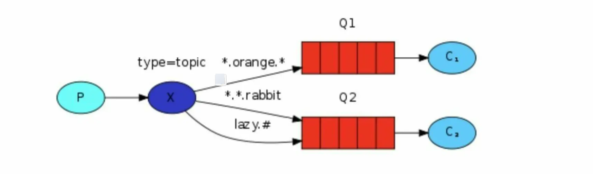

- Q1-->绑定的是
  - 中间带 orange 带 3 个单词的字符串 `(*.orange.*)`
- Q2-->绑定的是
  - 最后一个单词是 rabbit 的 3 个单词 `(*.*.rabbit)`
  - 第一个单词是 lazy 的多个单词 `(lazy.#)`

| 案例                     | 接收                                       |
| ------------------------ | ------------------------------------------ |
| quick.orange.rabbit      | 被队列 Q1Q2 接收到                         |
| lazy.orange.elephant     | 被队列 Q1Q2 接收到                         |
| quick.orange.fox         | 被队列 Q1 接收到                           |
| lazy.brown.fox           | 被队列 Q2 接收到                           |
| lazy.pink.rabbit         | 虽然满足两个绑定但只被队列 Q2 接收一次     |
| quick.brown.fox          | 不匹配任何绑定不会被任何队列接收到会被丢弃 |
| quick.orange.male.rabbit | 是四个单词不匹配任何绑定会被丢弃           |
| lazy.orange.male.rabbit  | 是四个单词但匹配 Q2                        |

### 绑定关系

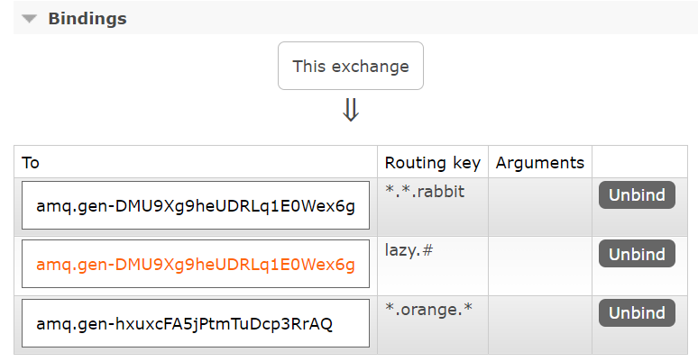

### 消息生产者

```java
public class EmitLogTopic {
    private static final String EXCHANGE_NAME = "topic_logs";

    public static void main(String[] argv) throws Exception {
        Channel channel = RabbitMqUtils.getChannel();
        /*声明交换机*/
        channel.exchangeDeclare(EXCHANGE_NAME, "topic");
        /**
         * Q1-->绑定的是
         * 中间带 orange 带 3 个单词的字符串 (*.orange.*)
         * Q2-->绑定的是
         * 最后一个单词是 rabbit 的 3 个单词 (*.*.rabbit)
         * 第一个单词是 lazy 的多个单词 (lazy.#)
         *
         */
        Map<String, String> bindingKeyMap = new HashMap<>();
        /*生产者将要发布的消息*/
        bindingKeyMap.put("quick.orange.rabbit", "被队列 Q1Q2 接收到");
        bindingKeyMap.put("lazy.orange.elephant", "被队列 Q1Q2 接收到");
        bindingKeyMap.put("quick.orange.fox", "被队列 Q1 接收到");
        bindingKeyMap.put("lazy.brown.fox", "被队列 Q2 接收到");
        bindingKeyMap.put("lazy.pink.rabbit", "虽然满足两个绑定但只被队列 Q2 接收一次");
        bindingKeyMap.put("quick.brown.fox", "不匹配任何绑定不会被任何队列接收到会被丢弃");
        bindingKeyMap.put("quick.orange.male.rabbit", "是四个单词不匹配任何绑定会被丢弃");
        bindingKeyMap.put("lazy.orange.male.rabbit", "是四个单词但匹配 Q2");
        for (Map.Entry<String, String> bindingKeyEntry : bindingKeyMap.entrySet()) {
            String bindingKey = bindingKeyEntry.getKey();
            String message = bindingKeyEntry.getValue();
            channel.basicPublish(EXCHANGE_NAME, bindingKey, null,
                    message.getBytes(StandardCharsets.UTF_8));
            System.out.println("生产者发出消息" + message);
        }
    }
}
```

### 消息消费者一

```java
public class ReceiveLogsTopic01 {
    private static final String EXCHANGE_NAME = "topic_logs";

    public static void main(String[] argv) throws Exception {
        Channel channel = RabbitMqUtils.getChannel();
        channel.exchangeDeclare(EXCHANGE_NAME, "topic");
        /*声明临时队列*/
        String queueName = channel.queueDeclare().getQueue();
        channel.queueBind(queueName, EXCHANGE_NAME, "*.orange.*");
        System.out.println("等待接收消息.....");
        channel.basicConsume(
                queueName,
                true,
                (consumerTag, delivery) -> {
                    String message = new String(delivery.getBody(), StandardCharsets.UTF_8);
                    System.out.println("接收队列：" + queueName + "绑定键：" + delivery.getEnvelope().getRoutingKey() + ",消息：" + message);
                },
                consumerTag -> {
                }
        );
    }
}
```

### 消息消费者二

```java
public class ReceiveLogsTopic02 {
    private static final String EXCHANGE_NAME = "topic_logs";

    public static void main(String[] argv) throws Exception {
        Channel channel = RabbitMqUtils.getChannel();
        channel.exchangeDeclare(EXCHANGE_NAME, "topic");
        /*声明临时队列*/
        String queueName = channel.queueDeclare().getQueue();
        channel.queueBind(queueName, EXCHANGE_NAME, "*.*.rabbit");
        channel.queueBind(queueName, EXCHANGE_NAME, "lazy.#");
        System.out.println("等待接收消息.....");
        channel.basicConsume(
                queueName,
                true,
                (consumerTag, delivery) -> {
                    String message = new String(delivery.getBody(), StandardCharsets.UTF_8);
                    System.out.println("接收队列：" + queueName + "绑定键：" + delivery.getEnvelope().getRoutingKey() + ",消息：" + message);
                },
                consumerTag -> {
                }
        );
    }
}
```

### 效果演示

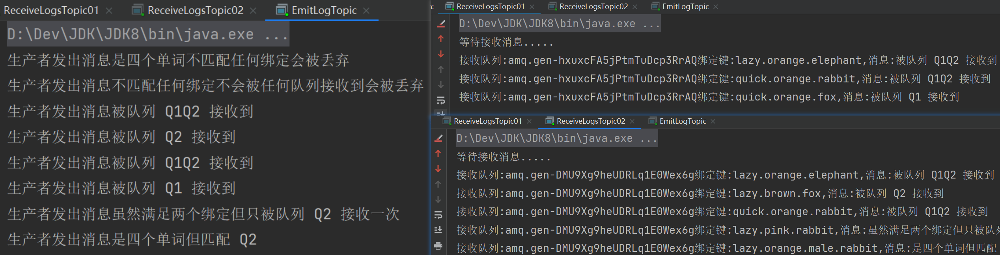
