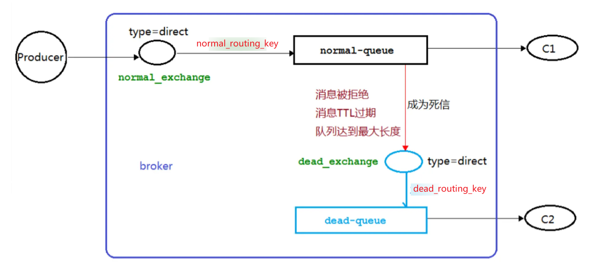
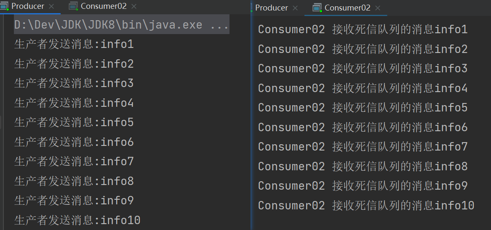
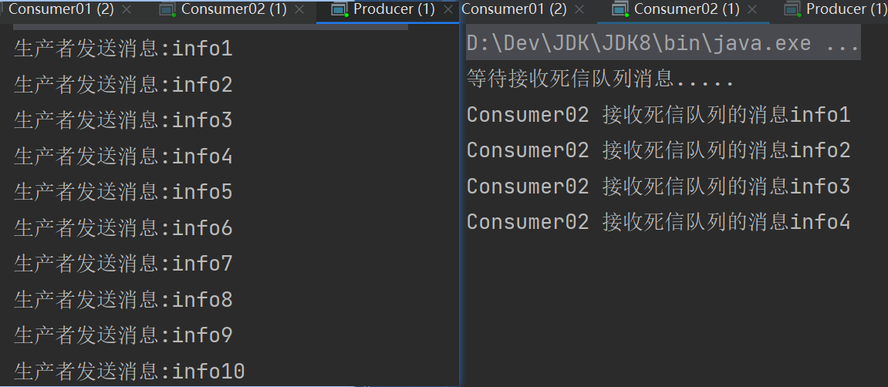
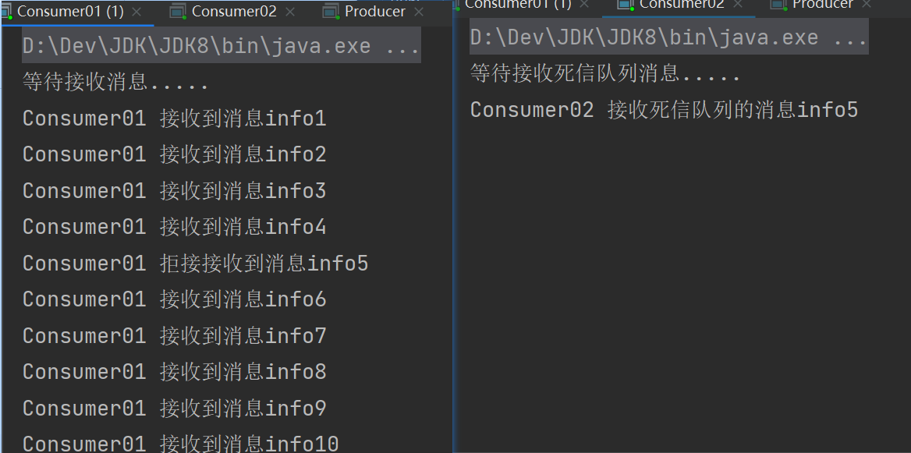

# RabbitMQ 死信队列

## 死信的概念

先从概念解释上搞清楚这个定义，死信，顾名思义就是无法被消费的消息，字面意思可以这样理解，一般来说，producer 将消息投递到 broker 或者直接到 queue 里了，consumer 从 queue 取出消息进行消费，但某些时候由于特定的原因**导致 queue 中的某些消息无法被消费**，这样的消息如果没有后续的处理，就变成了死信，有死信自然就有了死信队列。		

应用场景：为了保证订单业务的消息数据不丢失，需要使用到 RabbitMQ 的死信队列机制，当消息消费发生异常时，将消息投入死信队列中。还有比如说：用户在商城下单成功并点击去支付后在指定时间未支付时自动失效。

## 死信的来源

- 消息 TTL 过期

  TTL 是 Time To Live 的缩写，也就是生存时间

- 队列达到最大长度

  队列满了，无法再添加数据到 MQ 中

- 消息被拒绝

  （basic.reject 或 basic.nack）并且 requeue = false

## 死信实战

交换机类型是 direct，两个消费者，一个生产者，两个队列：消息队列和死信队列



## TTL 过期导致死信

> 先开启 C1 消费者之后 C1 关闭消费者（模拟消费者挂掉，TTL 过期导致死信），此时绑定关系已经产生，再开启 C2 消费者（专门用于处理死信队列的消费者），再开启生产者发送消息，消息就会进入到死信队列被 C2 消费者消费

### 消息生产者

```java
public class Producer {
    private static final String NORMAL_EXCHANGE = "normal_exchange";

    public static void main(String[] args) throws Exception {
        Channel channel = RabbitMqUtils.getChannel();
        channel.exchangeDeclare(NORMAL_EXCHANGE, BuiltinExchangeType.DIRECT);
        // 设置消息的 TTL 时间
        // 10 秒过期时间
        AMQP.BasicProperties properties = new
                AMQP.BasicProperties().builder().expiration("10000").build();
        //该信息是用作演示队列个数限制
        for (int i = 1; i < 11; i++) {
            String message = "info" + i;
            channel.basicPublish(NORMAL_EXCHANGE, "normal_routing_key", properties,
                    message.getBytes());
            System.out.println("生产者发送消息：" + message);
        }
    }
}
```

### 消息消费者

```java
public class Consumer01 {
    //普通交换机名称
    private static final String NORMAL_EXCHANGE = "normal_exchange";
    //死信交换机名称
    private static final String DEAD_EXCHANGE = "dead_exchange";

    public static void main(String[] args) throws Exception {
        Channel channel = RabbitMqUtils.getChannel();
        //声明死信和普通交换机 类型为 direct
        channel.exchangeDeclare(NORMAL_EXCHANGE, BuiltinExchangeType.DIRECT);
        channel.exchangeDeclare(DEAD_EXCHANGE, BuiltinExchangeType.DIRECT);


        //声明死信队列
        String deadQueue = "dead-queue";
        channel.queueDeclare(deadQueue, false, false, false, null);
        //死信队列绑定死信交换机与 routingkey
        channel.queueBind(deadQueue, DEAD_EXCHANGE, "dead_routing_key");

        //正常队列绑定死信队列信息
        Map<String, Object> params = new HashMap<>();
        //正常队列设置死信交换机 参数 key 是固定值
        params.put("x-dead-letter-exchange", DEAD_EXCHANGE);
        //正常队列设置死信 routing-key 参数 key 是固定值
        params.put("x-dead-letter-routing-key", "dead_routing_key");

        String normalQueue = "normal-queue";
        // 绑定死信队列
        channel.queueDeclare(normalQueue, false, false, false, params);
        channel.queueBind(normalQueue, NORMAL_EXCHANGE, "normal_routing_key");
        System.out.println("等待接收消息.....");

        channel.basicConsume(
                normalQueue,
                true,
                (consumerTag, delivery) -> {
                    String message = new String(delivery.getBody(), StandardCharsets.UTF_8);
                    System.out.println("Consumer01 接收到消息" + message);
                },
                consumerTag -> {
                }
        );
    }
}
```

### 死信消息消费者

```java
/*消费者二 死信队列 专门处理死信的消费者*/
public class Consumer02 {
    private static final String DEAD_EXCHANGE = "dead_exchange";

    public static void main(String[] argv) throws Exception {
        Channel channel = RabbitMqUtils.getChannel();
        channel.exchangeDeclare(DEAD_EXCHANGE, BuiltinExchangeType.DIRECT);
        String deadQueue = "dead-queue";
        channel.queueDeclare(deadQueue, false, false, false, null);
        channel.queueBind(deadQueue, DEAD_EXCHANGE, "dead_routing_key");
        System.out.println("等待接收死信队列消息.....");
        channel.basicConsume(
                deadQueue,
                true,
                (consumerTag, delivery) -> {
                    String message = new String(delivery.getBody(), StandardCharsets.UTF_8);
                    System.out.println("Consumer02 接收死信队列的消息" + message);
                },
                consumerTag -> {
                }
        );
    }
}
```

### 效果演示



## 队列达到最大长度

> 先开启 C1 消费者之后 C1 关闭消费者（模拟消费者挂掉，因为 C1 处理消息很快，需要模拟 C1 挂掉，队列才能达到最大长度），此时绑定关系已经产生，再开启 C2 消费者（专门用于处理死信队列的消费者），再开启生产者发送消息，消息先进入到 C1 的普通队列，队列达到最大长度，剩下的消息就会进入到死信队列被 C2 消费者消费

### 消息生产者

> 去掉设置消息的 TTL 时间

```java
public class Producer {
    private static final String NORMAL_EXCHANGE = "normal_exchange";

    public static void main(String[] args) throws Exception {
        Channel channel = RabbitMqUtils.getChannel();
        channel.exchangeDeclare(NORMAL_EXCHANGE, BuiltinExchangeType.DIRECT);

        //去掉设置消息的 TTL 时间
        //AMQP.BasicProperties properties = new AMQP.BasicProperties().builder().expiration("10000").build();
        //该信息是用作演示队列个数限制
        for (int i = 1; i < 11; i++) {
            String message = "info" + i;
            channel.basicPublish(NORMAL_EXCHANGE, "normal_routing_key", null,
                    message.getBytes());
            System.out.println("生产者发送消息：" + message);
        }
    }
}
```

### 消息消费者

```java,{24}
public class Consumer01 {
    //普通交换机名称
    private static final String NORMAL_EXCHANGE = "normal_exchange";
    //死信交换机名称
    private static final String DEAD_EXCHANGE = "dead_exchange";

    public static void main(String[] args) throws Exception {
        Channel channel = RabbitMqUtils.getChannel();
        //声明死信和普通交换机 类型为 direct
        channel.exchangeDeclare(NORMAL_EXCHANGE, BuiltinExchangeType.DIRECT);
        channel.exchangeDeclare(DEAD_EXCHANGE, BuiltinExchangeType.DIRECT);
        //声明死信队列
        String deadQueue = "dead-queue";
        channel.queueDeclare(deadQueue, false, false, false, null);
        //死信队列绑定死信交换机与 routingkey
        channel.queueBind(deadQueue, DEAD_EXCHANGE, "dead_routing_key");
        //正常队列绑定死信队列信息
        Map<String, Object> params = new HashMap<>();
        //正常队列设置死信交换机 参数 key 是固定值
        params.put("x-dead-letter-exchange", DEAD_EXCHANGE);
        //正常队列设置死信 routing-key 参数 key 是固定值
        params.put("x-dead-letter-routing-key", "dead_routing_key");
        //设置队列长度
        params.put("x-max-length", 6);

        String normalQueue = "normal-queue";
        channel.queueDeclare(normalQueue, false, false, false, params);
        channel.queueBind(normalQueue, NORMAL_EXCHANGE, "normal_routing_key");
        System.out.println("等待接收消息.....");

        channel.basicConsume(
                normalQueue,
                true,
                (consumerTag, delivery) -> {
                    String message = new String(delivery.getBody(), StandardCharsets.UTF_8);
                    System.out.println("Consumer01 接收到消息" + message);
                },
                consumerTag -> {
                }
        );
    }
}
```

### 死信消息消费者

```java
/*消费者二 死信队列 专门处理死信的消费者*/
public class Consumer02 {
    private static final String DEAD_EXCHANGE = "dead_exchange";

    public static void main(String[] argv) throws Exception {
        Channel channel = RabbitMqUtils.getChannel();
        channel.exchangeDeclare(DEAD_EXCHANGE, BuiltinExchangeType.DIRECT);
        String deadQueue = "dead-queue";
        channel.queueDeclare(deadQueue, false, false, false, null);
        channel.queueBind(deadQueue, DEAD_EXCHANGE, "dead_routing_key");
        System.out.println("等待接收死信队列消息.....");
        channel.basicConsume(
                deadQueue,
                true,
                (consumerTag, delivery) -> {
                    String message = new String(delivery.getBody(), StandardCharsets.UTF_8);
                    System.out.println("Consumer02 接收死信队列的消息" + message);
                },
                consumerTag -> {
                }
        );
    }
}
```

### 效果演示



## 消息被拒绝

> 消费者 C1 拒收消息 "info5"，开启手动应答

### 消息生产者

```java
public class Producer {
    private static final String NORMAL_EXCHANGE = "normal_exchange";

    public static void main(String[] args) throws Exception {
        Channel channel = RabbitMqUtils.getChannel();
        channel.exchangeDeclare(NORMAL_EXCHANGE, BuiltinExchangeType.DIRECT);
        //该信息是用作演示队列个数限制
        for (int i = 1; i < 11; i++) {
            String message = "info" + i;
            channel.basicPublish(NORMAL_EXCHANGE, "normal_routing_key", null,
                    message.getBytes());
            System.out.println("生产者发送消息：" + message);
        }
    }
}
```

### 消息消费者

 ```java,{34-46}
public class Consumer01 {
    //普通交换机名称
    private static final String NORMAL_EXCHANGE = "normal_exchange";
    //死信交换机名称
    private static final String DEAD_EXCHANGE = "dead_exchange";

    public static void main(String[] args) throws Exception {
        Channel channel = RabbitMqUtils.getChannel();
        //声明死信和普通交换机 类型为 direct
        channel.exchangeDeclare(NORMAL_EXCHANGE, BuiltinExchangeType.DIRECT);
        channel.exchangeDeclare(DEAD_EXCHANGE, BuiltinExchangeType.DIRECT);
        //声明死信队列
        String deadQueue = "dead-queue";
        channel.queueDeclare(deadQueue, false, false, false, null);
        //死信队列绑定死信交换机与 routingkey
        channel.queueBind(deadQueue, DEAD_EXCHANGE, "dead_routing_key");
        //正常队列绑定死信队列信息
        Map<String, Object> params = new HashMap<>();
        //正常队列设置死信交换机 参数 key 是固定值
        params.put("x-dead-letter-exchange", DEAD_EXCHANGE);
        //正常队列设置死信 routing-key 参数 key 是固定值
        params.put("x-dead-letter-routing-key", "dead_routing_key");


        String normalQueue = "normal-queue";
        channel.queueDeclare(normalQueue, false, false, false, params);
        channel.queueBind(normalQueue, NORMAL_EXCHANGE, "normal_routing_key");
        System.out.println("等待接收消息.....");

        channel.basicConsume(
                normalQueue,
                /*开启手动应答*/
                false,
                (consumerTag, delivery) -> {
                    String message = new String(delivery.getBody(), StandardCharsets.UTF_8);
                    if (message.equals("info5")) {
                        System.out.println("Consumer01 拒接接收到消息" + message);
                        /*requeue为false表示消息不重新入队,成为死信队列*/
                        channel.basicReject(delivery.getEnvelope().getDeliveryTag(), false);
                    } else {
                        System.out.println("Consumer01 接收到消息" + message);
                        /*批量应答*/
                        channel.basicAck(delivery.getEnvelope().getDeliveryTag(), false);
                    }
                },
                consumerTag -> {
                }
        );
    }
}
 ```

### 死信消息消费者

```java
/*消费者二 死信队列 专门处理死信的消费者*/
public class Consumer02 {
    private static final String DEAD_EXCHANGE = "dead_exchange";

    public static void main(String[] argv) throws Exception {
        Channel channel = RabbitMqUtils.getChannel();
        channel.exchangeDeclare(DEAD_EXCHANGE, BuiltinExchangeType.DIRECT);
        String deadQueue = "dead-queue";
        channel.queueDeclare(deadQueue, false, false, false, null);
        channel.queueBind(deadQueue, DEAD_EXCHANGE, "dead_routing_key");
        System.out.println("等待接收死信队列消息.....");
        channel.basicConsume(
                deadQueue,
                true,
                (consumerTag, delivery) -> {
                    String message = new String(delivery.getBody(), StandardCharsets.UTF_8);
                    System.out.println("Consumer02 接收死信队列的消息" + message);
                },
                consumerTag -> {
                }
        );
    }
}
```

### 效果演示


