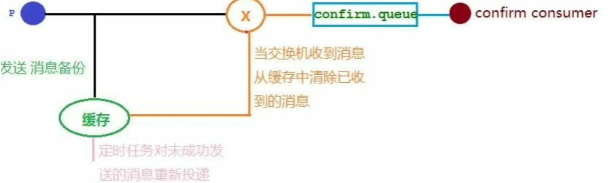
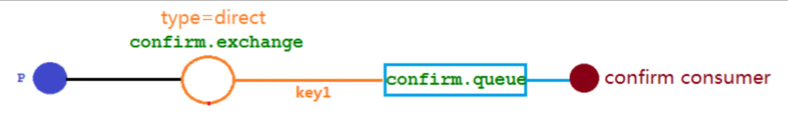
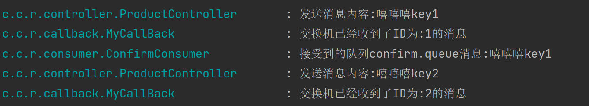
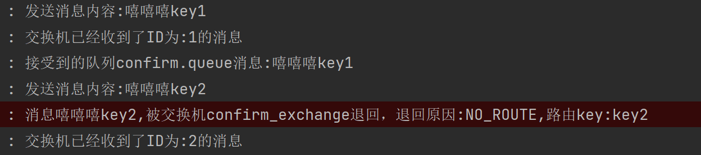
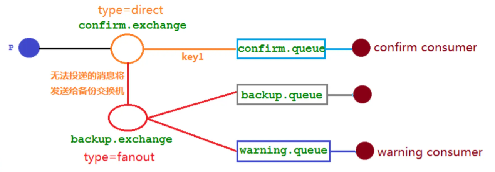
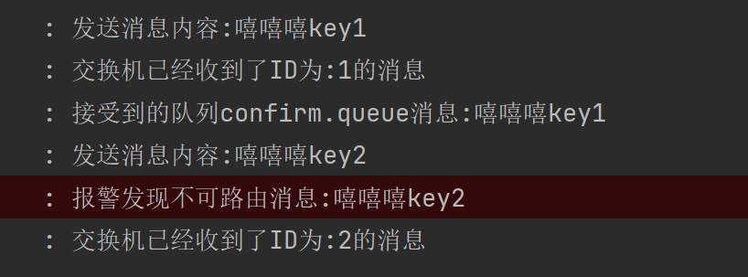

# RabbitMQ 发布确认高级

在生产环境中由于一些不明原因，导致 RabbitMQ 重启，在 RabbitMQ 重启期间生产者消息投递失败，导致消息丢失，需要手动处理和恢复。于是，我们开始思考，如何才能进行 RabbitMQ 的消息可靠投递呢？

## SpringBoot 版本

### 介绍

首先发布消息后进行备份在缓存里，如果消息成功发布确认到交换机，则从缓存里删除该消息，如果没有成功发布，则设置一个定时任务，重新从缓存里获取消息发布到交换机，直到成功发布到交换机。



### 实战

#### ①思路分析

一个交换机：confirm.exchange，一个队列：confirm.queue，一个消费者：confirm.consumer

其中交换机类型时 direct，与队列关联的 routingKey 是 key1



#### ②配置文件

```yaml
server:
  port: 8888
spring:
  rabbitmq:
    host: 193.111.30.163
    port: 5672
    username: admin
    password: 123456
    publisher-confirm-type: correlated
```

#####  publisher-confirm-type 发布确认类型解析

- `NONE` 值是禁用发布确认模式，是默认值
- `CORRELATED` 值是发布消息成功到交换器后会触发回调方法
- `SIMPLE` 值经测试有两种效果，其一效果和 CORRELATED 值一样会触发回调方法，其二在发布消息成功后使用 rabbitTemplate 调用 waitForConfirms 或 waitForConfirmsOrDie 方法等待 broker 节点返回发送结果，根据返回结果来判定下一步的逻辑，要注意的点是 waitForConfirmsOrDie 方法如果返回 false 则会关闭 channel，则接下来无法发送消息到 broker;

#### ③添加配置类

声明交换机和队列，并且将交换机和队列进行绑定

```java
@Configuration
public class ConfirmConfig {

    //交换机
    public static final String CONFIRM_EXCHANGE_NAME = "confirm_exchange";
    //队列
    public static final String CONFIRM_QUEUE_NAME = "confirm_queue";
    //routingKey
    public static final String CONFIRM_ROUTING_KEY = "key1";

    //声明交换机
    @Bean("confirmExchange")
    public DirectExchange confirmExchange() {
        return new DirectExchange(CONFIRM_EXCHANGE_NAME);
    }

    //声明队列
    @Bean("confirmQueue")
    public Queue confirmQueue() {
        return QueueBuilder.durable(CONFIRM_QUEUE_NAME).build();
    }

    //绑定
    @Bean
    public Binding queueBindingExchange(@Qualifier("confirmQueue") Queue confirmQueue,
                                        @Qualifier("confirmExchange") DirectExchange confirmExchange) {
        return BindingBuilder.bind(confirmQueue).to(confirmExchange).with(CONFIRM_ROUTING_KEY);
    }
}
```

#### ④消息生产者

```java
@Slf4j
@RequestMapping("/confirm")
@RestController
public class ProductController {

    @Resource
    private RabbitTemplate rabbitTemplate;

    //开始发消息，测试确认
    // http://localhost:8888/sendMessage/嘻嘻嘻
    @GetMapping("/sendMessage/{message}")
    public void sendMessage(@PathVariable("message") String message) {
        //指定消息 id 为 1
        CorrelationData correlationData1 = new CorrelationData("1");
        rabbitTemplate.convertAndSend(ConfirmConfig.CONFIRM_EXCHANGE_NAME,
                ConfirmConfig.CONFIRM_ROUTING_KEY, message + "key1", correlationData1);
        log.info("发送消息内容:{}", message + "key1");

        //指定消息 id 为 2
        CorrelationData correlationData2 = new CorrelationData("2");
        String CONFIRM_ROUTING_KEY = "key2";
        rabbitTemplate.convertAndSend(ConfirmConfig.CONFIRM_EXCHANGE_NAME,
                CONFIRM_ROUTING_KEY, message + "key2", correlationData2);
        log.info("发送消息内容:{}", message + "key2");
    }

}
```

#### ⑤消息消费者

监听 `confirm.queue` 队列

```java
@Slf4j
@Component
public class ConfirmConsumer {

    @RabbitListener(queues = ConfirmConfig.CONFIRM_QUEUE_NAME)
    public void receiveConfirmMessage(Message message) {
        String msg = new String(message.getBody());
        log.info("接受到的队列 confirm.queue 消息:{}", msg);
    }
}
```

#### ⑥消息生产者发布消息后的回调接口

只要生产者发布消息，交换机不管是否收到消息，都会调用该类的 `confirm` 方法

```java
@Slf4j
@Component
public class MyCallBack implements RabbitTemplate.ConfirmCallback {

    //注入
    @Resource
    private RabbitTemplate rabbitTemplate;

    @PostConstruct
    public void init() {
        //注入
        rabbitTemplate.setConfirmCallback(this);
    }

    /**
     * 交换机不管是否收到消息的一个回调方法
     * 1. 发消息 交换机接收到了 回调
     *
     * @param correlationData 保存回调信息的 Id 及相关信息
     * @param ack             交换机收到消息 为 true
     * @param cause           未收到消息的原因
     */
    @Override
    public void confirm(CorrelationData correlationData, boolean ack, String cause) {
        String id = correlationData != null ? correlationData.getId() : "";
        if (ack) {
            log.info("交换机已经收到了 ID 为:{}的消息", id);
        } else {
            log.info("交换机还未收到 ID 为:{}的消息，由于原因:{}", id, cause);
        }
    }
}
```

#### ⑦效果演示

http://localhost:8888/confirm/sendMessage/嘻嘻嘻



可以看到，发送了两条消息，第一条消息的 RoutingKey 为 "key1"，第二条消息的 RoutingKey 为 "key2"，两条消息都成功被交换机接收，也收到了交换机的确认回调，但消费者只收到了一条消息，因为第二条消息的 RoutingKey 与队列的 BindingKey 不一致，也没有其它队列能接收这个消息，所有第二条消息被直接丢弃了。

丢弃的消息交换机是不知道的，需要解决告诉生产者消息传送失败。

## 回退消息

### 介绍

获取回退的消息，首先在配置文件开启该功能，然后需要自定义类实现 `RabbitTemplate.ReturnsCallback` 接口，并且初始化时，使用该自定义类作为回退消息的处理类，同时开启 `Mandatory`，设置为 true

在启动开启 Mandatory，或者在代码里手动开启 Mandatory 参数，或者都开启

配置类文件开启：

```ymal
# 新版
spring:
  rabbitmq:
  	template:
      mandatory: true
      
# 旧版
spring:
  rabbitmq:
    mandatory: true
```

在仅开启了生产者确认机制的情况下，交换机接收到消息后，会直接给消息生产者发送确认消息，如果发现该消息不可路由，那么消息会被直接丢弃，此时生产者是不知道消息被丢弃这个事件的。

通过设置 mandatory 参数可以在当消息传递过程中不可达目的地时将消息返回给生产者。

### 实战

#### ①修改配置文件

```ymal,{9-12}
server:
  port: 8888
spring:
  rabbitmq:
    host: 193.111.30.163
    port: 5672
    username: admin
    password: 123456
    publisher-confirm-type: correlated
    publisher-returns: true
    template:
      mandatory: true
```

#### ②修改回调接口

实现 `RabbitTemplate.ReturnsCallback` 接口，并实现方法

```java,{3,13,35-51}
@Slf4j
@Component
public class MyCallBack implements RabbitTemplate.ConfirmCallback, RabbitTemplate.ReturnsCallback {

    //注入
    @Resource
    private RabbitTemplate rabbitTemplate;

    @PostConstruct
    public void init() {
        //注入
        rabbitTemplate.setConfirmCallback(this);
        rabbitTemplate.setReturnsCallback(this);
    }

    /**
     * 交换机不管是否收到消息的一个回调方法
     * 1. 发消息 交换机接收到了 回调
     *
     * @param correlationData 保存回调信息的 Id 及相关信息
     * @param ack             交换机收到消息 为 true
     * @param cause           未收到消息的原因
     */
    @Override
    public void confirm(CorrelationData correlationData, boolean ack, String cause) {
        String id = correlationData != null ? correlationData.getId() : "";
        if (ack) {
            log.info("交换机已经收到了 ID 为:{}的消息", id);
        } else {
            log.info("交换机还未收到 ID 为:{}的消息，由于原因:{}", id, cause);
        }
    }


    //可以在当消息传递过程中不可达目的地时将消息返回给生产者
    //只有不可达目的地的时候 才进行回退
    /**
     * 当消息无法路由的时候的回调方法
     * message      消息
     * replyCode    编码
     * replyText    退回原因
     * exchange     从哪个交换机退回
     * routingKey   通过哪个路由 key 退回
     */
    @Override
    public void returnedMessage(ReturnedMessage returned) {
        log.error("消息{},被交换机{}退回，退回原因:{},路由 key:{}",
                new String(returned.getMessage().getBody()), returned.getExchange(),
                returned.getReplyText(), returned.getRoutingKey());
    }
}
```

#### ③效果演示

http://localhost:8888/confirm/sendMessage/嘻嘻嘻



## 备份交换机

### 介绍

有了 mandatory 参数和回退消息，我们获得了对无法投递消息的感知能力，有机会在生产者的消息无法被投递时发现并处理。但有时候，我们并不知道该如何处理这些无法路由的消息，最多打个日志，然后触发报警，再来手动处理。而通过日志来处理这些无法路由的消息是很不优雅的做法，特别是当生产者所在的服务有多台机器的时候，手动复制日志会更加麻烦而且容易出错。而且设置 mandatory 参数会增加生产者的复杂性，需要添加处理这些被退回的消息的逻辑。如果既不想丢失消息，又不想增加生产者的复杂性，该怎么做呢？

前面在设置死信队列的文章中，我们提到，可以为队列设置死信交换机来存储那些处理失败的消息，可是这些不可路由消息根本没有机会进入到队列，因此无法使用死信队列来保存消息。在 RabbitMQ 中，有一种备份交换机的机制存在，可以很好的应对这个问题。

什么是备份交换机呢？备份交换机可以理解为 RabbitMQ 中交换机的“备胎”，当我们为某一个交换机声明一个对应的备份交换机时，就是为它创建一个备胎，当交换机接收到一条不可路由消息时，将会把这条消息转发到备份交换机中，由备份交换机来进行转发和处理，通常备份交换机的类型为 Fanout，这样就能把所有消息都投递到与其绑定的队列中，然后我们在备份交换机下绑定一个队列，这样所有那些原交换机无法被路由的消息，就会都进入这个队列了。当然，我们还可以建立一个报警队列，用独立的消费者来进行监测和报警。

### 实战

需要一个备份交换机 `backup.exchange`，类型为 `fanout`，该交换机发送消息到队列 `backup.queue` 和 `warning.queue`

#### ①思路分析



#### ②修改配置文件

```java
@Configuration
public class ConfirmConfig {

    //交换机
    public static final String CONFIRM_EXCHANGE_NAME = "confirm_exchange";
    //队列
    public static final String CONFIRM_QUEUE_NAME = "confirm_queue";
    //routingKey
    public static final String CONFIRM_ROUTING_KEY = "key1";

    //关于备份的
    //交换机
    public static final String BACKUP_EXCHANGE_NAME = "backup_exchange";
    //队列
    public static final String BACKUP_QUEUE_NAME = "backup_queue";
    //报警队列
    public static final String WARNING_QUEUE_NAME = "warning_queue";


    //声明交换机，设置该交换机的备份交换机
    @Bean("confirmExchange")
    public DirectExchange confirmExchange(){
        return ExchangeBuilder.directExchange(CONFIRM_EXCHANGE_NAME)
                .durable(true).withArgument("alternate-exchange",BACKUP_EXCHANGE_NAME).build();
    }

    //声明队列
    @Bean("confirmQueue")
    public Queue confirmQueue(){
        return QueueBuilder.durable(CONFIRM_QUEUE_NAME).build();
    }

    //绑定
    @Bean
    public Binding queueBindingExchange(@Qualifier("confirmQueue") Queue confirmQueue,
                                        @Qualifier("confirmExchange") DirectExchange confirmExchange){
        return BindingBuilder.bind(confirmQueue).to(confirmExchange).with(CONFIRM_ROUTING_KEY);
    }

    //备份交换机的创建
    @Bean("backupExchange")
    public FanoutExchange backupExchange(){
        return new FanoutExchange(BACKUP_EXCHANGE_NAME);
    }

    //声明备份队列
    @Bean("backupQueue")
    public Queue backupQueue(){
        return QueueBuilder.durable(BACKUP_QUEUE_NAME).build();
    }

    //声明报警队列
    @Bean("warningQueue")
    public Queue warningQueue(){
        return QueueBuilder.durable(WARNING_QUEUE_NAME).build();
    }

    //绑定 备份队列绑定备份交换机
    @Bean
    public Binding backupQueueBindingBackupExchange(@Qualifier("backupQueue") Queue backupQueue,
                                                    @Qualifier("backupExchange") FanoutExchange backupExchange){
        return BindingBuilder.bind(backupQueue).to(backupExchange);
    }

    //绑定 报警队列绑定备份交换机
    @Bean
    public Binding warningQueueBindingBackupExchange(@Qualifier("warningQueue") Queue warningQueue,
                                                     @Qualifier("backupExchange") FanoutExchange backupExchange){
        return BindingBuilder.bind(warningQueue).to(backupExchange);
    }
}
```

#### ③报警消费者

```java
@Slf4j
@Component
public class ConfirmConsumer {

    @RabbitListener(queues = ConfirmConfig.CONFIRM_QUEUE_NAME)
    public void receiveConfirmMessage(Message message) {
        String msg = new String(message.getBody());
        log.info("接受到的队列 confirm.queue 消息:{}", msg);
    }
}
```

#### ④效果演示



Mandatory 参数与备份交换机可以一起使用的时候，如果两者同时开启，消息究竟何去何从？谁优先级高，经过上面结果显示答案是**备份交换机优先级高**。
