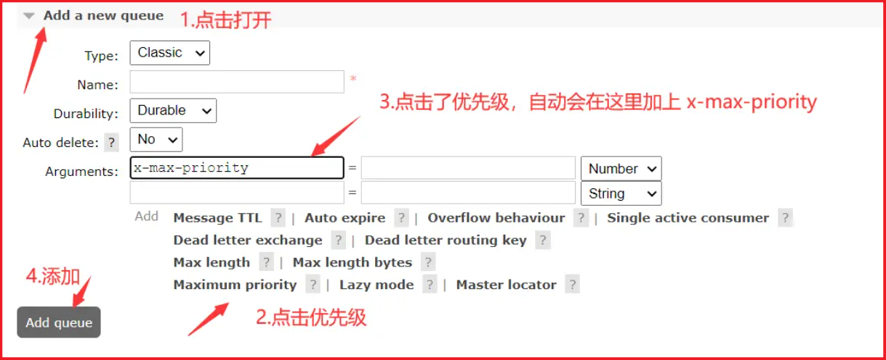
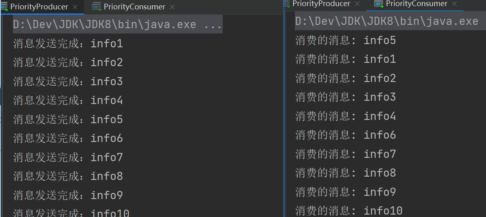
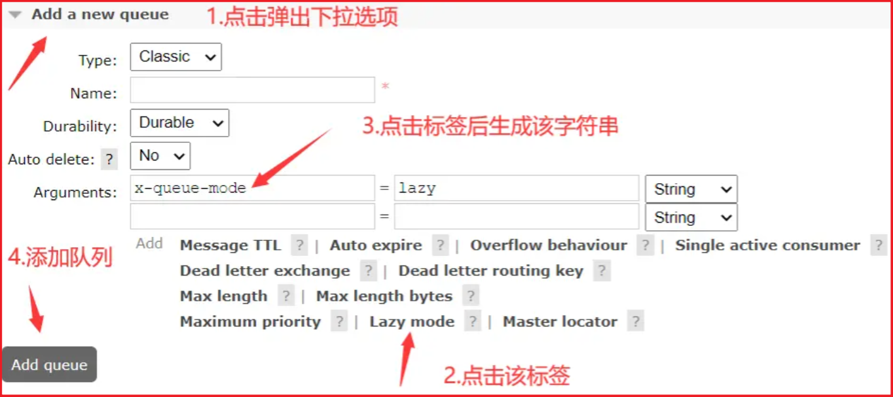
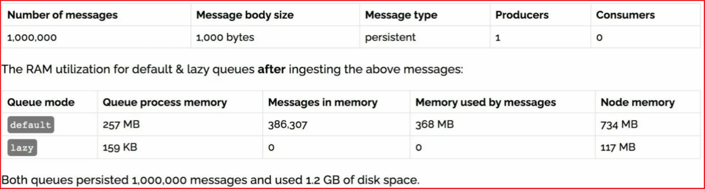

# RabbitMQ 其他知识点

## 幂等性

### 概念 s

幂等性指的是一种操作，无论执行多少次，其结果都是相同的。换句话说，重复执行同一操作所产生的结果不会发生变化，这个操作就是幂等的。

在计算机科学中，幂等性是指一个操作或请求可以安全地执行多次，而不会产生不同的结果或导致不良影响。这是一种非常重要的概念，因为在分布式系统中，网络延迟、通信故障等因素可能会导致消息重复发送或操作执行多次的情况。

例如，HTTP 请求通常是幂等的，因为对同一个 URL 的多次请求应该返回相同的结果。如果一个 HTTP 请求不是幂等的，可能会导致资源被多次创建、更新或删除，从而破坏系统的一致性和完整性。

### 重复消费

消费者在消费 MQ 中的消息时，MQ 已把消息发送给消费者，消费者在给 MQ 返回 ack 时网络中断，故 MQ 未收到确认信息，该条消息会重新发给其他的消费者，或者在网络重连后再次发送给该消费者，但实际上该消费者已成功消费了该条消息，造成消费者消费了重复的消息。

### 解决思路

由于网络延迟、硬件故障等因素，消息可能会重复传递或消费，从而导致操作的重复执行。为了解决这个问题，需要保证消息消费的幂等性。

以下是几种常见的解决思路：

1. 唯一 ID：在每个消息中添加一个唯一 ID，用于标识消息的唯一性。消费者在处理消息之前，先检查消息 ID 是否已经被处理过，如果已经处理过，就可以忽略这个消息。可以使用数据库表、分布式锁、Redis 等工具来存储和检查消息 ID。
2. 状态判断：在处理消息之前，先判断操作状态是否已经完成。例如，如果要在数据库中插入一条记录，可以先查询该记录是否已经存在，如果存在就不执行插入操作。
3. 去重表：使用一个去重表来记录已经消费过的消息，消费者在处理消息之前，先检查去重表中是否存在该消息，如果存在就可以忽略这个消息。
4. 幂等性算法：设计一种幂等性算法，可以在消费时判断操作是否已经执行过。例如，使用分布式锁、乐观锁、CAS 等算法来实现幂等性。

### 消费端的幂等性保障

在海量订单生成的业务高峰期，生产端有可能就会重复发生了消息，这时候消费端就要实现幂等性，这就意味着我们的消息永远不会被消费多次，即使我们收到了一样的消息。

业界主流的幂等性有两种操作：

- 唯一 ID+ 指纹码机制，利用数据库主键去重

指纹码：我们的一些规则或者时间戳加别的服务给到的唯一信息码，它并不一定是我们系统生成的，基本都是由我们的业务规则拼接而来，但是一定要保证唯一性，然后就利用查询语句进行判断这个 id 是否存在数据库中，优势就是实现简单就一个拼接，然后查询判断是否重复；劣势就是在高并发时，如果是单个数据库就会有写入性能瓶颈当然也可以采用分库分表提升性能，但也不是我们最推荐的方式。

- Redis 的原子性

利用 redis 执行 setnx 命令，天然具有幂等性。从而实现不重复消费

## 优先级队列

### 使用场景

在我们系统中有一个订单催付的场景，我们的客户在天猫下的订单，淘宝会及时将订单推送给我们，如果在用户设定的时间内未付款那么就会给用户推送一条短信提醒，很简单的一个功能对吧。

但是，tmall 商家对我们来说，肯定是要分大客户和小客户的对吧，比如像苹果，小米这样大商家一年起码能给我们创造很大的利润，所以理应当然，他们的订单必须得到优先处理，而曾经我们的后端系统是使用 redis 来存放的定时轮询，大家都知道 redis 只能用 List 做一个简简单单的消息队列，并不能实现一个优先级的场景，所以订单量大了后采用 RabbitMQ 进行改造和优化，如果发现是大客户的订单给一个相对比较高的优先级，否则就是默认优先级。

### 添加方法

#### Web 页面添加



1. 进入 Web 页面，点击 Queue 菜单，然后点击 `Add a new queue`
2. 点击下方的 `Maximum priority`
3. 执行第二步，则会自动在 `Argument` 生成 `x-max-priority` 字符串
4. 点击 `Add queue` 即可添加优先级队列成功

#### 声明队列的时候添加优先级

设置队列的最大优先级 最大可以设置到 255 官网推荐 1-10 如果设置太高比较吃内存和 CPU

```java
Map<String, Object> params = new HashMap();
// 优先级为 10
params.put("x-max-priority", 10);
channel.queueDeclare("hello", true, false, false, params);
```

> 注意事项
>
> 队列实现优先级需要做的事情有如下：队列需要设置为优先级队列，消息需要设置消息的优先级，消费
>
> 者需要等待消息已经发送到队列中才去消费，因为这样才有机会对消息进行排序

### 实战

生产者发送十个消息，如果消息为 `info5`，则优先级是最高的，当消费者从队列获取消息的时候，优先获取 `info5` 消息

#### ①消息生产者

```java
public class PriorityProducer {

    private static final String QUEUE_NAME = "priority_queue";

    public static void main(String[] args) throws IOException, TimeoutException {
        Channel channel = RabbitMqUtils.getChannel();

        //给消息赋予一个 priority 属性
        AMQP.BasicProperties properties =
                new AMQP.BasicProperties().builder().priority(1).priority(10).build();

        for (int i = 1; i < 11; i++) {
            String message = "info" + i;
            if (i == 5) {
                channel.basicPublish("", QUEUE_NAME, properties, message.getBytes());
            } else {
                channel.basicPublish("", QUEUE_NAME, null, message.getBytes());
            }
            System.out.println("消息发送完成：" + message);
        }
    }
}
```

#### ②消息消费者

```java
public class PriorityConsumer {
    private final static String QUEUE_NAME = "priority_queue";

    public static void main(String[] args) throws IOException, TimeoutException {
        Channel channel = RabbitMqUtils.getChannel();

        //设置队列的最大优先级 最大可以设置到 255 官网推荐 1-10 如果设置太高比较吃内存和 CPU
        Map<String, Object> params = new HashMap<>();
        params.put("x-max-priority", 10);
        channel.queueDeclare(QUEUE_NAME, true, false, false, params);

        DeliverCallback deliverCallback = (consumerTag, delivery) -> {
            String message = new String(delivery.getBody());
            System.out.println("消费的消息：" + message);
        };

        CancelCallback cancelCallback = (consumerTag) -> {
            System.out.println("消息消费被中断");
        };

        channel.basicConsume(QUEUE_NAME, true, deliverCallback, cancelCallback);
    }
}
```

#### ③效果演示

先启动生产者，将消息发送到队列中，再启动消费者，消息就会按照消费的优先级消费



## 惰性队列

### 使用场景

RabbitMQ 从 3.6.0 版本开始引入了惰性队列的概念。惰性队列会尽可能的将消息存入磁盘中，而在消费者消费到相应的消息时才会被加载到内存中，它的一个重要的设计目标是能够支持更长的队列，即支持更多的消息存储。当消费者由于各种各样的原因（比如消费者下线、宕机亦或者是由于维护而关闭等）而致使长时间内不能消费消息造成堆积时，惰性队列就很有必要了。

默认情况下，当生产者将消息发送到 RabbitMQ 的时候，队列中的消息会尽可能的存储在内存之中，这样可以更加快速的将消息发送给消费者。即使是持久化的消息，在被写入磁盘的同时也会在内存中驻留一份备份。当 RabbitMQ 需要释放内存的时候，会将内存中的消息换页至磁盘中，这个操作会耗费较长的时间，也会阻塞队列的操作，进而无法接收新的消息。虽然 RabbitMQ 的开发者们一直在升级相关的算法，但是效果始终不太理想，尤其是在消息量特别大的时候。

### 两种模式

队列具备两种模式：default 和 lazy。默认的为 default 模式，在 3.6.0 之前的版本无需做任何变更。lazy 模式即为惰性队列的模式，可以通过调用 `channel.queueDeclare` 方法的时候在参数中设置，也可以通过 Policy 的方式设置，如果一个队列同时使用这两种方式设置的话，那么 Policy 的方式具备更高的优先级。如果要通过声明的方式改变已有队列的模式的话，那么只能先删除队列，然后再重新声明一个新的。

在队列声明的时候可以通过 `x-queue-mode` 参数来设置队列的模式，取值为 default 和 lazy。下面示例中演示了一个惰性队列的声明细节：

```java
Map<String, Object> args = new HashMap<String, Object>();
args.put("x-queue-mode", "lazy");
channel.queueDeclare("myqueue", false, false, false, args);
```

也可以在 Web 页面添加队列时，选择 `Lazy mode`



### 内存开销对比



在发送 1 百万条消息，每条消息大概占 1KB 的情况下，普通队列占用内存是 1.2GB，而惰性队列仅仅占用 1.5MB

## 设置虚拟主机

RabbitMQ 的虚拟主机的设计思想与 Apache 的虚拟主机或 Nginx 的 Server 相似，不同的是，Apache 中的虚拟主机是定义在配置文件中，而 RabbitMQ 的虚拟主机通过 rabbitmqctl 工具或者 HTTP API 进行创建和删除。

```sh
# 创建虚拟主机
rabbitmqctl add_vhost /mq

# 删除虚拟主机
rabbitmqctl delete_vhost /mq

# 列出虚拟主机
rabbitmqctl list_vhost

# 给用户赋予访问虚拟主机的权限
rabbitmqctl set_permissions -p /mq admin ".*" ".*" ".*"

# 清除权限
rabbitmqctl clear_permissions -p /mq admin
 
# 查看虚拟主机的权限
rabbitmqctl list_permissions -p /mq
```

